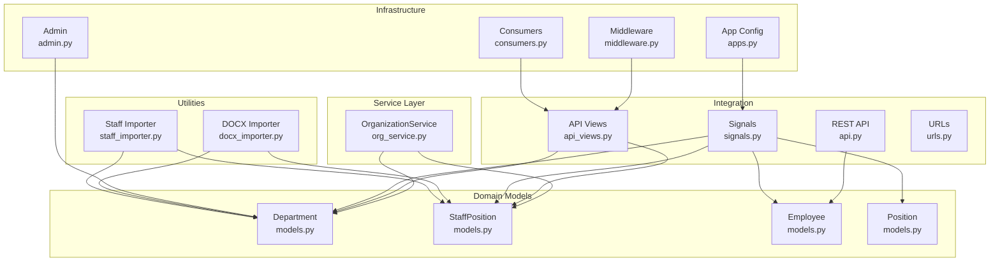
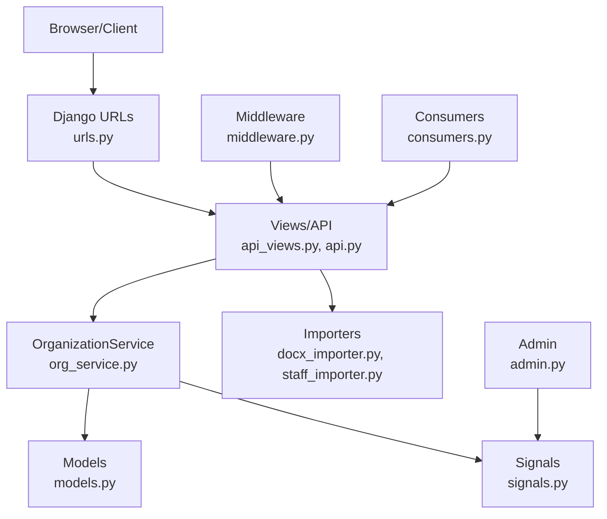
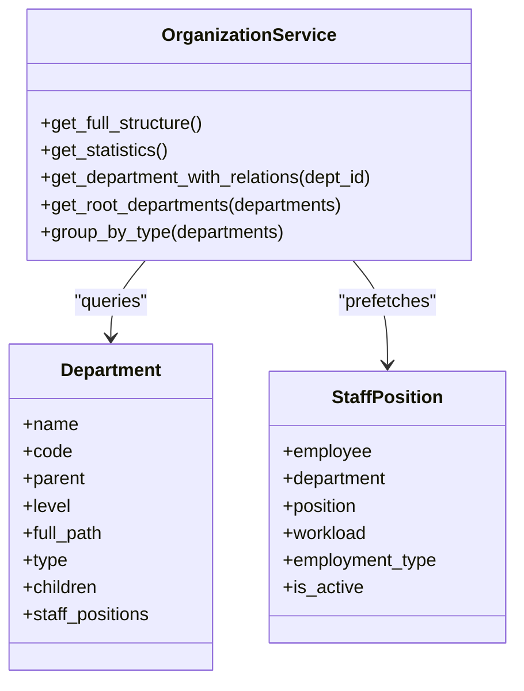
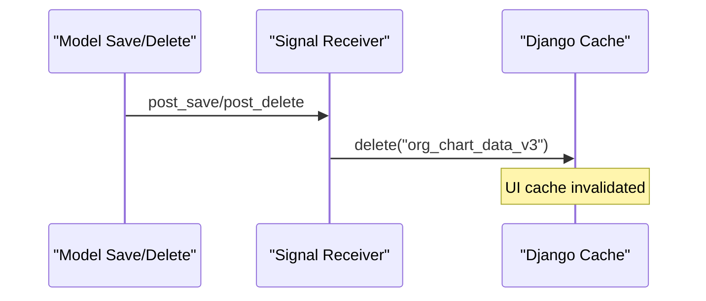
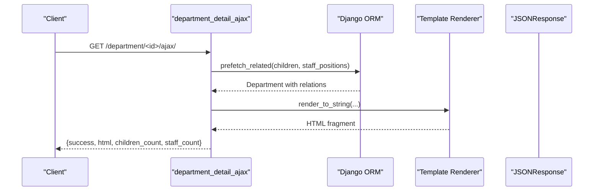
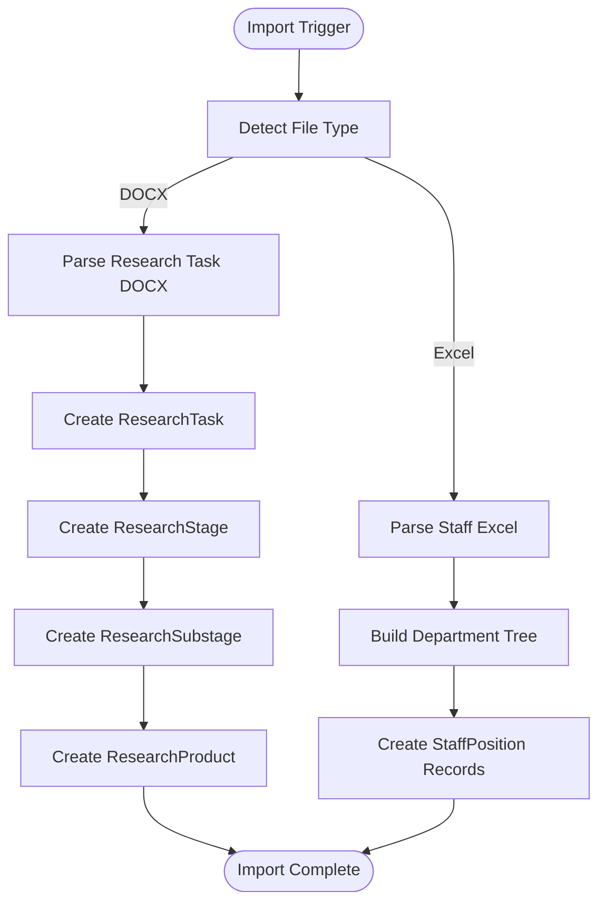
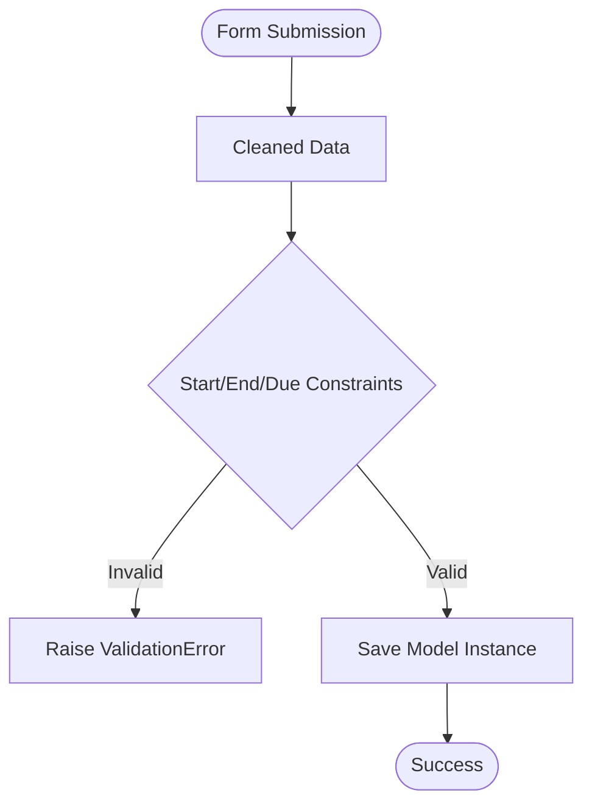
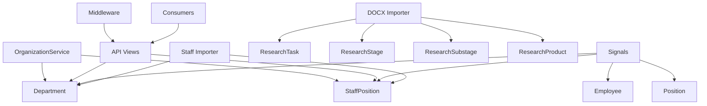

# Services and Business Logic

<cite>
**Referenced Files in This Document**
- [org_service.py](file://tasks/services/org_service.py)
- [models.py](file://tasks/models.py)
- [signals.py](file://tasks/signals.py)
- [api_views.py](file://tasks/views/api_views.py)
- [api.py](file://tasks/api.py)
- [urls.py](file://tasks/urls.py)
- [apps.py](file://tasks/apps.py)
- [middleware.py](file://tasks/middleware.py)
- [consumers.py](file://tasks/consumers.py)
- [test_api.py](file://tasks/tests/test_api.py)
- [admin.py](file://tasks/admin.py)
- [forms.py](file://tasks/forms.py)
- [docx_importer.py](file://tasks/utils/docx_importer.py)
- [staff_importer.py](file://tasks/utils/staff_importer.py)
</cite>

## Table of Contents
1. [Introduction](#introduction)
2. [Project Structure](#project-structure)
3. [Core Components](#core-components)
4. [Architecture Overview](#architecture-overview)
5. [Detailed Component Analysis](#detailed-component-analysis)
6. [Dependency Analysis](#dependency-analysis)
7. [Performance Considerations](#performance-considerations)
8. [Troubleshooting Guide](#troubleshooting-guide)
9. [Conclusion](#conclusion)
10. [Appendices](#appendices)

## Introduction
This document describes the Services and Business Logic layer of the Task Manager application with a focus on the OrganizationService for efficient tree operations, hierarchical queries, and relationship management. It documents business rule enforcement, data validation, workflow automation, signal handlers for cache invalidation and event-driven updates, API endpoint implementation, data serialization, external integration points, service layer architecture, dependency injection patterns, testing strategies, performance optimization techniques, caching strategies, database query optimization, error handling, logging, and monitoring.

## Project Structure
The service layer spans several modules:
- Service layer: OrganizationService encapsulates organizational tree operations and statistics.
- Models: Department, StaffPosition, Employee, Position define the hierarchy and relationships.
- Signals: Automatic cache invalidation on organizational model changes.
- Views/API: AJAX endpoints and REST endpoints for organization-related operations.
- Utilities: Importers for DOCX and Excel to populate organizational data.
- Middleware and Consumers: Logging and WebSocket event broadcasting.
- Tests: API tests validating search behavior.

**Diagram sources**
- [org_service.py:1-53](file://tasks/services/org_service.py#L1-L53)
- [models.py:532-678](file://tasks/models.py#L532-L678)
- [signals.py:1-32](file://tasks/signals.py#L1-L32)
- [api_views.py:1-130](file://tasks/views/api_views.py#L1-L130)
- [api.py:1-39](file://tasks/api.py#L1-L39)
- [urls.py:1-100](file://tasks/urls.py#L1-L100)
- [apps.py:1-8](file://tasks/apps.py#L1-L8)
- [middleware.py:1-43](file://tasks/middleware.py#L1-L43)
- [consumers.py:1-36](file://tasks/consumers.py#L1-L36)
- [docx_importer.py:1-521](file://tasks/utils/docx_importer.py#L1-L521)
- [staff_importer.py:1-328](file://tasks/utils/staff_importer.py#L1-L328)
- [admin.py:1-21](file://tasks/admin.py#L1-L21)

**Section sources**
- [org_service.py:1-53](file://tasks/services/org_service.py#L1-L53)
- [models.py:532-678](file://tasks/models.py#L532-L678)
- [signals.py:1-32](file://tasks/signals.py#L1-L32)
- [api_views.py:1-130](file://tasks/views/api_views.py#L1-L130)
- [api.py:1-39](file://tasks/api.py#L1-L39)
- [urls.py:1-100](file://tasks/urls.py#L1-L100)
- [apps.py:1-8](file://tasks/apps.py#L1-L8)
- [middleware.py:1-43](file://tasks/middleware.py#L1-L43)
- [consumers.py:1-36](file://tasks/consumers.py#L1-L36)
- [docx_importer.py:1-521](file://tasks/utils/docx_importer.py#L1-L521)
- [staff_importer.py:1-328](file://tasks/utils/staff_importer.py#L1-L328)
- [admin.py:1-21](file://tasks/admin.py#L1-L21)

## Core Components
- OrganizationService: Provides optimized retrieval of organizational structure, statistics, and grouping by type. Uses prefetch_related and select_related to minimize N+1 queries and aggregates counts efficiently.
- Domain Models: Department defines hierarchical relationships with parent/children and computed full_path and level. StaffPosition links Employee to Department and Position with workload and employment_type metadata.
- Signals: Invalidate a centralized cache key on changes to Department, StaffPosition, Employee, and Position to keep UI charts fresh.
- API Views: AJAX endpoints for department details and employee assignment/status updates; REST endpoint for quick task-employee assignment.
- Utilities: DOCX importer parses research task structure and creates ResearchTask/ResearchStage/ResearchSubstage/ResearchProduct; Excel importer builds Department hierarchy and StaffPosition records.
- Middleware and Consumers: Request logging and WebSocket broadcasting for real-time updates.
- Tests: Validates employee search API JSON response shape and counts.

**Section sources**
- [org_service.py:1-53](file://tasks/services/org_service.py#L1-L53)
- [models.py:532-678](file://tasks/models.py#L532-L678)
- [signals.py:1-32](file://tasks/signals.py#L1-L32)
- [api_views.py:1-130](file://tasks/views/api_views.py#L1-L130)
- [api.py:1-39](file://tasks/api.py#L1-L39)
- [docx_importer.py:1-521](file://tasks/utils/docx_importer.py#L1-L521)
- [staff_importer.py:1-328](file://tasks/utils/staff_importer.py#L1-L328)
- [middleware.py:1-43](file://tasks/middleware.py#L1-L43)
- [consumers.py:1-36](file://tasks/consumers.py#L1-L36)
- [test_api.py:1-38](file://tasks/tests/test_api.py#L1-L38)

## Architecture Overview
The service layer follows a layered architecture:
- Presentation: Views and API endpoints handle requests and render JSON or HTML fragments.
- Service: OrganizationService encapsulates domain logic for tree operations and statistics.
- Persistence: Django ORM models with indexes and optimized queries.
- Integration: Signals trigger cache invalidation; utilities integrate external formats (DOCX/Excel).
- Infrastructure: Middleware logs requests; Consumers broadcast updates via WebSockets.

**Diagram sources**
- [urls.py:1-100](file://tasks/urls.py#L1-L100)
- [api_views.py:1-130](file://tasks/views/api_views.py#L1-L130)
- [api.py:1-39](file://tasks/api.py#L1-L39)
- [org_service.py:1-53](file://tasks/services/org_service.py#L1-L53)
- [models.py:532-678](file://tasks/models.py#L532-L678)
- [docx_importer.py:1-521](file://tasks/utils/docx_importer.py#L1-L521)
- [staff_importer.py:1-328](file://tasks/utils/staff_importer.py#L1-L328)
- [signals.py:1-32](file://tasks/signals.py#L1-L32)
- [admin.py:1-21](file://tasks/admin.py#L1-L21)
- [middleware.py:1-43](file://tasks/middleware.py#L1-L43)
- [consumers.py:1-36](file://tasks/consumers.py#L1-L36)

## Detailed Component Analysis

### OrganizationService
OrganizationService centralizes organizational tree operations:
- get_full_structure: Returns the entire hierarchy with children and active staff positions, prefetching related sets to avoid N+1 queries.
- get_statistics: Aggregates total departments, unique employees across active staff positions, and total active staff positions.
- get_department_with_relations: Fetches a single department with children and active staff positions.
- get_root_departments: Filters top-level departments by absence of parent.
- group_by_type: Groups departments by predefined types.

**Diagram sources**
- [org_service.py:1-53](file://tasks/services/org_service.py#L1-L53)
- [models.py:532-678](file://tasks/models.py#L532-L678)

**Section sources**
- [org_service.py:1-53](file://tasks/services/org_service.py#L1-L53)
- [models.py:532-678](file://tasks/models.py#L532-L678)

### Signal Handlers for Cache Invalidation
Signals automatically invalidate the organization chart cache on changes to organizational models:
- On Department post_save/post_delete: clears cache key for org chart.
- On StaffPosition post_save/post_delete: clears cache key for org chart.
- On Employee post_save/post_delete: clears cache key for org chart.
- On Position post_save/post_delete: clears cache key for org chart.
- Admin integration: deletes cache after save/delete in admin.

**Diagram sources**
- [signals.py:1-32](file://tasks/signals.py#L1-L32)
- [admin.py:1-21](file://tasks/admin.py#L1-L21)

**Section sources**
- [signals.py:1-32](file://tasks/signals.py#L1-L32)
- [admin.py:1-21](file://tasks/admin.py#L1-L21)

### API Endpoint Implementation and Data Serialization
- AJAX department detail: Optimized prefetch_related to load children and active staff positions; renders partial HTML and returns JSON with counts.
- Employee search API: Filters active employees by name/email; serializes minimal JSON for frontend selection.
- REST quick assignment: Adds an employee to a task and returns structured JSON.

**Diagram sources**
- [api_views.py:96-130](file://tasks/views/api_views.py#L96-L130)

**Section sources**
- [api_views.py:1-130](file://tasks/views/api_views.py#L1-L130)
- [api.py:1-39](file://tasks/api.py#L1-L39)

### External Integration Points
- DOCX Importer: Parses research task structure from DOCX and creates ResearchTask, ResearchStage, ResearchSubstage, ResearchProduct, and ResearchTaskFunding.
- Excel Staff Importer: Builds Department hierarchy and StaffPosition records from Excel, inferring parent-child relationships and employment types.

**Diagram sources**
- [docx_importer.py:442-521](file://tasks/utils/docx_importer.py#L442-L521)
- [staff_importer.py:186-328](file://tasks/utils/staff_importer.py#L186-L328)

**Section sources**
- [docx_importer.py:1-521](file://tasks/utils/docx_importer.py#L1-L521)
- [staff_importer.py:1-328](file://tasks/utils/staff_importer.py#L1-L328)

### Business Rule Enforcement and Validation
- Form validation: TaskForm enforces temporal constraints (end time >= start time; due date >= start time).
- Model-level defaults and constraints: Department.save computes level and full_path; StaffPosition has employment_type and is_active flags; Employee has is_active and derived department path helpers.
- Import validation: Importers sanitize and infer missing metadata (e.g., employment_type parsing, department parent inference).

**Diagram sources**
- [forms.py:32-44](file://tasks/forms.py#L32-L44)
- [models.py:576-584](file://tasks/models.py#L576-L584)
- [staff_importer.py:164-184](file://tasks/utils/staff_importer.py#L164-L184)

**Section sources**
- [forms.py:1-224](file://tasks/forms.py#L1-L224)
- [models.py:532-678](file://tasks/models.py#L532-L678)
- [staff_importer.py:1-328](file://tasks/utils/staff_importer.py#L1-L328)

### Workflow Automation
- Automatic responsible assignment: Subtask save logic assigns a single performer as responsible if none set.
- Inheritance of performers/responsible: ResearchSubstage inherits performers and responsible from parent stage when not set.
- Cache invalidation: Signals and admin hooks ensure UI remains consistent after data changes.

**Section sources**
- [models.py:328-340](file://tasks/models.py#L328-L340)
- [models.py:525-531](file://tasks/models.py#L525-L531)
- [signals.py:1-32](file://tasks/signals.py#L1-L32)
- [admin.py:1-21](file://tasks/admin.py#L1-L21)

### Service Layer Architecture and Dependency Injection
- OrganizationService is implemented as a static utility class focused on data retrieval and aggregation.
- No explicit dependency injection framework is used; services rely on Django ORM and signals.
- Apps config imports signals module to ensure signal receivers are registered on app startup.

**Section sources**
- [org_service.py:1-53](file://tasks/services/org_service.py#L1-L53)
- [apps.py:1-8](file://tasks/apps.py#L1-L8)

### Testing Strategies
- API tests validate employee search endpoint response shape and counts.
- Tests use Django TestCase and Client to simulate authenticated requests.
- Coverage includes empty query behavior and positive matches.

**Section sources**
- [test_api.py:1-38](file://tasks/tests/test_api.py#L1-L38)

## Dependency Analysis
Key dependencies and relationships:
- OrganizationService depends on Department and StaffPosition for tree and stats.
- API views depend on models and template rendering for AJAX responses.
- Signals depend on cache backend and organizational models.
- Importers depend on third-party libraries (python-docx, pandas) and models.
- Middleware and consumers are orthogonal infrastructure concerns.

**Diagram sources**
- [org_service.py:1-53](file://tasks/services/org_service.py#L1-L53)
- [models.py:532-678](file://tasks/models.py#L532-L678)
- [signals.py:1-32](file://tasks/signals.py#L1-L32)
- [docx_importer.py:442-521](file://tasks/utils/docx_importer.py#L442-L521)
- [staff_importer.py:186-328](file://tasks/utils/staff_importer.py#L186-L328)
- [middleware.py:1-43](file://tasks/middleware.py#L1-L43)
- [consumers.py:1-36](file://tasks/consumers.py#L1-L36)

**Section sources**
- [org_service.py:1-53](file://tasks/services/org_service.py#L1-L53)
- [models.py:532-678](file://tasks/models.py#L532-L678)
- [signals.py:1-32](file://tasks/signals.py#L1-L32)
- [docx_importer.py:1-521](file://tasks/utils/docx_importer.py#L1-L521)
- [staff_importer.py:1-328](file://tasks/utils/staff_importer.py#L1-L328)
- [middleware.py:1-43](file://tasks/middleware.py#L1-L43)
- [consumers.py:1-36](file://tasks/consumers.py#L1-L36)

## Performance Considerations
- Query Optimization:
  - Use prefetch_related and select_related in OrganizationService to eliminate N+1 queries.
  - Aggregate statistics with database-level Count and distinct filtering.
- Indexing:
  - Models define composite and single-column indexes on parent/type/name/full_path/level to accelerate tree navigation and filtering.
- Caching:
  - Centralized cache key for organization chart; cleared on model changes via signals and admin.
- AJAX Efficiency:
  - Single optimized query with nested prefetches; count children/staff in Python to avoid extra DB hits.
- Import Performance:
  - Batch creation and dictionary caches reduce repeated lookups during import.

**Section sources**
- [org_service.py:1-53](file://tasks/services/org_service.py#L1-L53)
- [models.py:532-678](file://tasks/models.py#L532-L678)
- [signals.py:1-32](file://tasks/signals.py#L1-L32)
- [api_views.py:96-130](file://tasks/views/api_views.py#L96-L130)
- [docx_importer.py:1-521](file://tasks/utils/docx_importer.py#L1-L521)
- [staff_importer.py:1-328](file://tasks/utils/staff_importer.py#L1-L328)

## Troubleshooting Guide
- Cache Stale Data:
  - Symptom: Organization chart does not reflect recent changes.
  - Action: Verify signals and admin hooks are clearing the cache key; check cache backend availability.
- Slow Tree Queries:
  - Symptom: Loading department tree is slow.
  - Action: Ensure prefetch_related/select_related are applied; confirm indexes exist on parent/type/full_path.
- Import Failures:
  - Symptom: DOCX/Excel import errors or missing relationships.
  - Action: Validate file format and column alignment; review importer logs and inferred types.
- API Search Issues:
  - Symptom: Empty or incorrect employee search results.
  - Action: Confirm is_active filter and search term matching; inspect test coverage for expected behavior.

**Section sources**
- [signals.py:1-32](file://tasks/signals.py#L1-L32)
- [models.py:532-678](file://tasks/models.py#L532-L678)
- [docx_importer.py:1-521](file://tasks/utils/docx_importer.py#L1-L521)
- [staff_importer.py:1-328](file://tasks/utils/staff_importer.py#L1-L328)
- [test_api.py:1-38](file://tasks/tests/test_api.py#L1-L38)

## Conclusion
The Services and Business Logic layer provides robust, efficient operations for organizational hierarchies and related workflows. OrganizationService leverages Django ORM optimizations and aggregates to deliver scalable tree queries and statistics. Signals maintain UI consistency through cache invalidation, while API endpoints and utilities integrate external formats seamlessly. The architecture supports extensibility, maintainability, and performance through indexing, caching, and careful query planning.

## Appendices

### API Definitions
- GET /api/employee-search/
  - Query: q (search term)
  - Response: { results: [{ id, text, email }] }
- POST /api/tasks/quick-assign/
  - Body: { task_id, employee_id }
  - Response: { success, task, employee }

**Section sources**
- [api.py:10-39](file://tasks/api.py#L10-L39)
- [urls.py:1-100](file://tasks/urls.py#L1-L100)