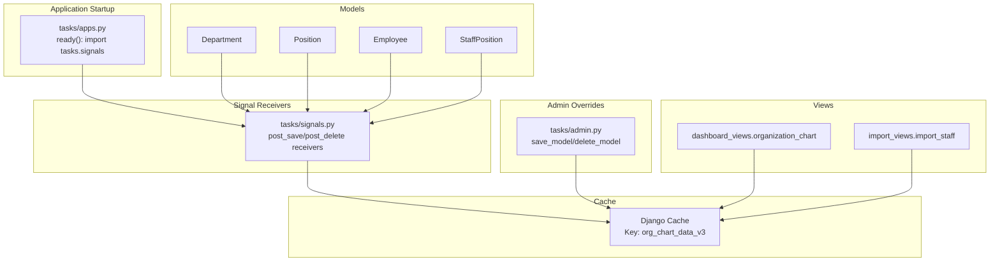
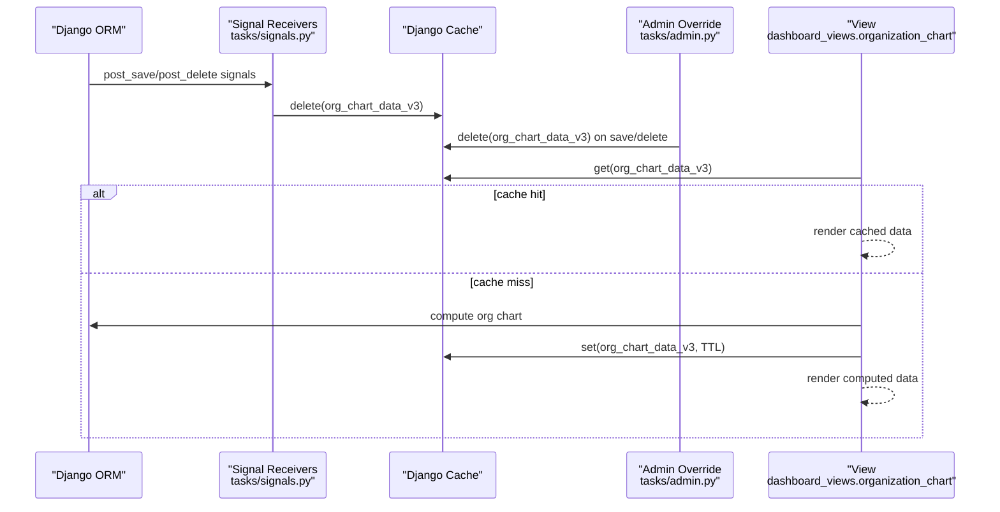
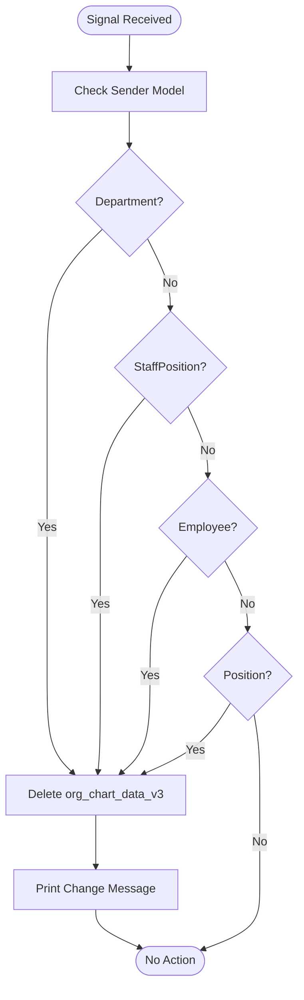
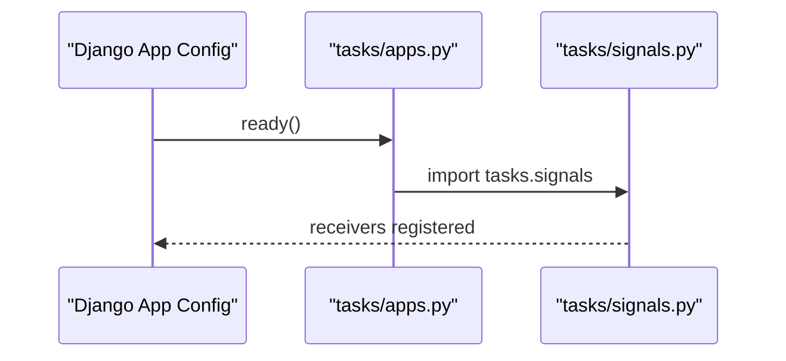
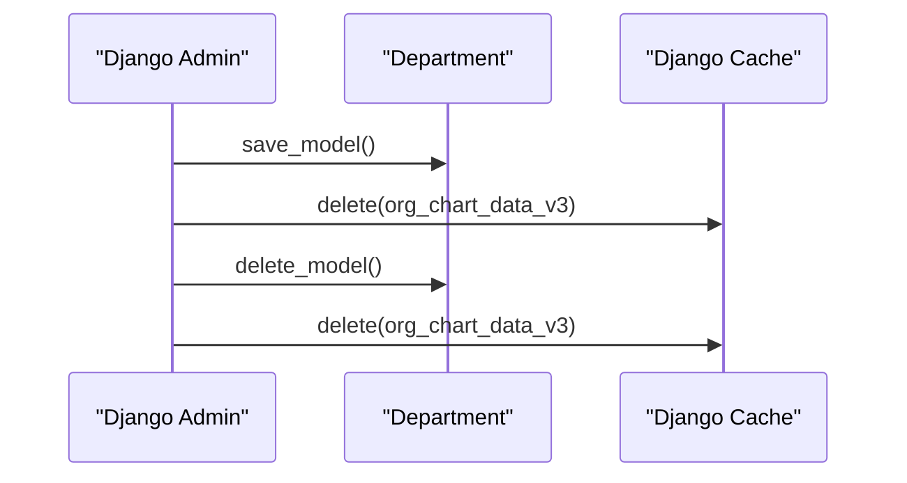
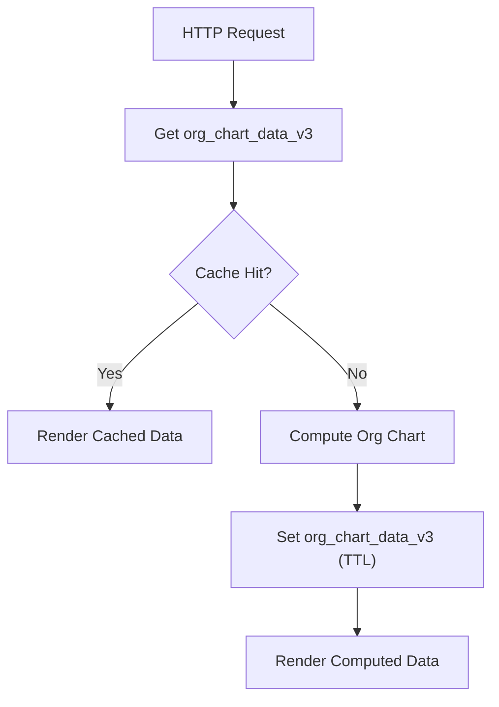
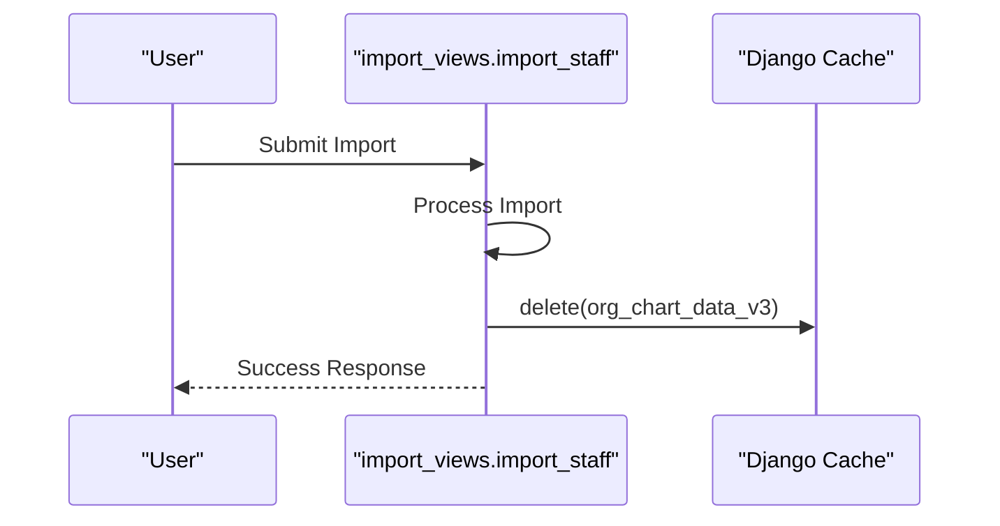
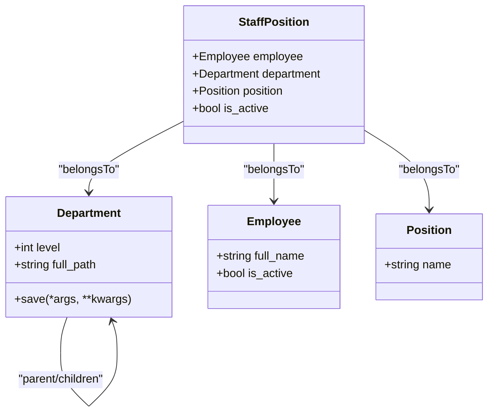
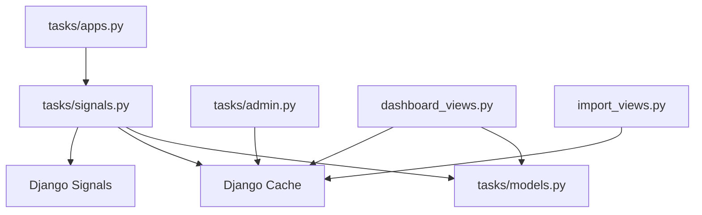

# Signal Handlers and Event Management

<cite>
**Referenced Files in This Document**
- [tasks/signals.py](file://tasks/signals.py)
- [tasks/apps.py](file://tasks/apps.py)
- [tasks/admin.py](file://tasks/admin.py)
- [tasks/views/dashboard_views.py](file://tasks/views/dashboard_views.py)
- [tasks/views/import_views.py](file://tasks/views/import_views.py)
- [tasks/models.py](file://tasks/models.py)
</cite>

## Table of Contents
1. [Introduction](#introduction)
2. [Project Structure](#project-structure)
3. [Core Components](#core-components)
4. [Architecture Overview](#architecture-overview)
5. [Detailed Component Analysis](#detailed-component-analysis)
6. [Dependency Analysis](#dependency-analysis)
7. [Performance Considerations](#performance-considerations)
8. [Troubleshooting Guide](#troubleshooting-guide)
9. [Conclusion](#conclusion)

## Introduction
This document explains the Django signal handlers and event-driven architecture used for automatic cache invalidation and data synchronization around organizational structure changes. It covers signal registration patterns, cache management via post_save and post_delete hooks, and complementary administrative and import pathways that maintain consistency. It also documents the event propagation flow, debugging techniques, and best practices for ensuring reliable signal behavior across the application.

## Project Structure
The signal-driven architecture spans several modules:
- Signal definitions and receivers for automatic cache invalidation
- Application startup hook to load signal receivers
- Administrative interface overrides to invalidate cache on model changes
- View logic that reads/writes the organization chart cache
- Import view that clears cache after bulk updates
- Model definitions that trigger signals during save/delete operations

**Diagram sources**
- [tasks/apps.py:7-8](file://tasks/apps.py#L7-L8)
- [tasks/signals.py:1-32](file://tasks/signals.py#L1-L32)
- [tasks/admin.py:11-19](file://tasks/admin.py#L11-L19)
- [tasks/views/dashboard_views.py:14-109](file://tasks/views/dashboard_views.py#L14-L109)
- [tasks/views/import_views.py:101-103](file://tasks/views/import_views.py#L101-L103)

**Section sources**
- [tasks/apps.py:7-8](file://tasks/apps.py#L7-L8)
- [tasks/signals.py:1-32](file://tasks/signals.py#L1-L32)
- [tasks/admin.py:11-19](file://tasks/admin.py#L11-L19)
- [tasks/views/dashboard_views.py:14-109](file://tasks/views/dashboard_views.py#L14-L109)
- [tasks/views/import_views.py:101-103](file://tasks/views/import_views.py#L101-L103)

## Core Components
- Signal receivers: Automatic cache invalidation on post_save and post_delete for Department, StaffPosition, Employee, and Position models.
- Application registry: Ensures signal receivers are loaded when the app starts.
- Admin overrides: Explicit cache invalidation in Django admin save and delete flows.
- View cache logic: Organization chart view caches computed data and serves from cache when available.
- Import pipeline: Bulk import operations clear cache after successful updates.

Key responsibilities:
- Maintain cache consistency for organization chart data
- Provide deterministic invalidation across ORM, admin, and import flows
- Support scalable rendering of hierarchical organizational data

**Section sources**
- [tasks/signals.py:7-32](file://tasks/signals.py#L7-L32)
- [tasks/apps.py:7-8](file://tasks/apps.py#L7-L8)
- [tasks/admin.py:11-19](file://tasks/admin.py#L11-L19)
- [tasks/views/dashboard_views.py:14-109](file://tasks/views/dashboard_views.py#L14-L109)
- [tasks/views/import_views.py:101-103](file://tasks/views/import_views.py#L101-L103)

## Architecture Overview
The event-driven architecture ensures that any change to organizational data invalidates the cached organization chart. The flow is:

**Diagram sources**
- [tasks/signals.py:7-32](file://tasks/signals.py#L7-L32)
- [tasks/admin.py:11-19](file://tasks/admin.py#L11-L19)
- [tasks/views/dashboard_views.py:14-109](file://tasks/views/dashboard_views.py#L14-L109)

## Detailed Component Analysis

### Signal Receivers for Automatic Cache Invalidation
- Receivers listen to post_save and post_delete signals for Department, StaffPosition, Employee, and Position.
- On each signal, the organization chart cache key is deleted to force recomputation on next request.
- Receivers print human-readable messages indicating which entity changed.

**Diagram sources**
- [tasks/signals.py:7-32](file://tasks/signals.py#L7-L32)

**Section sources**
- [tasks/signals.py:7-32](file://tasks/signals.py#L7-L32)

### Application Startup and Signal Registration
- The app’s ready method imports the signals module, ensuring receivers are registered when the application starts.
- This pattern guarantees that signal handlers are attached regardless of import order elsewhere in the project.

**Diagram sources**
- [tasks/apps.py:7-8](file://tasks/apps.py#L7-L8)
- [tasks/signals.py:1-32](file://tasks/signals.py#L1-L32)

**Section sources**
- [tasks/apps.py:7-8](file://tasks/apps.py#L7-L8)

### Admin Overrides for Cache Invalidation
- The admin overrides for Department explicitly invalidate the organization chart cache on save_model and delete_model.
- This ensures cache consistency even when changes are made outside of ORM save/delete operations.

**Diagram sources**
- [tasks/admin.py:11-19](file://tasks/admin.py#L11-L19)

**Section sources**
- [tasks/admin.py:11-19](file://tasks/admin.py#L11-L19)

### Organization Chart View and Cache Read/Write
- The organization chart view attempts to read cached data keyed by org_chart_data_v3.
- If cached data exists, it renders immediately; otherwise, it computes the chart, stores it in cache with a TTL, and renders.
- This design minimizes database queries and improves response times for repeated requests.

**Diagram sources**
- [tasks/views/dashboard_views.py:14-109](file://tasks/views/dashboard_views.py#L14-L109)

**Section sources**
- [tasks/views/dashboard_views.py:14-109](file://tasks/views/dashboard_views.py#L14-L109)

### Import Pipeline and Cache Invalidation
- After importing staff data, the import view deletes the organization chart cache to ensure subsequent requests reflect the updated data.
- This complements the signal-based invalidation for bulk operations.

**Diagram sources**
- [tasks/views/import_views.py:101-103](file://tasks/views/import_views.py#L101-L103)

**Section sources**
- [tasks/views/import_views.py:101-103](file://tasks/views/import_views.py#L101-L103)

### Model-Level Hooks and Event Propagation
- While the current signals target post_save and post_delete, the models themselves define save behavior and relationships.
- The Department model computes hierarchical metadata (level, full_path) during save, which influences downstream cache invalidation and rendering.

**Diagram sources**
- [tasks/models.py:532-584](file://tasks/models.py#L532-L584)
- [tasks/models.py:604-677](file://tasks/models.py#L604-L677)
- [tasks/models.py:13-79](file://tasks/models.py#L13-L79)
- [tasks/models.py:587-602](file://tasks/models.py#L587-L602)

**Section sources**
- [tasks/models.py:532-584](file://tasks/models.py#L532-L584)
- [tasks/models.py:604-677](file://tasks/models.py#L604-L677)
- [tasks/models.py:13-79](file://tasks/models.py#L13-L79)
- [tasks/models.py:587-602](file://tasks/models.py#L587-L602)

## Dependency Analysis
- Signal receivers depend on Django’s post_save and post_delete signals and the Django cache framework.
- The application startup module depends on the signals module to register receivers.
- Admin overrides depend on the cache framework and the Department model.
- Views depend on the cache framework and model relationships to compute and render the organization chart.
- Import view depends on the cache framework and the import pipeline.

**Diagram sources**
- [tasks/signals.py:1-32](file://tasks/signals.py#L1-L32)
- [tasks/apps.py:7-8](file://tasks/apps.py#L7-L8)
- [tasks/admin.py:11-19](file://tasks/admin.py#L11-L19)
- [tasks/views/dashboard_views.py:14-109](file://tasks/views/dashboard_views.py#L14-L109)
- [tasks/views/import_views.py:101-103](file://tasks/views/import_views.py#L101-L103)
- [tasks/models.py:532-584](file://tasks/models.py#L532-L584)

**Section sources**
- [tasks/signals.py:1-32](file://tasks/signals.py#L1-L32)
- [tasks/apps.py:7-8](file://tasks/apps.py#L7-L8)
- [tasks/admin.py:11-19](file://tasks/admin.py#L11-L19)
- [tasks/views/dashboard_views.py:14-109](file://tasks/views/dashboard_views.py#L14-L109)
- [tasks/views/import_views.py:101-103](file://tasks/views/import_views.py#L101-L103)
- [tasks/models.py:532-584](file://tasks/models.py#L532-L584)

## Performance Considerations
- Cache TTL: The organization chart view sets a TTL for the cache key, balancing freshness and performance.
- Efficient prefetching: The view uses annotations and prefetches to minimize N+1 queries when building the chart.
- Signal granularity: Using post_save and post_delete ensures invalidation occurs only when relevant models change.
- Bulk operations: Admin and import flows explicitly invalidate cache to avoid serving stale data after batch updates.

[No sources needed since this section provides general guidance]

## Troubleshooting Guide
Common issues and remedies:
- Cache not invalidated after model changes
  - Verify that the app ready hook imports signals and that receivers are registered.
  - Confirm that post_save and post_delete signals are firing for the affected models.
  - Check that the cache key org_chart_data_v3 is being deleted by receivers and admin overrides.
- Stale organization chart after bulk import
  - Ensure the import view deletes the cache key after successful import.
- Debugging signal handlers
  - Use print statements or structured logging to confirm which receiver executed and for which model.
  - Temporarily enable Django logging for signals to trace handler execution.
- Performance regressions
  - Monitor cache hit ratio and adjust TTL accordingly.
  - Review view prefetches and annotations to avoid unnecessary database queries.

**Section sources**
- [tasks/signals.py:7-32](file://tasks/signals.py#L7-L32)
- [tasks/admin.py:11-19](file://tasks/admin.py#L11-L19)
- [tasks/views/dashboard_views.py:14-109](file://tasks/views/dashboard_views.py#L14-L109)
- [tasks/views/import_views.py:101-103](file://tasks/views/import_views.py#L101-L103)

## Conclusion
The application employs a robust, event-driven cache invalidation strategy centered on Django signals, complemented by admin and import flows. Together, these components ensure that the organization chart remains consistent across ORM operations, admin edits, and bulk imports. By combining signal-based invalidation with efficient caching and optimized view logic, the system achieves both correctness and scalability for rendering hierarchical organizational data.