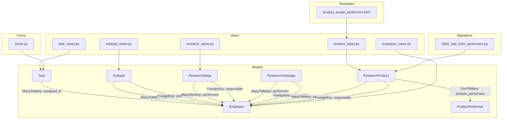
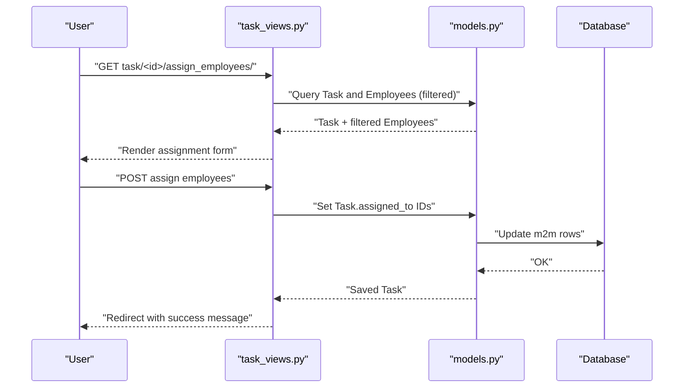
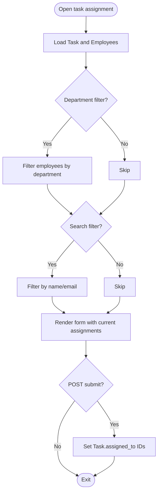
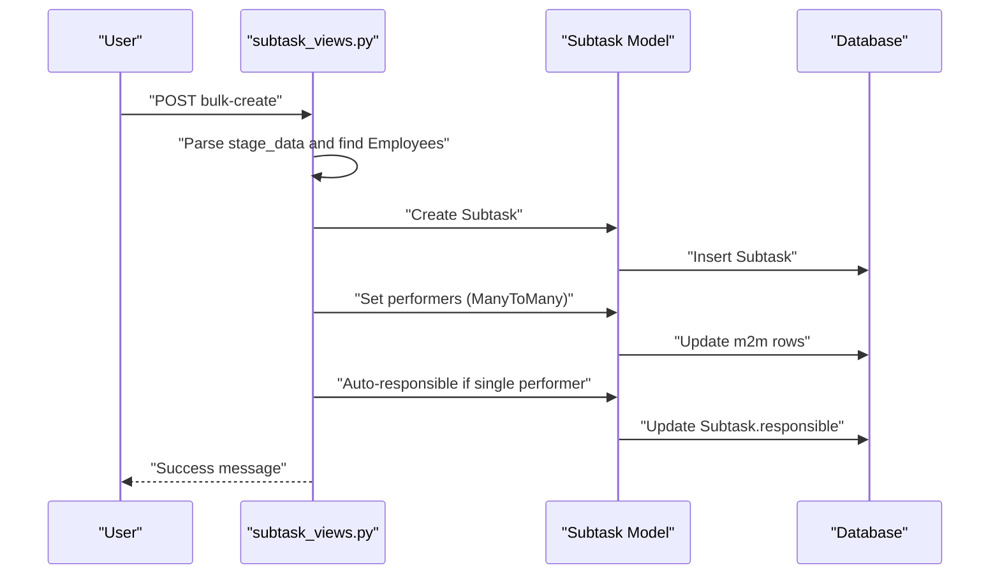
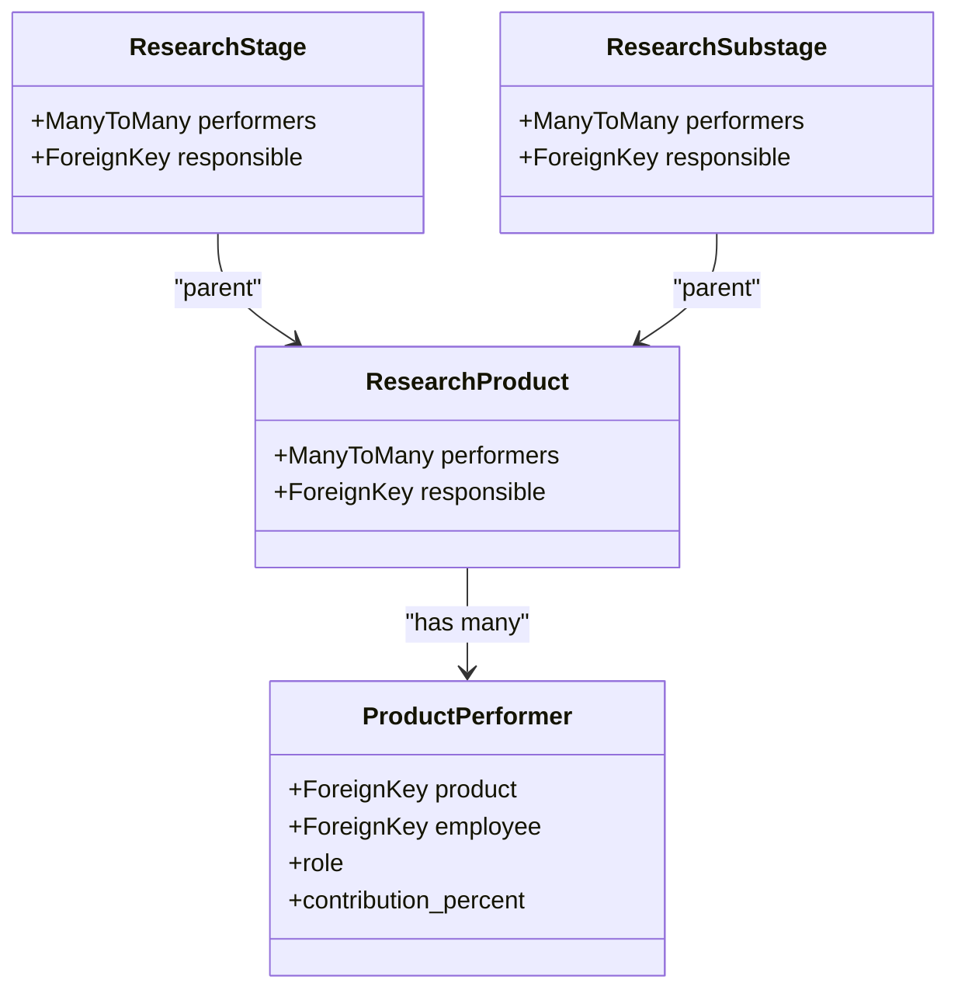
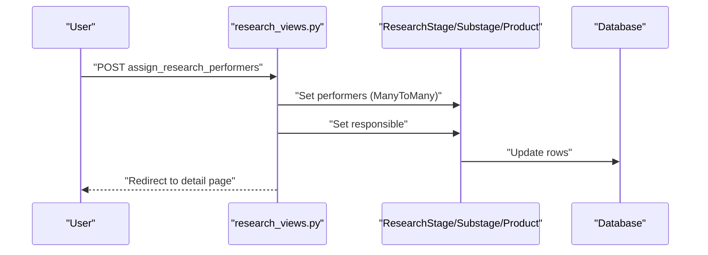
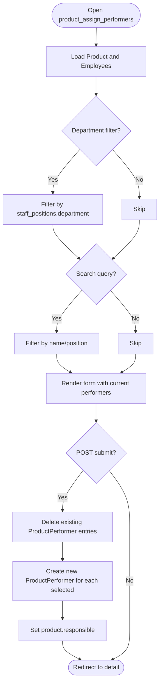
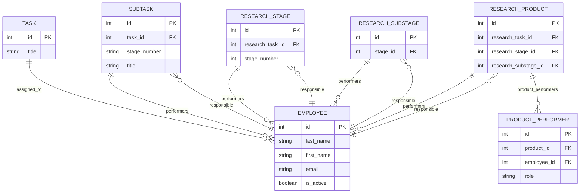

# Task Assignment and Collaboration

<cite>
**Referenced Files in This Document**
- [models.py](file://tasks/models.py)
- [task_views.py](file://tasks/views/task_views.py)
- [employee_views.py](file://tasks/views/employee_views.py)
- [subtask_views.py](file://tasks/views/subtask_views.py)
- [research_views.py](file://tasks/views/research_views.py)
- [product_views.py](file://tasks/views/product_views.py)
- [forms.py](file://tasks/forms.py)
- [0002_add_m2m_performers.py](file://tasks/migrations/0002_add_m2m_performers.py)
- [product_assign_performers.html](file://tasks/templates/tasks/product_assign_performers.html)
</cite>

## Table of Contents
1. [Introduction](#introduction)
2. [Project Structure](#project-structure)
3. [Core Components](#core-components)
4. [Architecture Overview](#architecture-overview)
5. [Detailed Component Analysis](#detailed-component-analysis)
6. [Dependency Analysis](#dependency-analysis)
7. [Performance Considerations](#performance-considerations)
8. [Troubleshooting Guide](#troubleshooting-guide)
9. [Conclusion](#conclusion)

## Introduction
This document explains the task assignment and collaboration features in the system, focusing on:
- The many-to-many relationship between tasks and employees
- Assignment workflows and performer management
- The task_assign_employees view, filtering by department and search
- Bulk assignment operations
- Assignment validation, conflict resolution, and assignment history tracking
- How assignments propagate through the task hierarchy (task → subtasks and research stages)

## Project Structure
The assignment and collaboration features span models, views, forms, migrations, and templates:
- Models define the relationships and hierarchy (Task, Subtask, Employee, Research* models)
- Views implement assignment workflows and filtering
- Forms constrain selections and enforce validation
- Migrations introduce performer relationships
- Templates provide the UI for assignment and filtering

**Diagram sources**
- [models.py:165-382](file://tasks/models.py#L165-L382)
- [models.py:448-531](file://tasks/models.py#L448-L531)
- [models.py:681-791](file://tasks/models.py#L681-L791)
- [task_views.py:301-340](file://tasks/views/task_views.py#L301-L340)
- [employee_views.py:18-332](file://tasks/views/employee_views.py#L18-L332)
- [subtask_views.py:10-65](file://tasks/views/subtask_views.py#L10-L65)
- [research_views.py:118-165](file://tasks/views/research_views.py#L118-L165)
- [product_views.py:50-170](file://tasks/views/product_views.py#L50-L170)
- [forms.py:5-44](file://tasks/forms.py#L5-L44)
- [0002_add_m2m_performers.py:1-16](file://tasks/migrations/0002_add_m2m_performers.py#L1-L16)
- [product_assign_performers.html:1-594](file://tasks/templates/tasks/product_assign_performers.html#L1-L594)

**Section sources**
- [models.py:165-382](file://tasks/models.py#L165-L382)
- [models.py:448-531](file://tasks/models.py#L448-L531)
- [models.py:681-791](file://tasks/models.py#L681-L791)
- [task_views.py:301-340](file://tasks/views/task_views.py#L301-L340)
- [employee_views.py:18-332](file://tasks/views/employee_views.py#L18-L332)
- [subtask_views.py:10-65](file://tasks/views/subtask_views.py#L10-L65)
- [research_views.py:118-165](file://tasks/views/research_views.py#L118-L165)
- [product_views.py:50-170](file://tasks/views/product_views.py#L50-L170)
- [forms.py:5-44](file://tasks/forms.py#L5-L44)
- [0002_add_m2m_performers.py:1-16](file://tasks/migrations/0002_add_m2m_performers.py#L1-L16)
- [product_assign_performers.html:1-594](file://tasks/templates/tasks/product_assign_performers.html#L1-L594)

## Core Components
- Task and Employee many-to-many relationship via assigned_to
- Subtask performer management via performers and responsible
- Research hierarchy performer management via ResearchStage, ResearchSubstage, ResearchProduct
- ProductPerformer for ResearchProduct to capture roles and contributions
- Forms validating time ranges and constraining selections to active employees
- Migrations introducing performer relationships for ResearchProduct

Key implementation references:
- Task assigned_to relationship: [models.py:191-197](file://tasks/models.py#L191-L197)
- Subtask performers/responsible: [models.py:269-285](file://tasks/models.py#L269-L285)
- Research hierarchy performers/responsible: [models.py:462-475](file://tasks/models.py#L462-L475), [models.py:502-515](file://tasks/models.py#L502-L515)
- ResearchProduct performers via ProductPerformer: [models.py:681-791](file://tasks/models.py#L681-L791), [models.py:793-800](file://tasks/models.py#L793-L800)
- Task assignment view (department and search): [task_views.py:301-340](file://tasks/views/task_views.py#L301-L340)
- Bulk subtask creation with performer assignment: [subtask_views.py:134-189](file://tasks/views/subtask_views.py#L134-L189)
- Research performer assignment: [research_views.py:118-165](file://tasks/views/research_views.py#L118-L165)
- ResearchProduct performer assignment: [product_views.py:50-170](file://tasks/views/product_views.py#L50-L170)
- Form constraints for active employees: [forms.py:27-30](file://tasks/forms.py#L27-L30), [forms.py:112-115](file://tasks/forms.py#L112-L115), [forms.py:135-139](file://tasks/forms.py#L135-L139)
- ResearchProduct performers migration: [0002_add_m2m_performers.py:1-16](file://tasks/migrations/0002_add_m2m_performers.py#L1-L16)

**Section sources**
- [models.py:165-382](file://tasks/models.py#L165-L382)
- [models.py:448-531](file://tasks/models.py#L448-L531)
- [models.py:681-791](file://tasks/models.py#L681-L791)
- [task_views.py:301-340](file://tasks/views/task_views.py#L301-L340)
- [subtask_views.py:134-189](file://tasks/views/subtask_views.py#L134-L189)
- [research_views.py:118-165](file://tasks/views/research_views.py#L118-L165)
- [product_views.py:50-170](file://tasks/views/product_views.py#L50-L170)
- [forms.py:27-30](file://tasks/forms.py#L27-L30)
- [forms.py:112-115](file://tasks/forms.py#L112-L115)
- [forms.py:135-139](file://tasks/forms.py#L135-L139)
- [0002_add_m2m_performers.py:1-16](file://tasks/migrations/0002_add_m2m_performers.py#L1-L16)

## Architecture Overview
Assignment workflows are implemented as view handlers that:
- Filter employees by department and search terms
- Set ManyToMany relationships for tasks and subtasks
- Assign responsible persons for subtasks and research items
- Persist assignments and provide feedback

**Diagram sources**
- [task_views.py:301-340](file://tasks/views/task_views.py#L301-L340)
- [models.py:165-197](file://tasks/models.py#L165-L197)

**Section sources**
- [task_views.py:301-340](file://tasks/views/task_views.py#L301-L340)
- [models.py:165-197](file://tasks/models.py#L165-L197)

## Detailed Component Analysis

### Task Assignment Workflow
- Endpoint: task/<int:task_id>/assign_employees/
- Filters:
  - Department: GET parameter "department" applied to Employee.filter(department=...)
  - Search: GET parameter "search" applied to Employee filter by name/email
- Operation:
  - On POST: collect selected employee IDs and set Task.assigned_to
  - On GET: prepare employee list, current assignment IDs, and filters

**Diagram sources**
- [task_views.py:301-340](file://tasks/views/task_views.py#L301-L340)

**Section sources**
- [task_views.py:301-340](file://tasks/views/task_views.py#L301-L340)

### Subtask Performer Assignment and Propagation
- Subtasks maintain a ManyToMany performers and a responsible Employee
- Automatic responsible assignment when a single performer is set
- Bulk creation supports parsing performer names and auto-assigning responsible if only one performer is found

**Diagram sources**
- [subtask_views.py:134-189](file://tasks/views/subtask_views.py#L134-L189)
- [models.py:269-285](file://tasks/models.py#L269-L285)

**Section sources**
- [subtask_views.py:134-189](file://tasks/views/subtask_views.py#L134-L189)
- [models.py:269-285](file://tasks/models.py#L269-L285)

### Research Hierarchy Performer Assignment
- ResearchStage and ResearchSubstage support ManyToMany performers and a responsible Employee
- ResearchProduct uses ProductPerformer to track multiple performers with roles and optional contributions

**Diagram sources**
- [models.py:462-475](file://tasks/models.py#L462-L475)
- [models.py:502-515](file://tasks/models.py#L502-L515)
- [models.py:681-791](file://tasks/models.py#L681-L791)
- [models.py:793-800](file://tasks/models.py#L793-L800)

**Section sources**
- [models.py:462-475](file://tasks/models.py#L462-L475)
- [models.py:502-515](file://tasks/models.py#L502-L515)
- [models.py:681-791](file://tasks/models.py#L681-L791)
- [models.py:793-800](file://tasks/models.py#L793-L800)

### Research Performer Assignment View
- Supports item_type: stage, substage, product
- Accepts POST lists of performers and a responsible
- Redirects to appropriate detail page after saving

**Diagram sources**
- [research_views.py:118-165](file://tasks/views/research_views.py#L118-L165)

**Section sources**
- [research_views.py:118-165](file://tasks/views/research_views.py#L118-L165)

### ResearchProduct Performer Assignment View
- Provides department-based filtering and advanced search across name and position
- Clears existing ProductPerformer entries and recreates with new performers
- Supports selecting a responsible person

**Diagram sources**
- [product_views.py:50-170](file://tasks/views/product_views.py#L50-L170)
- [product_assign_performers.html:1-594](file://tasks/templates/tasks/product_assign_performers.html#L1-L594)

**Section sources**
- [product_views.py:50-170](file://tasks/views/product_views.py#L50-L170)
- [product_assign_performers.html:1-594](file://tasks/templates/tasks/product_assign_performers.html#L1-L594)

### Assignment Validation and Conflict Resolution
- Time range validation in TaskForm prevents invalid start/end/due dates
- Constraints limit selection to active employees in forms
- Subtask automatic responsible assignment reduces manual conflict
- ResearchProduct assignment clears previous performers to avoid conflicts

Validation references:
- Task time validation: [forms.py:32-44](file://tasks/forms.py#L32-L44)
- Active employee constraints: [forms.py:27-30](file://tasks/forms.py#L27-L30), [forms.py:112-115](file://tasks/forms.py#L112-L115), [forms.py:135-139](file://tasks/forms.py#L135-L139)
- Subtask responsible auto-assignment: [models.py:328-340](file://tasks/models.py#L328-L340)
- ResearchProduct performer reset: [product_views.py:60-76](file://tasks/views/product_views.py#L60-L76)

**Section sources**
- [forms.py:32-44](file://tasks/forms.py#L32-L44)
- [forms.py:27-30](file://tasks/forms.py#L27-L30)
- [forms.py:112-115](file://tasks/forms.py#L112-L115)
- [forms.py:135-139](file://tasks/forms.py#L135-L139)
- [models.py:328-340](file://tasks/models.py#L328-L340)
- [product_views.py:60-76](file://tasks/views/product_views.py#L60-L76)

### Assignment History Tracking
- No explicit audit log or history model is present in the analyzed files
- Signals clear organizational cache on Employee/Department/StaffPosition changes, indirectly supporting consistency

References:
- Cache clearing signals: [signals.py:7-32](file://tasks/signals.py#L7-L32)

**Section sources**
- [signals.py:7-32](file://tasks/signals.py#L7-L32)

## Dependency Analysis
- Task.assigned_to ↔ Employee (many-to-many)
- Subtask.performers ↔ Employee (many-to-many)
- Subtask.responsible ↔ Employee (foreign key)
- ResearchStage.performers ↔ Employee (many-to-many)
- ResearchStage.responsible ↔ Employee (foreign key)
- ResearchSubstage.performers ↔ Employee (many-to-many)
- ResearchSubstage.responsible ↔ Employee (foreign key)
- ResearchProduct.performers ↔ Employee (many-to-many)
- ResearchProduct.responsible ↔ Employee (foreign key)
- ResearchProduct → ProductPerformer (one-to-many) for roles and contributions

**Diagram sources**
- [models.py:165-197](file://tasks/models.py#L165-L197)
- [models.py:269-285](file://tasks/models.py#L269-L285)
- [models.py:462-475](file://tasks/models.py#L462-L475)
- [models.py:502-515](file://tasks/models.py#L502-L515)
- [models.py:681-791](file://tasks/models.py#L681-L791)
- [models.py:793-800](file://tasks/models.py#L793-L800)

**Section sources**
- [models.py:165-197](file://tasks/models.py#L165-L197)
- [models.py:269-285](file://tasks/models.py#L269-L285)
- [models.py:462-475](file://tasks/models.py#L462-L475)
- [models.py:502-515](file://tasks/models.py#L502-L515)
- [models.py:681-791](file://tasks/models.py#L681-L791)
- [models.py:793-800](file://tasks/models.py#L793-L800)

## Performance Considerations
- Filtering by department on employees uses database indexes; ensure indexes exist on Employee.department and Employee.is_active
- Bulk operations (subtask bulk create, ResearchProduct performer reset) iterate over lists; consider batching for very large sets
- Use select_related/prefetch_related in views to minimize N+1 queries when rendering assignment pages
- Caching organizational structure is cleared on Employee/Department/StaffPosition changes to keep UI consistent

[No sources needed since this section provides general guidance]

## Troubleshooting Guide
Common issues and resolutions:
- Invalid time ranges on Task: ensure start_time ≤ end_time and start_time ≤ due_date
- Employees not selectable: verify they are active and included in form querysets
- Subtask responsible missing: ensure a single performer is set so auto-assignment triggers
- ResearchProduct performers not updating: confirm the view clears existing ProductPerformer entries before re-creating

References:
- Time validation: [forms.py:32-44](file://tasks/forms.py#L32-L44)
- Active employee constraints: [forms.py:27-30](file://tasks/forms.py#L27-L30), [forms.py:112-115](file://tasks/forms.py#L112-L115), [forms.py:135-139](file://tasks/forms.py#L135-L139)
- Auto-responsible: [models.py:328-340](file://tasks/models.py#L328-L340)
- Reset performers: [product_views.py:60-76](file://tasks/views/product_views.py#L60-L76)

**Section sources**
- [forms.py:32-44](file://tasks/forms.py#L32-L44)
- [forms.py:27-30](file://tasks/forms.py#L27-L30)
- [forms.py:112-115](file://tasks/forms.py#L112-L115)
- [forms.py:135-139](file://tasks/forms.py#L135-L139)
- [models.py:328-340](file://tasks/models.py#L328-L340)
- [product_views.py:60-76](file://tasks/views/product_views.py#L60-L76)

## Conclusion
The system implements robust task assignment and collaboration through:
- Clear many-to-many relationships between tasks and employees
- Dedicated assignment views with department and search filtering
- Bulk assignment capabilities for subtasks and research items
- Validation and conflict resolution via form constraints and automatic responsible assignment
- Extensible performer management for research hierarchies using ProductPerformer