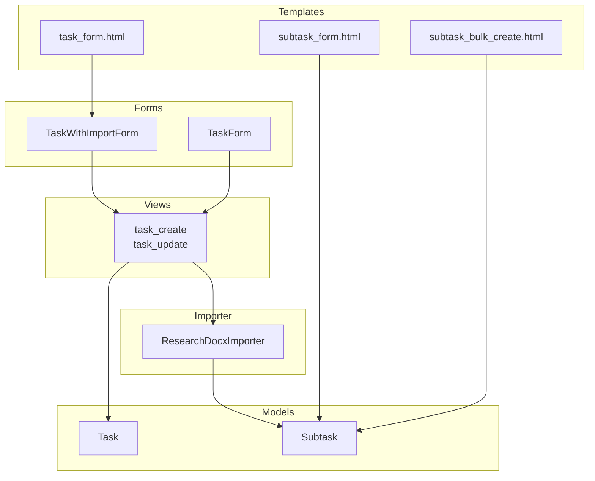
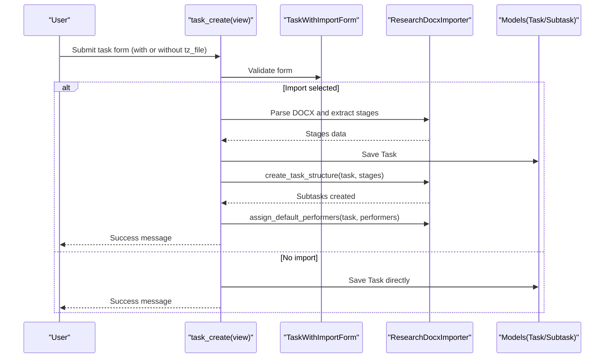
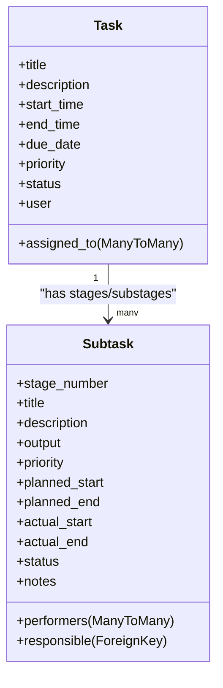
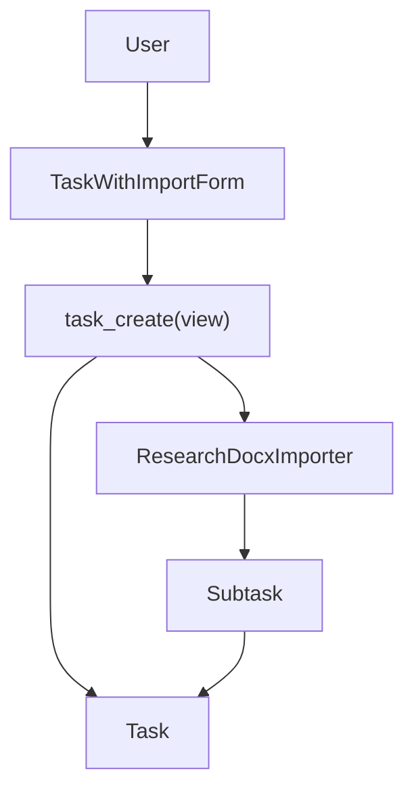
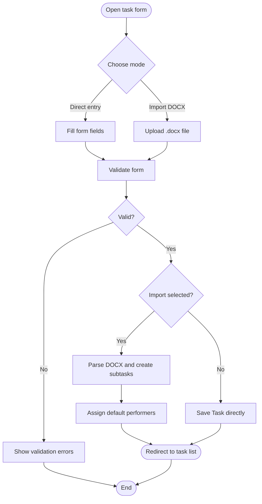
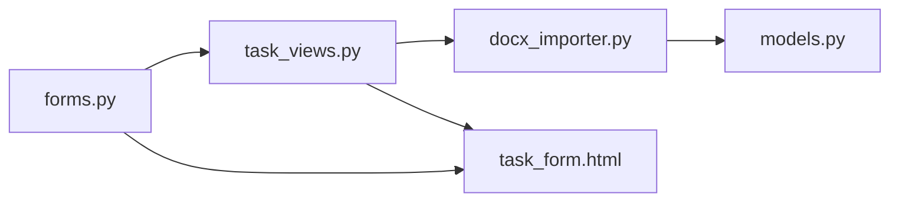

# Task Creation and Editing

<cite>
**Referenced Files in This Document**
- [forms.py](file://tasks/forms.py)
- [task_views.py](file://tasks/views/task_views.py)
- [docx_importer.py](file://tasks/utils/docx_importer.py)
- [models.py](file://tasks/models.py)
- [task_form.html](file://tasks/templates/tasks/task_form.html)
- [subtask_form.html](file://tasks/templates/tasks/subtask_form.html)
- [subtask_bulk_create.html](file://tasks/templates/tasks/subtask_bulk_create.html)
- [test_forms.py](file://tasks/tests/test_forms.py)
</cite>

## Table of Contents
1. [Introduction](#introduction)
2. [Project Structure](#project-structure)
3. [Core Components](#core-components)
4. [Architecture Overview](#architecture-overview)
5. [Detailed Component Analysis](#detailed-component-analysis)
6. [Dependency Analysis](#dependency-analysis)
7. [Performance Considerations](#performance-considerations)
8. [Troubleshooting Guide](#troubleshooting-guide)
9. [Conclusion](#conclusion)
10. [Appendices](#appendices)

## Introduction
This document explains the task creation and editing functionality with a focus on the dual creation mode that supports both direct task entry and DOCX import from research task specifications. It covers the TaskWithImportForm and TaskForm classes, their field definitions, validation rules, and business logic. It also documents the integration with ResearchDocxImporter for automated task structure creation, default performer assignment, and bulk operation capabilities. Step-by-step workflows, form field descriptions, validation error messages, user feedback mechanisms, and examples of successful creation scenarios and common error conditions are included.

## Project Structure
The task creation/editing feature spans several modules:
- Forms define UI fields, widgets, and validation logic.
- Views orchestrate request handling, form processing, and integration with the importer.
- Importer parses DOCX files and creates structured subtasks.
- Templates render the forms and provide user feedback.
- Tests validate form behavior.

**Diagram sources**
- [forms.py:5-44](file://tasks/forms.py#L5-L44)
- [forms.py:164-201](file://tasks/forms.py#L164-L201)
- [task_views.py:79-179](file://tasks/views/task_views.py#L79-L179)
- [docx_importer.py:6-44](file://tasks/utils/docx_importer.py#L6-L44)
- [models.py:165-238](file://tasks/models.py#L165-L238)
- [task_form.html:60-159](file://tasks/templates/tasks/task_form.html#L60-L159)
- [subtask_form.html:36-181](file://tasks/templates/tasks/subtask_form.html#L36-L181)
- [subtask_bulk_create.html:26-47](file://tasks/templates/tasks/subtask_bulk_create.html#L26-L47)

**Section sources**
- [forms.py:1-224](file://tasks/forms.py#L1-L224)
- [task_views.py:1-471](file://tasks/views/task_views.py#L1-L471)
- [docx_importer.py:1-521](file://tasks/utils/docx_importer.py#L1-L521)
- [models.py:165-531](file://tasks/models.py#L165-L531)
- [task_form.html:1-226](file://tasks/templates/tasks/task_form.html#L1-L226)
- [subtask_form.html:1-234](file://tasks/templates/tasks/subtask_form.html#L1-L234)
- [subtask_bulk_create.html:1-52](file://tasks/templates/tasks/subtask_bulk_create.html#L1-L52)

## Core Components
- TaskForm: Standard form for editing existing tasks with validation for time fields and active employee selection.
- TaskWithImportForm: Extended form for creating tasks with optional DOCX import, dynamic title handling, and performer assignment.
- ResearchDocxImporter: Parses DOCX research task specifications and creates task structure (stages and subtasks).
- Views: task_create and task_update handle form submission, validation, and importer integration.
- Templates: Render forms, provide user feedback, and support file selection and preview.

Key responsibilities:
- Validation: Ensure logical time ranges and required fields.
- Import: Extract stages and subtasks from DOCX and create Subtask records.
- Feedback: Messages for success, warnings, and errors.
- Bulk operations: Support for mass stage creation via text input.

**Section sources**
- [forms.py:5-44](file://tasks/forms.py#L5-L44)
- [forms.py:164-201](file://tasks/forms.py#L164-L201)
- [task_views.py:79-179](file://tasks/views/task_views.py#L79-L179)
- [docx_importer.py:14-44](file://tasks/utils/docx_importer.py#L14-L44)
- [task_form.html:60-159](file://tasks/templates/tasks/task_form.html#L60-L159)

## Architecture Overview
The dual creation mode integrates Django forms, views, and a DOCX parser to support two workflows:
- Direct creation: Fill out the form and save a Task with optional performers.
- DOCX import: Upload a .docx file, parse stages/substages, create Subtask entries, and optionally assign default performers.

**Diagram sources**
- [task_views.py:79-179](file://tasks/views/task_views.py#L79-L179)
- [forms.py:164-201](file://tasks/forms.py#L164-L201)
- [docx_importer.py:14-44](file://tasks/utils/docx_importer.py#L14-L44)
- [docx_importer.py:367-441](file://tasks/utils/docx_importer.py#L367-L441)

## Detailed Component Analysis

### TaskForm
Purpose:
- Edit existing Task instances with validation for time fields and active employee selection.

Fields and widgets:
- title, description, start_time, end_time, due_date, priority, status, assigned_to
- Widgets tailored for date/time and multi-select with active employee filtering

Validation:
- Ensures end_time >= start_time and due_date >= start_time
- Enforces active employee selection for assigned_to

Usage:
- Used in task_update view for editing tasks

**Section sources**
- [forms.py:5-44](file://tasks/forms.py#L5-L44)
- [task_views.py:181-203](file://tasks/views/task_views.py#L181-L203)
- [models.py:165-238](file://tasks/models.py#L165-L238)

### TaskWithImportForm
Purpose:
- Create tasks with optional DOCX import for research task structure.

Fields and widgets:
- Same as TaskForm plus tz_file for DOCX upload
- Dynamic title handling: title is optional when importing from DOCX

Validation:
- Inherits TaskForm validation
- Title becomes optional when tz_file is present (help text indicates automatic population)

Business logic:
- In task_create view, if a DOCX is uploaded, the importer extracts stages and subtasks
- Existing subtasks are removed before import to avoid duplication
- Default performers can be assigned to imported stages/subtasks

Template integration:
- task_form.html renders the form, supports file selection, and shows feedback

**Section sources**
- [forms.py:164-201](file://tasks/forms.py#L164-L201)
- [task_views.py:79-179](file://tasks/views/task_views.py#L79-L179)
- [task_form.html:60-159](file://tasks/templates/tasks/task_form.html#L60-L159)

### ResearchDocxImporter
Responsibilities:
- Parse DOCX research task specification
- Extract metadata (title, dates, funding)
- Extract stages and subtasks with dates and products
- Create Subtask records for stages and subtasks
- Assign default performers to stages/subtasks

Key methods:
- parse_research_task: orchestrates extraction and returns structured data
- create_task_structure: creates Subtask records for stages/substages
- assign_default_performers: assigns performers to created subtasks

Data flow:
- Reads paragraphs and tables from DOCX
- Uses regex to extract structured fields
- Builds hierarchical stages/substages with dates and products

**Section sources**
- [docx_importer.py:14-44](file://tasks/utils/docx_importer.py#L14-L44)
- [docx_importer.py:205-320](file://tasks/utils/docx_importer.py#L205-L320)
- [docx_importer.py:367-441](file://tasks/utils/docx_importer.py#L367-L441)

### Views: task_create and task_update
Workflow highlights:
- task_create:
  - Accepts POST with form data and optional tz_file
  - Validates TaskWithImportForm
  - If import file present:
    - Saves form data (task.user set)
    - Imports DOCX, updates task title if missing, removes existing subtasks
    - Creates stages/substages via importer
    - Assigns default performers if provided
    - Returns success or error messages
  - Otherwise saves task directly
- task_update:
  - Edits existing Task with TaskForm and validation

User feedback:
- Success, warning, and error messages via Django messages framework
- Template renders non-field and field-specific errors

**Section sources**
- [task_views.py:79-179](file://tasks/views/task_views.py#L79-L179)
- [task_views.py:181-203](file://tasks/views/task_views.py#L181-L203)
- [task_form.html:63-75](file://tasks/templates/tasks/task_form.html#L63-L75)

### Templates
- task_form.html:
  - Renders TaskWithImportForm
  - Provides file selection area and info display
  - Shows non-field and field-specific errors
  - Integrates Select2 for multi-select performers
- subtask_form.html:
  - Renders Subtask editing form with performers and responsible selection
  - Uses Select2 and auto-responsible behavior
- subtask_bulk_create.html:
  - Provides a text area for mass stage creation with a defined format

**Section sources**
- [task_form.html:60-159](file://tasks/templates/tasks/task_form.html#L60-L159)
- [subtask_form.html:36-181](file://tasks/templates/tasks/subtask_form.html#L36-L181)
- [subtask_bulk_create.html:26-47](file://tasks/templates/tasks/subtask_bulk_create.html#L26-L47)

### Model Relationships
- Task has many Subtask entries representing stages/substages
- Subtask has performers and responsible fields
- TaskForm/TaskWithImportForm restricts assigned_to to active employees

**Diagram sources**
- [models.py:165-238](file://tasks/models.py#L165-L238)
- [models.py:239-382](file://tasks/models.py#L239-L382)

## Architecture Overview
The system combines Django forms and views with a specialized DOCX importer to support research task creation in two modes:
- Direct: User fills the form and saves a Task.
- Import: User uploads a DOCX; the importer extracts stages and subtasks and creates Subtask records.

**Diagram sources**
- [task_views.py:79-179](file://tasks/views/task_views.py#L79-L179)
- [forms.py:164-201](file://tasks/forms.py#L164-L201)
- [docx_importer.py:14-44](file://tasks/utils/docx_importer.py#L14-L44)
- [models.py:165-238](file://tasks/models.py#L165-L238)

## Detailed Component Analysis

### Form Field Definitions and Validation Rules
- TaskForm fields:
  - title: required
  - description: optional
  - start_time, end_time, due_date: optional; validation enforces logical order
  - priority: choices low/medium/high
  - status: choices todo/in_progress/done
  - assigned_to: multi-select of active employees
- TaskWithImportForm fields:
  - Same as TaskForm plus tz_file (optional)
  - title becomes optional when importing from DOCX

Validation rules:
- End time must be >= start time
- Due date must be >= start time
- Active employee filtering for assigned_to

Error handling:
- ValidationError raised during form.clean for invalid time ranges
- Template displays non-field and field-specific errors

**Section sources**
- [forms.py:5-44](file://tasks/forms.py#L5-L44)
- [forms.py:164-201](file://tasks/forms.py#L164-L201)
- [task_form.html:88-91](file://tasks/templates/tasks/task_form.html#L88-L91)
- [task_form.html:109-111](file://tasks/templates/tasks/task_form.html#L109-L111)

### Dual Creation Mode Workflows
- Direct creation:
  - User submits TaskWithImportForm without tz_file
  - View validates and saves Task directly
  - Success message shown
- DOCX import:
  - User selects .docx file
  - View saves Task, imports DOCX, removes existing subtasks, creates stages/substages
  - Optional default performers are assigned
  - Success or warning message shown

**Diagram sources**
- [task_views.py:79-179](file://tasks/views/task_views.py#L79-L179)
- [forms.py:164-201](file://tasks/forms.py#L164-L201)
- [task_form.html:60-159](file://tasks/templates/tasks/task_form.html#L60-L159)

### Integration with ResearchDocxImporter
- Parser extracts:
  - Title, dates, foundation, funding source, customer, executor, address, location
  - Goals, tasks, and stages with substages and product lists
- Structure creation:
  - Removes existing subtasks
  - Creates Subtask entries for stages and substages
  - Stores expected products in subtask.output
- Default performer assignment:
  - Applies performers to imported stages/substages if provided

**Section sources**
- [docx_importer.py:14-44](file://tasks/utils/docx_importer.py#L14-L44)
- [docx_importer.py:367-441](file://tasks/utils/docx_importer.py#L367-L441)
- [task_views.py:104-136](file://tasks/views/task_views.py#L104-L136)

### Bulk Operation Capabilities
- Mass stage creation:
  - subtask_bulk_create.html accepts structured text input
  - Supports number, title, priority, description, and comma-separated performers
- Integration:
  - Useful for quickly generating stage outlines prior to import

**Section sources**
- [subtask_bulk_create.html:13-24](file://tasks/templates/tasks/subtask_bulk_create.html#L13-L24)

### Step-by-Step Creation Workflows
- Direct task creation:
  1. Navigate to task creation page
  2. Fill title, description, dates, priority, status, and assignees
  3. Submit form
  4. View confirms success
- DOCX import creation:
  1. Navigate to task creation page
  2. Click “Import from Research Task Specification” area
  3. Select .docx file
  4. Optionally select default performers
  5. Submit form
  6. View imports stages/substages and shows success or warning

**Section sources**
- [task_form.html:49-58](file://tasks/templates/tasks/task_form.html#L49-L58)
- [task_views.py:79-179](file://tasks/views/task_views.py#L79-L179)

### Examples and Error Conditions
- Successful creation (import):
  - Upload a valid DOCX with stages
  - Optionally select default performers
  - On submit, view imports and creates subtasks
  - Success message: “Task successfully created with import from Research Task Specification”
- Successful creation (direct):
  - Fill required fields and submit
  - Success message: “Task successfully created!”
- Common errors:
  - Invalid time range: “End time cannot be earlier than start time”
  - Due date before start: “Due date cannot be earlier than start time”
  - Import parsing failure: Error message shown with exception details
  - Missing title when not importing: form validation fails

**Section sources**
- [task_views.py:147-151](file://tasks/views/task_views.py#L147-L151)
- [forms.py:32-44](file://tasks/forms.py#L32-L44)
- [test_forms.py:34-43](file://tasks/tests/test_forms.py#L34-L43)

## Dependency Analysis
- Forms depend on models for field definitions and employee filtering
- Views depend on forms and importer for processing
- Importer depends on models for creating subtasks
- Templates depend on forms for rendering and user feedback

**Diagram sources**
- [forms.py:5-44](file://tasks/forms.py#L5-L44)
- [task_views.py:79-179](file://tasks/views/task_views.py#L79-L179)
- [docx_importer.py:6-44](file://tasks/utils/docx_importer.py#L6-L44)
- [models.py:165-238](file://tasks/models.py#L165-L238)
- [task_form.html:60-159](file://tasks/templates/tasks/task_form.html#L60-L159)

**Section sources**
- [forms.py:1-224](file://tasks/forms.py#L1-L224)
- [task_views.py:1-471](file://tasks/views/task_views.py#L1-L471)
- [docx_importer.py:1-521](file://tasks/utils/docx_importer.py#L1-L521)
- [models.py:165-531](file://tasks/models.py#L165-L531)
- [task_form.html:1-226](file://tasks/templates/tasks/task_form.html#L1-L226)

## Performance Considerations
- Import parsing reads entire DOCX; large files may increase processing time
- Removing existing subtasks before import ensures clean state but requires additional queries
- Using temporary files for uploaded DOCX avoids keeping large payloads in memory
- Filtering employees by is_active reduces query size and improves UX

## Troubleshooting Guide
- Validation errors:
  - Ensure end_time >= start_time and due_date >= start_time
  - Select active employees for assigned_to
- Import errors:
  - Verify DOCX contains expected structure (stages table, dates)
  - Confirm file is .docx and not corrupted
- Unexpected empty title:
  - When importing, title can be taken from DOCX; otherwise fill manually
- Default performers not applied:
  - Ensure performers are selected in the form before submitting

**Section sources**
- [forms.py:32-44](file://tasks/forms.py#L32-L44)
- [task_views.py:147-151](file://tasks/views/task_views.py#L147-L151)
- [task_form.html:112-114](file://tasks/templates/tasks/task_form.html#L112-L114)

## Conclusion
The task creation and editing system provides flexible dual-mode creation: direct entry and DOCX import. TaskWithImportForm and TaskForm encapsulate validation and UI concerns, while ResearchDocxImporter automates structure creation and default performer assignment. The views coordinate these components, and templates deliver user feedback. Together, they support efficient task lifecycle management with robust validation and clear error messaging.

## Appendices
- Test coverage:
  - Form validation tests confirm invalid time ranges and required fields
  - TaskWithImportForm presence checks ensure expected fields exist

**Section sources**
- [test_forms.py:13-43](file://tasks/tests/test_forms.py#L13-L43)
- [test_forms.py:49-65](file://tasks/tests/test_forms.py#L49-L65)