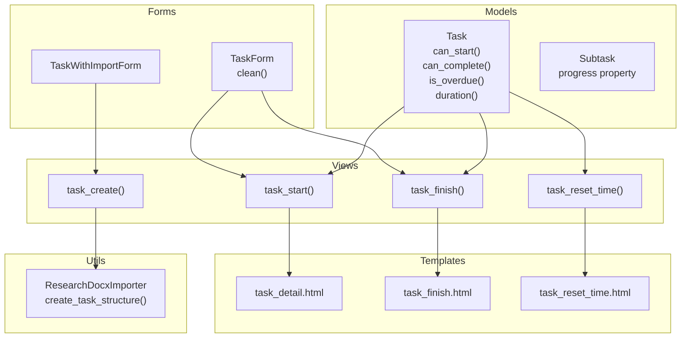
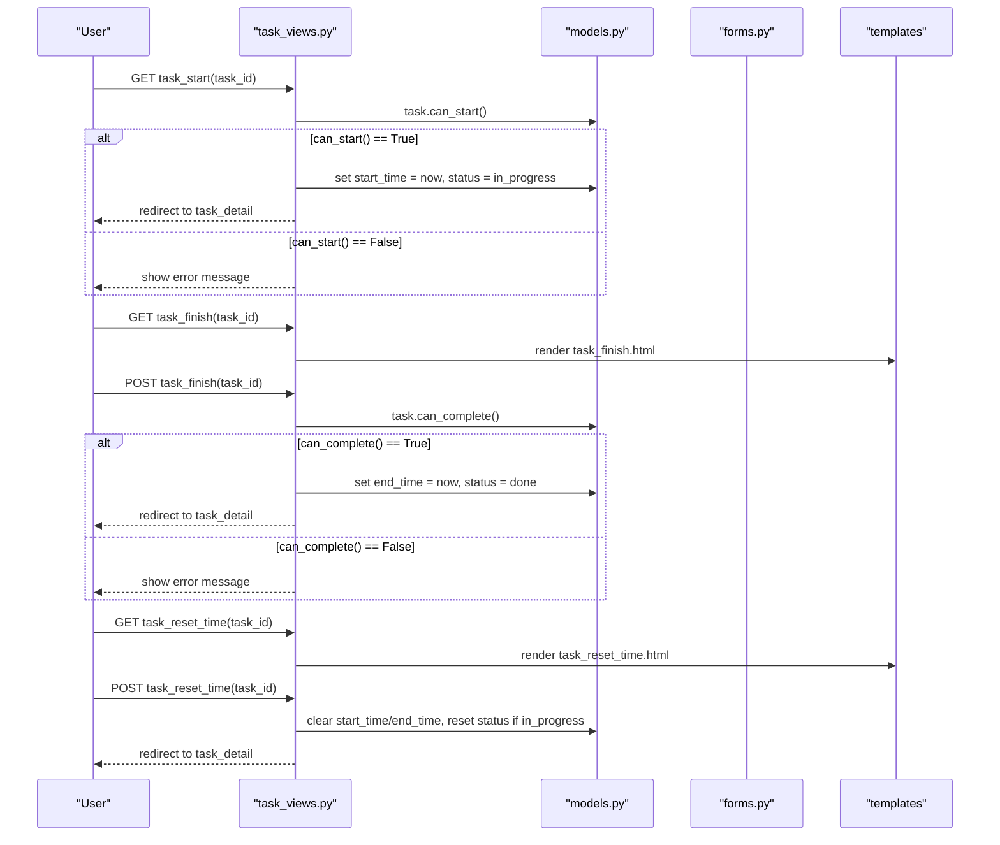
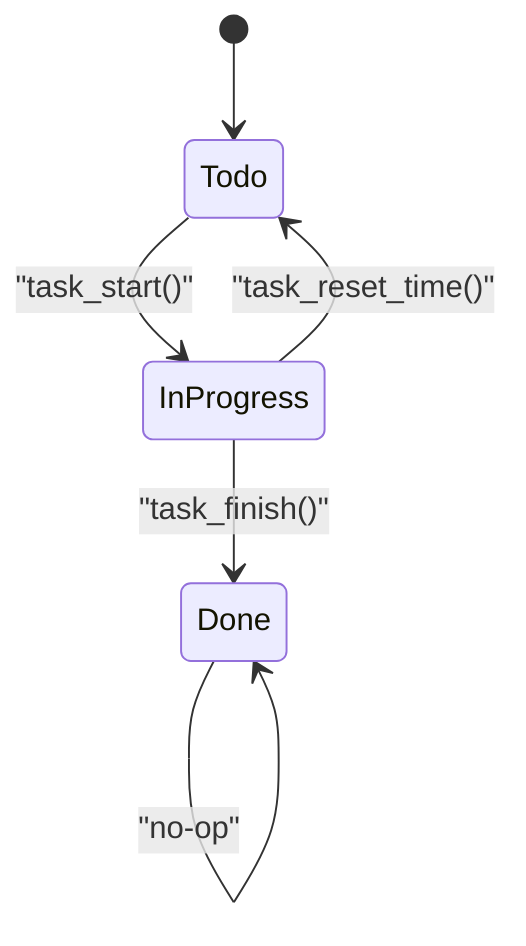
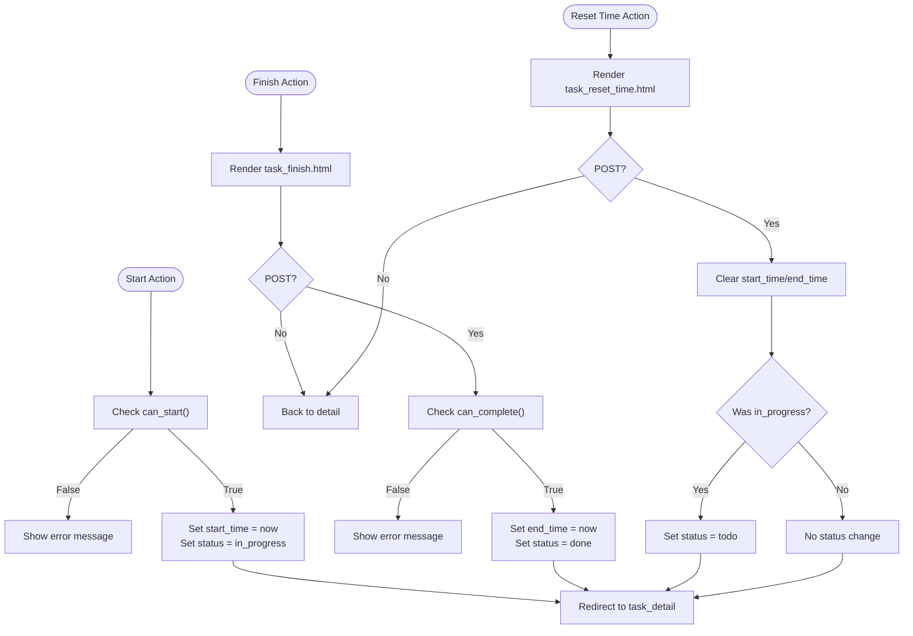
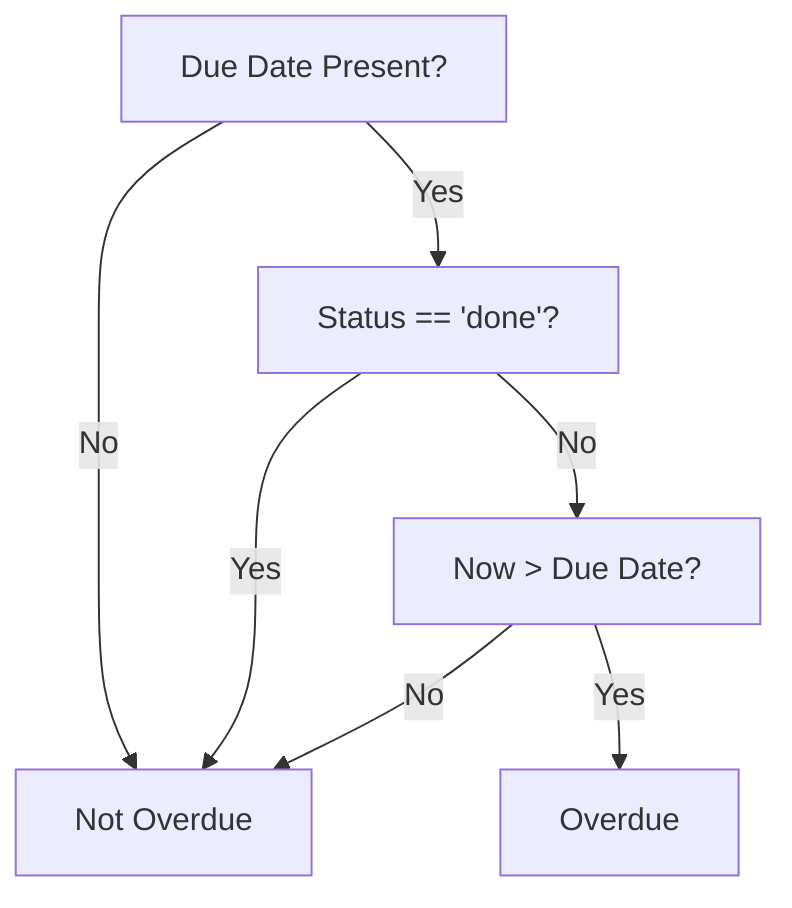
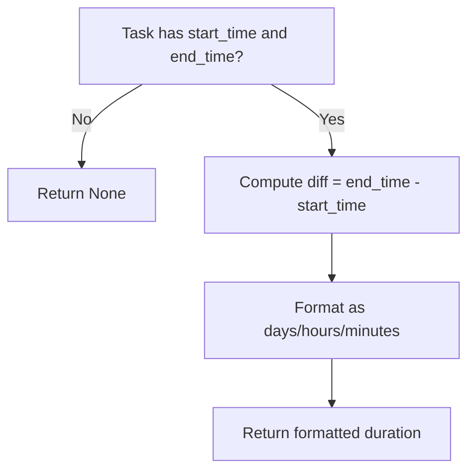
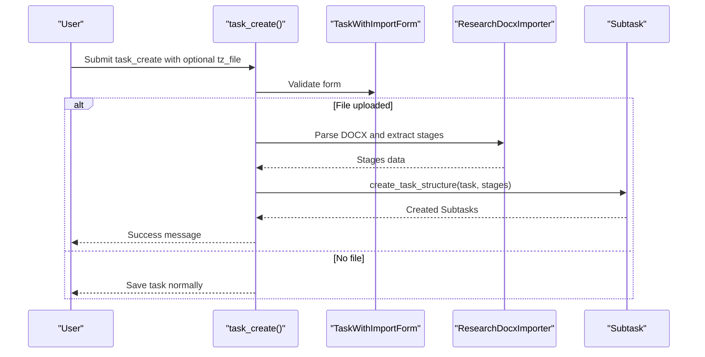
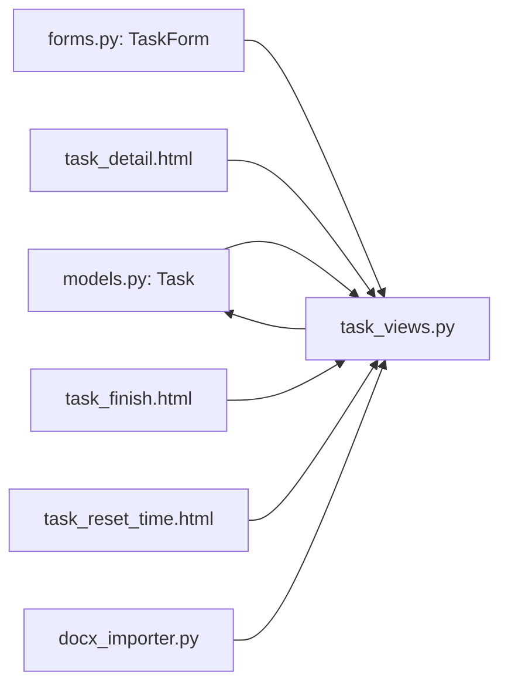

# Task Lifecycle Management

<cite>
**Referenced Files in This Document**
- [models.py](file://tasks/models.py)
- [task_views.py](file://tasks/views/task_views.py)
- [forms.py](file://tasks/forms.py)
- [docx_importer.py](file://tasks/utils/docx_importer.py)
- [task_detail.html](file://tasks/templates/tasks/task_detail.html)
- [task_finish.html](file://tasks/templates/tasks/task_finish.html)
- [task_reset_time.html](file://tasks/templates/tasks/task_reset_time.html)
- [urls.py](file://tasks/urls.py)
- [test_models.py](file://tasks/tests/test_models.py)
</cite>

## Table of Contents
1. [Introduction](#introduction)
2. [Project Structure](#project-structure)
3. [Core Components](#core-components)
4. [Architecture Overview](#architecture-overview)
5. [Detailed Component Analysis](#detailed-component-analysis)
6. [Dependency Analysis](#dependency-analysis)
7. [Performance Considerations](#performance-considerations)
8. [Troubleshooting Guide](#troubleshooting-guide)
9. [Conclusion](#conclusion)

## Introduction
This document explains the complete task lifecycle management in the Task Management System. It covers the end-to-end workflow from task creation to completion, including status transitions (todo → in_progress → done), timing controls (start_time, end_time), state validation logic, deadline management, overdue detection, and time tracking calculations. It also documents the integration with research task import functionality, task reset operations, and time tracking reset scenarios.

## Project Structure
The task lifecycle spans several modules:
- Models define the Task entity, validation helpers, and timing calculations.
- Views implement the lifecycle actions (start, finish, reset-time) and integrate with the research import pipeline.
- Forms enforce business rules for time fields and priorities.
- Templates render the UI for task state transitions and confirmations.
- URLs route requests to the appropriate views.

**Diagram sources**
- [models.py:165-238](file://tasks/models.py#L165-L238)
- [task_views.py:250-298](file://tasks/views/task_views.py#L250-L298)
- [forms.py:5-44](file://tasks/forms.py#L5-L44)
- [docx_importer.py:367-441](file://tasks/utils/docx_importer.py#L367-L441)
- [task_detail.html:172-198](file://tasks/templates/tasks/task_detail.html#L172-L198)
- [task_finish.html:1-32](file://tasks/templates/tasks/task_finish.html#L1-L32)
- [task_reset_time.html:1-32](file://tasks/templates/tasks/task_reset_time.html#L1-L32)

**Section sources**
- [models.py:165-238](file://tasks/models.py#L165-L238)
- [task_views.py:250-298](file://tasks/views/task_views.py#L250-L298)
- [forms.py:5-44](file://tasks/forms.py#L5-L44)
- [docx_importer.py:367-441](file://tasks/utils/docx_importer.py#L367-L441)
- [task_detail.html:172-198](file://tasks/templates/tasks/task_detail.html#L172-L198)
- [task_finish.html:1-32](file://tasks/templates/tasks/task_finish.html#L1-L32)
- [task_reset_time.html:1-32](file://tasks/templates/tasks/task_reset_time.html#L1-L32)

## Core Components
- Task model encapsulates lifecycle fields (status, start_time, end_time, due_date) and validation helpers:
  - can_start(): validates readiness to start (todo and no start_time).
  - can_complete(): validates readiness to finish (in_progress, has start_time, no end_time).
  - is_overdue(): determines overdue state based on due_date and status.
  - duration(): computes human-readable duration when both start_time and end_time are present.
- Task views implement lifecycle actions:
  - task_start(): sets start_time and status to in_progress when can_start() passes.
  - task_finish(): prompts confirmation and sets end_time and status to done when can_complete() passes.
  - task_reset_time(): clears timing fields and resets status to todo if currently in_progress.
  - task_create(): integrates research task import to build task structure from DOCX.
- Forms enforce business rules:
  - TaskForm.clean(): ensures end_time ≥ start_time and due_date ≥ start_time.
- Templates render UI for transitions and confirmations.

**Section sources**
- [models.py:165-238](file://tasks/models.py#L165-L238)
- [task_views.py:250-298](file://tasks/views/task_views.py#L250-L298)
- [forms.py:32-44](file://tasks/forms.py#L32-L44)
- [task_detail.html:172-198](file://tasks/templates/tasks/task_detail.html#L172-L198)
- [task_finish.html:1-32](file://tasks/templates/tasks/task_finish.html#L1-L32)
- [task_reset_time.html:1-32](file://tasks/templates/tasks/task_reset_time.html#L1-L32)

## Architecture Overview
The lifecycle is controlled by the Task model’s validation helpers and enforced by views. Forms validate temporal constraints server-side. The research import pipeline builds task structure from DOCX and integrates with task creation.

**Diagram sources**
- [task_views.py:250-298](file://tasks/views/task_views.py#L250-L298)
- [models.py:231-238](file://tasks/models.py#L231-L238)
- [task_finish.html:1-32](file://tasks/templates/tasks/task_finish.html#L1-L32)
- [task_reset_time.html:1-32](file://tasks/templates/tasks/task_reset_time.html#L1-L32)

## Detailed Component Analysis

### Task Model: State Machine and Validation
The Task model defines the state machine and validation logic:
- Statuses: todo, in_progress, done.
- Timing fields: start_time, end_time, due_date.
- Validation helpers:
  - can_start(): requires status == todo and no start_time.
  - can_complete(): requires status == in_progress, start_time set, and no end_time.
  - is_overdue(): overdue if due_date < now and status != done.
  - duration(): computes human-readable duration when both start_time and end_time are present.

**Diagram sources**
- [models.py:165-238](file://tasks/models.py#L165-L238)
- [task_views.py:250-298](file://tasks/views/task_views.py#L250-L298)

**Section sources**
- [models.py:165-238](file://tasks/models.py#L165-L238)

### Lifecycle Actions: Views and Business Rules
- task_start():
  - Validates can_start() before updating start_time and status.
  - Redirects to task detail page with success/error message.
- task_finish():
  - Renders a confirmation page (task_finish.html) for safety.
  - On POST, validates can_complete() before setting end_time and status.
- task_reset_time():
  - Renders a confirmation page (task_reset_time.html) for safety.
  - Clears start_time and end_time; if status was in_progress, resets to todo.

**Diagram sources**
- [task_views.py:250-298](file://tasks/views/task_views.py#L250-L298)
- [task_finish.html:1-32](file://tasks/templates/tasks/task_finish.html#L1-L32)
- [task_reset_time.html:1-32](file://tasks/templates/tasks/task_reset_time.html#L1-L32)

**Section sources**
- [task_views.py:250-298](file://tasks/views/task_views.py#L250-L298)
- [task_finish.html:1-32](file://tasks/templates/tasks/task_finish.html#L1-L32)
- [task_reset_time.html:1-32](file://tasks/templates/tasks/task_reset_time.html#L1-L32)

### Deadline Management and Overdue Detection
- Overdue detection:
  - is_overdue() returns true if due_date exists, status != done, and current time exceeds due_date.
  - Template displays overdue badge when applicable.
- Form validation:
  - TaskForm.clean() enforces end_time ≥ start_time and due_date ≥ start_time.

**Diagram sources**
- [models.py:214-218](file://tasks/models.py#L214-L218)
- [task_detail.html:50-52](file://tasks/templates/tasks/task_detail.html#L50-L52)
- [forms.py:32-44](file://tasks/forms.py#L32-L44)

**Section sources**
- [models.py:214-218](file://tasks/models.py#L214-L218)
- [task_detail.html:50-52](file://tasks/templates/tasks/task_detail.html#L50-L52)
- [forms.py:32-44](file://tasks/forms.py#L32-L44)

### Time Tracking Calculations
- Duration calculation:
  - duration() computes difference between end_time and start_time and formats as days/hours/minutes when both are present.
- Statistics:
  - task_statistics aggregates active tasks and average duration for completed tasks.

**Diagram sources**
- [models.py:219-229](file://tasks/models.py#L219-L229)
- [task_views.py:377-384](file://tasks/views/task_views.py#L377-L384)

**Section sources**
- [models.py:219-229](file://tasks/models.py#L219-L229)
- [task_views.py:377-384](file://tasks/views/task_views.py#L377-L384)

### Integration with Research Task Import
- task_create() supports importing DOCX-based research task structure:
  - Parses DOCX via ResearchDocxImporter.
  - Creates Subtask entries for stages and substages.
  - Assigns default performers if provided.
  - Handles errors gracefully and preserves task creation when import fails.

**Diagram sources**
- [task_views.py:79-179](file://tasks/views/task_views.py#L79-L179)
- [docx_importer.py:367-441](file://tasks/utils/docx_importer.py#L367-L441)
- [forms.py:164-201](file://tasks/forms.py#L164-L201)

**Section sources**
- [task_views.py:79-179](file://tasks/views/task_views.py#L79-L179)
- [docx_importer.py:367-441](file://tasks/utils/docx_importer.py#L367-L441)
- [forms.py:164-201](file://tasks/forms.py#L164-L201)

### Practical Examples of Task Progression
- Example 1: Start a task
  - Preconditions: status == todo and no start_time.
  - Action: task_start() sets start_time to current time and status to in_progress.
- Example 2: Finish a task
  - Preconditions: status == in_progress, start_time set, no end_time.
  - Action: task_finish() sets end_time to current time and status to done.
- Example 3: Reset time
  - Preconditions: any status.
  - Action: clear start_time and end_time; if status was in_progress, reset to todo.

**Section sources**
- [models.py:231-238](file://tasks/models.py#L231-L238)
- [task_views.py:250-298](file://tasks/views/task_views.py#L250-L298)

### Error Handling for Invalid State Transitions
- Invalid start attempts:
  - If can_start() fails, the view shows an error message and redirects to task detail.
- Invalid finish attempts:
  - If can_complete() fails, the view shows an error message and redirects to task detail.
- Form validation failures:
  - TaskForm.clean() raises validation errors for inconsistent time fields.

**Section sources**
- [task_views.py:254-262](file://tasks/views/task_views.py#L254-L262)
- [task_views.py:270-278](file://tasks/views/task_views.py#L270-L278)
- [forms.py:32-44](file://tasks/forms.py#L32-L44)

### Task Reset Operations and Time Tracking Reset Scenarios
- task_reset_time():
  - Clears start_time and end_time.
  - Resets status to todo if it was in_progress.
  - Renders a confirmation page before applying changes.

**Section sources**
- [task_views.py:285-298](file://tasks/views/task_views.py#L285-L298)
- [task_reset_time.html:1-32](file://tasks/templates/tasks/task_reset_time.html#L1-L32)

## Dependency Analysis
- Views depend on Task model’s validation helpers to enforce state transitions.
- Forms enforce temporal constraints server-side to prevent invalid state changes.
- Templates render UI elements and links that trigger lifecycle actions.
- Research import pipeline depends on Task model creation and Subtask structure creation.

**Diagram sources**
- [models.py:165-238](file://tasks/models.py#L165-L238)
- [task_views.py:250-298](file://tasks/views/task_views.py#L250-L298)
- [forms.py:5-44](file://tasks/forms.py#L5-L44)
- [task_detail.html:172-198](file://tasks/templates/tasks/task_detail.html#L172-L198)
- [task_finish.html:1-32](file://tasks/templates/tasks/task_finish.html#L1-L32)
- [task_reset_time.html:1-32](file://tasks/templates/tasks/task_reset_time.html#L1-L32)
- [docx_importer.py:367-441](file://tasks/utils/docx_importer.py#L367-L441)

**Section sources**
- [models.py:165-238](file://tasks/models.py#L165-L238)
- [task_views.py:250-298](file://tasks/views/task_views.py#L250-L298)
- [forms.py:5-44](file://tasks/forms.py#L5-L44)
- [task_detail.html:172-198](file://tasks/templates/tasks/task_detail.html#L172-L198)
- [task_finish.html:1-32](file://tasks/templates/tasks/task_finish.html#L1-L32)
- [task_reset_time.html:1-32](file://tasks/templates/tasks/task_reset_time.html#L1-L32)
- [docx_importer.py:367-441](file://tasks/utils/docx_importer.py#L367-L441)

## Performance Considerations
- Prefer filtering by status and due_date indexes to efficiently compute overdue counts and statistics.
- Avoid unnecessary computations in templates; use model properties like duration() sparingly.
- When importing large research structures, batch creation of Subtask entries to minimize database round-trips.

## Troubleshooting Guide
- Cannot start task:
  - Verify status is todo and start_time is None.
  - Check that can_start() returns True in the view.
- Cannot finish task:
  - Verify status is in_progress, start_time is set, and end_time is None.
  - Check that can_complete() returns True in the view.
- Overdue badge not appearing:
  - Ensure due_date is set and status is not done.
  - Confirm timezone-awareness of due_date and current time.
- Time tracking shows None:
  - Ensure both start_time and end_time are set before calling duration().
- Import errors during task creation:
  - Review console logs for exceptions raised during DOCX parsing.
  - Confirm the uploaded file is a valid DOCX and contains expected structure.

**Section sources**
- [models.py:214-238](file://tasks/models.py#L214-L238)
- [task_views.py:250-298](file://tasks/views/task_views.py#L250-L298)
- [task_detail.html:50-59](file://tasks/templates/tasks/task_detail.html#L50-L59)
- [docx_importer.py:100-151](file://tasks/utils/docx_importer.py#L100-L151)

## Conclusion
The Task Management System enforces a clear lifecycle with explicit validation rules and safe UI confirmations. The Task model centralizes state validation, while views implement lifecycle actions with robust error handling. Forms ensure temporal consistency, and the research import pipeline seamlessly integrates external data into task structure. Together, these components provide a reliable, auditable, and user-friendly task lifecycle management solution.