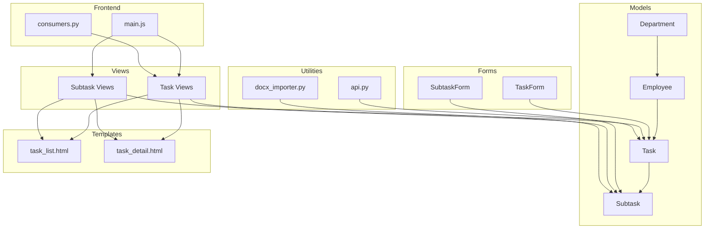
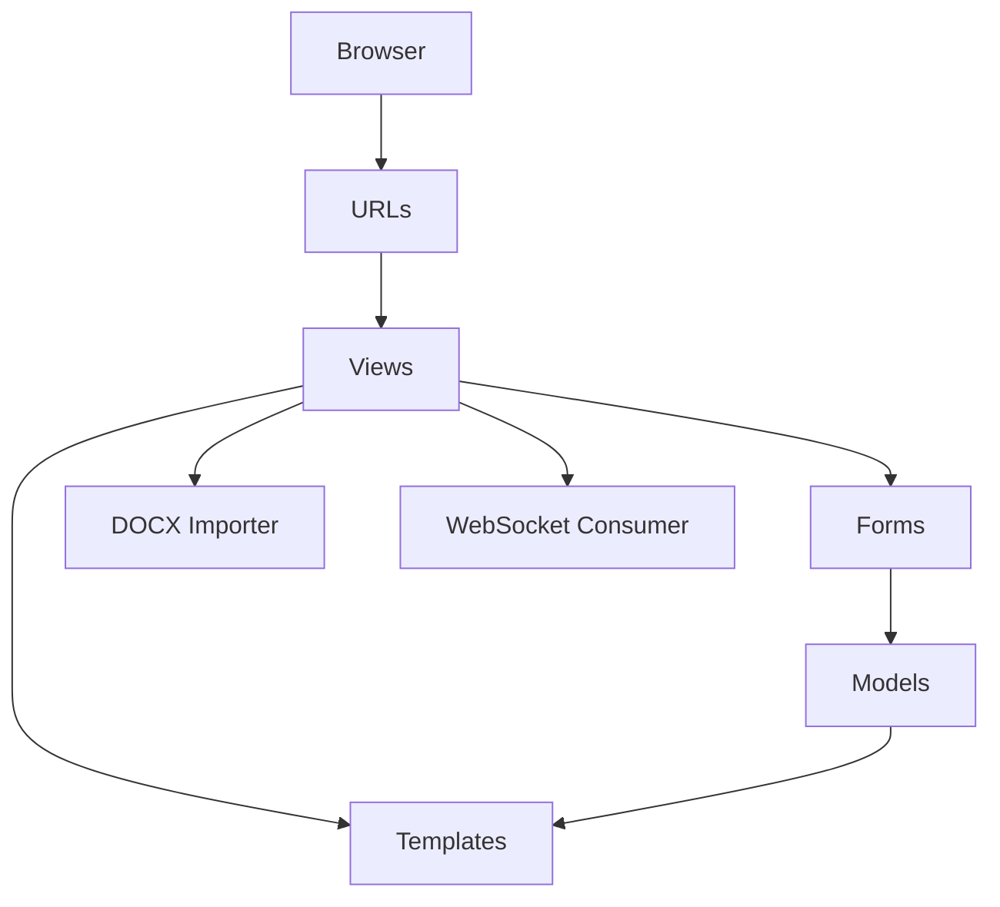
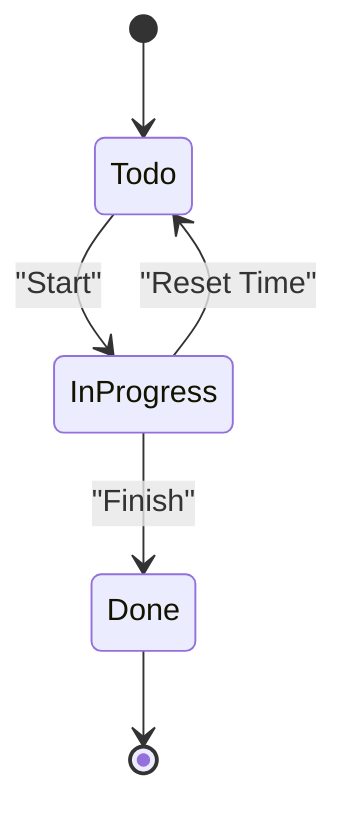
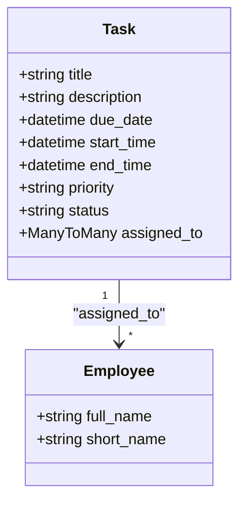
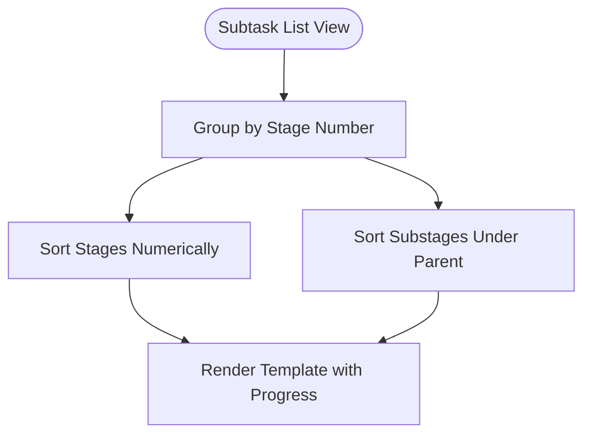
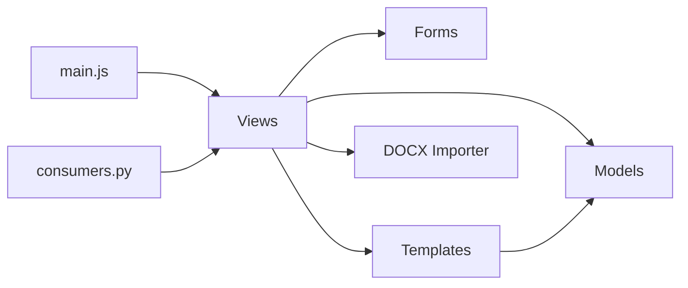

# Task Management System

<cite>
**Referenced Files in This Document**
- [models.py](file://tasks/models.py)
- [forms.py](file://tasks/forms.py)
- [forms_subtask.py](file://tasks/forms_subtask.py)
- [task_views.py](file://tasks/views/task_views.py)
- [subtask_views.py](file://tasks/views/subtask_views.py)
- [task_list.html](file://tasks/templates/tasks/task_list.html)
- [task_detail.html](file://tasks/templates/tasks/task_detail.html)
- [api.py](file://tasks/api.py)
- [urls.py](file://tasks/urls.py)
- [docx_importer.py](file://tasks/utils/docx_importer.py)
- [main.js](file://static/js/main.js)
- [consumers.py](file://tasks/consumers.py)
- [admin.py](file://tasks/admin.py)
- [signals.py](file://tasks/signals.py)
- [base.py](file://tasks/views/base.py)
- [decorators.py](file://tasks/decorators.py)
- [middleware.py](file://tasks/middleware.py)
</cite>

## Table of Contents
1. [Introduction](#introduction)
2. [Project Structure](#project-structure)
3. [Core Components](#core-components)
4. [Architecture Overview](#architecture-overview)
5. [Detailed Component Analysis](#detailed-component-analysis)
6. [Dependency Analysis](#dependency-analysis)
7. [Performance Considerations](#performance-considerations)
8. [Troubleshooting Guide](#troubleshooting-guide)
9. [Conclusion](#conclusion)

## Introduction
This document describes the Task Management System, focusing on the complete lifecycle of tasks from creation to completion. It covers task states, priorities, status transitions, assignment mechanisms, performer collaboration, and time tracking. It also documents creation forms, validation rules, filtering/searching, bulk operations, subtasks and dependency management, timeline visualization, UI components, AJAX interactions, real-time updates, scheduling, deadlines, and notifications.

## Project Structure
The system is organized around Django models, forms, views, templates, and supporting utilities:
- Models define tasks, subtasks, employees, departments, and research-related entities.
- Forms encapsulate validation and UI widgets for task and subtask creation/editing.
- Views handle business logic for CRUD operations, status transitions, filtering, and AJAX endpoints.
- Templates render lists, details, and forms with Bootstrap and icons.
- Utilities support DOCX import of research task structures.
- Frontend JavaScript provides AJAX helpers and notifications.
- Channels enable WebSocket-based real-time updates per task.

**Diagram sources**
- [models.py:165-327](file://tasks/models.py#L165-L327)
- [forms.py:5-44](file://tasks/forms.py#L5-L44)
- [forms_subtask.py:4-78](file://tasks/forms_subtask.py#L4-L78)
- [task_views.py:19-471](file://tasks/views/task_views.py#L19-L471)
- [subtask_views.py:10-218](file://tasks/views/subtask_views.py#L10-L218)
- [task_list.html:1-382](file://tasks/templates/tasks/task_list.html#L1-L382)
- [task_detail.html:1-211](file://tasks/templates/tasks/task_detail.html#L1-L211)
- [docx_importer.py:6-521](file://tasks/utils/docx_importer.py#L6-L521)
- [api.py:10-39](file://tasks/api.py#L10-L39)
- [main.js:88-135](file://static/js/main.js#L88-L135)
- [consumers.py:4-36](file://tasks/consumers.py#L4-L36)

**Section sources**
- [models.py:165-327](file://tasks/models.py#L165-L327)
- [forms.py:5-44](file://tasks/forms.py#L5-L44)
- [forms_subtask.py:4-78](file://tasks/forms_subtask.py#L4-L78)
- [task_views.py:19-471](file://tasks/views/task_views.py#L19-L471)
- [subtask_views.py:10-218](file://tasks/views/subtask_views.py#L10-L218)
- [task_list.html:1-382](file://tasks/templates/tasks/task_list.html#L1-L382)
- [task_detail.html:1-211](file://tasks/templates/tasks/task_detail.html#L1-L211)
- [docx_importer.py:6-521](file://tasks/utils/docx_importer.py#L6-L521)
- [api.py:10-39](file://tasks/api.py#L10-L39)
- [main.js:88-135](file://static/js/main.js#L88-L135)
- [consumers.py:4-36](file://tasks/consumers.py#L4-L36)

## Core Components
- Task: Represents a work item with title, description, priority, status, due date, and time tracking fields. Supports assignment to multiple employees and status transitions.
- Subtask: Represents stages/phases of a task with numbered stage identifiers, performers, responsible person, planned/actual dates, and status.
- Employee: Stores personal and organizational details, with department and position associations.
- Department: Hierarchical organizational unit with type and path tracking.
- ResearchTask/Stage/Substage/Product: Extended research workflow entities for scientific projects.
- Forms: Validation and UI widgets for task and subtask creation/editing.
- Views: Business logic for task lifecycle, filtering, AJAX endpoints, and research import.
- Templates: Render lists, details, and forms with Bootstrap and icons.
- Utilities: DOCX parsing and import of research structures.
- Frontend: AJAX helpers, notifications, and WebSocket consumer for real-time updates.

**Section sources**
- [models.py:165-327](file://tasks/models.py#L165-L327)
- [forms.py:5-44](file://tasks/forms.py#L5-L44)
- [forms_subtask.py:4-78](file://tasks/forms_subtask.py#L4-L78)
- [task_views.py:19-471](file://tasks/views/task_views.py#L19-L471)
- [subtask_views.py:10-218](file://tasks/views/subtask_views.py#L10-L218)
- [task_list.html:1-382](file://tasks/templates/tasks/task_list.html#L1-L382)
- [task_detail.html:1-211](file://tasks/templates/tasks/task_detail.html#L1-L211)
- [docx_importer.py:6-521](file://tasks/utils/docx_importer.py#L6-L521)
- [api.py:10-39](file://tasks/api.py#L10-L39)
- [main.js:88-135](file://static/js/main.js#L88-L135)
- [consumers.py:4-36](file://tasks/consumers.py#L4-L36)

## Architecture Overview
The system follows a layered architecture:
- Presentation: Templates and static assets.
- Application: Views and URLs routing.
- Domain: Models and business logic.
- Persistence: Django ORM with database-backed models.
- Real-time: Channels WebSocket consumer per task room.
- Import/Export: DOCX parsing utilities.

**Diagram sources**
- [urls.py:38-100](file://tasks/urls.py#L38-L100)
- [task_views.py:19-471](file://tasks/views/task_views.py#L19-L471)
- [subtask_views.py:10-218](file://tasks/views/subtask_views.py#L10-L218)
- [models.py:165-327](file://tasks/models.py#L165-L327)
- [docx_importer.py:6-521](file://tasks/utils/docx_importer.py#L6-L521)
- [consumers.py:4-36](file://tasks/consumers.py#L4-L36)

## Detailed Component Analysis

### Task Lifecycle and States
Tasks follow a clear lifecycle with explicit state transitions:
- Creation: TaskForm validates and persists task metadata and assignments.
- Status Transitions:
  - Todo → In Progress: Start action sets start_time and status.
  - In Progress → Done: Finish action sets end_time and status.
  - Reset: Reset time clears timestamps and can revert status to Todo if in Progress.
- Priority and Due Dates: Priority influences UI highlighting; due_date drives overdue checks and sorting.
- Time Tracking: start_time/end_time and duration calculation.

**Diagram sources**
- [task_views.py:250-281](file://tasks/views/task_views.py#L250-L281)
- [models.py:214-238](file://tasks/models.py#L214-L238)

**Section sources**
- [task_views.py:250-281](file://tasks/views/task_views.py#L250-L281)
- [models.py:214-238](file://tasks/models.py#L214-L238)

### Task Assignment and Collaboration
- Assignment: Tasks can be assigned to multiple employees via TaskForm. Bulk assignment is supported in views.
- Collaboration: Subtasks support multiple performers and a single responsible person. Automatic responsible assignment occurs when only one performer exists.
- Filtering and Search: Task list supports filtering by status, employee, and free-text search on title/description; sorting by multiple criteria.

**Diagram sources**
- [models.py:165-212](file://tasks/models.py#L165-L212)
- [models.py:13-107](file://tasks/models.py#L13-L107)

**Section sources**
- [forms.py:5-44](file://tasks/forms.py#L5-L44)
- [task_views.py:301-340](file://tasks/views/task_views.py#L301-L340)
- [task_list.html:19-69](file://tasks/templates/tasks/task_list.html#L19-L69)

### Time Tracking and Duration Calculation
- Fields: start_time, end_time.
- Computation: duration() returns formatted duration based on start_time and end_time.
- UI: Displays start time, end time, and computed duration on task detail page.

**Section sources**
- [models.py:219-229](file://tasks/models.py#L219-L229)
- [task_detail.html:27-61](file://tasks/templates/tasks/task_detail.html#L27-L61)

### Task Creation Forms and Validation
- TaskForm: Validates time constraints (end_time ≥ start_time, due_date ≥ start_time) and limits employee selection to active users.
- TaskWithImportForm: Allows importing research structure from DOCX, auto-filling task metadata and creating subtasks.
- SubtaskForm: Validates responsible person inclusion among performers and date range consistency.

**Section sources**
- [forms.py:5-44](file://tasks/forms.py#L5-L44)
- [forms.py:164-201](file://tasks/forms.py#L164-L201)
- [forms_subtask.py:4-78](file://tasks/forms_subtask.py#L4-L78)

### Subtasks, Stages, and Dependencies
- Subtask numbering supports integer stages and decimal sub-stages (e.g., "1", "1.1", "1.2").
- Grouping: subtask_list groups subtasks by stage and sorts sub-stages under their parent stage.
- Bulk Creation: SubtaskBulkCreateForm parses structured input to create multiple stages quickly.
- Status Updates: AJAX endpoint updates subtask status and records actual_start/actual_end timestamps.

**Diagram sources**
- [subtask_views.py:11-65](file://tasks/views/subtask_views.py#L11-L65)

**Section sources**
- [subtask_views.py:11-65](file://tasks/views/subtask_views.py#L11-L65)
- [forms_subtask.py:81-129](file://tasks/forms_subtask.py#L81-L129)

### Timeline Visualization and Progress
- Task Detail: Shows a progress bar summarizing subtask completion percentage and highlights recent subtasks.
- Subtask List: Displays grouped stages with counts and progress metrics.

**Section sources**
- [task_detail.html:104-171](file://tasks/templates/tasks/task_detail.html#L104-L171)
- [subtask_views.py:53-65](file://tasks/views/subtask_views.py#L53-L65)

### Filtering, Searching, and Sorting
- Filters: Status, employee assignment, and free-text search on title/description.
- Sorting: By creation date, due date, priority, and title.
- Statistics: Counts for Todo, In Progress, Done, and Overdue tasks.

**Section sources**
- [task_views.py:19-69](file://tasks/views/task_views.py#L19-L69)
- [task_list.html:19-69](file://tasks/templates/tasks/task_list.html#L19-L69)

### Bulk Operations
- Subtask Bulk Create: Accepts structured input to create multiple stages efficiently.
- Quick Assign API: Adds an employee to a task via POST.

**Section sources**
- [forms_subtask.py:81-129](file://tasks/forms_subtask.py#L81-L129)
- [api.py:24-39](file://tasks/api.py#L24-L39)

### Research Import and Structure
- DOCX Importer: Parses research task documents, extracting title, stages, sub-stages, products, and funding years.
- Task Structure Creation: Creates Subtask entries for stages and sub-stages, optionally assigning default performers.
- Research Entities: ResearchTask, ResearchStage, ResearchSubstage, ResearchProduct provide extended workflow support.

**Section sources**
- [docx_importer.py:14-521](file://tasks/utils/docx_importer.py#L14-L521)
- [task_views.py:80-179](file://tasks/views/task_views.py#L80-L179)

### User Interface Components and AJAX Interactions
- Templates: Bootstrap-based cards, badges, progress bars, and action buttons.
- AJAX Helpers: Unified GET/POST utilities with CSRF token handling and notifications.
- Notifications: Centralized Notify module for user feedback.

**Section sources**
- [task_list.html:1-382](file://tasks/templates/tasks/task_list.html#L1-L382)
- [task_detail.html:1-211](file://tasks/templates/tasks/task_detail.html#L1-L211)
- [main.js:88-135](file://static/js/main.js#L88-L135)

### Real-Time Updates
- WebSocket Consumer: Establishes a group per task; broadcasts updates to connected clients.
- Room Grouping: Uses task-specific room names for targeted updates.

**Section sources**
- [consumers.py:4-36](file://tasks/consumers.py#L4-L36)

### Scheduling, Deadlines, and Notifications
- Scheduling: Planned start/end dates for subtasks; actual start/end recorded upon status changes.
- Deadlines: due_date on tasks; is_overdue() flagging for overdue items.
- Notifications: Messages framework for user feedback; centralized Notify for frontend.

**Section sources**
- [models.py:214-218](file://tasks/models.py#L214-L218)
- [task_detail.html:47-59](file://tasks/templates/tasks/task_detail.html#L47-L59)
- [main.js:61-86](file://static/js/main.js#L61-L86)

## Dependency Analysis
The system exhibits clear separation of concerns:
- Views depend on Models and Forms.
- Templates depend on Views and Models for rendering.
- Utilities (DOCX importer) are invoked by views.
- Frontend JS depends on views for AJAX endpoints.
- Channels consumer integrates with views for real-time updates.

**Diagram sources**
- [task_views.py:19-471](file://tasks/views/task_views.py#L19-L471)
- [models.py:165-327](file://tasks/models.py#L165-L327)
- [forms.py:5-44](file://tasks/forms.py#L5-L44)
- [task_list.html:1-382](file://tasks/templates/tasks/task_list.html#L1-L382)
- [docx_importer.py:6-521](file://tasks/utils/docx_importer.py#L6-L521)
- [main.js:88-135](file://static/js/main.js#L88-L135)
- [consumers.py:4-36](file://tasks/consumers.py#L4-L36)

**Section sources**
- [task_views.py:19-471](file://tasks/views/task_views.py#L19-L471)
- [models.py:165-327](file://tasks/models.py#L165-L327)
- [forms.py:5-44](file://tasks/forms.py#L5-L44)
- [task_list.html:1-382](file://tasks/templates/tasks/task_list.html#L1-L382)
- [docx_importer.py:6-521](file://tasks/utils/docx_importer.py#L6-L521)
- [main.js:88-135](file://static/js/main.js#L88-L135)
- [consumers.py:4-36](file://tasks/consumers.py#L4-L36)

## Performance Considerations
- Indexes: Strategic database indexes on frequently filtered/sorted fields (user, status, priority, due_date, created_date) improve query performance.
- Caching: Signals clear organizational chart cache on structural changes to keep derived data fresh.
- Efficient Queries: Views filter and order data server-side; templates avoid excessive database hits by passing aggregated counts and progress.
- Logging/Middleware: Request logging and timing middleware aid in identifying slow endpoints.

**Section sources**
- [models.py:199-209](file://tasks/models.py#L199-L209)
- [models.py:312-317](file://tasks/models.py#L312-L317)
- [admin.py:11-19](file://tasks/admin.py#L11-L19)
- [signals.py:7-32](file://tasks/signals.py#L7-L32)
- [middleware.py:9-43](file://tasks/middleware.py#L9-L43)

## Troubleshooting Guide
- Validation Errors: Forms raise validation errors for invalid time ranges and missing required selections; check form widgets and cleaned_data.
- Import Failures: DOCX importer logs parsing steps and exceptions; verify document structure and required sections.
- Real-Time Updates: Ensure WebSocket consumer is reachable and client connects to the correct task room.
- Logging: Use middleware and decorator logs to trace request lifecycle and exceptions.

**Section sources**
- [forms.py:32-44](file://tasks/forms.py#L32-L44)
- [forms_subtask.py:63-78](file://tasks/forms_subtask.py#L63-L78)
- [docx_importer.py:14-44](file://tasks/utils/docx_importer.py#L14-L44)
- [consumers.py:4-36](file://tasks/consumers.py#L4-L36)
- [decorators.py:8-21](file://tasks/decorators.py#L8-L21)
- [middleware.py:37-42](file://tasks/middleware.py#L37-L42)

## Conclusion
The Task Management System provides a robust, extensible solution for managing tasks and research workflows. It enforces business rules through forms and models, offers rich UI components and AJAX interactions, supports real-time updates, and includes powerful import capabilities for research structures. The architecture cleanly separates concerns and leverages Django’s ORM, forms, and templates for maintainability and scalability.