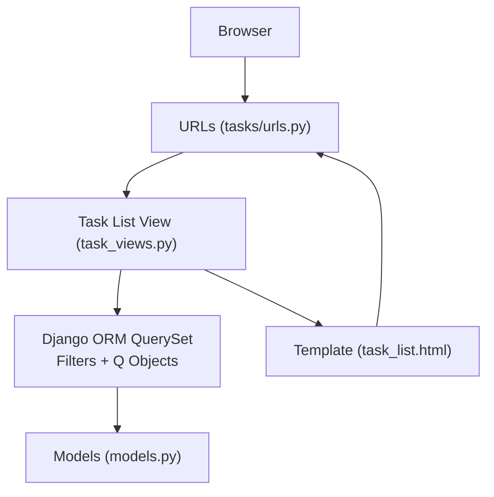
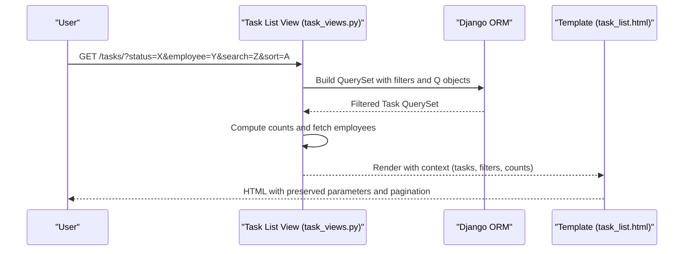
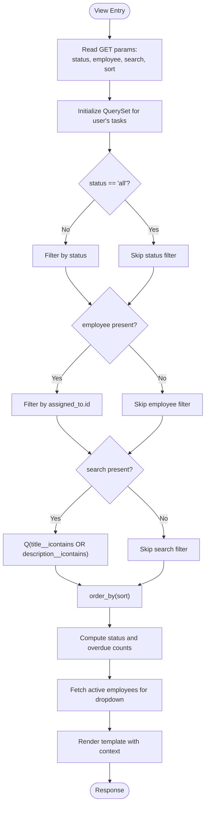
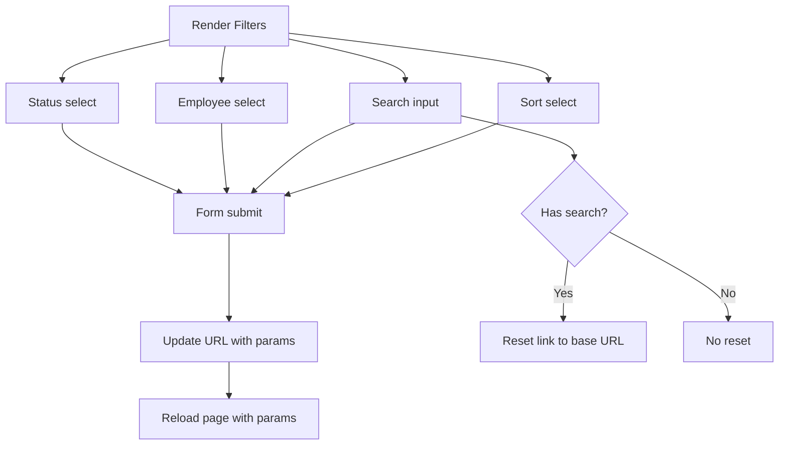
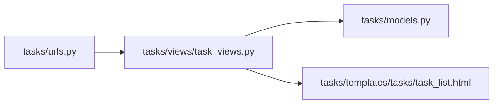

# Task Search and Filtering

<cite>
**Referenced Files in This Document**
- [task_views.py](file://tasks/views/task_views.py)
- [task_list.html](file://tasks/templates/tasks/task_list.html)
- [models.py](file://tasks/models.py)
- [urls.py](file://tasks/urls.py)
- [api_views.py](file://tasks/views/api_views.py)
- [employee_views.py](file://tasks/views/employee_views.py)
- [settings.py](file://taskmanager/settings.py)
</cite>

## Table of Contents
1. [Introduction](#introduction)
2. [Project Structure](#project-structure)
3. [Core Components](#core-components)
4. [Architecture Overview](#architecture-overview)
5. [Detailed Component Analysis](#detailed-component-analysis)
6. [Dependency Analysis](#dependency-analysis)
7. [Performance Considerations](#performance-considerations)
8. [Troubleshooting Guide](#troubleshooting-guide)
9. [Conclusion](#conclusion)

## Introduction
This document explains the task search and filtering capabilities in the task manager application. It covers:
- Multi-criteria filtering by status and assigned employees
- Keyword search across titles and descriptions
- Query parameter handling and URL-based filtering
- Persistent filter state across pages
- Complex queries using Q objects
- Sorting and pagination integration
- Examples of filter combinations and reset mechanisms
- Performance considerations and caching strategies for large datasets

## Project Structure
The search and filtering logic spans the view layer, templates, models, and URLs:
- Views handle GET parameters, build filtered querysets, and pass context to templates
- Templates render filter controls and maintain state via URL parameters
- Models define indexes and relationships that support efficient filtering
- URLs route requests to the appropriate view

**Diagram sources**
- [urls.py:38-49](file://tasks/urls.py#L38-L49)
- [task_views.py:408-458](file://tasks/views/task_views.py#L408-L458)
- [task_list.html:22-69](file://tasks/templates/tasks/task_list.html#L22-L69)
- [models.py:165-210](file://tasks/models.py#L165-L210)

**Section sources**
- [urls.py:38-49](file://tasks/urls.py#L38-L49)
- [task_views.py:408-458](file://tasks/views/task_views.py#L408-L458)
- [task_list.html:22-69](file://tasks/templates/tasks/task_list.html#L22-L69)
- [models.py:165-210](file://tasks/models.py#L165-L210)

## Core Components
- Task list view: Applies status, employee assignment, and keyword filters; supports sorting; prepares counts and employee lists for UI.
- Template: Renders filter controls (status dropdown, employee dropdown, search box, sort selector) and maintains state via URL parameters.
- Q objects: Used for combining multiple search conditions (title and description).
- Pagination: Implemented in templates to preserve filter parameters across pages.

Key implementation references:
- Status and employee filters, search, sorting, counts, and employee list: [task_views.py:408-458](file://tasks/views/task_views.py#L408-L458)
- Filter UI and pagination links preserving parameters: [task_list.html:22-69](file://tasks/templates/tasks/task_list.html#L22-L69), [task_list.html:330-371](file://tasks/templates/tasks/task_list.html#L330-L371)
- Q-based search across title and description: [task_views.py:426-431](file://tasks/views/task_views.py#L426-L431)
- Model indexes supporting filtering and sorting: [models.py:203-209](file://tasks/models.py#L203-L209)

**Section sources**
- [task_views.py:408-458](file://tasks/views/task_views.py#L408-L458)
- [task_list.html:22-69](file://tasks/templates/tasks/task_list.html#L22-L69)
- [task_list.html:330-371](file://tasks/templates/tasks/task_list.html#L330-L371)
- [models.py:203-209](file://tasks/models.py#L203-L209)

## Architecture Overview
The filtering pipeline:
1. Client submits filters via URL parameters (status, employee, search, sort).
2. View reads parameters and constructs a filtered QuerySet using model fields and Q objects.
3. View computes summary counts and fetches employee lists for filter dropdowns.
4. Template renders filters, results, and pagination links that preserve current parameters.

**Diagram sources**
- [task_views.py:408-458](file://tasks/views/task_views.py#L408-L458)
- [task_list.html:22-69](file://tasks/templates/tasks/task_list.html#L22-L69)

## Detailed Component Analysis

### Task List View: Filters, Q Objects, Sorting, Counts
- Filters:
  - Status: filters by exact match against status choices
  - Employee: filters by assigned_to id
  - Search: uses Q objects to match title or description (case-insensitive)
- Sorting: order_by by various fields (creation date, due date, priority, title)
- Counts: computed for status categories and overdue tasks
- Employees: fetched for filter dropdowns

**Diagram sources**
- [task_views.py:408-458](file://tasks/views/task_views.py#L408-L458)

**Section sources**
- [task_views.py:408-458](file://tasks/views/task_views.py#L408-L458)

### Template: Filter Controls and Parameter Persistence
- Filter controls:
  - Status dropdown with “All”, “To do”, “In Progress”, “Done”
  - Employee dropdown populated from view context
  - Search input bound to “search” parameter
  - Sort dropdown with multiple options
- Reset mechanism: Clear button links to the base URL without parameters
- Pagination: Links preserve current status, employee, search, and sort parameters

**Diagram sources**
- [task_list.html:22-69](file://tasks/templates/tasks/task_list.html#L22-L69)
- [task_list.html:330-371](file://tasks/templates/tasks/task_list.html#L330-L371)

**Section sources**
- [task_list.html:22-69](file://tasks/templates/tasks/task_list.html#L22-L69)
- [task_list.html:330-371](file://tasks/templates/tasks/task_list.html#L330-L371)

### Q Objects for Complex Queries
- Task search uses Q objects to combine title and description matching
- Similar patterns appear in other views for flexible filtering

References:
- Q-based task search: [task_views.py:426-431](file://tasks/views/task_views.py#L426-L431)
- Q-based employee search (AJAX): [api_views.py:28-34](file://tasks/views/api_views.py#L28-L34)
- Q-based employee search (list view): [employee_views.py:38-46](file://tasks/views/employee_views.py#L38-L46)

**Section sources**
- [task_views.py:426-431](file://tasks/views/task_views.py#L426-L431)
- [api_views.py:28-34](file://tasks/views/api_views.py#L28-L34)
- [employee_views.py:38-46](file://tasks/views/employee_views.py#L38-L46)

### Sorting Options
- Supported sort fields include creation date (ascending/descending), due date (nearest/farthest), priority, and title
- Sorting is applied via order_by on the QuerySet

Reference:
- Sort handling: [task_views.py](file://tasks/views/task_views.py#L433)

**Section sources**
- [task_views.py](file://tasks/views/task_views.py#L433)

### Pagination Integration
- Pagination is handled in the template to preserve current filter parameters across pages
- Pagination links append the current status, employee, search, and sort values

Reference:
- Pagination rendering and parameter preservation: [task_list.html:330-371](file://tasks/templates/tasks/task_list.html#L330-L371)

**Section sources**
- [task_list.html:330-371](file://tasks/templates/tasks/task_list.html#L330-L371)

### Examples of Filter Combinations
- Status + Employee: apply both filters sequentially
- Status + Search: combine status filter with Q-based search
- Employee + Search: filter by assigned_to id and search across title/description
- All three combined: status → employee → search → sort
- Reset: navigate to base URL to clear all filters

References:
- Status and employee filters: [task_views.py:418-424](file://tasks/views/task_views.py#L418-L424)
- Q-based search: [task_views.py:426-431](file://tasks/views/task_views.py#L426-L431)
- Reset link: [task_list.html:50-54](file://tasks/templates/tasks/task_list.html#L50-L54)

**Section sources**
- [task_views.py:418-424](file://tasks/views/task_views.py#L418-L424)
- [task_views.py:426-431](file://tasks/views/task_views.py#L426-L431)
- [task_list.html:50-54](file://tasks/templates/tasks/task_list.html#L50-L54)

## Dependency Analysis
- Views depend on models for filtering and on templates for rendering
- Templates depend on view-provided context to render filters and results
- URLs route requests to the task list view

**Diagram sources**
- [urls.py:38-49](file://tasks/urls.py#L38-L49)
- [task_views.py:408-458](file://tasks/views/task_views.py#L408-L458)
- [task_list.html:22-69](file://tasks/templates/tasks/task_list.html#L22-L69)
- [models.py:165-210](file://tasks/models.py#L165-L210)

**Section sources**
- [urls.py:38-49](file://tasks/urls.py#L38-L49)
- [task_views.py:408-458](file://tasks/views/task_views.py#L408-L458)
- [task_list.html:22-69](file://tasks/templates/tasks/task_list.html#L22-L69)
- [models.py:165-210](file://tasks/models.py#L165-L210)

## Performance Considerations
- Database indexes: The Task model defines indexes on user, status, priority, due_date, and created_date, which support filtering and sorting efficiently.
- Q object usage: Combining conditions with Q improves readability and can leverage indexes effectively.
- Pagination: Using pagination prevents loading large result sets at once.
- Caching: The project currently uses a dummy cache backend and does not enable cache middleware. For large datasets, consider enabling a real cache backend and caching frequently accessed filtered views or summaries.

References:
- Task model indexes: [models.py:203-209](file://tasks/models.py#L203-L209)
- Settings with dummy cache: [settings.py:85-98](file://taskmanager/settings.py#L85-L98)

**Section sources**
- [models.py:203-209](file://tasks/models.py#L203-L209)
- [settings.py:85-98](file://taskmanager/settings.py#L85-L98)

## Troubleshooting Guide
- Filters not applying:
  - Verify URL parameters are present and correctly named (status, employee, search, sort)
  - Confirm view logic applies filters only when parameters are non-empty
- Search not returning expected results:
  - Ensure Q-based search is active and matches both title and description
  - Check case-insensitive matching behavior
- Sorting issues:
  - Confirm sort values correspond to supported fields
- Pagination losing filters:
  - Ensure pagination links include current status, employee, search, and sort parameters
- Reset not clearing filters:
  - Use the reset button that navigates to the base URL without parameters

References:
- Filter application and Q search: [task_views.py:418-431](file://tasks/views/task_views.py#L418-L431)
- Pagination parameter preservation: [task_list.html:330-371](file://tasks/templates/tasks/task_list.html#L330-L371)
- Reset link: [task_list.html:50-54](file://tasks/templates/tasks/task_list.html#L50-L54)

**Section sources**
- [task_views.py:418-431](file://tasks/views/task_views.py#L418-L431)
- [task_list.html:330-371](file://tasks/templates/tasks/task_list.html#L330-L371)
- [task_list.html:50-54](file://tasks/templates/tasks/task_list.html#L50-L54)

## Conclusion
The task search and filtering system provides a robust, URL-driven interface with multi-criteria filtering, Q-based search, sorting, and pagination. By leveraging model indexes and maintaining filter state across pages, it offers a responsive user experience. For production workloads with large datasets, enabling a real cache backend and optimizing queries further would improve performance.