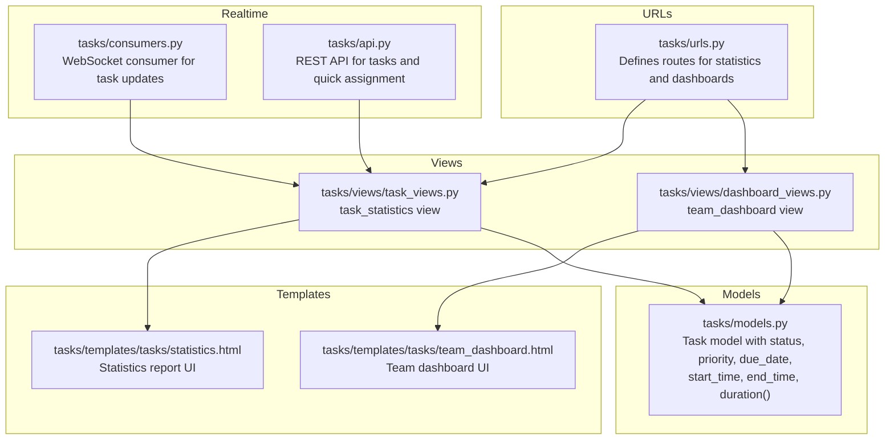
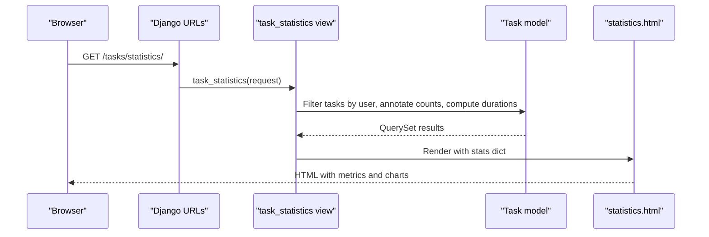
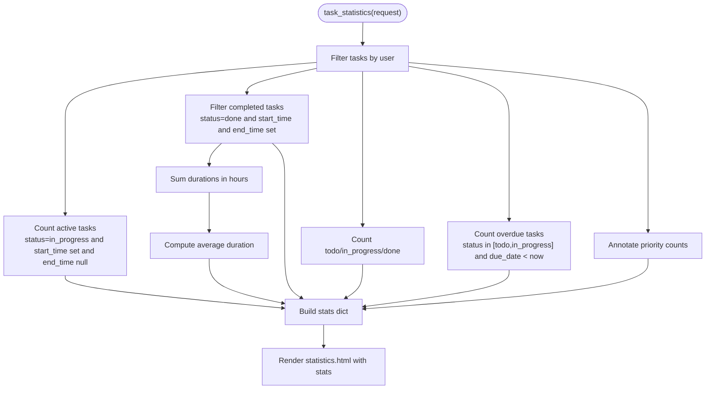
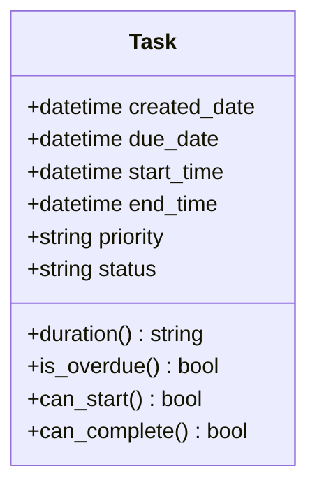
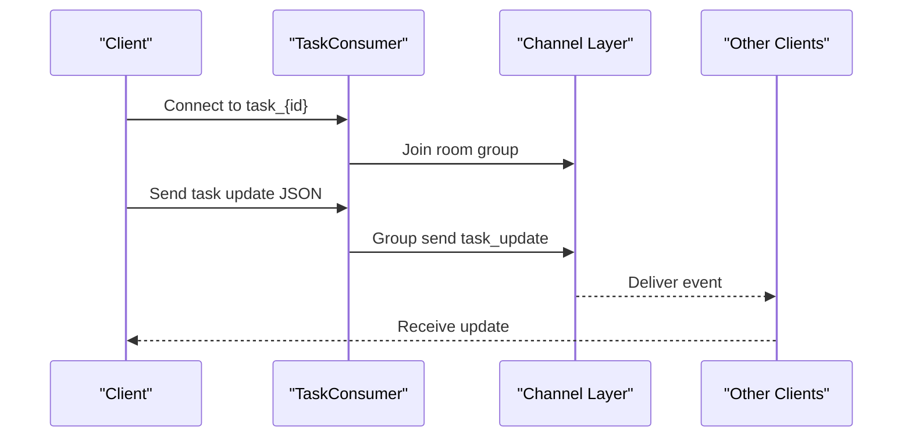
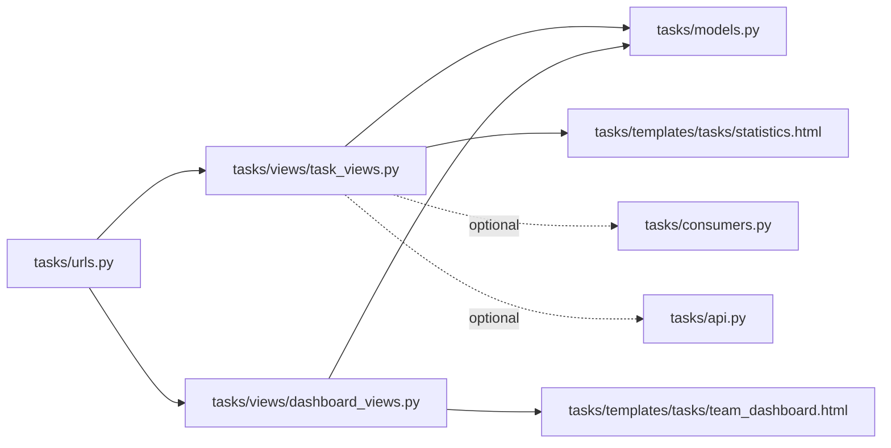

# Task Statistics and Dashboard

<cite>
**Referenced Files in This Document**
- [tasks/views/dashboard_views.py](file://tasks/views/dashboard_views.py)
- [tasks/views/task_views.py](file://tasks/views/task_views.py)
- [tasks/templates/tasks/statistics.html](file://tasks/templates/tasks/statistics.html)
- [tasks/templates/tasks/team_dashboard.html](file://tasks/templates/tasks/team_dashboard.html)
- [tasks/models.py](file://tasks/models.py)
- [tasks/urls.py](file://tasks/urls.py)
- [tasks/consumers.py](file://tasks/consumers.py)
- [tasks/api.py](file://tasks/api.py)
- [tasks/templatetags/task_extras.py](file://tasks/templatetags/task_extras.py)
</cite>

## Table of Contents
1. [Introduction](#introduction)
2. [Project Structure](#project-structure)
3. [Core Components](#core-components)
4. [Architecture Overview](#architecture-overview)
5. [Detailed Component Analysis](#detailed-component-analysis)
6. [Dependency Analysis](#dependency-analysis)
7. [Performance Considerations](#performance-considerations)
8. [Troubleshooting Guide](#troubleshooting-guide)
9. [Conclusion](#conclusion)
10. [Appendices](#appendices)

## Introduction
This document explains the task statistics and dashboard functionality in the task manager application. It covers the task_statistics view, statistical calculations for task metrics, priority distributions, and time tracking analytics. It also documents the dashboard components that show task counts by status, overdue indicators, priority breakdowns, and average completion times. Integration with time tracking data, duration calculations, and performance metrics are included, along with examples of statistical reports, dashboard customizations, export capabilities, real-time updates, and caching strategies.

## Project Structure
The task statistics and dashboard features are implemented across views, templates, models, URLs, and optional real-time WebSocket consumers. The primary statistics page aggregates counts and durations per user, while the team dashboard provides organizational-level insights.

**Diagram sources**
- [tasks/urls.py:38-92](file://tasks/urls.py#L38-L92)
- [tasks/views/task_views.py:365-406](file://tasks/views/task_views.py#L365-L406)
- [tasks/views/dashboard_views.py:111-143](file://tasks/views/dashboard_views.py#L111-L143)
- [tasks/templates/tasks/statistics.html:1-329](file://tasks/templates/tasks/statistics.html#L1-L329)
- [tasks/templates/tasks/team_dashboard.html:1-78](file://tasks/templates/tasks/team_dashboard.html#L1-L78)
- [tasks/models.py:165-238](file://tasks/models.py#L165-L238)
- [tasks/consumers.py:1-36](file://tasks/consumers.py#L1-L36)
- [tasks/api.py:1-39](file://tasks/api.py#L1-L39)

**Section sources**
- [tasks/urls.py:38-92](file://tasks/urls.py#L38-L92)
- [tasks/views/task_views.py:365-406](file://tasks/views/task_views.py#L365-L406)
- [tasks/views/dashboard_views.py:111-143](file://tasks/views/dashboard_views.py#L111-L143)
- [tasks/templates/tasks/statistics.html:1-329](file://tasks/templates/tasks/statistics.html#L1-L329)
- [tasks/templates/tasks/team_dashboard.html:1-78](file://tasks/templates/tasks/team_dashboard.html#L1-L78)
- [tasks/models.py:165-238](file://tasks/models.py#L165-L238)
- [tasks/consumers.py:1-36](file://tasks/consumers.py#L1-L36)
- [tasks/api.py:1-39](file://tasks/api.py#L1-L39)

## Core Components
- task_statistics view: Aggregates task counts by status, overdue counts, priority distribution, active tasks, completed task count, and average duration. Renders a comprehensive statistics report.
- Team dashboard view: Provides high-level metrics for the organization, including total employees, active tasks, employees with tasks, top performers, and recent assignments.
- Task model: Supplies status, priority, due date, start/end times, overdue checks, and duration calculation helpers.
- Templates: Present statistics and dashboard cards, progress bars, priority tables, and actionable tips.
- Optional real-time updates: WebSocket consumer and REST API enable live updates and quick actions.

**Section sources**
- [tasks/views/task_views.py:365-406](file://tasks/views/task_views.py#L365-L406)
- [tasks/views/dashboard_views.py:111-143](file://tasks/views/dashboard_views.py#L111-L143)
- [tasks/models.py:165-238](file://tasks/models.py#L165-L238)
- [tasks/templates/tasks/statistics.html:1-329](file://tasks/templates/tasks/statistics.html#L1-L329)
- [tasks/templates/tasks/team_dashboard.html:1-78](file://tasks/templates/tasks/team_dashboard.html#L1-L78)
- [tasks/consumers.py:1-36](file://tasks/consumers.py#L1-L36)
- [tasks/api.py:1-39](file://tasks/api.py#L1-L39)

## Architecture Overview
The statistics and dashboard pipeline follows a standard Django request-response pattern with optional real-time enhancements.

**Diagram sources**
- [tasks/urls.py:48-48](file://tasks/urls.py#L48-L48)
- [tasks/views/task_views.py:365-406](file://tasks/views/task_views.py#L365-L406)
- [tasks/models.py:165-238](file://tasks/models.py#L165-L238)
- [tasks/templates/tasks/statistics.html:1-329](file://tasks/templates/tasks/statistics.html#L1-L329)

## Detailed Component Analysis

### Task Statistics View and Calculations
The task_statistics view computes:
- Totals: total, todo, in_progress, done, overdue
- Priority distribution: high, medium, low counts
- Active and completed metrics: active_now, completed_count
- Average duration: derived from completed tasks with start_time and end_time

**Diagram sources**
- [tasks/views/task_views.py:365-406](file://tasks/views/task_views.py#L365-L406)
- [tasks/models.py:165-238](file://tasks/models.py#L165-L238)

**Section sources**
- [tasks/views/task_views.py:365-406](file://tasks/views/task_views.py#L365-L406)
- [tasks/models.py:165-238](file://tasks/models.py#L165-L238)

### Dashboard Components and Metrics
The statistics page displays:
- Total task counts by status with progress visualization
- Overdue indicator with alert messaging
- Priority breakdown cards
- Time tracking summary: active tasks, completed count, average duration
- Priority detail table and daily creation stats (if available)
- Actionable productivity tips

The team dashboard displays:
- Total employees
- Active tasks
- Employees with tasks
- Top performers by task count
- Recent assignments

**Section sources**
- [tasks/templates/tasks/statistics.html:1-329](file://tasks/templates/tasks/statistics.html#L1-L329)
- [tasks/templates/tasks/team_dashboard.html:1-78](file://tasks/templates/tasks/team_dashboard.html#L1-L78)
- [tasks/views/dashboard_views.py:111-143](file://tasks/views/dashboard_views.py#L111-L143)

### Time Tracking Analytics and Duration Calculations
The Task model supports time tracking via start_time and end_time. Duration computation:
- Uses timedelta arithmetic to compute hours and minutes
- Formats a human-readable duration string
- Averages durations only for completed tasks with both timestamps

**Diagram sources**
- [tasks/models.py:165-238](file://tasks/models.py#L165-L238)

**Section sources**
- [tasks/models.py:165-238](file://tasks/models.py#L165-L238)
- [tasks/views/task_views.py:377-384](file://tasks/views/task_views.py#L377-L384)

### Real-Time Dashboard Updates and WebSocket Integration
Optional real-time updates are supported via:
- WebSocket consumer that broadcasts task updates to a room group
- REST API endpoints for quick actions (e.g., assigning employees)

**Diagram sources**
- [tasks/consumers.py:1-36](file://tasks/consumers.py#L1-L36)

**Section sources**
- [tasks/consumers.py:1-36](file://tasks/consumers.py#L1-L36)
- [tasks/api.py:1-39](file://tasks/api.py#L1-L39)

### Export Capabilities
The repository includes an employee export endpoint and template, indicating potential for exporting task-related data. While a dedicated task export is not present in the analyzed files, the export infrastructure exists and can be extended to support task exports.

**Section sources**
- [tasks/urls.py:61-63](file://tasks/urls.py#L61-L63)
- [tasks/api.py:1-39](file://tasks/api.py#L1-L39)

## Dependency Analysis
Key dependencies and relationships:
- task_statistics depends on Task model aggregations and timezone utilities
- Templates depend on context variables provided by views
- Optional real-time features depend on Django Channels and WebSocket consumers
- URL routing connects endpoints to views

**Diagram sources**
- [tasks/urls.py:38-92](file://tasks/urls.py#L38-L92)
- [tasks/views/task_views.py:365-406](file://tasks/views/task_views.py#L365-L406)
- [tasks/views/dashboard_views.py:111-143](file://tasks/views/dashboard_views.py#L111-L143)
- [tasks/models.py:165-238](file://tasks/models.py#L165-L238)
- [tasks/templates/tasks/statistics.html:1-329](file://tasks/templates/tasks/statistics.html#L1-L329)
- [tasks/templates/tasks/team_dashboard.html:1-78](file://tasks/templates/tasks/team_dashboard.html#L1-L78)
- [tasks/consumers.py:1-36](file://tasks/consumers.py#L1-L36)
- [tasks/api.py:1-39](file://tasks/api.py#L1-L39)

**Section sources**
- [tasks/urls.py:38-92](file://tasks/urls.py#L38-L92)
- [tasks/views/task_views.py:365-406](file://tasks/views/task_views.py#L365-L406)
- [tasks/views/dashboard_views.py:111-143](file://tasks/views/dashboard_views.py#L111-L143)
- [tasks/models.py:165-238](file://tasks/models.py#L165-L238)
- [tasks/templates/tasks/statistics.html:1-329](file://tasks/templates/tasks/statistics.html#L1-L329)
- [tasks/templates/tasks/team_dashboard.html:1-78](file://tasks/templates/tasks/team_dashboard.html#L1-L78)
- [tasks/consumers.py:1-36](file://tasks/consumers.py#L1-L36)
- [tasks/api.py:1-39](file://tasks/api.py#L1-L39)

## Performance Considerations
- Prefer database-level aggregation to minimize Python-side loops:
  - Use values(...).annotate(...) for priority counts
  - Use filtered counts for status and overdue metrics
- Avoid repeated queries by prefetching related data where appropriate
- Cache heavy computations:
  - The organization chart view demonstrates caching with a 10-minute TTL and cache invalidation on changes
- Use timezone-aware comparisons consistently to avoid off-by-one errors
- For large datasets, consider pagination and limiting date ranges for statistics

[No sources needed since this section provides general guidance]

## Troubleshooting Guide
Common issues and resolutions:
- Overdue calculation discrepancies:
  - Ensure due_date comparisons use timezone.now() consistently
  - Verify statuses are not prematurely changed before overdue checks
- Duration averaging:
  - Only completed tasks with both start_time and end_time contribute to average duration
  - Confirm timezone localization for accurate timedelta arithmetic
- Template rendering:
  - Ensure stats keys exist in the context to prevent missing variable errors
  - Use the provided template tags to safely access dictionary items
- Real-time updates:
  - Verify WebSocket consumer is connected and group membership is established
  - Confirm channel layer backend is configured for production deployments

**Section sources**
- [tasks/views/task_views.py:393-396](file://tasks/views/task_views.py#L393-L396)
- [tasks/models.py:214-229](file://tasks/models.py#L214-L229)
- [tasks/templatetags/task_extras.py:5-8](file://tasks/templatetags/task_extras.py#L5-L8)
- [tasks/consumers.py:1-36](file://tasks/consumers.py#L1-L36)

## Conclusion
The task statistics and dashboard system provides a comprehensive overview of task performance, priority distribution, and time tracking metrics. By leveraging database-level aggregations, optional caching, and real-time updates, the system balances accuracy and responsiveness. Extending export capabilities and adding periodic caching invalidation can further improve reliability and user experience.

[No sources needed since this section summarizes without analyzing specific files]

## Appendices

### Statistical Report Examples
- Overview cards: total, todo, in_progress, done, overdue
- Priority breakdown: high, medium, low counts
- Time tracking summary: active tasks, completed count, average duration
- Progress visualization: stacked progress bar by status
- Priority detail table: counts and percentages
- Daily creation stats: last 7 days (if available)
- Productivity tips: actionable suggestions based on current metrics

**Section sources**
- [tasks/templates/tasks/statistics.html:13-133](file://tasks/templates/tasks/statistics.html#L13-L133)
- [tasks/templates/tasks/statistics.html:243-288](file://tasks/templates/tasks/statistics.html#L243-L288)
- [tasks/templates/tasks/statistics.html:290-319](file://tasks/templates/tasks/statistics.html#L290-L319)

### Dashboard Customization Tips
- Modify template blocks to reorder or add metric cards
- Extend the stats dictionary in task_statistics to include new KPIs
- Add filters for date ranges or assignees to refine metrics
- Integrate additional models (e.g., ResearchTask) into dashboard views for cross-domain insights

**Section sources**
- [tasks/views/task_views.py:365-406](file://tasks/views/task_views.py#L365-L406)
- [tasks/templates/tasks/statistics.html:1-329](file://tasks/templates/tasks/statistics.html#L1-L329)

### Caching Strategies
- Use Django’s cache framework to cache computed statistics for a short TTL
- Invalidate cache entries on data changes (e.g., task updates, status changes)
- Consider cache keys per user to isolate statistics

**Section sources**
- [tasks/views/dashboard_views.py:14-109](file://tasks/views/dashboard_views.py#L14-L109)