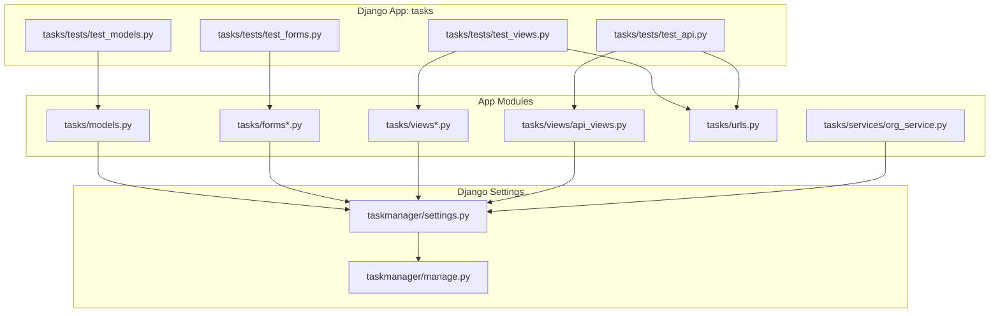
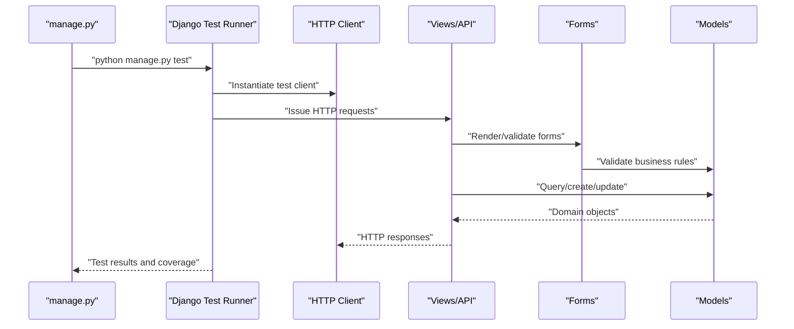
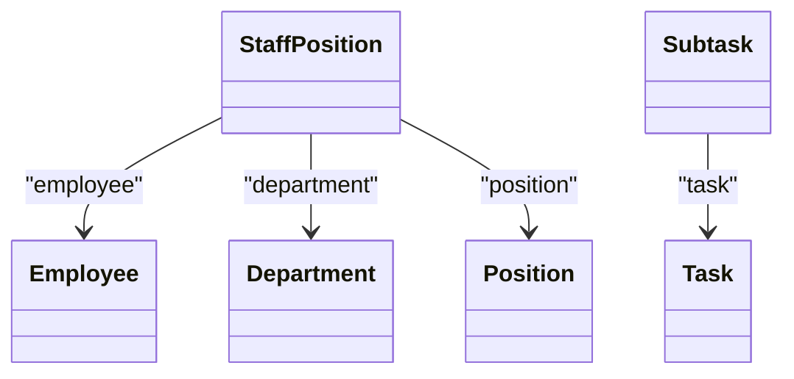
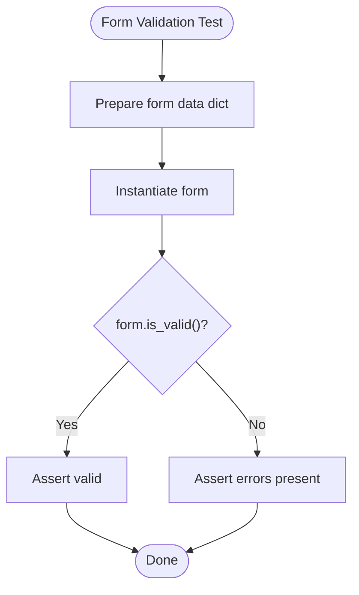
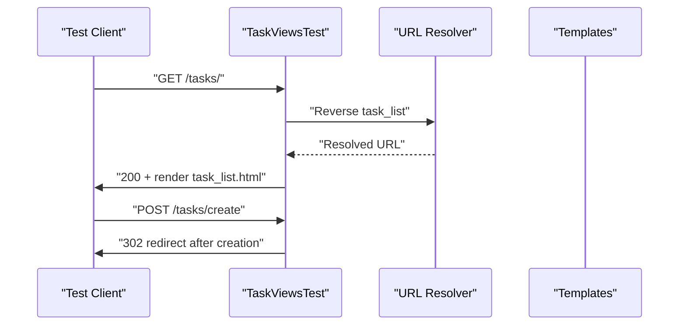
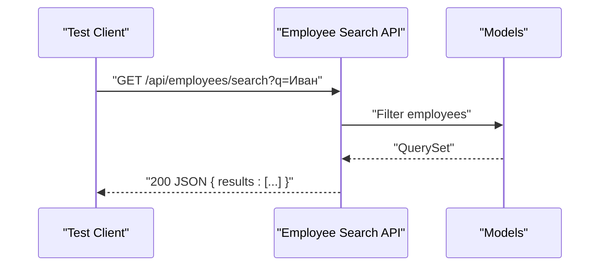
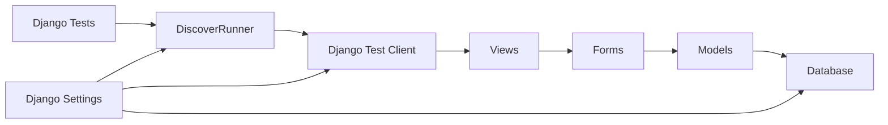

# Testing and Quality Assurance

<cite>
**Referenced Files in This Document**
- [manage.py](file://taskmanager/manage.py)
- [settings.py](file://taskmanager/settings.py)
- [test_api.py](file://tasks/tests/test_api.py)
- [test_forms.py](file://tasks/tests/test_forms.py)
- [test_models.py](file://tasks/tests/test_models.py)
- [test_views.py](file://tasks/tests/test_views.py)
- [test_import.py](file://taskmanager/test_import.py)
- [org_service.py](file://tasks/services/org_service.py)
- [forms_employee.py](file://tasks/forms_employee.py)
- [forms_product.py](file://tasks/forms_product.py)
- [forms_subtask.py](file://tasks/forms_subtask.py)
- [models.py](file://tasks/models.py)
- [views.py](file://tasks/views.py)
- [api_views.py](file://tasks/views/api_views.py)
- [urls.py](file://tasks/urls.py)
- [logging.conf](file://taskmanager/logging.conf)
</cite>

## Table of Contents
1. [Introduction](#introduction)
2. [Project Structure](#project-structure)
3. [Core Components](#core-components)
4. [Architecture Overview](#architecture-overview)
5. [Detailed Component Analysis](#detailed-component-analysis)
6. [Dependency Analysis](#dependency-analysis)
7. [Performance Considerations](#performance-considerations)
8. [Troubleshooting Guide](#troubleshooting-guide)
9. [Conclusion](#conclusion)
10. [Appendices](#appendices)

## Introduction
This document describes the Testing and Quality Assurance framework for the Task Manager application. It covers unit testing strategies, test case organization, and test data management. It also explains integration testing approaches, API testing methodologies, and form validation testing. Guidance is provided for test execution, continuous integration setup, and automated testing workflows. Code coverage and quality metrics are addressed alongside performance testing. Best practices for mocks, test environments, debugging, troubleshooting, and maintainable testing documentation are included.

## Project Structure
The testing framework is organized around Django’s built-in test runner and follows a conventional app layout:
- Unit tests are grouped by functional area under tasks/tests:
  - test_models.py: model-level assertions and business logic validations
  - test_forms.py: form validation and field presence checks
  - test_views.py: view-level HTTP behavior and template rendering
  - test_api.py: API endpoint behavior and JSON responses
- Test execution is orchestrated via Django’s manage.py command-line interface.
- Coverage reports are generated and browsed locally using the coverage tooling integrated with Django settings.

**Diagram sources**
- [test_models.py:1-178](file://tasks/tests/test_models.py#L1-L178)
- [test_forms.py:1-65](file://tasks/tests/test_forms.py#L1-L65)
- [test_views.py:1-115](file://tasks/tests/test_views.py#L1-L115)
- [test_api.py:1-38](file://tasks/tests/test_api.py#L1-L38)
- [models.py](file://tasks/models.py)
- [forms_employee.py](file://tasks/forms_employee.py)
- [forms_product.py](file://tasks/forms_product.py)
- [forms_subtask.py](file://tasks/forms_subtask.py)
- [views.py](file://tasks/views.py)
- [api_views.py](file://tasks/views/api_views.py)
- [urls.py](file://tasks/urls.py)
- [org_service.py](file://tasks/services/org_service.py)
- [settings.py:1-288](file://taskmanager/settings.py#L1-L288)
- [manage.py:1-23](file://taskmanager/manage.py#L1-L23)

**Section sources**
- [manage.py:1-23](file://taskmanager/manage.py#L1-L23)
- [settings.py:1-288](file://taskmanager/settings.py#L1-L288)

## Core Components
- Test Runner and Execution
  - Django’s DiscoverRunner is configured for test discovery and execution.
  - Tests are executed via manage.py commands.
- Test Categories
  - Model tests validate domain logic and property behaviors.
  - Form tests validate field presence and validation constraints.
  - View tests validate HTTP responses, redirects, and template rendering.
  - API tests validate JSON endpoints and search/filter behavior.
- Test Data Management
  - Fixtures and factories are not present; tests rely on setUp methods to create minimal, deterministic objects.
- Coverage and Reporting
  - Coverage reports are browsed locally; HTML coverage artifacts are present in the repository.

**Section sources**
- [settings.py:274-274](file://taskmanager/settings.py#L274-L274)
- [manage.py:1-23](file://taskmanager/manage.py#L1-L23)
- [test_models.py:1-178](file://tasks/tests/test_models.py#L1-L178)
- [test_forms.py:1-65](file://tasks/tests/test_forms.py#L1-L65)
- [test_views.py:1-115](file://tasks/tests/test_views.py#L1-L115)
- [test_api.py:1-38](file://tasks/tests/test_api.py#L1-L38)

## Architecture Overview
The testing architecture leverages Django’s testing client and runner to exercise the application stack. Tests interact with models, forms, views, and APIs through HTTP requests and direct method calls. The settings module configures the database, middleware, and logging to support repeatable test runs.

**Diagram sources**
- [manage.py:1-23](file://taskmanager/manage.py#L1-L23)
- [settings.py:1-288](file://taskmanager/settings.py#L1-L288)
- [test_views.py:1-115](file://tasks/tests/test_views.py#L1-L115)
- [test_api.py:1-38](file://tasks/tests/test_api.py#L1-L38)
- [test_forms.py:1-65](file://tasks/tests/test_forms.py#L1-L65)
- [test_models.py:1-178](file://tasks/tests/test_models.py#L1-L178)

## Detailed Component Analysis

### Model-Level Testing
- Focus
  - Employee, Department, Position, StaffPosition, Task, Subtask models.
  - Property validations (full name, short name, full path, level).
  - Business logic validations (is_overdue, can_start, can_complete).
- Strategies
  - setUp creates minimal instances per test class.
  - Assertions target model properties, manager queries, and method outcomes.
- Coverage
  - Comprehensive coverage across model behaviors and edge cases.

**Diagram sources**
- [test_models.py:1-178](file://tasks/tests/test_models.py#L1-L178)
- [models.py](file://tasks/models.py)

**Section sources**
- [test_models.py:1-178](file://tasks/tests/test_models.py#L1-L178)

### Form-Level Testing
- Focus
  - TaskForm and TaskWithImportForm validation and field presence.
  - Negative cases: missing required fields, invalid date ranges.
- Strategies
  - Construct form instances with data dictionaries.
  - Assert validity and error messages.
- Coverage
  - Validates required fields and custom validators.

**Diagram sources**
- [test_forms.py:1-65](file://tasks/tests/test_forms.py#L1-L65)
- [forms_employee.py](file://tasks/forms_employee.py)
- [forms_product.py](file://tasks/forms_product.py)
- [forms_subtask.py](file://tasks/forms_subtask.py)

**Section sources**
- [test_forms.py:1-65](file://tasks/tests/test_forms.py#L1-L65)

### View-Level Testing
- Focus
  - Task CRUD views: list, detail, create (GET/POST), complete, delete.
  - Authentication views: login, register.
  - Unauthorized access redirection behavior.
- Strategies
  - Use Django test Client to simulate HTTP requests.
  - Assert status codes, redirects, template usage, and content presence.
- Coverage
  - Exercises routing, middleware, and template rendering.

**Diagram sources**
- [test_views.py:1-115](file://tasks/tests/test_views.py#L1-L115)
- [urls.py](file://tasks/urls.py)
- [views.py](file://tasks/views.py)

**Section sources**
- [test_views.py:1-115](file://tasks/tests/test_views.py#L1-L115)

### API Testing
- Focus
  - Employee search endpoint behavior.
  - Empty query handling and result filtering.
- Strategies
  - Use test Client to issue GET requests to named URLs.
  - Assert status codes and parsed JSON structure.
- Coverage
  - Validates endpoint availability and response shape.

**Diagram sources**
- [test_api.py:1-38](file://tasks/tests/test_api.py#L1-L38)
- [api_views.py](file://tasks/views/api_views.py)
- [models.py](file://tasks/models.py)

**Section sources**
- [test_api.py:1-38](file://tasks/tests/test_api.py#L1-L38)

### Test Data Management and Utilities
- Local test data bootstrap
  - A standalone script initializes the database with a user, task, stage, and substage for manual verification.
- Recommendations
  - Prefer Django fixtures or factory libraries for larger datasets.
  - Keep test data scoped to setUp and avoid global state.

**Section sources**
- [test_import.py:1-54](file://taskmanager/test_import.py#L1-L54)

## Dependency Analysis
- Test-to-Module Coupling
  - Tests depend on app modules (models, forms, views, URLs) but remain decoupled from external systems.
- External Dependencies
  - Django test runner and client.
  - Coverage tooling integrated via settings.
- Environment Configuration
  - Database and cache settings support isolated test runs.
  - Logging configured for visibility during test execution.

**Diagram sources**
- [settings.py:1-288](file://taskmanager/settings.py#L1-L288)
- [test_models.py:1-178](file://tasks/tests/test_models.py#L1-L178)
- [test_forms.py:1-65](file://tasks/tests/test_forms.py#L1-L65)
- [test_views.py:1-115](file://tasks/tests/test_views.py#L1-L115)
- [test_api.py:1-38](file://tasks/tests/test_api.py#L1-L38)

**Section sources**
- [settings.py:1-288](file://taskmanager/settings.py#L1-L288)

## Performance Considerations
- Test Speed
  - Use lightweight fixtures and minimal object graphs in setUp.
  - Avoid unnecessary database writes in shared fixtures.
- Coverage
  - Maintain high coverage thresholds for critical paths (validation, business logic, API responses).
- Profiling
  - Integrate profiling tools to identify slow tests; refactor long-running assertions.
- Environment
  - Use SQLite for local tests; configure CI to mirror production databases if needed.

## Troubleshooting Guide
- Common Issues
  - Unauthorized access failures: verify login in test Client and middleware behavior.
  - Template rendering errors: assert template usage and context variables.
  - API response mismatches: validate JSON keys and pagination parameters.
- Debugging Techniques
  - Enable DEBUG mode and console logging for detailed output.
  - Use Django’s RequestLogMiddleware to inspect request/response metadata.
- Reproduction Methods
  - Run individual tests with verbosity flags to isolate failures.
  - Use the standalone test import script to seed data for manual inspection.

**Section sources**
- [test_views.py:1-115](file://tasks/tests/test_views.py#L1-L115)
- [test_api.py:1-38](file://tasks/tests/test_api.py#L1-L38)
- [logging.conf](file://taskmanager/logging.conf)
- [test_import.py:1-54](file://taskmanager/test_import.py#L1-L54)

## Conclusion
The Task Manager employs a pragmatic, Django-native testing strategy covering models, forms, views, and APIs. Tests are organized by functional area, leverage setUp for deterministic state, and integrate with Django’s test runner and coverage tooling. By adopting best practices for mocking, environment isolation, and maintainable documentation, the framework supports reliable, scalable quality assurance.

## Appendices

### Test Execution and Continuous Integration
- Running Tests
  - Use manage.py to execute the test suite and generate coverage reports.
- CI Setup
  - Configure CI to install dependencies, set environment variables, and run tests with coverage collection.
  - Fail builds on coverage thresholds or test failures.

**Section sources**
- [manage.py:1-23](file://taskmanager/manage.py#L1-L23)
- [settings.py:1-288](file://taskmanager/settings.py#L1-L288)

### Code Coverage and Quality Metrics
- Coverage Reports
  - HTML coverage artifacts are present; review per-module coverage to identify gaps.
- Metrics
  - Target high coverage for models, forms, and API endpoints.
  - Track branch coverage for conditional logic in views and forms.

**Section sources**
- [test_models.py:1-178](file://tasks/tests/test_models.py#L1-L178)
- [test_forms.py:1-65](file://tasks/tests/test_forms.py#L1-L65)
- [test_views.py:1-115](file://tasks/tests/test_views.py#L1-L115)
- [test_api.py:1-38](file://tasks/tests/test_api.py#L1-L38)

### Mock Strategies and Test Environment Configuration
- Mocking
  - Use unittest.mock to stub external services or time-dependent logic in tests.
- Environment
  - Configure DATABASES and CACHES for isolated test runs.
  - Centralize logging configuration for consistent diagnostics.

**Section sources**
- [settings.py:106-110](file://taskmanager/settings.py#L106-L110)
- [settings.py:92-96](file://taskmanager/settings.py#L92-L96)
- [logging.conf](file://taskmanager/logging.conf)

### Testing Documentation Standards and Maintainability
- Standards
  - Use descriptive test names and docstrings.
  - Group related tests in classes and keep setUp focused.
- Maintainability
  - Refactor repetitive assertions into helper methods.
  - Keep test data minimal and explicit.

[No sources needed since this section provides general guidance]