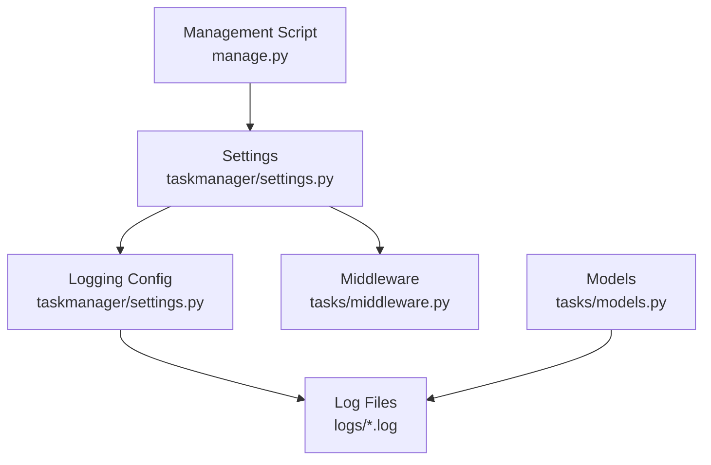
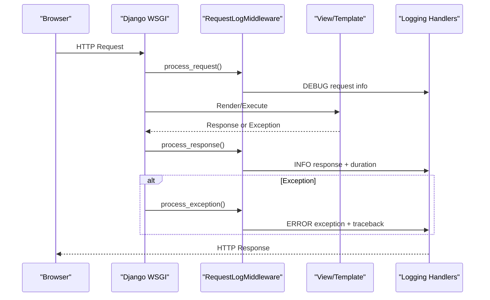
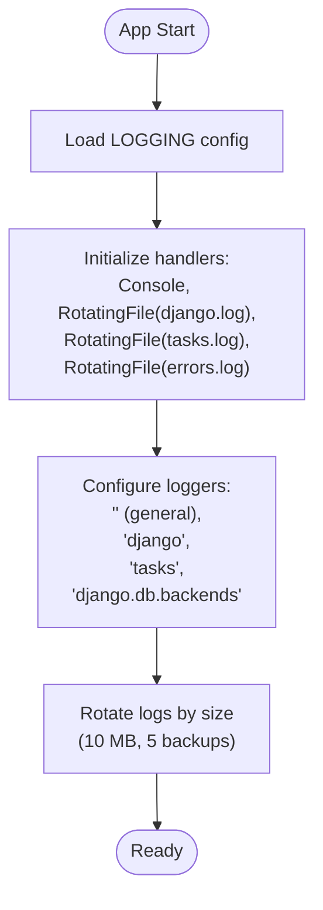
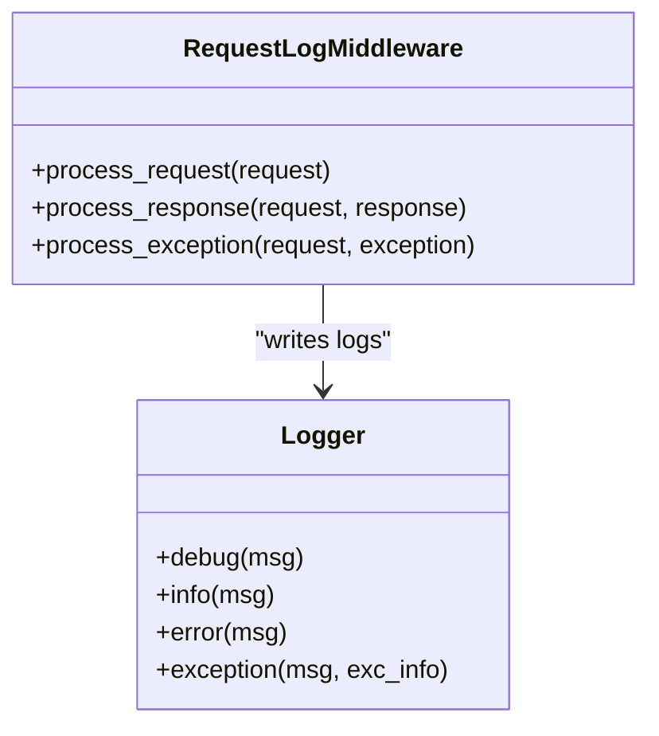
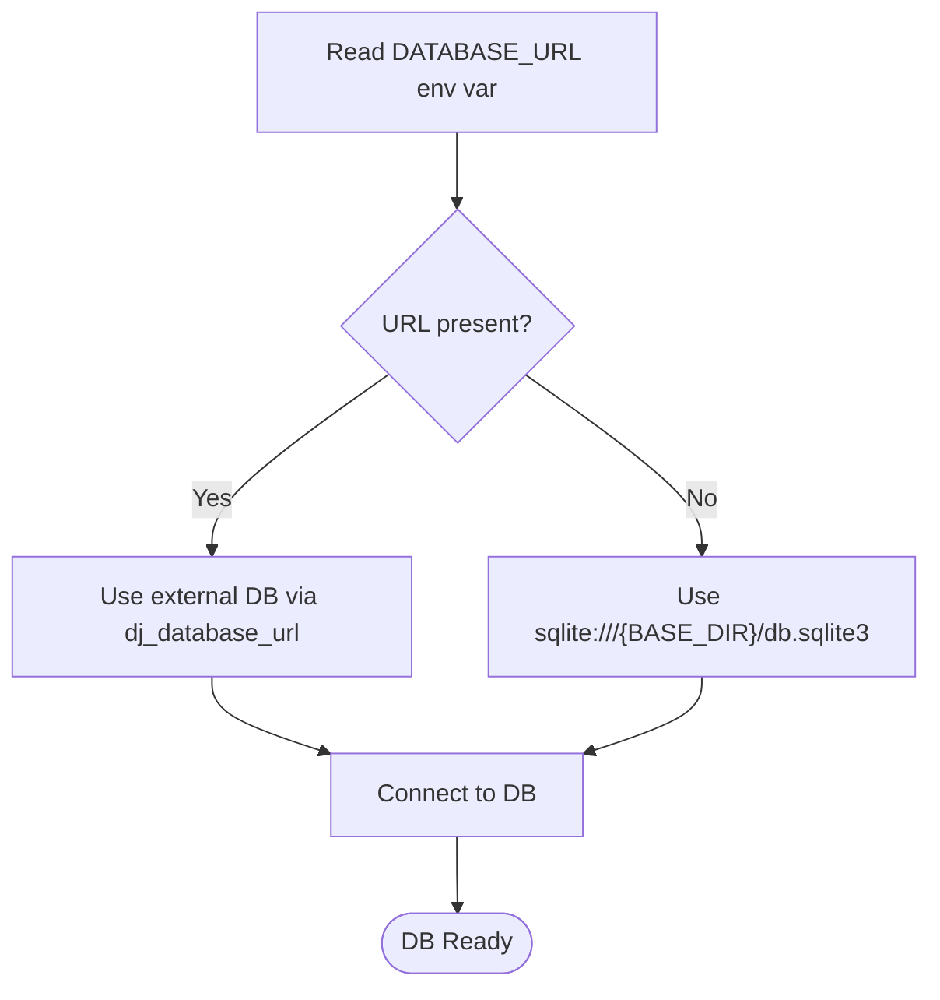
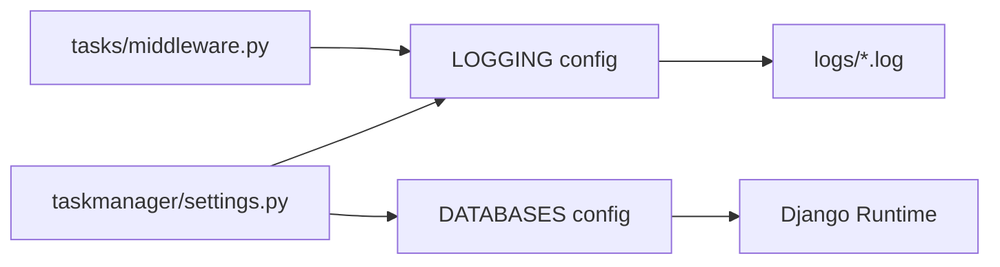

# Troubleshooting and FAQ

<cite>
**Referenced Files in This Document**
- [settings.py](file://taskmanager/settings.py)
- [logging.conf](file://taskmanager/logging.conf)
- [middleware.py](file://tasks/middleware.py)
- [clean_logs.py](file://clean_logs.py)
- [manage.py](file://manage.py)
- [models.py](file://tasks/models.py)
- [django.log](file://logs/django.log)
- [errors.log](file://logs/errors.log)
- [tasks.log](file://logs/tasks.log)
- [debug.txt](file://debug.txt)
</cite>

## Table of Contents
1. [Introduction](#introduction)
2. [Project Structure](#project-structure)
3. [Core Components](#core-components)
4. [Architecture Overview](#architecture-overview)
5. [Detailed Component Analysis](#detailed-component-analysis)
6. [Dependency Analysis](#dependency-analysis)
7. [Performance Considerations](#performance-considerations)
8. [Troubleshooting Guide](#troubleshooting-guide)
9. [FAQ](#faq)
10. [Conclusion](#conclusion)
11. [Appendices](#appendices)

## Introduction
This document provides comprehensive troubleshooting guidance and frequently asked questions for the Task Manager application. It covers installation issues, configuration problems, runtime errors, debugging techniques, log analysis, performance troubleshooting, database-related issues, and application-specific problems. It also includes practical workflows for resolving common issues, interpreting error messages and stack traces, and escalation procedures.

## Project Structure
The application follows a standard Django layout with a dedicated application module and shared logging configuration. Key areas relevant to troubleshooting include:
- Settings and logging configuration
- Middleware for request/response/error logging
- Log files for application, Django, and task-specific events
- Management script for running commands and diagnosing environment issues

**Diagram sources**
- [settings.py:180-249](file://taskmanager/settings.py#L180-L249)
- [middleware.py:1-43](file://tasks/middleware.py#L1-L43)
- [manage.py:1-23](file://manage.py#L1-L23)
- [models.py:1-800](file://tasks/models.py#L1-L800)

**Section sources**
- [settings.py:180-249](file://taskmanager/settings.py#L180-L249)
- [middleware.py:1-43](file://tasks/middleware.py#L1-L43)
- [manage.py:1-23](file://manage.py#L1-L23)

## Core Components
- Logging subsystem: Centralized configuration with rotating file handlers for console, general Django logs, task-specific logs, and error-only logs. Includes separate loggers for application code and Django internals.
- Request logging middleware: Captures request method, path, response status, duration, and unhandled exceptions with detailed context.
- Environment and database configuration: Uses environment variables for secrets, debug mode, hosts, and database URL, with SQLite as default fallback.
- Management interface: Provides diagnostics via the Django management command runner and environment checks.

**Section sources**
- [settings.py:180-249](file://taskmanager/settings.py#L180-L249)
- [middleware.py:9-43](file://tasks/middleware.py#L9-L43)
- [settings.py:106-110](file://taskmanager/settings.py#L106-L110)
- [manage.py:7-18](file://manage.py#L7-L18)

## Architecture Overview
The troubleshooting architecture centers on centralized logging and middleware instrumentation. Requests are logged with timing and status, and exceptions are captured with stack traces. Logs are rotated and stored under a dedicated directory, enabling postmortem analysis.

**Diagram sources**
- [middleware.py:12-42](file://tasks/middleware.py#L12-L42)
- [django.log:17-121](file://logs/django.log#L17-L121)

## Detailed Component Analysis

### Logging Configuration and Rotation
- Rotating file handlers ensure logs do not grow indefinitely and are split by severity.
- Dedicated loggers:
  - General app logger writes to console and general log.
  - Django logger writes to console and general log.
  - Tasks logger writes to console, tasks log, and error-only log.
  - Database backend logger configured to capture SQL errors.
- Test-time overrides reduce noise during automated runs.

**Diagram sources**
- [settings.py:180-249](file://taskmanager/settings.py#L180-L249)

**Section sources**
- [settings.py:180-249](file://taskmanager/settings.py#L180-L249)
- [logging.conf:1-30](file://taskmanager/logging.conf#L1-L30)

### Request Logging Middleware
- Records request start time and logs basic request metadata.
- On response, logs status code and duration.
- On exceptions, logs detailed error with stack trace.
- Facilitates quick identification of failing endpoints and user context.

**Diagram sources**
- [middleware.py:9-43](file://tasks/middleware.py#L9-L43)

**Section sources**
- [middleware.py:9-43](file://tasks/middleware.py#L9-L43)

### Database Configuration and Diagnostics
- Database URL is derived from an environment variable with a SQLite fallback.
- SQL query logging can be enabled for diagnostics.
- Migration and connection issues often surface in Django’s database logger.

**Diagram sources**
- [settings.py:106-110](file://taskmanager/settings.py#L106-L110)

**Section sources**
- [settings.py:106-110](file://taskmanager/settings.py#L106-L110)

### Management Command Diagnostics
- The management script sets the Django settings module and raises explicit ImportError if Django is not available on PATH.
- Use this to validate environment setup and Python path issues.

**Section sources**
- [manage.py:7-18](file://manage.py#L7-L18)

## Dependency Analysis
- Logging depends on the settings configuration and environment variables for paths and levels.
- Middleware depends on the logging framework and request/response lifecycle.
- Database connectivity depends on environment variables and the presence of required drivers.

**Diagram sources**
- [settings.py:180-249](file://taskmanager/settings.py#L180-L249)
- [middleware.py:1-43](file://tasks/middleware.py#L1-L43)

**Section sources**
- [settings.py:180-249](file://taskmanager/settings.py#L180-L249)
- [middleware.py:1-43](file://tasks/middleware.py#L1-L43)

## Performance Considerations
- Enable SQL logging selectively for performance investigations.
- Monitor request durations captured by middleware to identify slow endpoints.
- Use rotating logs to prevent disk pressure from excessive logging.
- Consider disabling or reducing log levels in production to minimize overhead.

[No sources needed since this section provides general guidance]

## Troubleshooting Guide

### Installation and Environment Issues
- Django not found or import error:
  - Symptom: ImportError indicating Django is not available on PATH.
  - Resolution: Ensure the virtual environment is activated and Django is installed in the current environment.
  - Validation: Run the management script to confirm environment readiness.

**Section sources**
- [manage.py:11-17](file://manage.py#L11-L17)

### Configuration Problems
- Incorrect SECRET_KEY or DEBUG settings:
  - Symptom: Security warnings or unexpected behavior in production vs. development.
  - Resolution: Set SECRET_KEY and DEBUG via environment variables as per settings.
- ALLOWED_HOSTS misconfiguration:
  - Symptom: 400 Bad Request or host header errors.
  - Resolution: Update ALLOWED_HOSTS to include domain(s) and IP addresses.

**Section sources**
- [settings.py:28](file://taskmanager/settings.py#L28)
- [settings.py:33](file://taskmanager/settings.py#L33)

### Database Connectivity and Migration Issues
- Database URL not set:
  - Symptom: SQLite file path fallback or connection errors.
  - Resolution: Set DATABASE_URL or ensure the SQLite file exists.
- SQL errors:
  - Symptom: Errors in database backend logger.
  - Resolution: Review SQL logs and queries; verify migrations are applied.

**Section sources**
- [settings.py:106-110](file://taskmanager/settings.py#L106-L110)
- [settings.py:243-247](file://taskmanager/settings.py#L243-L247)

### Template and Asset Compression Errors
- Offline compression manifest missing:
  - Symptom: OfflineGenerationError indicating a missing asset hash.
  - Resolution: Run the compression command to rebuild the offline manifest.
- Template syntax errors:
  - Symptom: TemplateSyntaxError about unknown or duplicated block tags.
  - Resolution: Fix template tags and ensure blocks are unique.

**Section sources**
- [django.log:17-121](file://logs/django.log#L17-L121)
- [errors.log:11-71](file://logs/errors.log#L11-L71)
- [errors.log:74-136](file://logs/errors.log#L74-L136)

### Runtime Errors and Exceptions
- Unhandled exceptions:
  - Symptom: 500 Internal Server Error with stack traces.
  - Resolution: Inspect the tasks logger for detailed exception entries and stack traces.
- Slow requests:
  - Symptom: Long response times.
  - Resolution: Use middleware logs to identify slow endpoints and optimize queries.

**Section sources**
- [middleware.py:37-42](file://tasks/middleware.py#L37-L42)
- [tasks.log:11-81](file://logs/tasks.log#L11-L81)

### Debugging Techniques and Log Analysis
- Console and file logs:
  - Use the general and tasks loggers to trace application flow and errors.
- Error-only logs:
  - Focus on the error-only handler for critical failures.
- Middleware timing:
  - Use INFO entries to measure endpoint performance.

**Section sources**
- [settings.py:180-249](file://taskmanager/settings.py#L180-L249)
- [tasks.log:1-151](file://logs/tasks.log#L1-L151)

### Cleaning Old Logs
- Automated cleanup:
  - Use the provided script to remove logs older than a specified number of days.

**Section sources**
- [clean_logs.py:1-16](file://clean_logs.py#L1-L16)

### Error Message Interpretation and Stack Trace Analysis
- Template errors:
  - Look for template syntax errors and missing tags in the errors log.
- Compression errors:
  - Resolve missing manifest entries by rebuilding compressed assets.
- Request failures:
  - Match request method and path from middleware logs to locate the failing view.

**Section sources**
- [errors.log:11-71](file://logs/errors.log#L11-L71)
- [errors.log:74-136](file://logs/errors.log#L74-L136)
- [tasks.log:10-81](file://logs/tasks.log#L10-L81)

### Escalation Procedures and Support Contact Information
- Collect logs:
  - Attach the most recent logs from the logs directory.
- Describe the issue:
  - Include steps to reproduce, observed symptoms, and environment details.
- Provide context:
  - Mention whether the issue occurs in development or production and any recent changes.

[No sources needed since this section provides general guidance]

## FAQ

### How do I check if Django is properly installed?
- Run the management script to trigger environment checks and ImportError if Django is missing.

**Section sources**
- [manage.py:11-17](file://manage.py#L11-L17)

### Why am I seeing template syntax errors?
- Template tags might be missing or duplicated. Fix the template or adjust the template tags accordingly.

**Section sources**
- [errors.log:11-71](file://logs/errors.log#L11-L71)
- [errors.log:74-136](file://logs/errors.log#L74-L136)

### How do I fix offline compression errors?
- Rebuild the offline compression manifest using the appropriate command.

**Section sources**
- [django.log:17-121](file://logs/django.log#L17-L121)

### How can I diagnose slow pages?
- Review middleware logs for response durations and identify endpoints with long processing times.

**Section sources**
- [tasks.log:10-81](file://logs/tasks.log#L10-L81)

### How do I enable SQL query logging?
- Enable SQL logging in the logging configuration for targeted diagnostics.

**Section sources**
- [settings.py:243-247](file://taskmanager/settings.py#L243-L247)

### What should I do if I encounter database connection errors?
- Verify DATABASE_URL and ensure the database is reachable. Check the database backend logger for detailed errors.

**Section sources**
- [settings.py:106-110](file://taskmanager/settings.py#L106-L110)
- [settings.py:243-247](file://taskmanager/settings.py#L243-L247)

### How do I interpret the tasks logger entries?
- Use the tasks logger for application-specific events and errors. Combine with middleware logs for request context.

**Section sources**
- [settings.py:238-242](file://taskmanager/settings.py#L238-L242)
- [tasks.log:1-151](file://logs/tasks.log#L1-L151)

### How do I clean up old logs?
- Use the provided script to remove logs older than a specified threshold.

**Section sources**
- [clean_logs.py:1-16](file://clean_logs.py#L1-L16)

### What does a 404 error for favicon.ico indicate?
- A 404 for favicon.ico is usually benign and indicates the browser requested a default icon that is not served.

**Section sources**
- [tasks.log:83-85](file://logs/tasks.log#L83-L85)

### How do I troubleshoot model-related issues?
- Review model definitions and ensure migrations are applied. Use logs to trace model interactions.

**Section sources**
- [models.py:1-800](file://tasks/models.py#L1-L800)

## Conclusion
This guide consolidates actionable steps to diagnose and resolve common installation, configuration, runtime, and performance issues. By leveraging the centralized logging configuration, middleware instrumentation, and structured log analysis, most problems can be quickly identified and resolved. For persistent or complex issues, collect logs and escalate with detailed context.

[No sources needed since this section summarizes without analyzing specific files]

## Appendices

### Appendix A: Log Locations and Levels
- General logs: django.log
- Error-only logs: errors.log
- Task-specific logs: tasks.log
- Log rotation: 10 MB with 5 backups

**Section sources**
- [settings.py:199-225](file://taskmanager/settings.py#L199-L225)

### Appendix B: Example Log Entries
- Template syntax error and repeated block tag errors
- Offline compression manifest error
- Request timing and error entries

**Section sources**
- [errors.log:11-71](file://logs/errors.log#L11-L71)
- [errors.log:74-136](file://logs/errors.log#L74-L136)
- [django.log:17-121](file://logs/django.log#L17-L121)
- [tasks.log:10-81](file://logs/tasks.log#L10-L81)