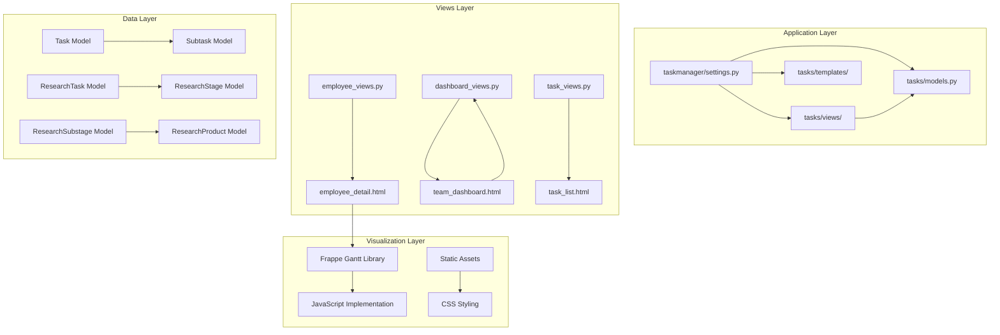
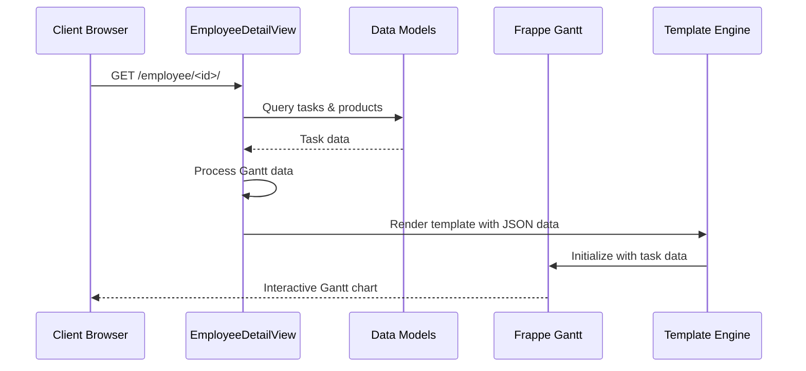
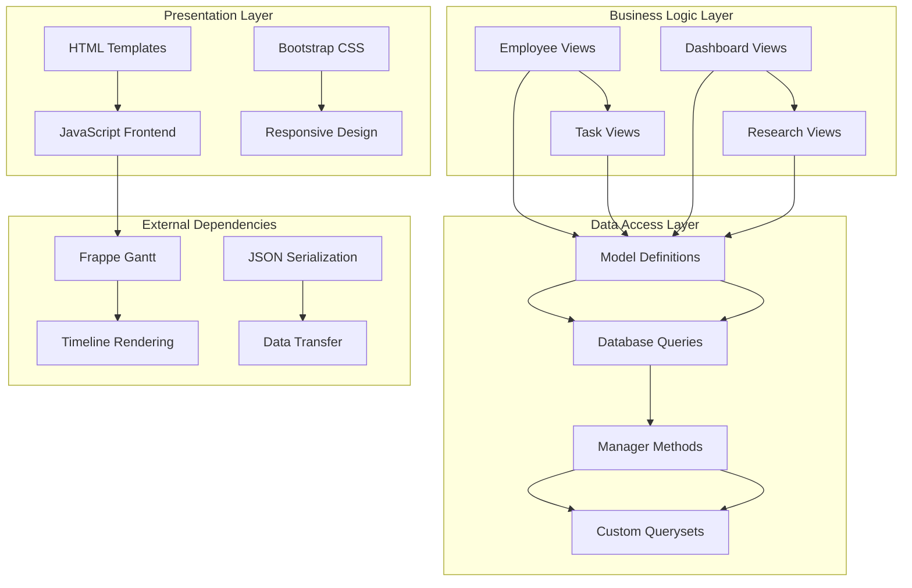
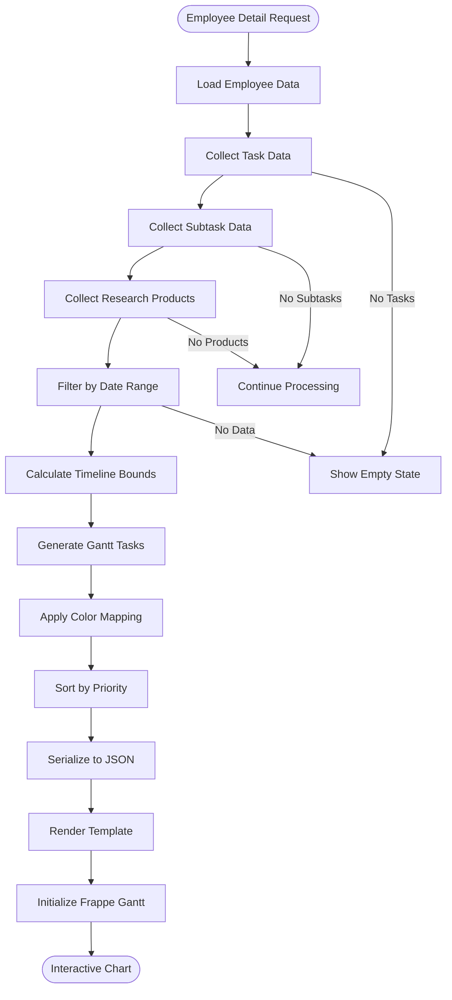
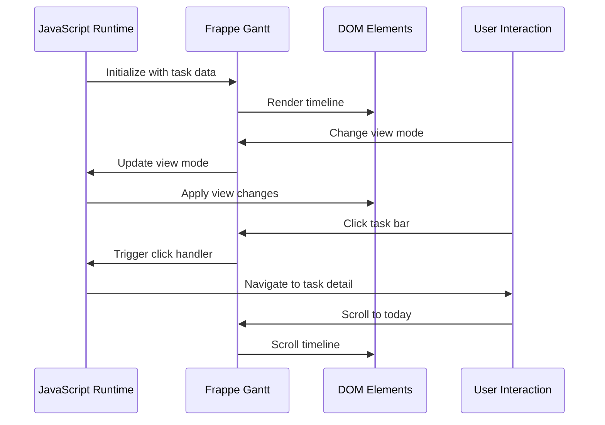
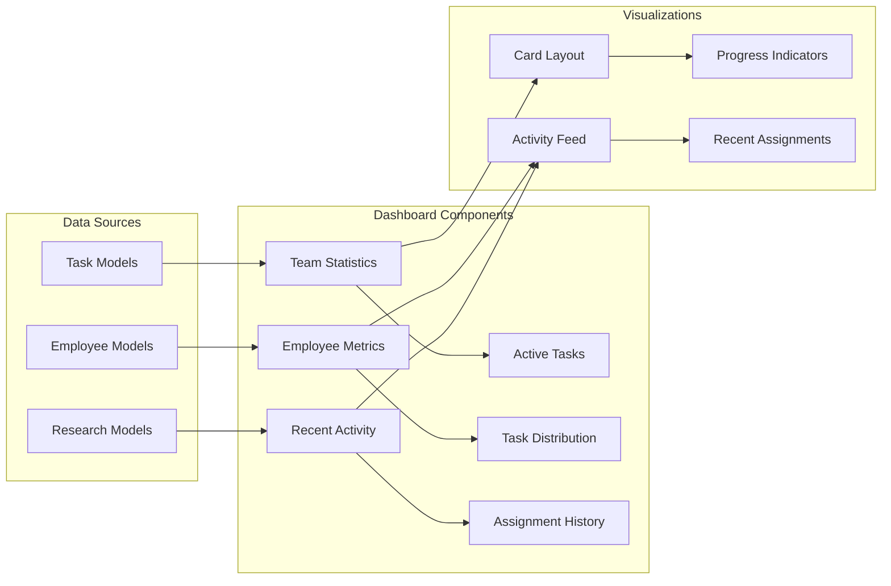
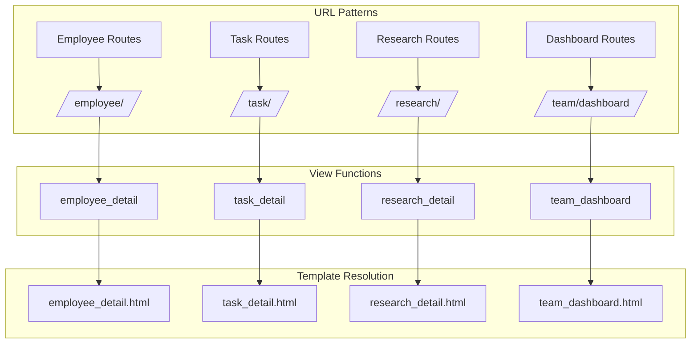
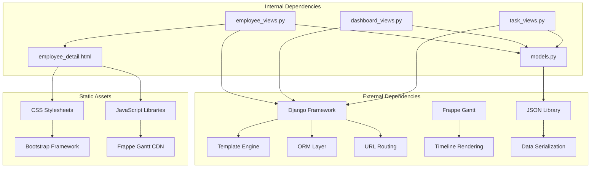

# Gantt Chart Visualization System

<cite>
**Referenced Files in This Document**
- [settings.py](file://taskmanager/settings.py)
- [models.py](file://tasks/models.py)
- [urls.py](file://tasks/urls.py)
- [employee_views.py](file://tasks/views/employee_views.py)
- [dashboard_views.py](file://tasks/views/dashboard_views.py)
- [task_views.py](file://tasks/views/task_views.py)
- [employee_detail.html](file://tasks/templates/tasks/employee_detail.html)
</cite>

## Table of Contents
1. [Introduction](#introduction)
2. [Project Structure](#project-structure)
3. [Core Components](#core-components)
4. [Architecture Overview](#architecture-overview)
5. [Detailed Component Analysis](#detailed-component-analysis)
6. [Dependency Analysis](#dependency-analysis)
7. [Performance Considerations](#performance-considerations)
8. [Troubleshooting Guide](#troubleshooting-guide)
9. [Conclusion](#conclusion)

## Introduction

The Gantt Chart Visualization System is a sophisticated web-based project management tool built with Django that provides interactive timeline visualization for tasks, subtasks, and research products. This system enables organizations to track project timelines, monitor progress, and visualize resource allocation across multiple hierarchical levels including individual employees, departments, and research initiatives.

The system integrates seamlessly with the broader task management infrastructure, utilizing Frappe Gantt library for dynamic chart rendering and implementing advanced filtering capabilities for temporal analysis. It supports real-time collaboration through embedded task assignment mechanisms and provides comprehensive reporting through integrated dashboards.

## Project Structure

The Gantt visualization system is organized within a modular Django application structure that separates concerns between data models, business logic, presentation layers, and static assets.

**Diagram sources**
- [settings.py:1-288](file://taskmanager/settings.py#L1-L288)
- [models.py:165-858](file://tasks/models.py#L165-L858)
- [employee_views.py:65-752](file://tasks/views/employee_views.py#L65-L752)

**Section sources**
- [settings.py:1-288](file://taskmanager/settings.py#L1-L288)
- [models.py:1-858](file://tasks/models.py#L1-L858)

## Core Components

### Data Models Architecture

The system's data architecture centers around interconnected models that represent the hierarchical nature of organizational tasks and projects.

**Diagram sources**
- [models.py:165-858](file://tasks/models.py#L165-L858)

### View Controllers

The system employs specialized view controllers that handle different aspects of the Gantt visualization functionality.

**Diagram sources**
- [employee_views.py:65-752](file://tasks/views/employee_views.py#L65-L752)
- [employee_detail.html:900-974](file://tasks/templates/tasks/employee_detail.html#L900-L974)

**Section sources**
- [models.py:165-858](file://tasks/models.py#L165-L858)
- [employee_views.py:65-752](file://tasks/views/employee_views.py#L65-L752)

## Architecture Overview

The Gantt visualization system follows a layered architecture pattern that separates data persistence, business logic, presentation, and client-side interactivity.

**Diagram sources**
- [employee_views.py:65-752](file://tasks/views/employee_views.py#L65-L752)
- [models.py:165-858](file://tasks/models.py#L165-L858)

The architecture implements several key design patterns:

- **Model-View-Template (MVT)**: Django's native pattern for separation of concerns
- **Repository Pattern**: Through custom manager methods and querysets
- **Factory Pattern**: For generating Gantt task configurations
- **Observer Pattern**: Through Django signals for data synchronization

## Detailed Component Analysis

### Employee Gantt Visualization

The employee-specific Gantt implementation provides comprehensive timeline visualization for individual contributors across multiple task categories.

**Diagram sources**
- [employee_views.py:65-752](file://tasks/views/employee_views.py#L65-L752)
- [employee_detail.html:270-469](file://tasks/templates/tasks/employee_detail.html#L270-L469)

#### Data Processing Pipeline

The system implements a sophisticated data processing pipeline that transforms raw database records into Gantt-ready task objects with intelligent timeline calculations.

Key processing steps include:

1. **Data Aggregation**: Consolidation of tasks, subtasks, and research products
2. **Temporal Analysis**: Calculation of optimal timeline boundaries
3. **Priority Sorting**: Organization by due dates and importance
4. **Color Assignment**: Visual differentiation by research task hierarchy
5. **JSON Serialization**: Efficient data transfer to frontend

#### Client-Side Implementation

The frontend implementation leverages Frappe Gantt library with custom enhancements for improved user experience.

**Diagram sources**
- [employee_detail.html:900-974](file://tasks/templates/tasks/employee_detail.html#L900-L974)

**Section sources**
- [employee_views.py:65-752](file://tasks/views/employee_views.py#L65-L752)
- [employee_detail.html:270-469](file://tasks/templates/tasks/employee_detail.html#L270-L469)

### Dashboard Integration

The system provides integrated dashboard functionality that displays organizational-wide task metrics and team performance indicators.

**Diagram sources**
- [dashboard_views.py:112-143](file://tasks/views/dashboard_views.py#L112-L143)

**Section sources**
- [dashboard_views.py:112-143](file://tasks/views/dashboard_views.py#L112-L143)

### URL Routing Configuration

The system employs Django's URL routing system to organize Gantt-related endpoints within a logical namespace structure.

**Diagram sources**
- [urls.py:38-100](file://tasks/urls.py#L38-L100)

**Section sources**
- [urls.py:38-100](file://tasks/urls.py#L38-L100)

## Dependency Analysis

The Gantt visualization system exhibits well-structured dependencies that promote maintainability and scalability.

**Diagram sources**
- [employee_views.py:65-752](file://tasks/views/employee_views.py#L65-L752)
- [models.py:165-858](file://tasks/models.py#L165-L858)

### Performance Optimization Strategies

The system implements several optimization strategies to ensure responsive performance:

- **Database Query Optimization**: Strategic use of `select_related()` and `prefetch_related()` to minimize N+1 query problems
- **Caching Mechanisms**: Intelligent caching for frequently accessed organizational charts
- **Lazy Loading**: Progressive loading of Gantt data based on user interaction
- **Efficient Serialization**: Optimized JSON generation for large datasets

**Section sources**
- [employee_views.py:65-752](file://tasks/views/employee_views.py#L65-L752)
- [dashboard_views.py:14-109](file://tasks/views/dashboard_views.py#L14-L109)

## Performance Considerations

The Gantt visualization system incorporates multiple performance optimization techniques:

### Database Optimization
- **Select Related**: Minimizes database queries through strategic foreign key resolution
- **Prefetch Related**: Efficiently loads related objects in bulk operations
- **Index Utilization**: Strategic indexing on frequently queried fields
- **Query Optimization**: Custom managers and querysets for complex aggregations

### Frontend Performance
- **Lazy Loading**: Gantt initialization occurs only when the chart panel is expanded
- **Virtual Scrolling**: Handles large datasets without memory overhead
- **Debounced Filtering**: Prevents excessive re-rendering during date range selection
- **Efficient DOM Manipulation**: Minimal DOM updates during timeline navigation

### Caching Strategy
- **Redis/Cached Backend**: Configurable caching for organizational data
- **Page-Level Caching**: Entire chart pages cached for anonymous access
- **Fragment Caching**: Individual chart components cached separately
- **Cache Invalidation**: Smart invalidation strategies for real-time data

## Troubleshooting Guide

### Common Issues and Solutions

#### Gantt Chart Not Rendering
**Symptoms**: Blank chart area with console errors
**Causes**: 
- Missing Frappe Gantt library
- Invalid JSON data format
- Missing DOM elements

**Solutions**:
1. Verify CDN connectivity for Frappe Gantt resources
2. Check browser console for JSON parsing errors
3. Ensure proper HTML element initialization

#### Performance Issues with Large Datasets
**Symptoms**: Slow chart loading and rendering delays
**Causes**:
- Excessive data points
- Inefficient database queries
- Memory leaks in JavaScript

**Solutions**:
1. Implement date range filtering
2. Optimize database query patterns
3. Use virtual scrolling for large datasets

#### Color Mapping Problems
**Symptoms**: Incorrect color assignment on chart bars
**Causes**:
- Color array index out of bounds
- Missing research task associations
- JavaScript execution timing issues

**Solutions**:
1. Validate color array length against data count
2. Ensure proper research task relationships
3. Implement proper DOM ready handlers

**Section sources**
- [employee_detail.html:725-781](file://tasks/templates/tasks/employee_detail.html#L725-L781)
- [employee_views.py:888-902](file://tasks/views/employee_views.py#L888-L902)

## Conclusion

The Gantt Chart Visualization System represents a comprehensive solution for project timeline management within the Django ecosystem. The system successfully integrates multiple data sources, provides intuitive user interfaces, and maintains excellent performance characteristics through strategic optimization techniques.

Key achievements include:

- **Seamless Integration**: Tight coupling between task management and timeline visualization
- **Scalable Architecture**: Well-structured codebase supporting future feature expansion
- **User Experience**: Intuitive interface with responsive design and interactive capabilities
- **Performance Optimization**: Efficient data processing and rendering strategies
- **Maintainability**: Clear separation of concerns and comprehensive documentation

The system serves as a robust foundation for project management workflows, enabling organizations to visualize complex task hierarchies, track progress across multiple dimensions, and make informed decisions based on comprehensive timeline analytics.

Future enhancement opportunities include real-time collaboration features, advanced filtering capabilities, export functionality for various formats, and integration with external project management tools.