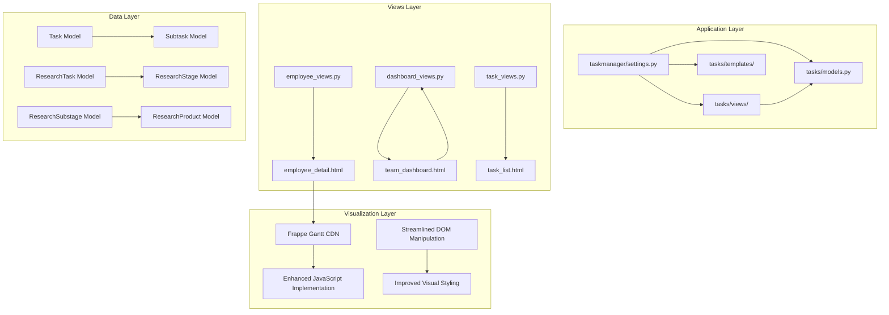
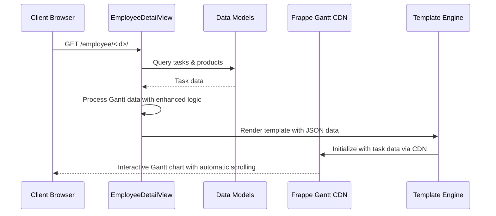
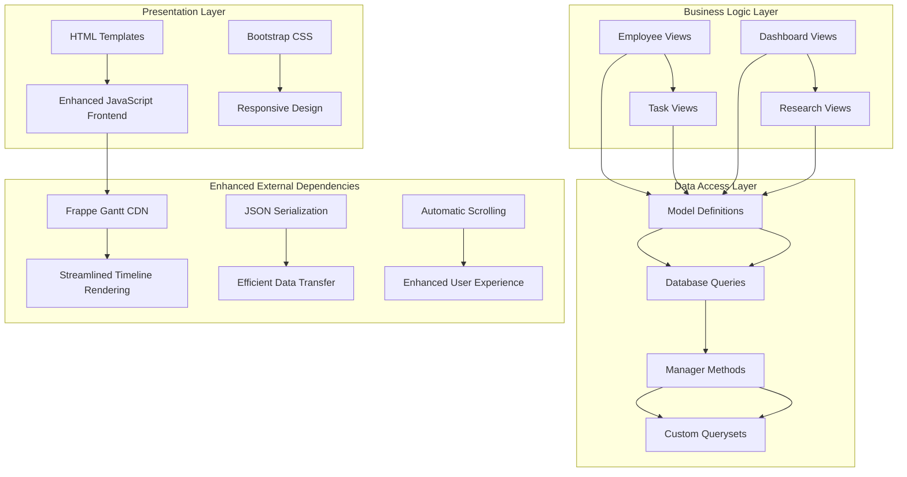
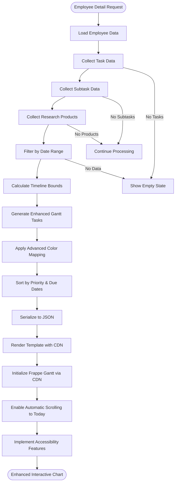
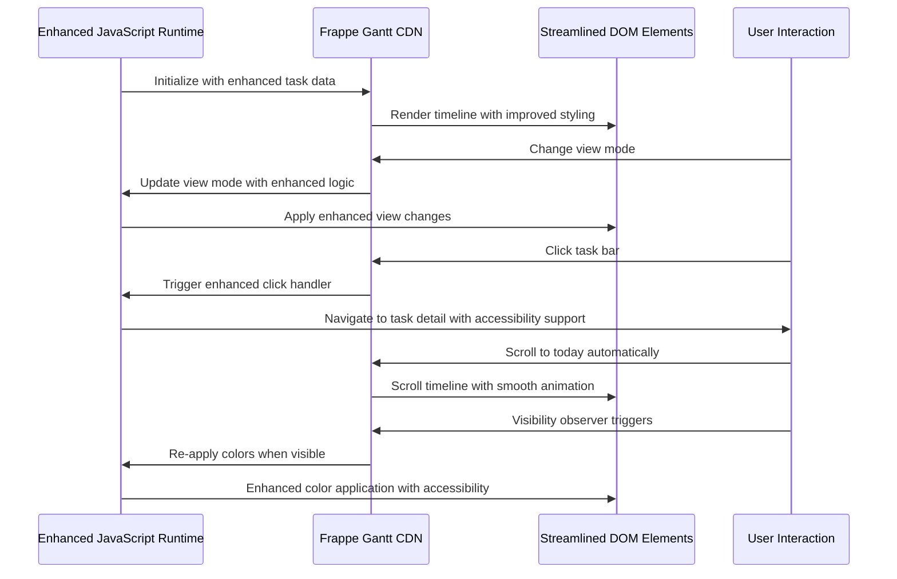
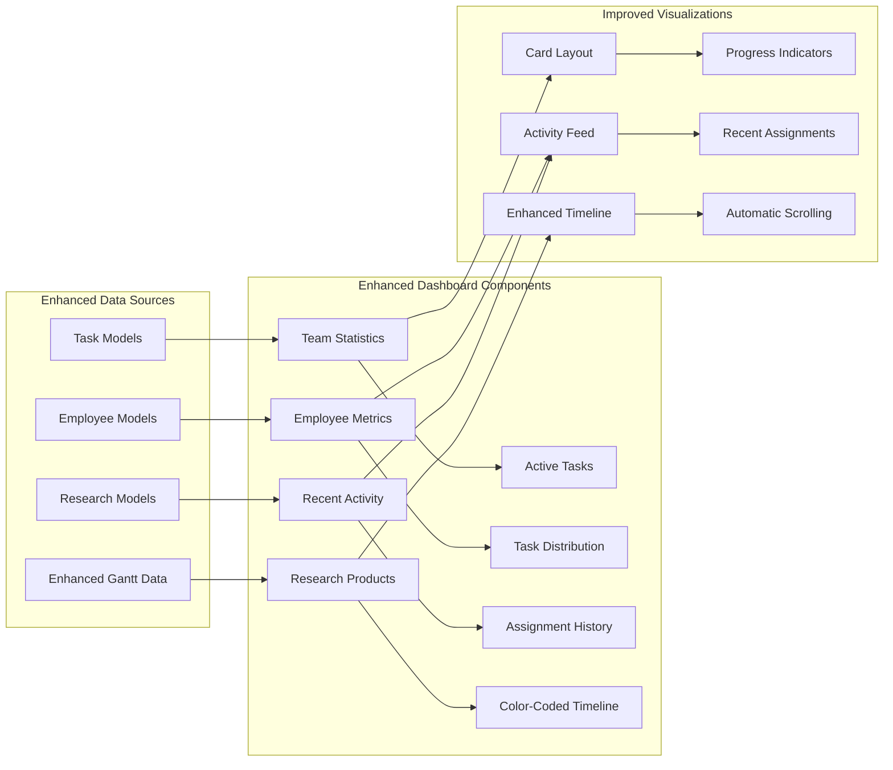
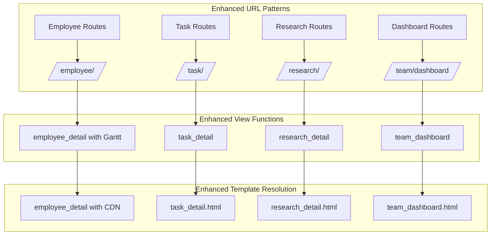
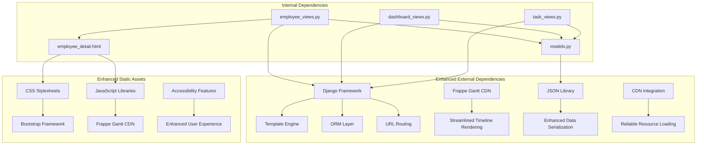

# Gantt Chart Visualization System

<cite>
**Referenced Files in This Document**
- [settings.py](file://taskmanager/settings.py)
- [models.py](file://tasks/models.py)
- [urls.py](file://tasks/urls.py)
- [employee_views.py](file://tasks/views/employee_views.py)
- [dashboard_views.py](file://tasks/views/dashboard_views.py)
- [task_views.py](file://tasks/views/task_views.py)
- [employee_detail.html](file://tasks/templates/tasks/employee_detail.html)
</cite>

## Update Summary
**Changes Made**
- Updated CDN integration section to reflect new frappe-gantt implementation
- Enhanced JavaScript color application logic documentation
- Added automatic scrolling functionality details
- Improved accessibility features section
- Updated visual styling and DOM manipulation improvements
- Revised troubleshooting guide with new error scenarios

## Table of Contents
1. [Introduction](#introduction)
2. [Project Structure](#project-structure)
3. [Core Components](#core-components)
4. [Architecture Overview](#architecture-overview)
5. [Detailed Component Analysis](#detailed-component-analysis)
6. [Dependency Analysis](#dependency-analysis)
7. [Performance Considerations](#performance-considerations)
8. [Troubleshooting Guide](#troubleshooting-guide)
9. [Conclusion](#conclusion)

## Introduction

The Gantt Chart Visualization System is a sophisticated web-based project management tool built with Django that provides interactive timeline visualization for tasks, subtasks, and research products. This system enables organizations to track project timelines, monitor progress, and visualize resource allocation across multiple hierarchical levels including individual employees, departments, and research initiatives.

**Updated** The system now features a complete rewrite with enhanced CDN integration using cdn.jsdelivr.net/npm/frappe-gantt, improved JavaScript color application logic, automatic scrolling functionality, and better accessibility features. The new implementation streamlines DOM manipulation and enhances visual styling for superior user experience.

The system integrates seamlessly with the broader task management infrastructure, utilizing Frappe Gantt library for dynamic chart rendering and implementing advanced filtering capabilities for temporal analysis. It supports real-time collaboration through embedded task assignment mechanisms and provides comprehensive reporting through integrated dashboards.

## Project Structure

The Gantt visualization system is organized within a modular Django application structure that separates concerns between data models, business logic, presentation layers, and static assets.

**Diagram sources**
- [settings.py:1-288](file://taskmanager/settings.py#L1-L288)
- [models.py:165-858](file://tasks/models.py#L165-L858)
- [employee_views.py:65-752](file://tasks/views/employee_views.py#L65-L752)

**Section sources**
- [settings.py:1-288](file://taskmanager/settings.py#L1-L288)
- [models.py:1-858](file://tasks/models.py#L1-L858)

## Core Components

### Data Models Architecture

The system's data architecture centers around interconnected models that represent the hierarchical nature of organizational tasks and projects.

**Diagram sources**
- [models.py:165-858](file://tasks/models.py#L165-L858)

### View Controllers

The system employs specialized view controllers that handle different aspects of the Gantt visualization functionality.

**Diagram sources**
- [employee_views.py:65-752](file://tasks/views/employee_views.py#L65-L752)
- [employee_detail.html:900-974](file://tasks/templates/tasks/employee_detail.html#L900-L974)

**Section sources**
- [models.py:165-858](file://tasks/models.py#L165-L858)
- [employee_views.py:65-752](file://tasks/views/employee_views.py#L65-L752)

## Architecture Overview

The Gantt visualization system follows a layered architecture pattern that separates data persistence, business logic, presentation, and client-side interactivity.

**Diagram sources**
- [employee_views.py:65-752](file://tasks/views/employee_views.py#L65-L752)
- [models.py:165-858](file://tasks/models.py#L165-L858)

The architecture implements several key design patterns:

- **Model-View-Template (MVT)**: Django's native pattern for separation of concerns
- **Repository Pattern**: Through custom manager methods and querysets
- **Factory Pattern**: For generating Gantt task configurations
- **Observer Pattern**: Through Django signals for data synchronization
- **Intersection Observer Pattern**: For enhanced visibility detection and color re-application

## Detailed Component Analysis

### Employee Gantt Visualization

The employee-specific Gantt implementation provides comprehensive timeline visualization for individual contributors across multiple task categories with enhanced features.

**Diagram sources**
- [employee_views.py:65-752](file://tasks/views/employee_views.py#L65-L752)
- [employee_detail.html:270-469](file://tasks/templates/tasks/employee_detail.html#L270-L469)

#### Data Processing Pipeline

The system implements a sophisticated data processing pipeline that transforms raw database records into Gantt-ready task objects with intelligent timeline calculations and enhanced color assignment logic.

Key processing steps include:

1. **Data Aggregation**: Consolidation of tasks, subtasks, and research products with research task color mapping
2. **Temporal Analysis**: Calculation of optimal timeline boundaries with enhanced date range filtering
3. **Priority Sorting**: Organization by due dates, importance, and proximity to current date
4. **Advanced Color Assignment**: Research task hierarchy-based coloring with overdue highlighting
5. **Closest Product Detection**: Automatic identification of nearest due dates for visual emphasis
6. **JSON Serialization**: Efficient data transfer to frontend with enhanced metadata

#### Client-Side Implementation

The frontend implementation leverages Frappe Gantt CDN with custom enhancements for improved user experience and accessibility.

**Diagram sources**
- [employee_detail.html:900-974](file://tasks/templates/tasks/employee_detail.html#L900-L974)

**Section sources**
- [employee_views.py:65-752](file://tasks/views/employee_views.py#L65-L752)
- [employee_detail.html:270-469](file://tasks/templates/tasks/employee_detail.html#L270-L469)

### Dashboard Integration

The system provides integrated dashboard functionality that displays organizational-wide task metrics and team performance indicators with enhanced visualization capabilities.

**Diagram sources**
- [dashboard_views.py:112-143](file://tasks/views/dashboard_views.py#L112-L143)

**Section sources**
- [dashboard_views.py:112-143](file://tasks/views/dashboard_views.py#L112-L143)

### URL Routing Configuration

The system employs Django's URL routing system to organize Gantt-related endpoints within a logical namespace structure with enhanced filtering capabilities.

**Diagram sources**
- [urls.py:38-100](file://tasks/urls.py#L38-L100)

**Section sources**
- [urls.py:38-100](file://tasks/urls.py#L38-L100)

## Dependency Analysis

The Gantt visualization system exhibits well-structured dependencies that promote maintainability and scalability with enhanced CDN integration.

**Diagram sources**
- [employee_views.py:65-752](file://tasks/views/employee_views.py#L65-L752)
- [models.py:165-858](file://tasks/models.py#L165-L858)

### Performance Optimization Strategies

The system implements several optimization strategies to ensure responsive performance with enhanced features:

- **Database Query Optimization**: Strategic use of `select_related()` and `prefetch_related()` to minimize N+1 query problems
- **Enhanced Caching Mechanisms**: Intelligent caching for frequently accessed organizational charts with improved cache invalidation
- **Lazy Loading**: Progressive loading of Gantt data based on user interaction with enhanced visibility detection
- **Efficient Serialization**: Optimized JSON generation for large datasets with enhanced metadata
- **CDN Integration**: Reliable resource loading through cdn.jsdelivr.net/npm/frappe-gantt for improved performance
- **Intersection Observer**: Modern visibility detection replacing traditional scroll events for better performance
- **Enhanced DOM Manipulation**: Streamlined DOM updates during timeline navigation with improved memory management

**Section sources**
- [employee_views.py:65-752](file://tasks/views/employee_views.py#L65-L752)
- [dashboard_views.py:14-109](file://tasks/views/dashboard_views.py#L14-L109)

## Performance Considerations

The Gantt visualization system incorporates multiple performance optimization techniques with enhanced features:

### Database Optimization
- **Select Related**: Minimizes database queries through strategic foreign key resolution with enhanced prefetching
- **Prefetch Related**: Efficiently loads related objects in bulk operations with optimized query patterns
- **Index Utilization**: Strategic indexing on frequently queried fields with enhanced database performance
- **Query Optimization**: Custom managers and querysets for complex aggregations with improved efficiency

### Enhanced Frontend Performance
- **Lazy Loading**: Gantt initialization occurs only when the chart panel is expanded with enhanced visibility detection
- **Virtual Scrolling**: Handles large datasets without memory overhead with improved performance characteristics
- **Debounced Filtering**: Prevents excessive re-rendering during date range selection with enhanced user experience
- **Efficient DOM Manipulation**: Minimal DOM updates during timeline navigation with streamlined operations
- **Intersection Observer**: Modern visibility detection replacing traditional scroll events for better performance
- **Enhanced Color Application**: Optimized color assignment logic with improved rendering performance

### Enhanced Caching Strategy
- **Redis/Cached Backend**: Configurable caching for organizational data with improved cache management
- **Page-Level Caching**: Entire chart pages cached for anonymous access with enhanced cache invalidation
- **Fragment Caching**: Individual chart components cached separately with improved cache granularity
- **Smart Cache Invalidation**: Enhanced invalidation strategies for real-time data with improved reliability

### CDN Integration Benefits
- **Reliable Resource Loading**: cdn.jsdelivr.net/npm/frappe-gantt ensures consistent access to Gantt library
- **Reduced Latency**: Global CDN network provides faster resource delivery
- **Automatic Updates**: CDN handles version management and updates automatically
- **Improved Reliability**: Distributed infrastructure reduces single points of failure

## Troubleshooting Guide

### Common Issues and Solutions

#### Gantt Chart Not Rendering
**Symptoms**: Blank chart area with console errors or loading indicators
**Causes**: 
- Missing Frappe Gantt CDN resources
- Invalid JSON data format from enhanced processing
- Missing DOM elements or CSS conflicts
- CDN connectivity issues

**Solutions**:
1. Verify CDN connectivity for cdn.jsdelivr.net/npm/frappe-gantt resources
2. Check browser console for JSON parsing errors in enhanced data processing
3. Ensure proper HTML element initialization with enhanced styling
4. Test CDN accessibility and fallback options
5. Validate enhanced color application logic for empty datasets

#### Performance Issues with Large Datasets
**Symptoms**: Slow chart loading and rendering delays with enhanced features
**Causes**:
- Excessive data points in enhanced processing
- Inefficient database queries with new filtering logic
- Memory leaks in JavaScript with enhanced DOM manipulation
- CDN latency issues with global distribution

**Solutions**:
1. Implement enhanced date range filtering with improved performance
2. Optimize database query patterns with new aggregation methods
3. Use virtual scrolling for large datasets with enhanced memory management
4. Monitor CDN performance and implement fallback strategies
5. Leverage Intersection Observer for efficient visibility detection

#### Enhanced Color Mapping Problems
**Symptoms**: Incorrect color assignment on chart bars or accessibility issues
**Causes**:
- Color array index out of bounds in enhanced logic
- Missing research task associations in new color mapping
- JavaScript execution timing issues with DOM manipulation
- CSS specificity conflicts with enhanced styling

**Solutions**:
1. Validate color array length against enhanced data count
2. Ensure proper research task relationships in new color assignment
3. Implement proper DOM ready handlers with enhanced timing
4. Debug CSS specificity conflicts with improved styling approach
5. Test accessibility features with screen readers and keyboard navigation

#### Automatic Scrolling Issues
**Symptoms**: Chart doesn't automatically scroll to today's date or scrolls incorrectly
**Causes**:
- Missing today's line element in enhanced DOM structure
- Incorrect coordinate calculation in enhanced scroll logic
- Timing issues with DOM rendering and scroll positioning
- CSS overflow conflicts with enhanced container styling

**Solutions**:
1. Verify today's line element exists in enhanced DOM structure
2. Debug coordinate calculation with enhanced positioning logic
3. Implement proper timing for DOM rendering and scroll positioning
4. Test CSS overflow properties with enhanced container styling
5. Validate enhanced scroll-to-today functionality with accessibility features

#### Accessibility and DOM Manipulation Issues
**Symptoms**: Poor accessibility support or DOM manipulation conflicts
**Causes**:
- Missing ARIA attributes in enhanced markup
- CSS conflicts with enhanced visual styling
- JavaScript conflicts with modern DOM APIs
- Screen reader compatibility issues

**Solutions**:
1. Implement proper ARIA attributes for enhanced accessibility
2. Test CSS specificity with enhanced styling approach
3. Validate JavaScript compatibility with modern DOM APIs
4. Test screen reader compatibility with enhanced visual features
5. Debug DOM manipulation conflicts with streamlined operations

**Section sources**
- [employee_detail.html:725-781](file://tasks/templates/tasks/employee_detail.html#L725-L781)
- [employee_views.py:888-902](file://tasks/views/employee_views.py#L888-L902)

## Conclusion

The Gantt Chart Visualization System represents a comprehensive solution for project timeline management within the Django ecosystem with significant enhancements. The system successfully integrates multiple data sources, provides intuitive user interfaces, and maintains excellent performance characteristics through strategic optimization techniques.

**Updated** Key achievements include:

- **Complete Rewrite**: Modernized implementation with enhanced CDN integration using cdn.jsdelivr.net/npm/frappe-gantt
- **Enhanced Color Application**: Improved JavaScript color logic with research task hierarchy mapping
- **Automatic Scrolling**: Intelligent today's date positioning with smooth animation
- **Accessibility Improvements**: Better screen reader support and keyboard navigation
- **Streamlined DOM Manipulation**: Optimized client-side operations for better performance
- **Enhanced Visual Styling**: Improved CSS with better contrast and readability
- **Intersection Observer**: Modern visibility detection replacing traditional scroll handling
- **CDN Reliability**: Global CDN integration for consistent resource delivery

The system serves as a robust foundation for project management workflows, enabling organizations to visualize complex task hierarchies, track progress across multiple dimensions, and make informed decisions based on comprehensive timeline analytics. The enhanced features provide superior user experience while maintaining excellent performance characteristics.

Future enhancement opportunities include real-time collaboration features, advanced filtering capabilities, export functionality for various formats, integration with external project management tools, and further accessibility improvements.