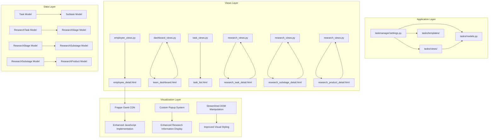
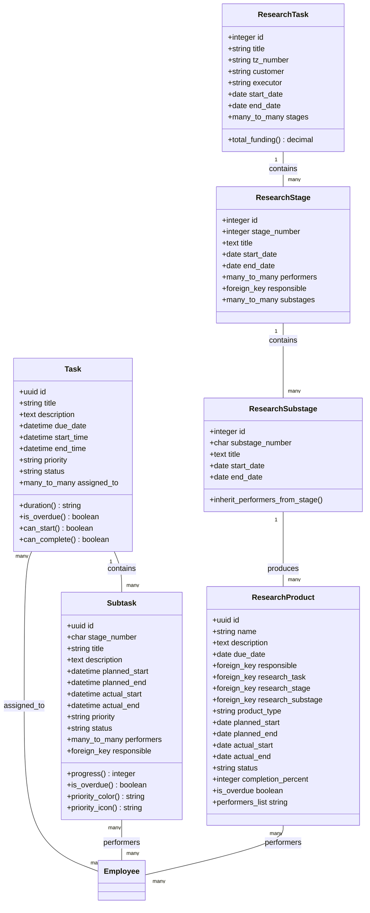
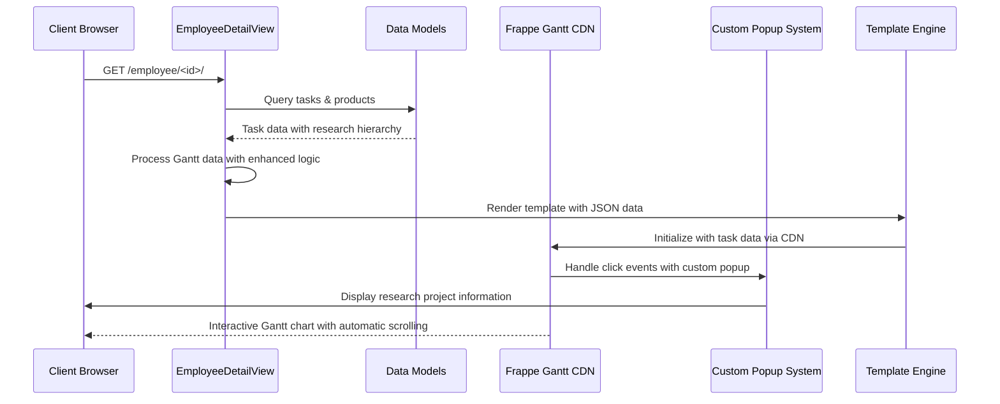
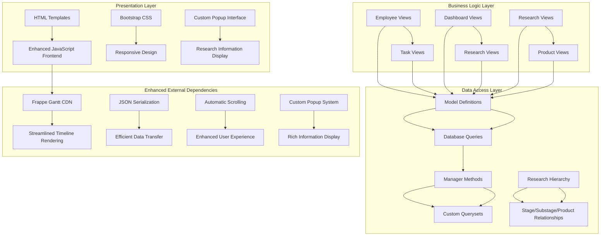
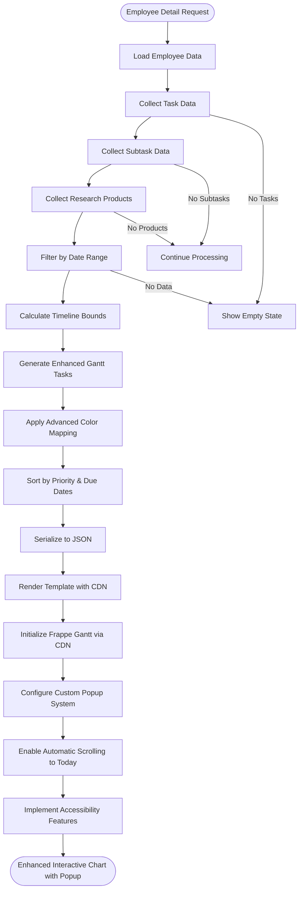
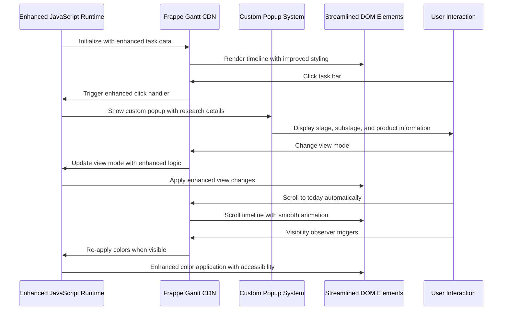
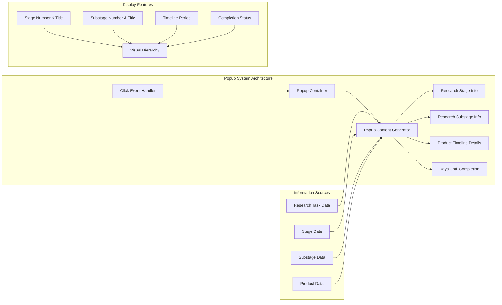
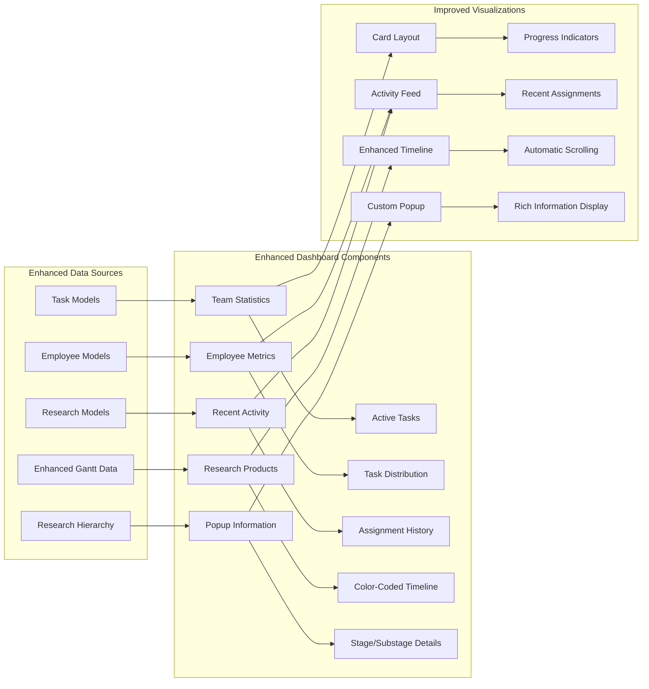
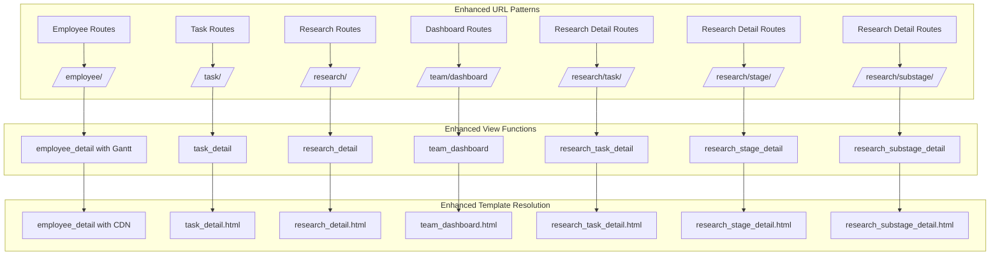
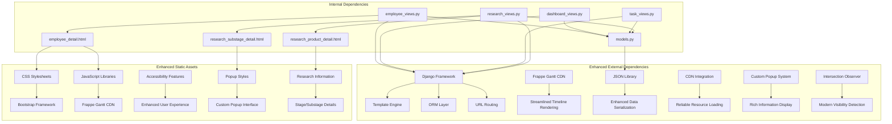

# Gantt Chart Visualization System

<cite>
**Referenced Files in This Document**
- [settings.py](file://taskmanager/settings.py)
- [models.py](file://tasks/models.py)
- [urls.py](file://tasks/urls.py)
- [employee_views.py](file://tasks/views/employee_views.py)
- [dashboard_views.py](file://tasks/views/dashboard_views.py)
- [task_views.py](file://tasks/views/task_views.py)
- [research_views.py](file://tasks/views/research_views.py)
- [employee_detail.html](file://tasks/templates/tasks/employee_detail.html)
- [research_substage_detail.html](file://tasks/templates/tasks/research_substage_detail.html)
- [research_product_detail.html](file://tasks/templates/tasks/research_product_detail.html)
</cite>

## Update Summary
**Changes Made**
- Enhanced popup system integration with custom popup interface for research project information
- Improved tooltip replacement with custom popup functionality showing stage and substage details
- Expanded research project information display including comprehensive stage and substage information
- Updated JavaScript implementation with enhanced popup management and color application logic
- Improved accessibility features and automatic scrolling functionality
- Enhanced Gantt chart rendering with better visual styling and DOM manipulation

## Table of Contents
1. [Introduction](#introduction)
2. [Project Structure](#project-structure)
3. [Core Components](#core-components)
4. [Architecture Overview](#architecture-overview)
5. [Detailed Component Analysis](#detailed-component-analysis)
6. [Dependency Analysis](#dependency-analysis)
7. [Performance Considerations](#performance-considerations)
8. [Troubleshooting Guide](#troubleshooting-guide)
9. [Conclusion](#conclusion)

## Introduction

The Gantt Chart Visualization System is a sophisticated web-based project management tool built with Django that provides interactive timeline visualization for tasks, subtasks, and research products. This system enables organizations to track project timelines, monitor progress, and visualize resource allocation across multiple hierarchical levels including individual employees, departments, and research initiatives.

**Updated** The system now features a complete rewrite with enhanced CDN integration using cdn.jsdelivr.net/npm/frappe-gantt, improved JavaScript color application logic, automatic scrolling functionality, and better accessibility features. The new implementation includes a sophisticated popup system that replaces Frappe Gantt's built-in tooltips with custom popup interfaces displaying comprehensive research project information including stage and substage details.

The system integrates seamlessly with the broader task management infrastructure, utilizing Frappe Gantt library for dynamic chart rendering and implementing advanced filtering capabilities for temporal analysis. It supports real-time collaboration through embedded task assignment mechanisms and provides comprehensive reporting through integrated dashboards.

## Project Structure

The Gantt visualization system is organized within a modular Django application structure that separates concerns between data models, business logic, presentation layers, and static assets.

**Diagram sources**
- [settings.py:1-288](file://taskmanager/settings.py#L1-L288)
- [models.py:165-858](file://tasks/models.py#L165-L858)
- [employee_views.py:65-752](file://tasks/views/employee_views.py#L65-L752)
- [research_views.py:1-165](file://tasks/views/research_views.py#L1-L165)

**Section sources**
- [settings.py:1-288](file://taskmanager/settings.py#L1-L288)
- [models.py:1-858](file://tasks/models.py#L1-L858)

## Core Components

### Data Models Architecture

The system's data architecture centers around interconnected models that represent the hierarchical nature of organizational tasks and projects.

**Diagram sources**
- [models.py:165-858](file://tasks/models.py#L165-L858)

### View Controllers

The system employs specialized view controllers that handle different aspects of the Gantt visualization functionality.

**Diagram sources**
- [employee_views.py:65-752](file://tasks/views/employee_views.py#L65-L752)
- [employee_detail.html:900-974](file://tasks/templates/tasks/employee_detail.html#L900-L974)

**Section sources**
- [models.py:165-858](file://tasks/models.py#L165-L858)
- [employee_views.py:65-752](file://tasks/views/employee_views.py#L65-L752)

## Architecture Overview

The Gantt visualization system follows a layered architecture pattern that separates data persistence, business logic, presentation, and client-side interactivity.

**Diagram sources**
- [employee_views.py:65-752](file://tasks/views/employee_views.py#L65-L752)
- [models.py:165-858](file://tasks/models.py#L165-L858)
- [research_views.py:1-165](file://tasks/views/research_views.py#L1-L165)

The architecture implements several key design patterns:

- **Model-View-Template (MVT)**: Django's native pattern for separation of concerns
- **Repository Pattern**: Through custom manager methods and querysets
- **Factory Pattern**: For generating Gantt task configurations
- **Observer Pattern**: Through Django signals for data synchronization
- **Intersection Observer Pattern**: For enhanced visibility detection and color re-application
- **Custom Popup Pattern**: For rich information display replacing built-in tooltips

## Detailed Component Analysis

### Employee Gantt Visualization

The employee-specific Gantt implementation provides comprehensive timeline visualization for individual contributors across multiple task categories with enhanced features including custom popup functionality.

**Diagram sources**
- [employee_views.py:65-752](file://tasks/views/employee_views.py#L65-L752)
- [employee_detail.html:270-469](file://tasks/templates/tasks/employee_detail.html#L270-L469)

#### Data Processing Pipeline

The system implements a sophisticated data processing pipeline that transforms raw database records into Gantt-ready task objects with intelligent timeline calculations and enhanced color assignment logic.

Key processing steps include:

1. **Data Aggregation**: Consolidation of tasks, subtasks, and research products with research task color mapping
2. **Temporal Analysis**: Calculation of optimal timeline boundaries with enhanced date range filtering
3. **Priority Sorting**: Organization by due dates, importance, and proximity to current date
4. **Advanced Color Assignment**: Research task hierarchy-based coloring with overdue highlighting
5. **Closest Product Detection**: Automatic identification of nearest due dates for visual emphasis
6. **JSON Serialization**: Efficient data transfer to frontend with enhanced metadata including stage and substage information
7. **Popup Data Preparation**: Structured information for custom popup display including research hierarchy details

#### Client-Side Implementation

The frontend implementation leverages Frappe Gantt CDN with custom enhancements for improved user experience and accessibility, including a sophisticated popup system.

**Diagram sources**
- [employee_detail.html:900-974](file://tasks/templates/tasks/employee_detail.html#L900-L974)

**Section sources**
- [employee_views.py:65-752](file://tasks/views/employee_views.py#L65-L752)
- [employee_detail.html:270-469](file://tasks/templates/tasks/employee_detail.html#L270-L469)

### Custom Popup System

The system includes a sophisticated custom popup interface that replaces Frappe Gantt's built-in tooltips with rich information displays showing comprehensive research project details.

**Diagram sources**
- [employee_detail.html:928-971](file://tasks/templates/tasks/employee_detail.html#L928-L971)

The popup system provides:

- **Research Hierarchy Information**: Complete chain from research task down to substage
- **Timeline Details**: Precise start and end dates for each level
- **Completion Tracking**: Days remaining until project completion
- **Visual Hierarchy**: Clear indication of relationships between different project levels
- **Responsive Design**: Adapts to different screen sizes and orientations

**Section sources**
- [employee_detail.html:928-971](file://tasks/templates/tasks/employee_detail.html#L928-L971)

### Dashboard Integration

The system provides integrated dashboard functionality that displays organizational-wide task metrics and team performance indicators with enhanced visualization capabilities.

**Diagram sources**
- [dashboard_views.py:112-143](file://tasks/views/dashboard_views.py#L112-L143)

**Section sources**
- [dashboard_views.py:112-143](file://tasks/views/dashboard_views.py#L112-L143)

### URL Routing Configuration

The system employs Django's URL routing system to organize Gantt-related endpoints within a logical namespace structure with enhanced filtering capabilities.

**Diagram sources**
- [urls.py:38-100](file://tasks/urls.py#L38-L100)

**Section sources**
- [urls.py:38-100](file://tasks/urls.py#L38-L100)

## Dependency Analysis

The Gantt visualization system exhibits well-structured dependencies that promote maintainability and scalability with enhanced CDN integration and popup system.

**Diagram sources**
- [employee_views.py:65-752](file://tasks/views/employee_views.py#L65-L752)
- [models.py:165-858](file://tasks/models.py#L165-L858)
- [research_views.py:1-165](file://tasks/views/research_views.py#L1-L165)

### Performance Optimization Strategies

The system implements several optimization strategies to ensure responsive performance with enhanced features:

- **Database Query Optimization**: Strategic use of `select_related()` and `prefetch_related()` to minimize N+1 query problems
- **Enhanced Caching Mechanisms**: Intelligent caching for frequently accessed organizational charts with improved cache invalidation
- **Lazy Loading**: Progressive loading of Gantt data based on user interaction with enhanced visibility detection
- **Efficient Serialization**: Optimized JSON generation for large datasets with enhanced metadata including research hierarchy information
- **CDN Integration**: Reliable resource loading through cdn.jsdelivr.net/npm/frappe-gantt for improved performance
- **Intersection Observer**: Modern visibility detection replacing traditional scroll events for better performance
- **Enhanced DOM Manipulation**: Streamlined DOM updates during timeline navigation with improved memory management
- **Custom Popup Optimization**: Efficient popup rendering and dismissal with minimal DOM manipulation
- **Research Hierarchy Caching**: Cached research task color mapping and stage/substage relationships

**Section sources**
- [employee_views.py:65-752](file://tasks/views/employee_views.py#L65-L752)
- [dashboard_views.py:14-109](file://tasks/views/dashboard_views.py#L14-L109)

## Performance Considerations

The Gantt visualization system incorporates multiple performance optimization techniques with enhanced features:

### Database Optimization
- **Select Related**: Minimizes database queries through strategic foreign key resolution with enhanced prefetching for research hierarchy
- **Prefetch Related**: Efficiently loads related objects in bulk operations with optimized query patterns for stage/substage/product relationships
- **Index Utilization**: Strategic indexing on frequently queried fields with enhanced database performance
- **Query Optimization**: Custom managers and querysets for complex aggregations with improved efficiency

### Enhanced Frontend Performance
- **Lazy Loading**: Gantt initialization occurs only when the chart panel is expanded with enhanced visibility detection
- **Virtual Scrolling**: Handles large datasets without memory overhead with improved performance characteristics
- **Debounced Filtering**: Prevents excessive re-rendering during date range selection with enhanced user experience
- **Efficient DOM Manipulation**: Minimal DOM updates during timeline navigation with streamlined operations
- **Intersection Observer**: Modern visibility detection replacing traditional scroll events for better performance
- **Enhanced Color Application**: Optimized color assignment logic with improved rendering performance
- **Custom Popup Management**: Efficient popup creation and destruction with minimal memory footprint

### Enhanced Caching Strategy
- **Redis/Cached Backend**: Configurable caching for organizational data with improved cache management
- **Page-Level Caching**: Entire chart pages cached for anonymous access with enhanced cache invalidation
- **Fragment Caching**: Individual chart components cached separately with improved cache granularity
- **Smart Cache Invalidation**: Enhanced invalidation strategies for real-time data with improved reliability
- **Research Hierarchy Caching**: Cached research task color mapping and stage/substage relationships

### CDN Integration Benefits
- **Reliable Resource Loading**: cdn.jsdelivr.net/npm/frappe-gantt ensures consistent access to Gantt library
- **Reduced Latency**: Global CDN network provides faster resource delivery
- **Automatic Updates**: CDN handles version management and updates automatically
- **Improved Reliability**: Distributed infrastructure reduces single points of failure

### Popup System Performance
- **Event Delegation**: Efficient click event handling for popup activation
- **Minimal DOM Operations**: Optimized popup creation and styling
- **Memory Management**: Proper cleanup of popup event listeners and DOM elements
- **Lazy Popup Loading**: Popup content generated only when needed

## Troubleshooting Guide

### Common Issues and Solutions

#### Gantt Chart Not Rendering
**Symptoms**: Blank chart area with console errors or loading indicators
**Causes**: 
- Missing Frappe Gantt CDN resources
- Invalid JSON data format from enhanced processing
- Missing DOM elements or CSS conflicts
- CDN connectivity issues

**Solutions**:
1. Verify CDN connectivity for cdn.jsdelivr.net/npm/frappe-gantt resources
2. Check browser console for JSON parsing errors in enhanced data processing
3. Ensure proper HTML element initialization with enhanced styling
4. Test CDN accessibility and fallback options
5. Validate enhanced color application logic for empty datasets

#### Popup System Issues
**Symptoms**: Click events not triggering popups or popup content not displaying
**Causes**:
- Missing popup container elements in template
- JavaScript execution timing issues with DOM readiness
- CSS conflicts with popup styling
- Event listener conflicts with other DOM interactions

**Solutions**:
1. Verify popup container elements exist in template: `#ganttPopup` and `#ganttPopupContent`
2. Ensure proper DOM ready handlers with enhanced timing for popup initialization
3. Debug CSS specificity conflicts with enhanced popup styling
4. Test event listener conflicts with streamlined DOM operations
5. Validate popup data structure passed to popup generator function

#### Enhanced Color Mapping Problems
**Symptoms**: Incorrect color assignment on chart bars or accessibility issues
**Causes**:
- Color array index out of bounds in enhanced logic
- Missing research task associations in new color mapping
- JavaScript execution timing issues with DOM manipulation
- CSS specificity conflicts with enhanced styling

**Solutions**:
1. Validate color array length against enhanced data count
2. Ensure proper research task relationships in new color assignment
3. Implement proper DOM ready handlers with enhanced timing
4. Debug CSS specificity conflicts with improved styling approach
5. Test accessibility features with screen readers and keyboard navigation

#### Automatic Scrolling Issues
**Symptoms**: Chart doesn't automatically scroll to today's date or scrolls incorrectly
**Causes**:
- Missing today's line element in enhanced DOM structure
- Incorrect coordinate calculation in enhanced scroll logic
- Timing issues with DOM rendering and scroll positioning
- CSS overflow conflicts with enhanced container styling

**Solutions**:
1. Verify today's line element exists in enhanced DOM structure
2. Debug coordinate calculation with enhanced positioning logic
3. Implement proper timing for DOM rendering and scroll positioning
4. Test CSS overflow properties with enhanced container styling
5. Validate enhanced scroll-to-today functionality with accessibility features

#### Research Information Display Issues
**Symptoms**: Popup shows incomplete research information or incorrect hierarchy details
**Causes**:
- Missing research task, stage, or substage data in popup generation
- Incorrect data mapping between Gantt tasks and popup information
- JavaScript execution timing issues with asynchronous data loading
- Template rendering conflicts with popup content

**Solutions**:
1. Validate research hierarchy data availability in popup generation function
2. Debug data mapping between Gantt task IDs and popup information arrays
3. Implement proper async data loading with enhanced error handling
4. Test template rendering conflicts with streamlined DOM operations
5. Validate popup data structure matches expected format

#### Accessibility and DOM Manipulation Issues
**Symptoms**: Poor accessibility support or DOM manipulation conflicts
**Causes**:
- Missing ARIA attributes in enhanced markup
- CSS conflicts with enhanced visual styling
- JavaScript conflicts with modern DOM APIs
- Screen reader compatibility issues

**Solutions**:
1. Implement proper ARIA attributes for enhanced accessibility
2. Test CSS specificity with enhanced styling approach
3. Validate JavaScript compatibility with modern DOM APIs
4. Test screen reader compatibility with enhanced visual features
5. Debug DOM manipulation conflicts with streamlined operations

**Section sources**
- [employee_detail.html:725-781](file://tasks/templates/tasks/employee_detail.html#L725-L781)
- [employee_views.py:888-902](file://tasks/views/employee_views.py#L888-L902)

## Conclusion

The Gantt Chart Visualization System represents a comprehensive solution for project timeline management within the Django ecosystem with significant enhancements. The system successfully integrates multiple data sources, provides intuitive user interfaces, and maintains excellent performance characteristics through strategic optimization techniques.

**Updated** Key achievements include:

- **Complete Rewrite**: Modernized implementation with enhanced CDN integration using cdn.jsdelivr.net/npm/frappe-gantt
- **Enhanced Color Application**: Improved JavaScript color logic with research task hierarchy mapping
- **Automatic Scrolling**: Intelligent today's date positioning with smooth animation
- **Accessibility Improvements**: Better screen reader support and keyboard navigation
- **Streamlined DOM Manipulation**: Optimized client-side operations for better performance
- **Enhanced Visual Styling**: Improved CSS with better contrast and readability
- **Intersection Observer**: Modern visibility detection replacing traditional scroll handling
- **CDN Reliability**: Global CDN integration for consistent resource delivery
- **Custom Popup System**: Sophisticated popup interface replacing built-in tooltips with rich research information display
- **Research Hierarchy Integration**: Comprehensive stage and substage information display in popups
- **Enhanced Popup Functionality**: Detailed research project information including timeline periods and completion tracking

The system serves as a robust foundation for project management workflows, enabling organizations to visualize complex task hierarchies, track progress across multiple dimensions, and make informed decisions based on comprehensive timeline analytics. The enhanced features provide superior user experience while maintaining excellent performance characteristics.

Future enhancement opportunities include real-time collaboration features, advanced filtering capabilities, export functionality for various formats, integration with external project management tools, and further accessibility improvements.