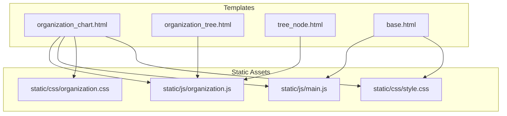
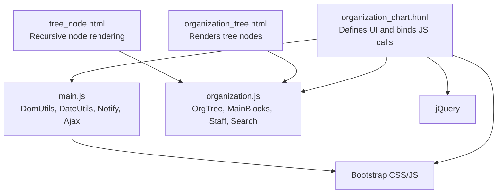
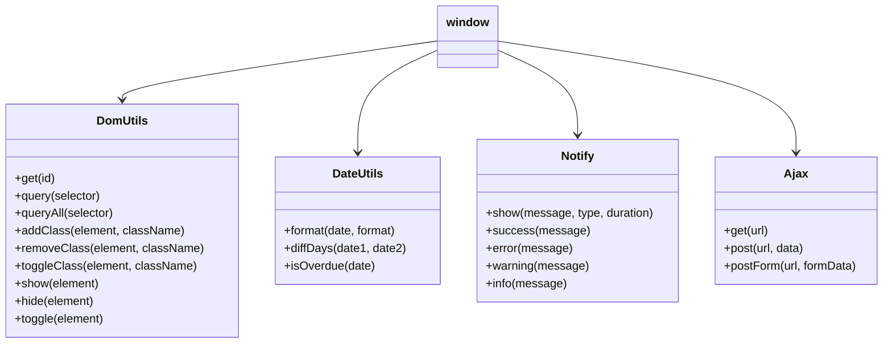
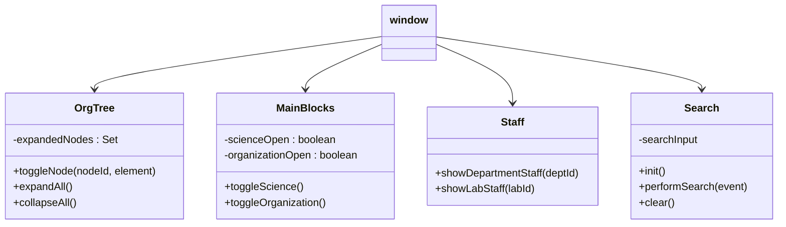
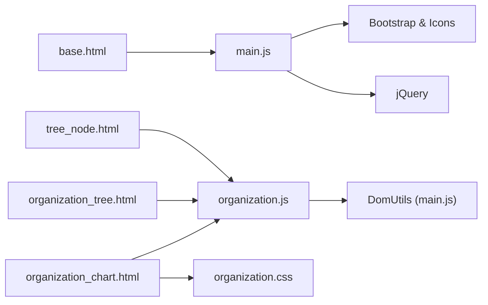

# JavaScript Components and Interactivity

<cite>
**Referenced Files in This Document**
- [main.js](file://static/js/main.js)
- [organization.js](file://static/js/organization.js)
- [organization_chart.html](file://tasks/templates/tasks/organization_chart.html)
- [organization_tree.html](file://tasks/templates/tasks/partials/organization_tree.html)
- [tree_node.html](file://tasks/templates/tasks/partials/tree_node.html)
- [base.html](file://tasks/templates/base.html)
- [organization.css](file://static/css/organization.css)
- [style.css](file://static/css/style.css)
</cite>

## Table of Contents
1. [Introduction](#introduction)
2. [Project Structure](#project-structure)
3. [Core Components](#core-components)
4. [Architecture Overview](#architecture-overview)
5. [Detailed Component Analysis](#detailed-component-analysis)
6. [Dependency Analysis](#dependency-analysis)
7. [Performance Considerations](#performance-considerations)
8. [Troubleshooting Guide](#troubleshooting-guide)
9. [Conclusion](#conclusion)

## Introduction
This document explains the JavaScript components and frontend interactivity for the task manager’s organizational structure page. It covers the global utilities, DOM manipulation patterns, event handling, AJAX interactions, and the interactive tree visualization. It also documents how jQuery and Bootstrap are integrated, how notifications and error handling work, and how to extend the system with additional components.

## Project Structure
The frontend is organized around two primary JavaScript modules:
- Global utilities and helpers shared across the project
- Organization-specific tree navigation, filtering, and UI controls

These scripts integrate with Django templates and Bootstrap to deliver interactive experiences.

**Diagram sources**
- [organization_chart.html:1-131](file://tasks/templates/tasks/organization_chart.html#L1-L131)
- [organization_tree.html:1-55](file://tasks/templates/tasks/partials/organization_tree.html#L1-L55)
- [tree_node.html:1-57](file://tasks/templates/tasks/partials/tree_node.html#L1-L57)
- [base.html:1-118](file://tasks/templates/base.html#L1-L118)
- [main.js:1-174](file://static/js/main.js#L1-L174)
- [organization.js:1-179](file://static/js/organization.js#L1-L179)
- [organization.css:1-591](file://static/css/organization.css#L1-L591)
- [style.css:1-314](file://static/css/style.css#L1-L314)

**Section sources**
- [organization_chart.html:1-131](file://tasks/templates/tasks/organization_chart.html#L1-L131)
- [organization_tree.html:1-55](file://tasks/templates/tasks/partials/organization_tree.html#L1-L55)
- [tree_node.html:1-57](file://tasks/templates/tasks/partials/tree_node.html#L1-L57)
- [base.html:1-118](file://tasks/templates/base.html#L1-L118)
- [main.js:1-174](file://static/js/main.js#L1-L174)
- [organization.js:1-179](file://static/js/organization.js#L1-L179)
- [organization.css:1-591](file://static/css/organization.css#L1-L591)
- [style.css:1-314](file://static/css/style.css#L1-L314)

## Core Components
- Global utilities module (DOM helpers, date utilities, notification system, AJAX helpers)
- Organization tree module (tree navigation, block toggles, staff lists, search/filter)
- Template integrations (organization chart page, tree partials, base layout)

Key responsibilities:
- Provide reusable DOM utilities and cross-page AJAX helpers
- Manage interactive tree expansion/collapse and search
- Coordinate Bootstrap and jQuery integration via the base template
- Deliver user feedback through a centralized notification system

**Section sources**
- [main.js:6-174](file://static/js/main.js#L6-L174)
- [organization.js:6-179](file://static/js/organization.js#L6-L179)
- [base.html:113-116](file://tasks/templates/base.html#L113-L116)

## Architecture Overview
The system follows a modular pattern:
- Templates define UI and bind to global JavaScript objects
- Global utilities provide cross-cutting concerns (AJAX, notifications)
- Organization module encapsulates tree-specific logic
- Styles define responsive layouts and animations

**Diagram sources**
- [organization_chart.html:1-131](file://tasks/templates/tasks/organization_chart.html#L1-L131)
- [organization_tree.html:1-55](file://tasks/templates/tasks/partials/organization_tree.html#L1-L55)
- [tree_node.html:1-57](file://tasks/templates/tasks/partials/tree_node.html#L1-L57)
- [main.js:1-174](file://static/js/main.js#L1-L174)
- [organization.js:1-179](file://static/js/organization.js#L1-L179)
- [base.html:113-116](file://tasks/templates/base.html#L113-L116)

## Detailed Component Analysis

### Global Utilities Module (main.js)
Responsibilities:
- DOM helpers: get/query/queryAll, add/remove/toggle classes, show/hide/toggle
- Date utilities: format, diff in days, overdue check
- Notification system: show success/error/warning/info with icons and auto-remove
- AJAX helpers: GET, POST (JSON and FormData), CSRF token extraction

Patterns:
- Encapsulation via IIFE-like globals exported to window
- Centralized error logging and user feedback
- Fetch-based async requests with try/catch and user notifications

**Diagram sources**
- [main.js:6-174](file://static/js/main.js#L6-L174)

**Section sources**
- [main.js:6-174](file://static/js/main.js#L6-L174)

### Organization Tree Module (organization.js)
Responsibilities:
- Tree navigation: expand/collapse per node, expand/collapse all
- Block toggles: show/hide scientific and organizational sections
- Staff lists: reveal department/lab staff
- Search/filter: live search across tree nodes with parent visibility

Patterns:
- Stateful toggling using a Set to track expanded nodes
- DOM queries and style toggling for visibility
- Event-driven initialization on DOMContentLoaded
- Template-driven click handlers invoking module functions

**Diagram sources**
- [organization.js:6-179](file://static/js/organization.js#L6-L179)

**Section sources**
- [organization.js:6-179](file://static/js/organization.js#L6-L179)

### Template Integrations
- Base template loads Bootstrap CSS/JS and jQuery, and injects global main.js
- Organization chart page defines control buttons, search box, and containers for tree sections
- Tree partials render recursive nodes and attach click handlers bound to OrgTree and Staff

Key integration points:
- Control buttons call OrgTree.expandAll()/collapseAll()
- Search input delegates to Search.performSearch()
- Node cards call OrgTree.toggleNode()
- Staff toggles call Staff.showDepartmentStaff()/showLabStaff()

**Section sources**
- [base.html:113-116](file://tasks/templates/base.html#L113-L116)
- [organization_chart.html:65-125](file://tasks/templates/tasks/organization_chart.html#L65-L125)
- [organization_tree.html:5-50](file://tasks/templates/tasks/partials/organization_tree.html#L5-L50)
- [tree_node.html:9-47](file://tasks/templates/tasks/partials/tree_node.html#L9-L47)

### Event Handling Mechanisms
- DOMContentLoaded initializes Search and hides containers
- Click handlers on UI elements delegate to module functions
- Keyboard events on search input trigger filtering logic
- No explicit event delegation is used; handlers are attached directly to interactive elements

Best practices observed:
- Keep event handlers minimal and delegate to module functions
- Use template-driven onclick attributes for quick bindings
- Initialize only after DOM is ready

**Section sources**
- [organization.js:157-173](file://static/js/organization.js#L157-L173)
- [organization_chart.html:84-93](file://tasks/templates/tasks/organization_chart.html#L84-L93)

### AJAX Interactions and CSRF Handling
- Ajax.get/post/postForm provide unified async request patterns
- CSRF token is extracted from cookies and included in headers for POST requests
- Errors are caught and surfaced via Notify.error with console logging

Common usage patterns:
- Load dynamic content via GET
- Submit forms via POST (JSON) or FormData
- Handle errors gracefully with user-visible notifications

**Section sources**
- [main.js:89-135](file://static/js/main.js#L89-L135)
- [main.js:138-151](file://static/js/main.js#L138-L151)

### DOM Manipulation Patterns
- Use DomUtils for consistent DOM queries and manipulations
- Toggle visibility by setting display styles
- Add/remove CSS classes for state changes
- Append notifications to a dedicated container

**Section sources**
- [main.js:6-29](file://static/js/main.js#L6-L29)
- [organization.js:10-27](file://static/js/organization.js#L10-L27)

### Interactive Filtering System
- Live search filters tree nodes by name
- Minimum input length threshold prevents premature filtering
- Parent nodes are revealed when a child matches the search term
- Clearing the input restores all nodes

**Diagram sources**
- [organization.js:111-154](file://static/js/organization.js#L111-L154)

**Section sources**
- [organization.js:111-154](file://static/js/organization.js#L111-L154)

### Organization Chart Visualization
- Two-level tree rendering with connecting lines and animated transitions
- Responsive grid layouts for leadership cards and staff lists
- Control buttons switch views and manage expansion state
- Icons from Bootstrap Icons enhance visual cues

**Section sources**
- [organization.css:6-591](file://static/css/organization.css#L6-L591)
- [organization_chart.html:10-126](file://tasks/templates/tasks/organization_chart.html#L10-L126)

### jQuery and Bootstrap Integration
- Bootstrap CSS/JS and Bootstrap Icons are loaded globally
- jQuery is included for compatibility and potential third-party plugins
- Notifications leverage Bootstrap alert classes and icons

**Section sources**
- [base.html:10-23](file://tasks/templates/base.html#L10-L23)
- [base.html:113-116](file://tasks/templates/base.html#L113-L116)
- [main.js:61-86](file://static/js/main.js#L61-L86)

## Dependency Analysis
- Templates depend on organization.js and main.js for interactivity
- organization.js depends on DomUtils for DOM operations
- main.js provides Ajax and Notify used across pages
- Stylesheets define responsive behavior and animations

**Diagram sources**
- [base.html:10-23](file://tasks/templates/base.html#L10-L23)
- [organization_chart.html:1-131](file://tasks/templates/tasks/organization_chart.html#L1-L131)
- [organization_tree.html:1-55](file://tasks/templates/tasks/partials/organization_tree.html#L1-L55)
- [tree_node.html:1-57](file://tasks/templates/tasks/partials/tree_node.html#L1-L57)
- [main.js:1-174](file://static/js/main.js#L1-L174)
- [organization.js:1-179](file://static/js/organization.js#L1-L179)
- [organization.css:1-591](file://static/css/organization.css#L1-L591)

**Section sources**
- [base.html:10-23](file://tasks/templates/base.html#L10-L23)
- [organization_chart.html:1-131](file://tasks/templates/tasks/organization_chart.html#L1-L131)
- [organization_tree.html:1-55](file://tasks/templates/tasks/partials/organization_tree.html#L1-L55)
- [tree_node.html:1-57](file://tasks/templates/tasks/partials/tree_node.html#L1-L57)
- [main.js:1-174](file://static/js/main.js#L1-L174)
- [organization.js:1-179](file://static/js/organization.js#L1-L179)
- [organization.css:1-591](file://static/css/organization.css#L1-L591)

## Performance Considerations
- Minimize DOM queries by caching selectors when reused frequently
- Batch DOM updates (e.g., toggling multiple icons) to reduce reflows
- Debounce search input if performance becomes an issue with large trees
- Prefer CSS transitions/animations over heavy JavaScript animations
- Use efficient selectors (IDs over class queries) where possible

## Troubleshooting Guide
Common issues and resolutions:
- Notifications not appearing: ensure the alerts container exists and is appended to the body during initialization
- AJAX failures: verify CSRF token retrieval and header inclusion; check browser network tab for 403/404 errors
- Tree nodes not expanding: confirm element IDs match the expected pattern and that icons are updated
- Search not working: ensure the search input has the correct ID and that event listeners are attached after DOMContentLoaded

**Section sources**
- [main.js:154-168](file://static/js/main.js#L154-L168)
- [main.js:138-151](file://static/js/main.js#L138-L151)
- [organization.js:157-173](file://static/js/organization.js#L157-L173)

## Conclusion
The JavaScript components provide a clean separation of concerns: global utilities handle cross-cutting needs, while the organization module encapsulates tree-specific behavior. The integration with Django templates and Bootstrap delivers a responsive, interactive experience. Extending the system involves adding new modules alongside existing patterns, leveraging the global utilities for AJAX and notifications, and following the established DOM manipulation and event handling conventions.