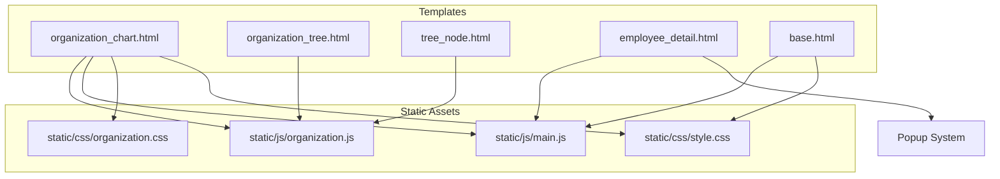
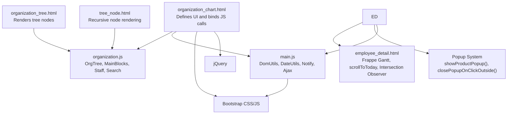
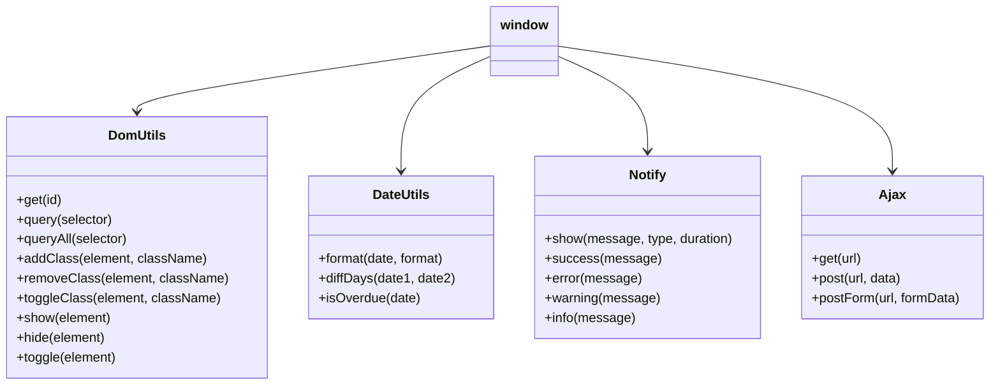
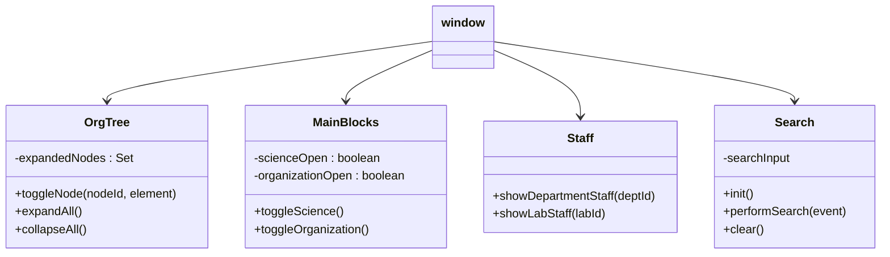
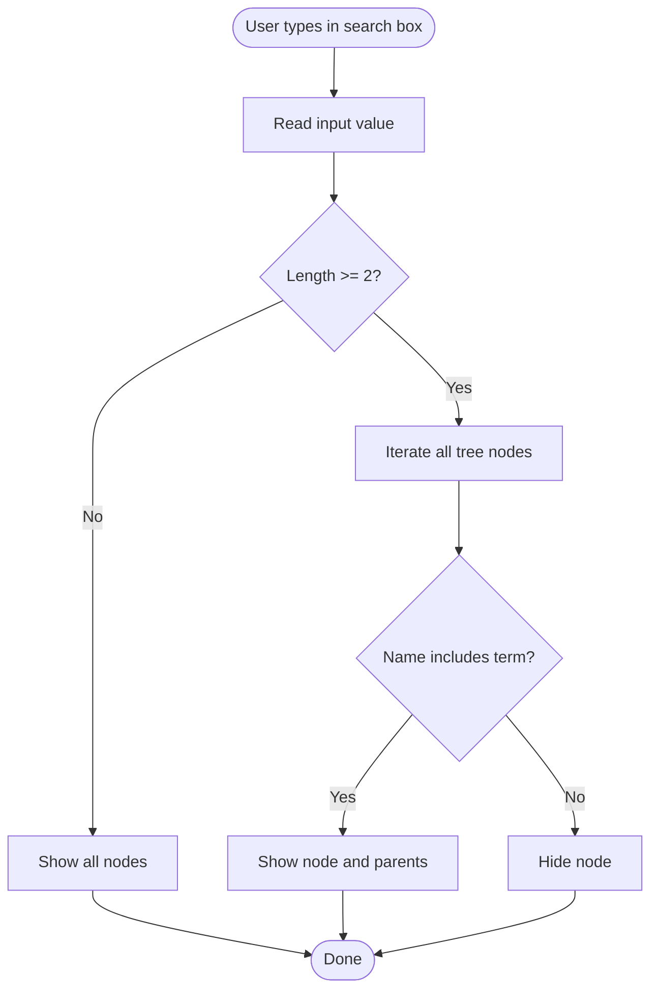
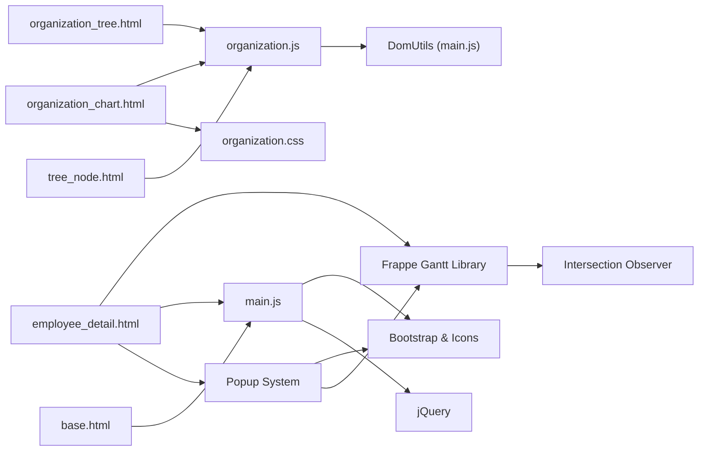

# JavaScript Components and Interactivity

<cite>
**Referenced Files in This Document**
- [main.js](file://static/js/main.js)
- [organization.js](file://static/js/organization.js)
- [organization_chart.html](file://tasks/templates/tasks/organization_chart.html)
- [organization_tree.html](file://tasks/templates/tasks/partials/organization_tree.html)
- [tree_node.html](file://tasks/templates/tasks/partials/tree_node.html)
- [base.html](file://tasks/templates/base.html)
- [organization.css](file://static/css/organization.css)
- [style.css](file://static/css/style.css)
- [employee_detail.html](file://tasks/templates/tasks/employee_detail.html)
</cite>

## Update Summary
**Changes Made**
- Added comprehensive popup system implementation with showProductPopup() and closePopupOnClickOutside() functions
- Enhanced Gantt chart JavaScript components with popup integration for product information display
- Integrated popup functionality with Frappe Gantt click events for enhanced user interaction
- Added popup styling and CSS classes for modal-like product information display
- Implemented click-outside detection for popup closure with proper event handling

## Table of Contents
1. [Introduction](#introduction)
2. [Project Structure](#project-structure)
3. [Core Components](#core-components)
4. [Architecture Overview](#architecture-overview)
5. [Detailed Component Analysis](#detailed-component-analysis)
6. [Gantt Chart Visualization System](#gantt-chart-visualization-system)
7. [Popup System Implementation](#popup-system-implementation)
8. [Dependency Analysis](#dependency-analysis)
9. [Performance Considerations](#performance-considerations)
10. [Troubleshooting Guide](#troubleshooting-guide)
11. [Conclusion](#conclusion)

## Introduction
This document explains the JavaScript components and frontend interactivity for the task manager's organizational structure page and Gantt chart visualization system. It covers the global utilities, DOM manipulation patterns, event handling, AJAX interactions, interactive tree visualization, advanced Gantt chart implementation with Frappe Gantt library, and the newly implemented popup system for product information display. It also documents how jQuery and Bootstrap are integrated, how notifications and error handling work, and how to extend the system with additional components.

## Project Structure
The frontend is organized around multiple JavaScript modules:
- Global utilities and helpers shared across the project
- Organization-specific tree navigation, filtering, and UI controls
- Advanced Gantt chart visualization with Frappe Gantt integration
- Popup system for displaying detailed product information
- Intersection observer-based DOM optimization for dynamic content loading

These scripts integrate with Django templates and Bootstrap to deliver interactive experiences with sophisticated timeline visualization capabilities and enhanced user interaction features.



**Diagram sources**
- [organization_chart.html:1-131](file://tasks/templates/tasks/organization_chart.html#L1-L131)
- [organization_tree.html:1-55](file://tasks/templates/tasks/partials/organization_tree.html#L1-L55)
- [tree_node.html:1-57](file://tasks/templates/tasks/partials/tree_node.html#L1-L57)
- [employee_detail.html:1-1129](file://tasks/templates/tasks/employee_detail.html#L1-L1129)
- [base.html:1-118](file://tasks/templates/base.html#L1-L118)
- [main.js:1-174](file://static/js/main.js#L1-L174)
- [organization.js:1-179](file://static/js/organization.js#L1-L179)
- [organization.css:1-591](file://static/css/organization.css#L1-L591)
- [style.css:1-314](file://static/css/style.css#L1-L314)

**Section sources**
- [organization_chart.html:1-131](file://tasks/templates/tasks/organization_chart.html#L1-L131)
- [organization_tree.html:1-55](file://tasks/templates/tasks/partials/organization_tree.html#L1-L55)
- [tree_node.html:1-57](file://tasks/templates/tasks/partials/tree_node.html#L1-L57)
- [employee_detail.html:1-1129](file://tasks/templates/tasks/employee_detail.html#L1-L1129)
- [base.html:1-118](file://tasks/templates/base.html#L1-L118)
- [main.js:1-174](file://static/js/main.js#L1-L174)
- [organization.js:1-179](file://static/js/organization.js#L1-L179)
- [organization.css:1-591](file://static/css/organization.css#L1-L591)
- [style.css:1-314](file://static/css/style.css#L1-L314)

## Core Components
- Global utilities module (DOM helpers, date utilities, notification system, AJAX helpers)
- Organization tree module (tree navigation, block toggles, staff lists, search/filter)
- Advanced Gantt chart module (timeline visualization, color management, scroll navigation, popup integration)
- Popup system module (product information display, click-outside detection, modal styling)
- Template integrations (organization chart page, tree partials, base layout, employee detail page)

Key responsibilities:
- Provide reusable DOM utilities and cross-page AJAX helpers
- Manage interactive tree expansion/collapse and search
- Coordinate Bootstrap and jQuery integration via the base template
- Deliver user feedback through a centralized notification system
- Implement sophisticated timeline visualization with Frappe Gantt
- Integrate popup system for detailed product information display
- Optimize DOM queries using intersection observers for performance

**Section sources**
- [main.js:6-174](file://static/js/main.js#L6-L174)
- [organization.js:6-179](file://static/js/organization.js#L6-L179)
- [employee_detail.html:928-971](file://tasks/templates/tasks/employee_detail.html#L928-L971)
- [base.html:113-116](file://tasks/templates/base.html#L113-L116)

## Architecture Overview
The system follows a modular pattern with enhanced Gantt chart capabilities and integrated popup system:
- Templates define UI and bind to global JavaScript objects
- Global utilities provide cross-cutting concerns (AJAX, notifications)
- Organization module encapsulates tree-specific logic
- Gantt module handles advanced timeline visualization with Frappe Gantt and popup integration
- Popup module manages product information display with click-outside detection
- Intersection observer optimizes DOM queries for performance
- Styles define responsive layouts, animations, and popup modal appearance



**Diagram sources**
- [organization_chart.html:1-131](file://tasks/templates/tasks/organization_chart.html#L1-L131)
- [organization_tree.html:1-55](file://tasks/templates/tasks/partials/organization_tree.html#L1-L55)
- [tree_node.html:1-57](file://tasks/templates/tasks/partials/tree_node.html#L1-L57)
- [employee_detail.html:1-1129](file://tasks/templates/tasks/employee_detail.html#L1-L1129)
- [main.js:1-174](file://static/js/main.js#L1-L174)
- [organization.js:1-179](file://static/js/organization.js#L1-L179)
- [base.html:113-116](file://tasks/templates/base.html#L113-L116)

## Detailed Component Analysis

### Global Utilities Module (main.js)
Responsibilities:
- DOM helpers: get/query/queryAll, add/remove/toggle classes, show/hide/toggle
- Date utilities: format, diff in days, overdue check
- Notification system: show success/error/warning/info with icons and auto-remove
- AJAX helpers: GET, POST (JSON and FormData), CSRF token extraction

Patterns:
- Encapsulation via IIFE-like globals exported to window
- Centralized error logging and user feedback
- Fetch-based async requests with try/catch and user notifications



**Diagram sources**
- [main.js:6-174](file://static/js/main.js#L6-L174)

**Section sources**
- [main.js:6-174](file://static/js/main.js#L6-L174)

### Organization Tree Module (organization.js)
Responsibilities:
- Tree navigation: expand/collapse per node, expand/collapse all
- Block toggles: show/hide scientific and organizational sections
- Staff lists: reveal department/lab staff
- Search/filter: live search across tree nodes with parent visibility

Patterns:
- Stateful toggling using a Set to track expanded nodes
- DOM queries and style toggling for visibility
- Event-driven initialization on DOMContentLoaded
- Template-driven click handlers invoking module functions



**Diagram sources**
- [organization.js:6-179](file://static/js/organization.js#L6-L179)

**Section sources**
- [organization.js:6-179](file://static/js/organization.js#L6-L179)

### Template Integrations
- Base template loads Bootstrap CSS/JS and jQuery, and injects global main.js
- Organization chart page defines control buttons, search box, and containers for tree sections
- Tree partials render recursive nodes and attach click handlers bound to OrgTree and Staff
- Employee detail page integrates Frappe Gantt for timeline visualization and popup system

Key integration points:
- Control buttons call OrgTree.expandAll()/collapseAll()
- Search input delegates to Search.performSearch()
- Node cards call OrgTree.toggleNode()
- Staff toggles call Staff.showDepartmentStaff()/showLabStaff()
- Gantt chart initialization uses Frappe Gantt library with popup integration
- Popup system displays product information on Gantt bar clicks

**Section sources**
- [base.html:113-116](file://tasks/templates/base.html#L113-L116)
- [organization_chart.html:65-125](file://tasks/templates/tasks/organization_chart.html#L65-L125)
- [organization_tree.html:5-50](file://tasks/templates/tasks/partials/organization_tree.html#L5-L50)
- [tree_node.html:9-47](file://tasks/templates/tasks/partials/tree_node.html#L9-L47)
- [employee_detail.html:730-1129](file://tasks/templates/tasks/employee_detail.html#L730-L1129)

### Event Handling Mechanisms
- DOMContentLoaded initializes Search and hides containers
- Click handlers on UI elements delegate to module functions
- Keyboard events on search input trigger filtering logic
- No explicit event delegation is used; handlers are attached directly to interactive elements
- Intersection observer handles visibility-based DOM optimizations
- Popup system implements click-outside detection for modal behavior
- Gantt chart click events trigger popup display with product information

Best practices observed:
- Keep event handlers minimal and delegate to module functions
- Use template-driven onclick attributes for quick bindings
- Initialize only after DOM is ready
- Implement intersection observer for performance optimization
- Use proper event cleanup to prevent memory leaks

**Section sources**
- [organization.js:157-173](file://static/js/organization.js#L157-L173)
- [organization_chart.html:84-93](file://tasks/templates/tasks/organization_chart.html#L84-L93)
- [employee_detail.html:965-971](file://tasks/templates/tasks/employee_detail.html#L965-L971)
- [employee_detail.html:1064-1072](file://tasks/templates/tasks/employee_detail.html#L1064-L1072)

### AJAX Interactions and CSRF Handling
- Ajax.get/post/postForm provide unified async request patterns
- CSRF token is extracted from cookies and included in headers for POST requests
- Errors are caught and surfaced via Notify.error with console logging

Common usage patterns:
- Load dynamic content via GET
- Submit forms via POST (JSON) or FormData
- Handle errors gracefully with user-visible notifications

**Section sources**
- [main.js:89-135](file://static/js/main.js#L89-L135)
- [main.js:138-151](file://static/js/main.js#L138-L151)

### DOM Manipulation Patterns
- Use DomUtils for consistent DOM queries and manipulations
- Toggle visibility by setting display styles
- Add/remove CSS classes for state changes
- Append notifications to a dedicated container
- Optimize DOM queries using querySelectorAll with intersection observer
- Implement modal-like popup behavior with proper z-index management

**Section sources**
- [main.js:6-29](file://static/js/main.js#L6-L29)
- [organization.js:10-27](file://static/js/organization.js#L10-L27)
- [employee_detail.html:843-880](file://tasks/templates/tasks/employee_detail.html#L843-L880)

### Interactive Filtering System
- Live search filters tree nodes by name
- Minimum input length threshold prevents premature filtering
- Parent nodes are revealed when a child matches the search term
- Clearing the input restores all nodes



**Diagram sources**
- [organization.js:111-154](file://static/js/organization.js#L111-L154)

**Section sources**
- [organization.js:111-154](file://static/js/organization.js#L111-L154)

### Organization Chart Visualization
- Two-level tree rendering with connecting lines and animated transitions
- Responsive grid layouts for leadership cards and staff lists
- Control buttons switch views and manage expansion state
- Icons from Bootstrap Icons enhance visual cues

**Section sources**
- [organization.css:6-591](file://static/css/organization.css#L6-L591)
- [organization_chart.html:10-126](file://tasks/templates/tasks/organization_chart.html#L10-L126)

### jQuery and Bootstrap Integration
- Bootstrap CSS/JS and Bootstrap Icons are loaded globally
- jQuery is included for compatibility and potential third-party plugins
- Notifications leverage Bootstrap alert classes and icons
- Popup system uses Bootstrap-inspired styling with custom modal behavior

**Section sources**
- [base.html:10-23](file://tasks/templates/base.html#L10-L23)
- [base.html:113-116](file://tasks/templates/base.html#L113-L116)
- [main.js:61-86](file://static/js/main.js#L61-L86)

## Gantt Chart Visualization System

**Updated** Enhanced with comprehensive Frappe Gantt integration, intersection observer optimization, popup system integration, and advanced timeline features

The Gantt chart system provides sophisticated timeline visualization for research projects and tasks with the following capabilities:

### Core Features
- **Timeline Visualization**: Interactive Gantt charts using Frappe Gantt library
- **Dynamic Color Application**: Automatic color assignment to project bars
- **Closest Task Highlighting**: Special styling for currently relevant tasks
- **Scroll Navigation**: Automatic positioning to today's date
- **Responsive Design**: Adaptive timeline that works across different screen sizes
- **View Mode Switching**: Multiple timeline perspectives (Day, Week, Month)
- **Popup Integration**: Detailed product information display on task click
- **Enhanced User Interaction**: Custom tooltips and modal-like popup behavior

### Implementation Details

#### Frappe Gantt Integration
The system integrates with the Frappe Gantt library for professional timeline visualization:

```javascript
// Initialize Gantt chart with enhanced configuration
currentGantt = new Gantt("#ganttChartContainer", tasks, {
    on_click: function(task) { 
        const productName = task.name.replace(/^\[\d+\.\d+\]\s*/, '');
        const product = GANTT_DATA.find(p => p.name === productName || p.name.includes(productName));
        if (product) {
            showProductPopup(product);
        }
        return false; // Prevent default tooltip
    },
    on_hover: function() {
        return false; // Disable default hover tooltip
    },
    bar_height: 45,
    bar_corner_radius: 4,
    padding: 25,
    view_mode: currentViewMode,
    date_format: 'YYYY-MM-DD',
    language: 'ru',
    popup_trigger: 'click' // Disable auto popup
});
```

#### Scroll to Today Functionality
The `scrollToToday()` function automatically positions the timeline to the current date:

```javascript
function scrollToToday() {
    if (!currentGantt) return;
    
    const ganttContainer = document.querySelector('#ganttChartContainer .gantt');
    if (!ganttContainer) return;
    
    const todayLine = document.querySelector('.gantt .today-line, .gantt .current-date-line');
    if (todayLine) {
        const x = parseFloat(todayLine.getAttribute('x1') || todayLine.getAttribute('x'));
        if (!isNaN(x)) {
            const container = document.getElementById('ganttChartContainer');
            const containerWidth = container.clientWidth;
            container.scrollLeft = Math.max(0, x - containerWidth / 2);
        }
    }
}
```

#### Intersection Observer Optimization
Advanced DOM optimization using intersection observer for performance:

```javascript
let ganttObserver = null;
function setupVisibilityObserver() {
    const container = document.getElementById('ganttChartContainer');
    if (!container || ganttObserver) return;
    
    ganttObserver = new IntersectionObserver((entries) => {
        entries.forEach(entry => {
            if (entry.isIntersecting) {
                // Re-apply colors when Gantt becomes visible
                setTimeout(applyColors, 50);
            }
        });
    }, { threshold: 0.1 });
    
    ganttObserver.observe(container);
}
```

#### Enhanced Bar Group Styling
Improved styling system with the `bar-closest-group` class for highlighting relevant tasks:

```css
/* Red highlight for closest products - only target the bar rect, not the wrapper */
.gantt .bar-closest .bar,
.gantt .bar-group.bar-closest-group .bar {
    stroke: #ff0000 !important;
    stroke-width: 4px !important;
}

/* Highlighted (closest) bars have bold black text */
.gantt .bar-group:has(.bar-closest) .bar-label,
.gantt .bar-closest-group .bar-label,
.gantt .bar-group.bar-closest-group .bar-label {
    fill: #000 !important;
    font-weight: 700 !important;
}
```

#### Dynamic Color Management
Smart color assignment and re-application system:

```javascript
function applyColors() {
    if (!GANTT_DATA || GANTT_DATA.length === 0) return;
    
    const barGroups = document.querySelectorAll('.gantt .bar-group');
    
    barGroups.forEach((group, index) => {
        const bar = group.querySelector('.bar');
        const label = group.querySelector('.bar-label');
        
        const task = GANTT_DATA[index];
        if (!task || !bar) return;
        
        // Apply red highlight for closest product
        if (task.is_closest) {
            bar.setAttribute('fill', '#dc3545');
            bar.style.fill = '#dc3545';
            group.classList.add('bar-closest-group');
        } else if (task.color) {
            bar.setAttribute('fill', task.color);
            bar.style.fill = task.color;
        }
    });
}
```

### Advanced Event Handling
The system implements sophisticated event handling for optimal user experience:

```javascript
// Initialize on page load with intersection observer
document.addEventListener('DOMContentLoaded', function() {
    console.log('Initializing Gantt with data:', GANTT_DATA);
    initGantt();
    setupVisibilityObserver();
    
    // Re-apply colors on scroll (for when Gantt re-enters viewport)
    let scrollTimeout;
    window.addEventListener('scroll', function() {
        clearTimeout(scrollTimeout);
        scrollTimeout = setTimeout(function() {
            applyColors();
        }, 100);
    });
});
```

### Template Integration
The Gantt system is integrated into the employee detail template with comprehensive styling and functionality:

```html
<!-- Frappe Gantt CDN -->
<link rel="stylesheet" href="https://cdn.jsdelivr.net/npm/frappe-gantt/dist/frappe-gantt.css">
<script src="https://cdn.jsdelivr.net/npm/frappe-gantt/dist/frappe-gantt.umd.js"></script>

<div id="ganttChartContainer" class="gantt-container"></div>
```

**Section sources**
- [employee_detail.html:730-1129](file://tasks/templates/tasks/employee_detail.html#L730-L1129)
- [employee_detail.html:799-835](file://tasks/templates/tasks/employee_detail.html#L799-L835)
- [employee_detail.html:902-1094](file://tasks/templates/tasks/employee_detail.html#L902-L1094)

## Popup System Implementation

**New** Comprehensive popup system for displaying detailed product information with modal-like behavior

The popup system provides an enhanced user experience for displaying detailed information about research products and tasks:

### Core Features
- **Modal-like Display**: Centered popup with shadow and rounded corners
- **Structured Information**: Organized product details with labels and values
- **Click-outside Detection**: Automatic popup closure when clicking outside content
- **Event Cleanup**: Proper event listener management to prevent memory leaks
- **Responsive Design**: Adapts to different screen sizes and content lengths
- **Integration with Gantt**: Triggered by Gantt bar clicks for seamless workflow

### Implementation Details

#### Popup Display Function
The `showProductPopup()` function creates and displays the popup with product information:

```javascript
function showProductPopup(product) {
    const popup = document.getElementById('ganttPopup');
    const popupContent = document.getElementById('ganttPopupContent');
        
    if (!popup || !popupContent) return;
    
    let html = `<div class="popup-product-name">${product.name}</div>`;
    
    if (product.substage_number && product.substage_title) {
        html += `<div class="popup-row"><span class="popup-label">Подэтап:</span> <span class="popup-value">${product.substage_number} - ${product.substage_title}</span></div>`;
    }
    
    if (product.stage_number && product.stage_name) {
        html += `<div class="popup-row"><span class="popup-label">Этап:</span> <span class="popup-value">${product.stage_number} - ${product.stage_name}</span></div>`;
    }
    
    if (product.research_task_title) {
        html += `<div class="popup-row"><span class="popup-label">НИР:</span> <span class="popup-value">${product.research_task_title}</span></div>`;
    }
    
    html += `<div class="popup-row"><span class="popup-label">Период:</span> <span class="popup-value">${product.start} — ${product.end}</span></div>`;
    
    if (product.days_to_end !== undefined) {
        const daysText = product.days_to_end === 0 ? 'сегодня' : `${product.days_to_end} дн.`;
        html += `<div class="popup-row"><span class="popup-label">До окончания:</span> <span class="popup-value">${daysText}</span></div>`;
    }
    
    popupContent.innerHTML = html;
    popup.style.display = 'block';
    
    // Close on click outside
    setTimeout(() => {
        document.addEventListener('click', closePopupOnClickOutside);
    }, 10);
}
```

#### Click-outside Detection
The `closePopupOnClickOutside()` function handles popup closure when clicking outside the popup content:

```javascript
function closePopupOnClickOutside(e) {
    const popup = document.getElementById('ganttPopup');
    if (!popup.contains(e.target)) {
        popup.style.display = 'none';
        document.removeEventListener('click', closePopupOnClickOutside);
    }
}
```

#### Popup Styling and Structure
The popup system uses Bootstrap-inspired styling with custom modal behavior:

```css
/* Product popup styles */
#ganttPopup {
    display: none;
    position: fixed;
    top: 50%;
    left: 50%;
    transform: translate(-50%, -50%);
    background: white;
    border-radius: 8px;
    box-shadow: 0 4px 20px rgba(0,0,0,0.25);
    z-index: 10000;
    min-width: 350px;
    max-width: 500px;
}
#ganttPopupContent {
    padding: 20px;
}
.popup-product-name {
    font-size: 16px;
    font-weight: 600;
    color: #333;
    margin-bottom: 15px;
    padding-bottom: 10px;
    border-bottom: 2px solid #0d6efd;
}
.popup-row {
    display: flex;
    margin-bottom: 8px;
}
.popup-label {
    font-weight: 500;
    color: #666;
    min-width: 110px;
}
.popup-value {
    color: #333;
}
```

#### Integration with Gantt Events
The popup system integrates seamlessly with Gantt chart click events:

```javascript
on_click: function(task) {
    const productName = task.name.replace(/^\[\d+\.\d+\]\s*/, '');
    const product = GANTT_DATA.find(p => p.name === productName || p.name.includes(productName));
    if (product) {
        showProductPopup(product);
    }
    return false; // Prevent default tooltip
}
```

### Advanced Event Handling
The popup system implements sophisticated event handling for optimal user experience:

```javascript
// Initialize popup system with proper event management
document.addEventListener('DOMContentLoaded', function() {
    // Popup initialization and event setup
    setupPopupEvents();
    
    // Ensure proper cleanup on page unload
    window.addEventListener('beforeunload', function() {
        const popup = document.getElementById('ganttPopup');
        if (popup) {
            popup.style.display = 'none';
        }
        document.removeEventListener('click', closePopupOnClickOutside);
    });
});
```

### Template Integration
The popup system is integrated into the employee detail template with proper HTML structure:

```html
<!-- Popup container -->
<div id="ganttPopup">
    <div id="ganttPopupContent"></div>
</div>
```

**Section sources**
- [employee_detail.html:928-971](file://tasks/templates/tasks/employee_detail.html#L928-L971)
- [employee_detail.html:843-880](file://tasks/templates/tasks/employee_detail.html#L843-L880)
- [employee_detail.html:1064-1072](file://tasks/templates/tasks/employee_detail.html#L1064-L1072)

## Dependency Analysis
- Templates depend on organization.js and main.js for interactivity
- organization.js depends on DomUtils for DOM operations
- main.js provides Ajax and Notify used across pages
- employee_detail.html depends on Frappe Gantt library for timeline visualization
- employee_detail.html includes popup system for product information display
- Stylesheets define responsive behavior, animations, and popup modal appearance
- Intersection observer optimizes DOM query performance
- Popup system depends on Gantt chart data and event handling



**Diagram sources**
- [base.html:10-23](file://tasks/templates/base.html#L10-L23)
- [organization_chart.html:1-131](file://tasks/templates/tasks/organization_chart.html#L1-L131)
- [organization_tree.html:1-55](file://tasks/templates/tasks/partials/organization_tree.html#L1-L55)
- [tree_node.html:1-57](file://tasks/templates/tasks/partials/tree_node.html#L1-L57)
- [employee_detail.html:1-1129](file://tasks/templates/tasks/employee_detail.html#L1-L1129)
- [main.js:1-174](file://static/js/main.js#L1-L174)
- [organization.js:1-179](file://static/js/organization.js#L1-L179)
- [organization.css:1-591](file://static/css/organization.css#L1-L591)

**Section sources**
- [base.html:10-23](file://tasks/templates/base.html#L10-L23)
- [organization_chart.html:1-131](file://tasks/templates/tasks/organization_chart.html#L1-L131)
- [organization_tree.html:1-55](file://tasks/templates/tasks/partials/organization_tree.html#L1-L55)
- [tree_node.html:1-57](file://tasks/templates/tasks/partials/tree_node.html#L1-L57)
- [employee_detail.html:1-1129](file://tasks/templates/tasks/employee_detail.html#L1-L1129)
- [main.js:1-174](file://static/js/main.js#L1-L174)
- [organization.js:1-179](file://static/js/organization.js#L1-L179)
- [organization.css:1-591](file://static/css/organization.css#L1-L591)

## Performance Considerations
- Minimize DOM queries by caching selectors when reused frequently
- Batch DOM updates (e.g., toggling multiple icons) to reduce reflows
- Debounce search input if performance becomes an issue with large trees
- Prefer CSS transitions/animations over heavy JavaScript animations
- Use efficient selectors (IDs over class queries) where possible
- **Intersection observer optimization**: Use intersection observer to defer DOM operations until elements become visible
- **Scroll-based optimization**: Re-apply colors only when Gantt chart re-enters viewport
- **Query optimization**: Cache DOM queries and reuse them across functions
- **Event cleanup**: Properly remove event listeners to prevent memory leaks in popup system
- **Popup optimization**: Use setTimeout for delayed event attachment to prevent immediate click handling

## Troubleshooting Guide
Common issues and resolutions:
- Notifications not appearing: ensure the alerts container exists and is appended to the body during initialization
- AJAX failures: verify CSRF token retrieval and header inclusion; check browser network tab for 403/404 errors
- Tree nodes not expanding: confirm element IDs match the expected pattern and that icons are updated
- Search not working: ensure the search input has the correct ID and that event listeners are attached after DOMContentLoaded
- **Gantt chart not displaying**: verify Frappe Gantt library is loaded and GANTT_DATA contains valid task objects
- **Scroll to today not working**: ensure today's line element exists in the Gantt chart DOM
- **Color application failing**: check that bar groups have the correct structure and task data matches indices
- **Intersection observer not triggering**: verify container element exists and observer is properly configured
- **Popup not appearing**: ensure popup elements exist in the DOM and have correct IDs
- **Popup not closing**: verify click-outside detection is properly attached and event listeners are cleaned up
- **Popup content empty**: check that product data is properly formatted and accessible in GANTT_DATA

**Section sources**
- [main.js:154-168](file://static/js/main.js#L154-L168)
- [main.js:138-151](file://static/js/main.js#L138-L151)
- [organization.js:157-173](file://static/js/organization.js#L157-L173)
- [employee_detail.html:928-971](file://tasks/templates/tasks/employee_detail.html#L928-L971)
- [employee_detail.html:1064-1072](file://tasks/templates/tasks/employee_detail.html#L1064-L1072)

## Conclusion
The JavaScript components provide a clean separation of concerns with enhanced Gantt chart capabilities and integrated popup system: global utilities handle cross-cutting needs, while the organization module encapsulates tree-specific behavior. The new Gantt chart system delivers sophisticated timeline visualization using Frappe Gantt with advanced features like intersection observer optimization, dynamic color application, automatic scroll positioning, and popup integration for detailed product information display. The popup system provides modal-like behavior for displaying structured product information with proper click-outside detection and event cleanup. The integration with Django templates and Bootstrap delivers a responsive, interactive experience with professional timeline visualization and enhanced user interaction capabilities. Extending the system involves adding new modules alongside existing patterns, leveraging the global utilities for AJAX and notifications, following the established DOM manipulation and event handling conventions, utilizing the intersection observer pattern for performance optimization, and implementing proper event cleanup for popup systems.