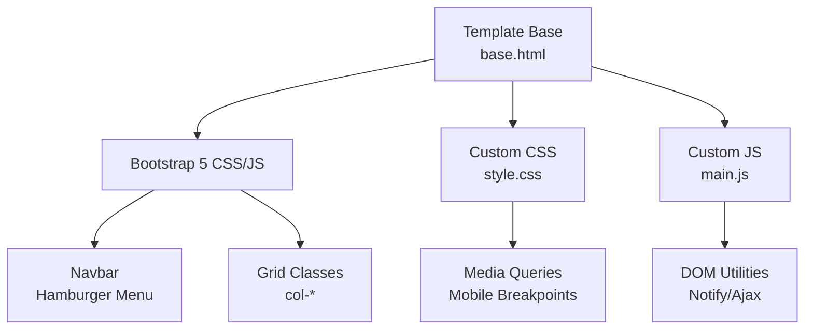
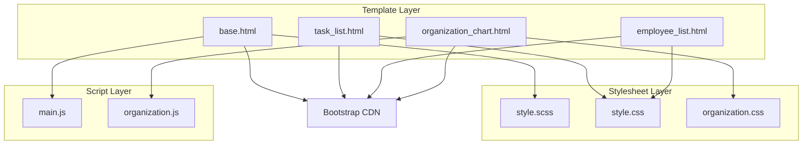
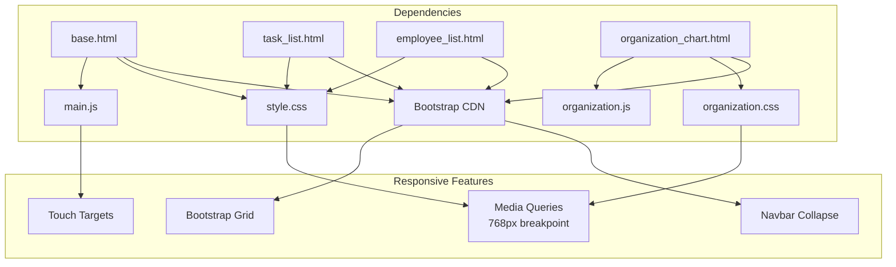

# Responsive Design and Mobile Compatibility

<cite>
**Referenced Files in This Document**
- [base.html](file://tasks/templates/base.html)
- [style.css](file://static/css/style.css)
- [style.scss](file://static/css/style.scss)
- [main.js](file://static/js/main.js)
- [task_list.html](file://tasks/templates/tasks/task_list.html)
- [employee_list.html](file://tasks/templates/tasks/employee_list.html)
- [organization_chart.html](file://tasks/templates/tasks/organization_chart.html)
- [organization.css](file://static/css/organization.css)
- [organization.js](file://static/js/organization.js)
- [responsive.css](file://staticfiles/admin/css/responsive.css)
- [nav_sidebar.css](file://staticfiles/admin/css/nav_sidebar.css)
</cite>

## Table of Contents
1. [Introduction](#introduction)
2. [Project Structure](#project-structure)
3. [Core Components](#core-components)
4. [Architecture Overview](#architecture-overview)
5. [Detailed Component Analysis](#detailed-component-analysis)
6. [Dependency Analysis](#dependency-analysis)
7. [Performance Considerations](#performance-considerations)
8. [Testing Strategies](#testing-strategies)
9. [Troubleshooting Guide](#troubleshooting-guide)
10. [Conclusion](#conclusion)

## Introduction
This document provides comprehensive guidance for responsive design implementation and mobile compatibility across the Task Manager application. It explains how Bootstrap grid classes, breakpoint configurations, and mobile-first design principles are applied, along with adaptive layouts, flexible components, and touch-friendly interface elements. It also covers mobile navigation patterns (hamburger menus), responsive typography, viewport configuration, meta tags setup, device-specific optimizations, testing strategies for various screen sizes, cross-browser compatibility, and performance considerations for mobile devices.

## Project Structure
The responsive design relies on:
- Bootstrap 5 integration via CDN for grid and navigation components
- Custom CSS with mobile-first media queries
- JavaScript utilities for DOM manipulation and notifications
- Template-level Bootstrap classes for responsive grids and navigation

**Diagram sources**
- [base.html:10-23](file://tasks/templates/base.html#L10-L23)
- [style.css:239-256](file://static/css/style.css#L239-L256)
- [main.js:154-174](file://static/js/main.js#L154-L174)

**Section sources**
- [base.html:10-23](file://tasks/templates/base.html#L10-L23)
- [style.css:239-256](file://static/css/style.css#L239-L256)
- [main.js:154-174](file://static/js/main.js#L154-L174)

## Core Components
- Viewport meta tag configured for responsive scaling
- Bootstrap navbar with collapsible navigation for mobile
- Custom grid system with flex utilities and spacing variables
- Media queries targeting tablet and mobile breakpoints
- JavaScript utilities for notifications and AJAX requests

Key implementation references:
- Viewport configuration and Bootstrap integration in the base template
- Custom grid and responsive typography in the stylesheet
- Mobile-first media queries for layout adjustments
- JavaScript initialization and notification system

**Section sources**
- [base.html:6-12](file://tasks/templates/base.html#L6-L12)
- [base.html:27-92](file://tasks/templates/base.html#L27-L92)
- [style.css:185-256](file://static/css/style.css#L185-L256)
- [main.js:154-174](file://static/js/main.js#L154-L174)

## Architecture Overview
The responsive architecture combines:
- Template layer: Bootstrap classes for grid and navigation
- Stylesheet layer: Custom CSS with mobile-first media queries
- Script layer: Utility functions for DOM manipulation and notifications

**Diagram sources**
- [base.html:10-23](file://tasks/templates/base.html#L10-L23)
- [task_list.html:20-69](file://tasks/templates/tasks/task_list.html#L20-L69)
- [employee_list.html:39-71](file://tasks/templates/tasks/employee_list.html#L39-L71)
- [organization_chart.html:6-8](file://tasks/templates/tasks/organization_chart.html#L6-L8)
- [style.scss:90-95](file://static/css/style.scss#L90-L95)
- [style.css:185-256](file://static/css/style.css#L185-L256)
- [organization.css:558-591](file://static/css/organization.css#L558-L591)
- [main.js:154-174](file://static/js/main.js#L154-L174)
- [organization.js:156-179](file://static/js/organization.js#L156-L179)

## Detailed Component Analysis

### Bootstrap Grid System and Navigation
- The base template integrates Bootstrap CSS and JS from CDN and uses Bootstrap navbar classes for responsive navigation.
- The navbar toggler controls a collapsible navigation menu on smaller screens.
- Grid classes are used extensively in templates to adapt content layout across breakpoints.

Responsive navigation behavior:
- Desktop: Full horizontal navigation bar with dropdown menus
- Mobile: Collapsible hamburger menu activated via Bootstrap data attributes

**Section sources**
- [base.html:27-92](file://tasks/templates/base.html#L27-L92)
- [task_list.html:20-69](file://tasks/templates/tasks/task_list.html#L20-L69)
- [employee_list.html:39-71](file://tasks/templates/tasks/employee_list.html#L39-L71)

### Breakpoint Configurations and Mobile-First Principles
- Custom styles define a primary mobile breakpoint at 768px for layout adjustments.
- Typography scales down on smaller screens for improved readability.
- Container padding is reduced on mobile to maximize content area.

Mobile-first adjustments:
- Column layout switches to vertical stacking on small screens
- Reduced container padding for better mobile usability
- Typography scaling for headings

**Section sources**
- [style.css:239-256](file://static/css/style.css#L239-L256)
- [style.scss:90-95](file://static/css/style.scss#L90-L95)

### Adaptive Layouts and Flexible Components
- Task list and employee list pages use Bootstrap grid classes to arrange cards and forms responsively.
- Organization chart page includes dedicated responsive styles for tree layouts and control buttons.
- Cards and forms adapt their spacing and alignment based on screen size.

Adaptive components:
- Card grids adjust column counts per breakpoint
- Forms use grid utilities for stacked layouts on small screens
- Organization tree adapts node layouts and spacing for mobile

**Section sources**
- [task_list.html:104-184](file://tasks/templates/tasks/task_list.html#L104-L184)
- [employee_list.html:74-133](file://tasks/templates/tasks/employee_list.html#L74-L133)
- [organization_chart.html:10-81](file://tasks/templates/tasks/organization_chart.html#L10-L81)
- [organization.css:558-591](file://static/css/organization.css#L558-L591)

### Touch-Friendly Interface Elements
- Bootstrap buttons and form controls are optimized for touch interaction.
- Notification system provides feedback for user actions.
- Organization chart includes interactive controls with visual feedback.

Touch optimizations:
- Large tap targets for buttons and controls
- Visual feedback for hover and focus states
- Clear affordances for interactive elements

**Section sources**
- [main.js:61-86](file://static/js/main.js#L61-L86)
- [organization.js:108-154](file://static/js/organization.js#L108-L154)

### Mobile Navigation Patterns and Hamburger Menu
- Navbar toggler uses Bootstrap classes and data attributes to control collapse behavior.
- Navigation items are organized into collapsible groups for efficient mobile use.
- Dropdown menus provide access to secondary navigation items.

Navigation pattern:
- Hamburger icon triggers collapse/expand of navigation items
- Dropdown menus adapt to mobile screen real estate
- Clear visual hierarchy for primary and secondary navigation

**Section sources**
- [base.html:32-34](file://tasks/templates/base.html#L32-L34)
- [base.html:35-90](file://tasks/templates/base.html#L35-L90)

### Responsive Typography
- Headings scale appropriately across breakpoints to maintain readability.
- Body text and form elements use relative units for consistent sizing.
- Custom CSS variables provide consistent spacing and sizing tokens.

Typography adaptations:
- Heading sizes decrease at smaller breakpoints
- Reduced line heights and margins for compact layouts
- Consistent font stack for cross-platform compatibility

**Section sources**
- [style.css:50-62](file://static/css/style.css#L50-L62)
- [style.scss:43-53](file://static/css/style.scss#L43-L53)

### Viewport Configuration and Meta Tags
- The viewport meta tag ensures proper scaling and rendering on mobile devices.
- Initial scale and width settings provide optimal mobile presentation.

Viewport setup:
- Width=device-width for accurate device pixel ratio handling
- Initial-scale=1.0 for consistent zoom behavior
- Ensures proper touch interaction and layout scaling

**Section sources**
- [base.html:7](file://tasks/templates/base.html#L7)

### Device-Specific Optimizations
- Organization chart includes specialized responsive styles for tree layouts.
- Admin interface includes separate responsive styles for sidebar and navigation.
- Custom CSS provides targeted adjustments for different device categories.

Device optimizations:
- Tree layout adjustments for mobile screen constraints
- Sidebar behavior changes below specific breakpoints
- Control button layouts that adapt to available space

**Section sources**
- [organization.css:558-591](file://static/css/organization.css#L558-L591)
- [responsive.css:1-93](file://staticfiles/admin/css/responsive.css#L1-L93)
- [nav_sidebar.css:119-128](file://staticfiles/admin/css/nav_sidebar.css#L119-L128)

### Testing Strategies for Different Screen Sizes
Recommended testing approaches:
- Test breakpoint transitions around 768px for layout shifts
- Verify navigation collapse behavior on mobile devices
- Check form field sizing and touch target accessibility
- Validate card grid responsiveness across device widths
- Test organization chart interactivity on touch devices

Testing considerations:
- Cross-device browser testing for consistent behavior
- Performance validation on lower-powered mobile devices
- Accessibility testing for screen reader compatibility
- Touch gesture validation for interactive elements

### Cross-Browser Compatibility
- Bootstrap 5 provides baseline cross-browser support
- Custom CSS uses widely supported properties and media queries
- JavaScript utilities avoid modern API dependencies where possible

Compatibility measures:
- Vendor prefixes for advanced CSS features
- Fallbacks for unsupported CSS properties
- Progressive enhancement for JavaScript-dependent features

### Performance Considerations for Mobile Devices
- Minimize CSS and JavaScript payload for mobile networks
- Optimize images and reduce HTTP requests
- Use efficient media queries and CSS selectors
- Leverage browser caching for static assets

Performance optimizations:
- Compress and combine CSS/JS where appropriate
- Use efficient grid layouts to reduce reflows
- Minimize DOM manipulation during user interactions
- Implement lazy loading for non-critical resources

## Dependency Analysis
The responsive design depends on coordinated interactions between templates, stylesheets, and scripts.

**Diagram sources**
- [base.html:10-23](file://tasks/templates/base.html#L10-L23)
- [style.css:239-256](file://static/css/style.css#L239-L256)
- [organization.css:558-591](file://static/css/organization.css#L558-L591)
- [organization.js:156-179](file://static/js/organization.js#L156-L179)

**Section sources**
- [base.html:10-23](file://tasks/templates/base.html#L10-L23)
- [style.css:239-256](file://static/css/style.css#L239-L256)
- [organization.css:558-591](file://static/css/organization.css#L558-L591)
- [organization.js:156-179](file://static/js/organization.js#L156-L179)

## Performance Considerations
- Minimize CSS and JavaScript payload for mobile networks
- Optimize images and reduce HTTP requests
- Use efficient media queries and CSS selectors
- Leverage browser caching for static assets

Performance optimizations:
- Compress and combine CSS/JS where appropriate
- Use efficient grid layouts to reduce reflows
- Minimize DOM manipulation during user interactions
- Implement lazy loading for non-critical resources

## Testing Strategies
Recommended testing approaches:
- Test breakpoint transitions around 768px for layout shifts
- Verify navigation collapse behavior on mobile devices
- Check form field sizing and touch target accessibility
- Validate card grid responsiveness across device widths
- Test organization chart interactivity on touch devices

Testing considerations:
- Cross-device browser testing for consistent behavior
- Performance validation on lower-powered mobile devices
- Accessibility testing for screen reader compatibility
- Touch gesture validation for interactive elements

## Troubleshooting Guide
Common responsive design issues and solutions:
- Layout breaks at specific breakpoints: Review media query ordering and specificity
- Navigation not collapsing on mobile: Verify Bootstrap data attributes and JavaScript initialization
- Touch targets too small: Increase button and form control sizes using Bootstrap utilities
- Content overflow on small screens: Adjust container padding and margin utilities

Troubleshooting steps:
- Inspect computed styles for conflicting media queries
- Validate Bootstrap class combinations for intended behavior
- Test with browser developer tools device emulation
- Check for JavaScript errors affecting responsive behavior

**Section sources**
- [base.html:32-34](file://tasks/templates/base.html#L32-L34)
- [style.css:239-256](file://static/css/style.css#L239-L256)
- [main.js:154-174](file://static/js/main.js#L154-L174)

## Conclusion
The Task Manager application implements a robust responsive design using Bootstrap 5 for foundational components and custom CSS for device-specific adaptations. The mobile-first approach ensures optimal performance and usability across devices, with careful attention to navigation patterns, typography, and touch interactions. The combination of Bootstrap's grid system, media queries, and JavaScript utilities creates a cohesive responsive experience that scales effectively from desktop to mobile devices.