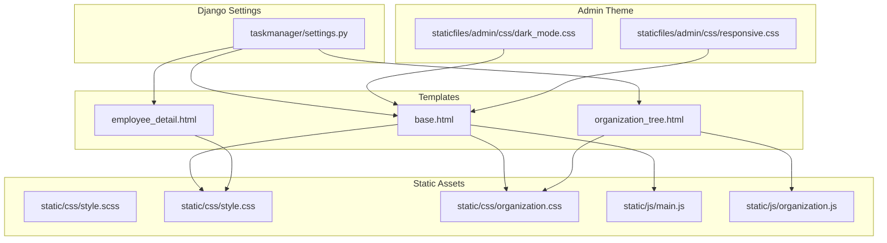
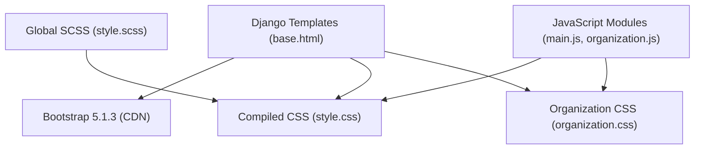
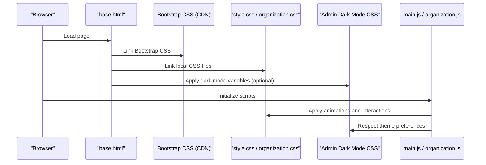
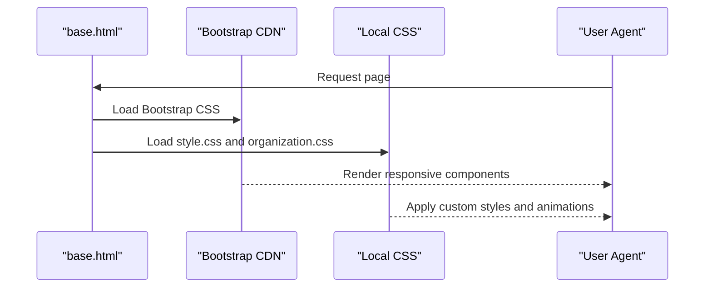
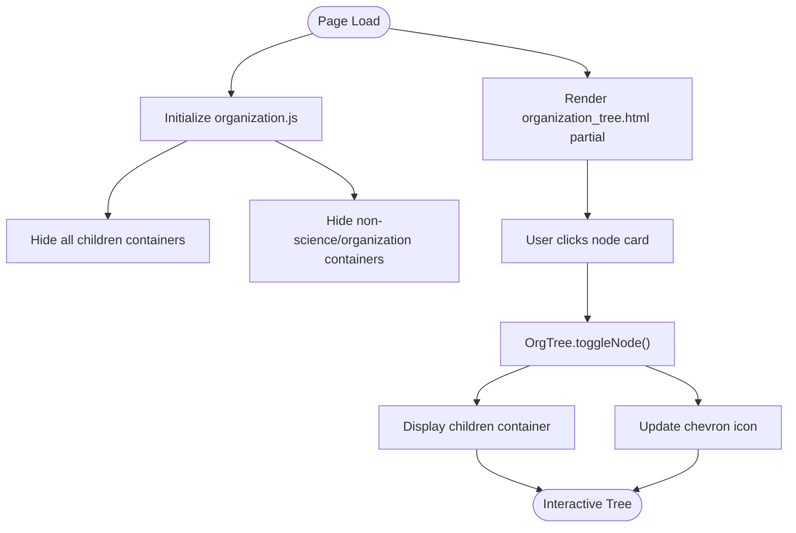
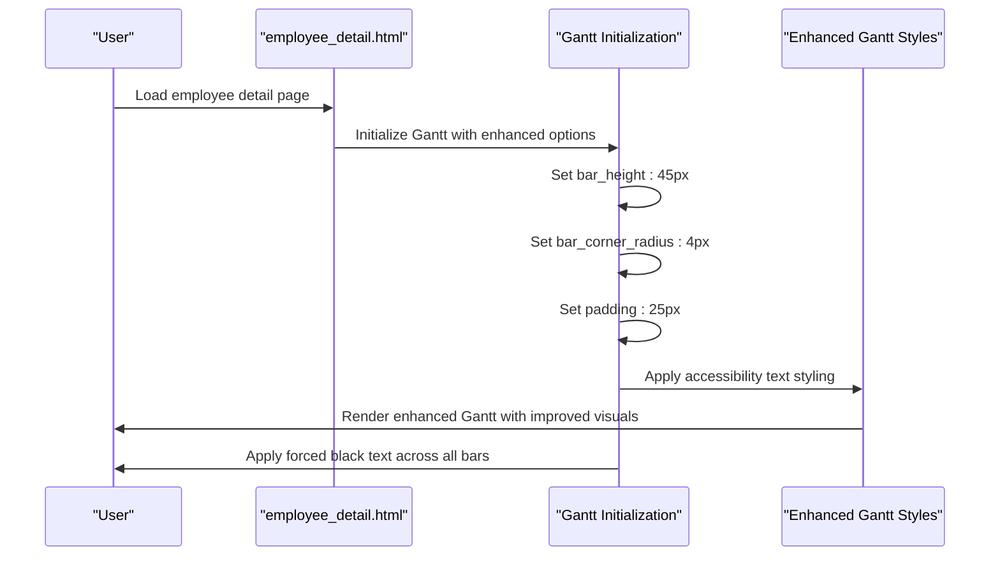
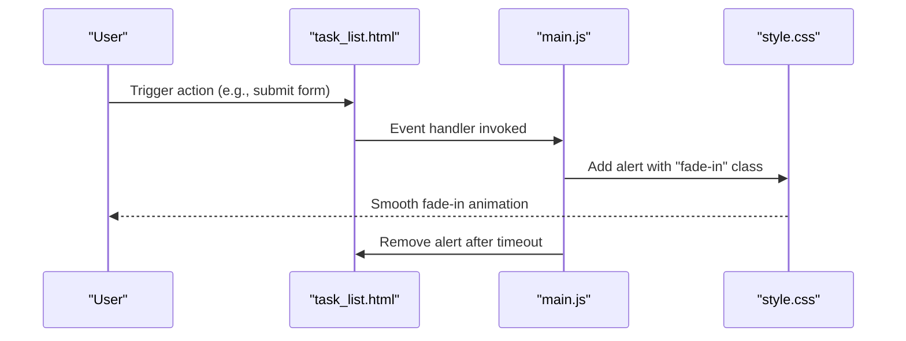
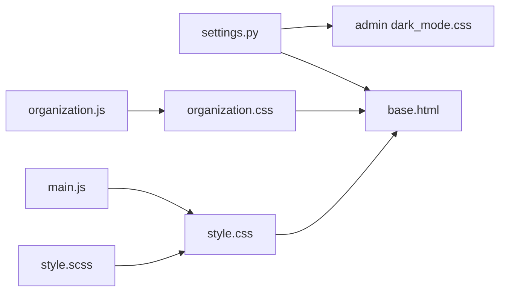

# Styling System and CSS Architecture

<cite>
**Referenced Files in This Document**
- [style.scss](file://static/css/style.scss)
- [style.css](file://static/css/style.css)
- [organization.css](file://static/css/organization.css)
- [base.html](file://tasks/templates/base.html)
- [settings.py](file://taskmanager/settings.py)
- [main.js](file://static/js/main.js)
- [organization.js](file://static/js/organization.js)
- [employee_detail.html](file://tasks/templates/tasks/employee_detail.html)
- [organization_tree.html](file://tasks/templates/tasks/partials/organization_tree.html)
- [dark_mode.css](file://staticfiles/admin/css/dark_mode.css)
- [responsive.css](file://staticfiles/admin/css/responsive.css)
</cite>

## Update Summary
**Changes Made**
- Updated Gantt chart styling section to reflect enhanced visual improvements
- Added documentation for increased bar height (35px to 45px), better corner radius (3px to 4px), expanded padding (18px to 25px)
- Documented forced black text color implementation for accessibility improvements
- Updated JavaScript implementation details for Gantt chart enhancements

## Table of Contents
1. [Introduction](#introduction)
2. [Project Structure](#project-structure)
3. [Core Components](#core-components)
4. [Architecture Overview](#architecture-overview)
5. [Detailed Component Analysis](#detailed-component-analysis)
6. [Dependency Analysis](#dependency-analysis)
7. [Performance Considerations](#performance-considerations)
8. [Troubleshooting Guide](#troubleshooting-guide)
9. [Conclusion](#conclusion)

## Introduction
This document describes the styling system and CSS architecture of the task manager application. It covers Bootstrap 5.1.3 integration, custom CSS overrides, SCSS compilation process, CSS file organization, responsive design principles, and component-specific styling patterns for task management UI, organization charts, and interactive components. It also documents CSS variables usage, theme customization options, utility classes, and animations.

## Project Structure
The styling system is organized around:
- Global SCSS source files under `static/css/` that compile to CSS
- Local CSS overrides for task management and organization chart pages
- Bootstrap 5.1.3 integration via CDN in templates
- JavaScript modules that interact with styles and animate UI elements
- Django static files collection and admin CSS for theming

**Diagram sources**
- [base.html:1-118](file://tasks/templates/base.html#L1-L118)
- [style.scss:1-95](file://static/css/style.scss#L1-L95)
- [style.css:1-314](file://static/css/style.css#L1-L314)
- [organization.css:1-591](file://static/css/organization.css#L1-L591)
- [main.js:1-174](file://static/js/main.js#L1-L174)
- [organization.js:1-179](file://static/js/organization.js#L1-L179)
- [settings.py:147-151](file://taskmanager/settings.py#L147-L151)
- [dark_mode.css:1-96](file://staticfiles/admin/css/dark_mode.css#L1-L96)
- [responsive.css:1-93](file://staticfiles/admin/css/responsive.css#L1-L93)

**Section sources**
- [base.html:1-118](file://tasks/templates/base.html#L1-L118)
- [settings.py:147-151](file://taskmanager/settings.py#L147-L151)

## Core Components
- Bootstrap 5.1.3 integration via CDN for layout utilities, components, and icons
- Global SCSS source (`style.scss`) defining CSS custom properties and base styles
- Compiled CSS (`style.css`) providing typography, buttons, cards, forms, alerts, grid, utilities, animations, and responsive breakpoints
- Organization chart CSS (`organization.css`) implementing hierarchical tree visuals, gradients, shadows, and animations
- Template-level integration loading Bootstrap CSS and local CSS files
- JavaScript modules enhancing interactivity and applying animations

Key integration points:
- Templates include Bootstrap CSS and local CSS via `` URLs
- SCSS compiles to CSS; the project does not enable compression precompilers in current settings
- Admin theme supports dark mode via CSS custom properties and prefers-color-scheme media queries

**Section sources**
- [base.html:10-23](file://tasks/templates/base.html#L10-L23)
- [style.scss:3-41](file://static/css/style.scss#L3-L41)
- [style.css:5-48](file://static/css/style.css#L5-L48)
- [organization.css:6-115](file://static/css/organization.css#L6-L115)
- [settings.py:282-284](file://taskmanager/settings.py#L282-L284)
- [dark_mode.css:1-44](file://staticfiles/admin/css/dark_mode.css#L1-L44)

## Architecture Overview
The styling architecture follows a layered approach:
- Base layer: Bootstrap 5.1.3 for responsive grid, components, and utilities
- Custom layer: Global SCSS defining design tokens and base styles
- Component layer: Page-specific CSS for organization charts and specialized UI
- Template layer: HTML templates linking to Bootstrap and local CSS
- Interaction layer: JavaScript enhancing UI behavior and animations

**Diagram sources**
- [base.html:10-23](file://tasks/templates/base.html#L10-L23)
- [style.scss:1-95](file://static/css/style.scss#L1-L95)
- [style.css:1-314](file://static/css/style.css#L1-L314)
- [organization.css:1-591](file://static/css/organization.css#L1-L591)
- [main.js:1-174](file://static/js/main.js#L1-L174)
- [organization.js:1-179](file://static/js/organization.js#L1-L179)

## Detailed Component Analysis

### Bootstrap Integration and Overrides
- Bootstrap is included via CDN in the base template, enabling responsive grid, navbars, badges, and form controls
- Local CSS overrides customize typography, buttons, cards, forms, alerts, and utilities
- Utility classes (e.g., `text-center`, `mt-1...mt-6`, `mb-1...mb-6`, `p-1...p-6`) leverage CSS custom properties for spacing

Implementation highlights:
- Typography and global resets defined in `style.scss` and `style.css`
- Button variants and hover effects applied to `.btn-primary`, `.btn-secondary`, etc.
- Card hover animations and transitions for interactive feedback

**Section sources**
- [base.html:10-23](file://tasks/templates/base.html#L10-L23)
- [style.scss:43-88](file://static/css/style.scss#L43-L88)
- [style.css:50-183](file://static/css/style.css#L50-L183)

### SCSS Compilation and Design Tokens
- The project includes a SCSS source file (`style.scss`) that defines CSS custom properties for colors, shadows, border radii, and spacing
- These variables are consumed throughout the compiled CSS and component styles
- The settings indicate compression precompilers are disabled; therefore, SCSS is likely compiled externally or manually

Compilation note:
- Current settings disable compression precompilers for SCSS, so the compiled CSS files are used directly

**Section sources**
- [style.scss:3-28](file://static/css/style.scss#L3-L28)
- [style.css:5-35](file://static/css/style.css#L5-L35)
- [settings.py:282-284](file://taskmanager/settings.py#L282-L284)

### Responsive Design and Mobile-First Approach
- Bootstrap's grid system and responsive utilities are leveraged across templates
- Custom responsive rules adjust typography and layout at tablet breakpoint (768px)
- Print media support hides non-essential elements using `.no-print`

Responsive behaviors:
- Grid containers, rows, and columns adapt to smaller screens
- Typography scales down for smaller viewports
- Flex direction switches to column layout on small screens

**Section sources**
- [base.html:7](file://tasks/templates/base.html#L7)
- [style.css:239-263](file://static/css/style.css#L239-L263)
- [responsive.css:1-93](file://staticfiles/admin/css/responsive.css#L1-L93)

### Task Management UI Styling Patterns
- Cards represent tasks with status badges, due dates, and action buttons
- Progress bars and animated stripes visualize task timing
- Alerts use contextual variants with left borders and Bootstrap-style dismissal
- Forms integrate with Bootstrap utilities and focus states with custom shadows

Patterns:
- Status indicators use colored badges and optional danger highlighting for overdue items
- Action buttons use Bootstrap button classes with custom hover effects
- Pagination integrates Bootstrap pagination utilities

**Section sources**
- [employee_detail.html:104-328](file://tasks/templates/tasks/employee_detail.html#L104-L328)
- [style.css:127-183](file://static/css/style.css#L127-L183)
- [style.css:285-293](file://static/css/style.css#L285-L293)

### Organization Chart Styling and Interactions
- Hierarchical tree visualization with gradient lines connecting nodes
- Level-specific styling and borders for visual hierarchy
- Hover animations and transitions for interactive feedback
- JavaScript toggles expand/collapse of child nodes and manages UI state

Key selectors and behaviors:
- Tree levels and nodes use flex layouts and pseudo-elements for connecting lines
- Node cards apply level-specific borders and gradients
- Animations include slide-down and fade-in effects
- JavaScript toggles visibility and updates chevron icons

**Section sources**
- [organization.css:6-183](file://static/css/organization.css#L6-L183)
- [organization.css:533-556](file://static/css/organization.css#L533-L556)
- [organization.js:9-50](file://static/js/organization.js#L9-L50)
- [organization_tree.html:1-55](file://tasks/templates/tasks/partials/organization_tree.html#L1-L55)

### Enhanced Gantt Chart Styling System
**Updated** The Gantt chart component has received significant visual improvements focused on accessibility and user experience:

#### Visual Enhancements
- **Bar Height**: Increased from 35px to 45px for better visibility and touch interaction
- **Corner Radius**: Improved from 3px to 4px for modern appearance and reduced visual harshness
- **Padding**: Expanded from 18px to 25px for better spacing and readability
- **Text Accessibility**: Forced black text color (#000) across all background colors for improved contrast

#### Implementation Details
The Gantt chart enhancement is implemented through both JavaScript configuration and CSS styling:

**JavaScript Configuration**:
- `bar_height: 45` - Sets the bar height to 45 pixels
- `bar_corner_radius: 4` - Applies 4px corner radius to bars
- `padding: 25` - Increases padding to 25px for better spacing

**CSS Accessibility Features**:
- Multiple selector targets ensure text visibility across different rendering contexts
- Forced black fill color (#000) with increasing specificity
- Bold weight for highlighted bars (font-weight: 700)
- Comprehensive text element targeting including `.bar-label`, `svg text`, and `.bar-wrapper text`

**Section sources**
- [employee_detail.html:1012-1026](file://tasks/templates/tasks/employee_detail.html#L1012-L1026)
- [employee_detail.html:810-834](file://tasks/templates/tasks/employee_detail.html#L810-L834)
- [employee_detail.html:948-967](file://tasks/templates/tasks/employee_detail.html#L948-L967)

### CSS Variables, Custom Properties, and Theme Customization
- CSS custom properties define a cohesive design system for colors, shadows, border radii, and spacing
- Variables are consistently used across global and component styles
- Admin dark mode theme adapts to prefers-color-scheme and data-theme attributes

Usage examples:
- Color tokens for primary, secondary, success, danger, warning, info, dark, light, and gray
- Shadow tokens for small, medium, large, and extra-large elevations
- Spacing tokens mapped to margin and padding utilities
- Dark mode variables override semantic colors for admin interface

**Section sources**
- [style.scss:3-28](file://static/css/style.scss#L3-L28)
- [style.css:5-35](file://static/css/style.css#L5-L35)
- [dark_mode.css:1-88](file://staticfiles/admin/css/dark_mode.css#L1-L88)

### Utility Classes and Animation Implementations
- Utility classes provide consistent spacing and alignment across components
- Animations include fade-in and slide-down effects applied to interactive elements
- JavaScript triggers animations and manages dynamic UI updates

Examples:
- Utility classes for text alignment and spacing (e.g., `.text-center`, `.mt-4`, `.p-6`)
- Keyframe animations for fade and slide-down effects
- JavaScript appends animated alerts and applies fade-in class for smooth entrance

**Section sources**
- [style.css:203-237](file://static/css/style.css#L203-L237)
- [main.js:61-86](file://static/js/main.js#L61-L86)

## Architecture Overview

**Diagram sources**
- [base.html:10-23](file://tasks/templates/base.html#L10-L23)
- [style.css:1-314](file://static/css/style.css#L1-L314)
- [organization.css:1-591](file://static/css/organization.css#L1-L591)
- [dark_mode.css:47-88](file://staticfiles/admin/css/dark_mode.css#L47-L88)
- [main.js:154-174](file://static/js/main.js#L154-L174)
- [organization.js:157-179](file://static/js/organization.js#L157-L179)

## Detailed Component Analysis

### Bootstrap Integration Flow

**Diagram sources**
- [base.html:10-23](file://tasks/templates/base.html#L10-L23)
- [style.css:1-314](file://static/css/style.css#L1-L314)
- [organization.css:1-591](file://static/css/organization.css#L1-L591)

### Organization Chart Rendering and Interactions

**Diagram sources**
- [organization.js:9-50](file://static/js/organization.js#L9-L50)
- [organization_tree.html:6-51](file://tasks/templates/tasks/partials/organization_tree.html#L6-L51)

### Enhanced Gantt Chart Rendering and Interactions
**Updated** The Gantt chart now features improved visual hierarchy and accessibility:

**Diagram sources**
- [employee_detail.html:1012-1026](file://tasks/templates/tasks/employee_detail.html#L1012-L1026)
- [employee_detail.html:810-834](file://tasks/templates/tasks/employee_detail.html#L810-L834)

### Task List Dynamic Updates and Animations

**Diagram sources**
- [main.js:61-86](file://static/js/main.js#L61-L86)
- [style.css:229-237](file://static/css/style.css#L229-L237)

## Dependency Analysis
- Templates depend on Bootstrap CDN and local CSS files
- Global SCSS compiles to CSS consumed by templates
- Organization chart styles depend on JavaScript for interactivity
- Admin theme depends on CSS custom properties and media queries
- Settings configure static files and disable compression precompilers

**Diagram sources**
- [settings.py:147-151](file://taskmanager/settings.py#L147-L151)
- [style.scss:1-95](file://static/css/style.scss#L1-L95)
- [style.css:1-314](file://static/css/style.css#L1-L314)
- [organization.css:1-591](file://static/css/organization.css#L1-L591)
- [main.js:1-174](file://static/js/main.js#L1-L174)
- [organization.js:1-179](file://static/js/organization.js#L1-L179)
- [dark_mode.css:1-96](file://staticfiles/admin/css/dark_mode.css#L1-L96)

**Section sources**
- [settings.py:147-151](file://taskmanager/settings.py#L147-L151)
- [settings.py:282-284](file://taskmanager/settings.py#L282-L284)

## Performance Considerations
- Bootstrap CDN reduces build-time overhead but increases external dependency
- Local CSS is served statically; ensure caching headers are configured appropriately
- Animations rely on CSS transitions and keyframes; avoid excessive reflows by batching DOM updates
- Keep SCSS minimal to reduce compile time if enabling precompilation in future
- **Updated** Gantt chart enhancements use efficient CSS selectors and JavaScript optimization techniques

## Troubleshooting Guide
Common issues and resolutions:
- Styles not loading: Verify static file configuration and `` URLs in templates
- Bootstrap conflicts: Ensure only one Bootstrap CSS is loaded (CDN plus local duplication should be avoided)
- Dark mode not applying: Confirm `dark_mode.css` is present and media queries match device preference
- Animations not visible: Check for missing `fade-in` or `slide-down` classes and ensure CSS keyframes are defined
- **Updated** Gantt chart text not visible: Verify CSS specificity and ensure forced black text styles are not being overridden

**Section sources**
- [base.html:10-23](file://tasks/templates/base.html#L10-L23)
- [dark_mode.css:1-96](file://staticfiles/admin/css/dark_mode.css#L1-L96)
- [style.css:229-237](file://static/css/style.css#L229-L237)
- [employee_detail.html:810-834](file://tasks/templates/tasks/employee_detail.html#L810-L834)

## Conclusion
The styling system combines Bootstrap 5.1.3 for responsive foundations with a custom SCSS/CSS layer that defines a consistent design language using CSS custom properties. Organization chart components showcase advanced visual hierarchy and interactive behaviors powered by JavaScript. The enhanced Gantt chart system demonstrates improved accessibility through forced black text coloring and better visual hierarchy with increased bar dimensions. The architecture balances maintainability, performance, and cross-device compatibility through a mobile-first responsive approach and careful use of utility classes and animations.