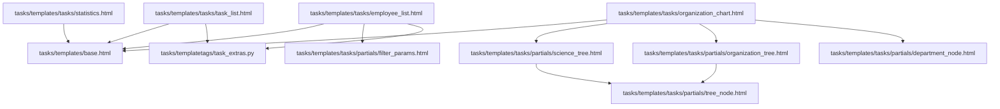
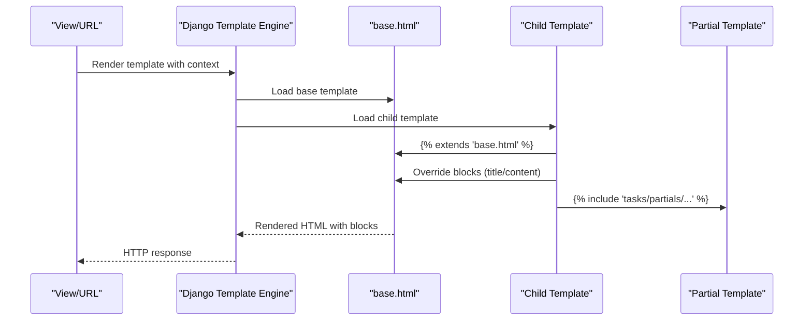
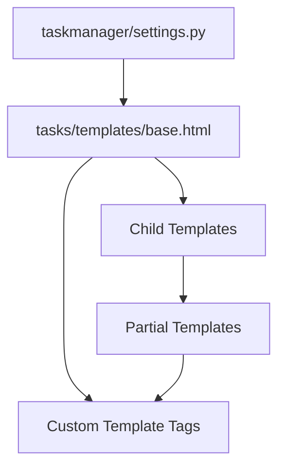

# Template Architecture and Inheritance

<cite>
**Referenced Files in This Document**
- [base.html](file://tasks/templates/base.html)
- [task_list.html](file://tasks/templates/tasks/task_list.html)
- [employee_list.html](file://tasks/templates/tasks/employee_list.html)
- [organization_chart.html](file://tasks/templates/tasks/organization_chart.html)
- [statistics.html](file://tasks/templates/tasks/statistics.html)
- [filter_params.html](file://tasks/templates/tasks/partials/filter_params.html)
- [tree_node.html](file://tasks/templates/tasks/partials/tree_node.html)
- [department_node.html](file://tasks/templates/tasks/partials/department_node.html)
- [science_tree.html](file://tasks/templates/tasks/partials/science_tree.html)
- [organization_tree.html](file://tasks/templates/tasks/partials/organization_tree.html)
- [task_extras.py](file://tasks/templatetags/task_extras.py)
- [settings.py](file://taskmanager/settings.py)
</cite>

## Table of Contents
1. [Introduction](#introduction)
2. [Project Structure](#project-structure)
3. [Core Components](#core-components)
4. [Architecture Overview](#architecture-overview)
5. [Detailed Component Analysis](#detailed-component-analysis)
6. [Dependency Analysis](#dependency-analysis)
7. [Performance Considerations](#performance-considerations)
8. [Troubleshooting Guide](#troubleshooting-guide)
9. [Conclusion](#conclusion)

## Introduction
This document explains the Django template architecture and inheritance system used in the project. It covers the base template structure, the block system, and how child templates extend the base and override blocks. It also documents the template loading mechanism, static asset inclusion patterns, and context variable passing. Reusable component patterns such as partial templates, navigation components, and form templates are described, along with template context processors, global variables, and conditional rendering logic. Finally, it includes examples of template inheritance chains, block definitions, and custom template tag usage.

## Project Structure
The template system centers around a single base template that defines the shared layout and blocks. Child templates extend the base and override specific blocks to render page-specific content. Partials are used for reusable components like navigation, trees, and filter parameters. Custom template tags provide additional filtering capabilities.

**Diagram sources**
- [base.html](file://tasks/templates/base.html)
- [task_list.html](file://tasks/templates/tasks/task_list.html)
- [employee_list.html](file://tasks/templates/tasks/employee_list.html)
- [organization_chart.html](file://tasks/templates/tasks/organization_chart.html)
- [statistics.html](file://tasks/templates/tasks/statistics.html)
- [filter_params.html](file://tasks/templates/tasks/partials/filter_params.html)
- [tree_node.html](file://tasks/templates/tasks/partials/tree_node.html)
- [department_node.html](file://tasks/templates/tasks/partials/department_node.html)
- [science_tree.html](file://tasks/templates/tasks/partials/science_tree.html)
- [organization_tree.html](file://tasks/templates/tasks/partials/organization_tree.html)
- [task_extras.py](file://tasks/templatetags/task_extras.py)

**Section sources**
- [base.html](file://tasks/templates/base.html)
- [settings.py](file://taskmanager/settings.py)

## Core Components
- Base template: Provides the HTML skeleton, navigation bar, alerts, and named blocks for title, content, extra CSS, and extra JS.
- Child templates: Extend the base and override blocks to inject page-specific content and assets.
- Partial templates: Encapsulate reusable UI fragments (navigation nodes, trees, filter params).
- Context processors: Provide global variables such as user and messages to all templates.
- Custom template tags: Add reusable filters (e.g., dictionary lookup).

**Section sources**
- [base.html](file://tasks/templates/base.html)
- [task_extras.py](file://tasks/templatetags/task_extras.py)
- [settings.py](file://taskmanager/settings.py)

## Architecture Overview
The template architecture follows Django’s inheritance model:
- A base template defines blocks for title, content, and optional extra assets.
- Child templates use the extends directive to inherit from the base and override blocks.
- Partials are included via include to reuse components across pages.
- Static assets are loaded using the static template tag and injected via extra_css and extra_js blocks.
- Context processors expose request-scoped data (e.g., user, messages) globally.

**Diagram sources**
- [base.html](file://tasks/templates/base.html)
- [task_list.html](file://tasks/templates/tasks/task_list.html)
- [employee_list.html](file://tasks/templates/tasks/employee_list.html)
- [organization_chart.html](file://tasks/templates/tasks/organization_chart.html)
- [statistics.html](file://tasks/templates/tasks/statistics.html)
- [filter_params.html](file://tasks/templates/tasks/partials/filter_params.html)

## Detailed Component Analysis

### Base Template and Block System
The base template defines:
- A top-level HTML structure with meta tags and viewport configuration.
- A navigation bar with links to core views and conditional authentication links.
- A messages area that iterates over Django messages to render alerts.
- A main content area with a content block for child templates.
- Footer and script sections.
- Optional extra_css and extra_js blocks for child-specific assets.

Key blocks:
- title: Sets the page title.
- content: Holds the main page content.
- extra_css: Allows child templates to inject additional styles.
- extra_js: Allows child templates to inject additional scripts.

Static asset inclusion:
- Uses the static template tag to link local CSS and JS.
- Loads external resources (Bootstrap and icons) from CDNs.

Conditional rendering:
- Displays user-specific navigation when the user is authenticated.
- Renders messages with appropriate alert types based on message tags.

**Section sources**
- [base.html](file://tasks/templates/base.html)

### Child Templates and Inheritance Chains
- task_list.html extends base.html, sets a page title, and overrides content with a complex list view including filters, statistics, cards, and pagination.
- employee_list.html extends base.html, adds a title and content, and includes a partial for filter parameters during pagination.
- organization_chart.html extends base.html, overrides content, injects extra CSS and JS, and includes two partials for scientific and organizational trees.
- statistics.html extends base.html and overrides content with a statistics dashboard.

Inheritance chain example:
- Child templates inherit from base.html and can optionally override blocks.
- Organization chart demonstrates extending base and adding extra assets via extra_css and extra_js.

**Section sources**
- [task_list.html](file://tasks/templates/tasks/task_list.html)
- [employee_list.html](file://tasks/templates/tasks/employee_list.html)
- [organization_chart.html](file://tasks/templates/tasks/organization_chart.html)
- [statistics.html](file://tasks/templates/tasks/statistics.html)

### Partial Templates and Reusable Components
Reusable components are implemented as partial templates:
- filter_params.html: A partial that preserves filter parameters across pagination links.
- tree_node.html: A recursive partial that renders a tree node with children and toggles.
- department_node.html: A partial that renders a department node with counts and badges.
- science_tree.html: A partial that organizes scientific departments and labs.
- organization_tree.html: A partial that organizes organizational departments and staff lists.

These partials are included by child templates to avoid duplication and promote maintainability.

**Section sources**
- [filter_params.html](file://tasks/templates/tasks/partials/filter_params.html)
- [tree_node.html](file://tasks/templates/tasks/partials/tree_node.html)
- [department_node.html](file://tasks/templates/tasks/partials/department_node.html)
- [science_tree.html](file://tasks/templates/tasks/partials/science_tree.html)
- [organization_tree.html](file://tasks/templates/tasks/partials/organization_tree.html)

### Template Loading Mechanism and Settings
Template loading is configured in settings:
- TEMPLATES backend is DjangoTemplates.
- DIRS includes a project-wide templates directory.
- APP_DIRS is enabled so app-specific templates are discoverable.
- Context processors include debug, request, auth, and messages.

Static files:
- STATIC_URL, STATICFILES_DIRS, and STATIC_ROOT define static file handling.
- COMPRESS settings indicate optional compression support.

This configuration ensures templates are discovered from both project and app directories and that context processors are available globally.

**Section sources**
- [settings.py](file://taskmanager/settings.py)

### Static Asset Inclusion Patterns
- Global CSS and JS are linked in the base template via the static tag.
- Child templates can inject additional assets using extra_css and extra_js blocks.
- Organization chart demonstrates injecting organization-specific CSS and JS via extra blocks.

Best practices:
- Keep global assets in base.html.
- Use extra blocks for page-specific assets to minimize duplication.

**Section sources**
- [base.html](file://tasks/templates/base.html)
- [organization_chart.html](file://tasks/templates/tasks/organization_chart.html)

### Context Variable Passing and Global Variables
Context processors provide global variables:
- request: Makes request metadata available.
- user: Provides authentication state and attributes.
- messages: Supplies Django messages framework data.
- debug: Enables debug context in templates.

Child templates rely on these globals for conditional rendering (e.g., authentication links) and for displaying messages.

**Section sources**
- [settings.py](file://taskmanager/settings.py)
- [base.html](file://tasks/templates/base.html)

### Conditional Rendering Logic
Common patterns:
- Authentication-aware navigation: Shows login/register links when the user is not authenticated; otherwise shows profile and logout.
- Message rendering: Iterates over messages and applies alert classes based on message tags.
- Visibility toggles: Shows or hides sections based on context variables (e.g., presence of employees, overdue tasks).

These patterns ensure templates adapt dynamically to user state and application data.

**Section sources**
- [base.html](file://tasks/templates/base.html)

### Reusable Component Patterns
- Navigation components: Built into the base template’s navbar and reused across all child templates.
- Tree components: Implemented as partials (tree_node, science_tree, organization_tree) and included by organization_chart.
- Filter components: Implemented as filter_params partial and included by employee_list to preserve filters during pagination.
- Form-like layouts: Used in list pages to present structured forms and controls.

These patterns reduce duplication and improve maintainability.

**Section sources**
- [base.html](file://tasks/templates/base.html)
- [organization_chart.html](file://tasks/templates/tasks/organization_chart.html)
- [employee_list.html](file://tasks/templates/tasks/employee_list.html)
- [filter_params.html](file://tasks/templates/tasks/partials/filter_params.html)
- [tree_node.html](file://tasks/templates/tasks/partials/tree_node.html)
- [science_tree.html](file://tasks/templates/tasks/partials/science_tree.html)
- [organization_tree.html](file://tasks/templates/tasks/partials/organization_tree.html)

### Custom Template Tags Usage
A custom filter is provided:
- get_item: Retrieves a dictionary value by key, returning None if the dictionary is falsy.

Usage examples:
- Accessing nested context dictionaries in templates to avoid errors when keys are missing.

This demonstrates how to extend templates with reusable filters.

**Section sources**
- [task_extras.py](file://tasks/templatetags/task_extras.py)

## Dependency Analysis
The template system exhibits low coupling and high cohesion:
- Base template is the single source of truth for layout and navigation.
- Child templates depend on base blocks and context processors.
- Partials encapsulate reusable logic and are included by multiple templates.
- Static assets are centralized in base and extended via extra blocks.

**Diagram sources**
- [settings.py](file://taskmanager/settings.py)
- [base.html](file://tasks/templates/base.html)
- [task_extras.py](file://tasks/templatetags/task_extras.py)

**Section sources**
- [settings.py](file://taskmanager/settings.py)
- [base.html](file://tasks/templates/base.html)
- [task_extras.py](file://tasks/templatetags/task_extras.py)

## Performance Considerations
- Minimize heavy computations in templates; move logic to views or context processors.
- Use partials to avoid duplicating expensive rendering logic.
- Keep extra CSS/JS minimal; include only what is necessary per page.
- Leverage static file collection and CDN-hosted libraries to reduce server load.

## Troubleshooting Guide
Common issues and resolutions:
- Block not rendering: Verify that child templates extend the base and override the correct blocks.
- Missing assets: Ensure static URLs are configured and that extra blocks are used for page-specific CSS/JS.
- Empty partials: Confirm that context variables passed to partials are populated by the view.
- Authentication links not appearing: Check that the user is authenticated and that context processors are enabled.

**Section sources**
- [base.html](file://tasks/templates/base.html)
- [settings.py](file://taskmanager/settings.py)

## Conclusion
The project’s template architecture leverages Django’s inheritance and block system to provide a consistent layout while enabling page-specific customization. Partials encapsulate reusable components, context processors supply global data, and custom template tags extend functionality. The configuration in settings ensures templates are discoverable and context-aware, supporting scalable and maintainable front-end development.