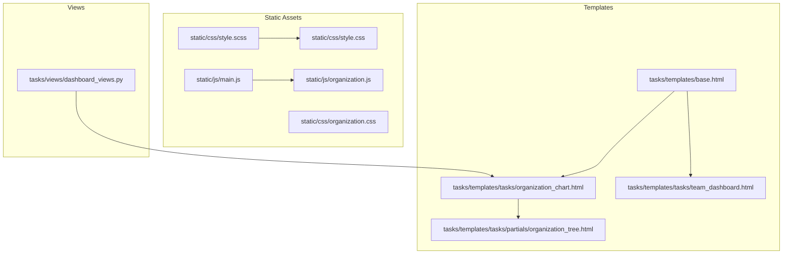
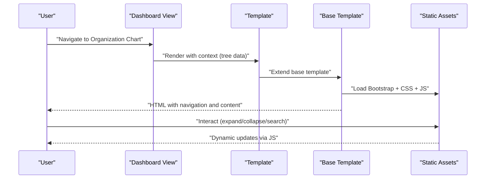
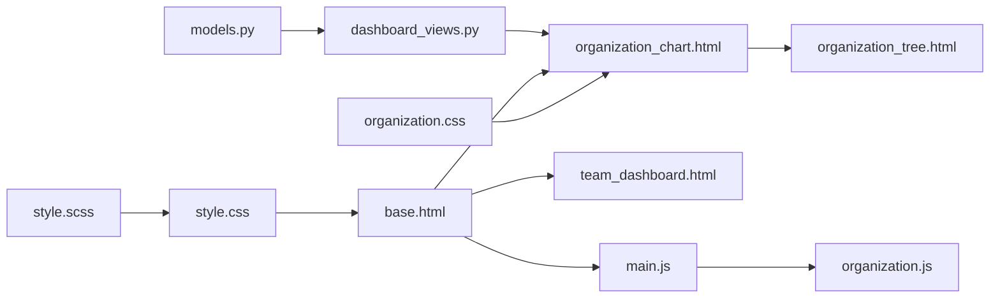

# User Interface and Templates

<cite>
**Referenced Files in This Document**
- [base.html](file://tasks/templates/base.html)
- [style.scss](file://static/css/style.scss)
- [style.css](file://static/css/style.css)
- [organization.css](file://static/css/organization.css)
- [main.js](file://static/js/main.js)
- [organization.js](file://static/js/organization.js)
- [organization_chart.html](file://tasks/templates/tasks/organization_chart.html)
- [organization_tree.html](file://tasks/templates/tasks/partials/organization_tree.html)
- [team_dashboard.html](file://tasks/templates/tasks/team_dashboard.html)
- [dashboard_views.py](file://tasks/views/dashboard_views.py)
- [task_extras.py](file://tasks/templatetags/task_extras.py)
- [settings.py](file://taskmanager/settings.py)
- [models.py](file://tasks/models.py)
</cite>

## Table of Contents
1. [Introduction](#introduction)
2. [Project Structure](#project-structure)
3. [Core Components](#core-components)
4. [Architecture Overview](#architecture-overview)
5. [Detailed Component Analysis](#detailed-component-analysis)
6. [Dependency Analysis](#dependency-analysis)
7. [Performance Considerations](#performance-considerations)
8. [Troubleshooting Guide](#troubleshooting-guide)
9. [Conclusion](#conclusion)

## Introduction
This document describes the User Interface and Template system of the Task Manager application. It covers the template inheritance hierarchy, base template structure, reusable component patterns, Bootstrap 5.1.3 integration, responsive design, mobile compatibility, JavaScript functionality (AJAX, forms, dynamic updates), organization chart visualization, tree navigation components, interactive elements, CSS styling architecture and SCSS compilation, template context processors and global variables, data presentation patterns, accessibility, cross-browser compatibility, and performance optimization for frontend assets.

## Project Structure
The UI system is organized around a single base template extended by page-specific templates. Styles are authored in SCSS and compiled to CSS. JavaScript is split into shared utilities and page-specific scripts. Views prepare hierarchical data for rendering.

**Diagram sources**
- [base.html](file://tasks/templates/base.html)
- [organization_chart.html](file://tasks/templates/tasks/organization_chart.html)
- [organization_tree.html](file://tasks/templates/tasks/partials/organization_tree.html)
- [team_dashboard.html](file://tasks/templates/tasks/team_dashboard.html)
- [style.scss](file://static/css/style.scss)
- [style.css](file://static/css/style.css)
- [organization.css](file://static/css/organization.css)
- [main.js](file://static/js/main.js)
- [organization.js](file://static/js/organization.js)
- [dashboard_views.py](file://tasks/views/dashboard_views.py)

**Section sources**
- [base.html](file://tasks/templates/base.html)
- [organization_chart.html](file://tasks/templates/tasks/organization_chart.html)
- [organization_tree.html](file://tasks/templates/tasks/partials/organization_tree.html)
- [team_dashboard.html](file://tasks/templates/tasks/team_dashboard.html)
- [style.scss](file://static/css/style.scss)
- [style.css](file://static/css/style.css)
- [organization.css](file://static/css/organization.css)
- [main.js](file://static/js/main.js)
- [organization.js](file://static/js/organization.js)
- [dashboard_views.py](file://tasks/views/dashboard_views.py)

## Core Components
- Base template: Provides the HTML shell, navigation, notifications, and script loading via blocks for extensibility.
- Organization chart page: Renders leadership stats, two main blocks, search, and a tree with expand/collapse controls.
- Shared utilities: DOM helpers, date utilities, notifications, and AJAX utilities.
- Organization-specific JS: Tree toggling, main blocks toggle, staff visibility, and search filtering.
- SCSS architecture: CSS custom properties, typography, buttons, cards, and responsive breakpoints.
- Dashboard page: Team metrics and recent assignments rendered with Bootstrap components.

**Section sources**
- [base.html](file://tasks/templates/base.html)
- [organization_chart.html](file://tasks/templates/tasks/organization_chart.html)
- [main.js](file://static/js/main.js)
- [organization.js](file://static/js/organization.js)
- [style.scss](file://static/css/style.scss)
- [team_dashboard.html](file://tasks/templates/tasks/team_dashboard.html)

## Architecture Overview
The UI pipeline follows a predictable flow:
- View builds hierarchical data and renders a page template.
- Page template extends the base template and injects content and optional assets.
- Base template loads Bootstrap, local CSS, and JavaScript, and exposes blocks for child templates.
- JavaScript initializes interactive behaviors and handles AJAX requests.

**Diagram sources**
- [dashboard_views.py](file://tasks/views/dashboard_views.py)
- [organization_chart.html](file://tasks/templates/tasks/organization_chart.html)
- [base.html](file://tasks/templates/base.html)
- [organization.js](file://static/js/organization.js)
- [main.js](file://static/js/main.js)

## Detailed Component Analysis

### Base Template and Blocks
- Extends the site layout with Bootstrap 5.1.3 and Bootstrap Icons CDN.
- Defines blocks for title, extra CSS, content, and extra JavaScript.
- Includes a responsive navigation bar with dropdowns and authentication links.
- Renders Django messages as Bootstrap alerts.
- Loads jQuery and the shared main.js, and exposes an extra_js block for page-specific scripts.

Key patterns:
- Block-based extensibility allows pages to inject CSS/JS and override content.
- Navigation adapts to user authentication state.
- Alerts are rendered centrally for consistent UX.

**Section sources**
- [base.html](file://tasks/templates/base.html)

### Organization Chart Page
- Extends base.html and adds organization.css via an extra CSS block.
- Provides leadership summary cards, two main blocks (scientific and organizational), and a tree area.
- Uses include directives to render partial tree templates for scientific and organizational branches.
- Adds control buttons for view modes and expand/collapse actions.
- Integrates a search box with clear button.

Interactive elements:
- Control buttons call global functions to switch views and toggle tree nodes.
- Clicking a node toggles its children visibility.
- Main blocks toggle open/close state.
- Search filters nodes by name and reveals ancestors.

**Section sources**
- [organization_chart.html](file://tasks/templates/tasks/organization_chart.html)

### Organization Tree Partial
- Renders a hierarchical tree with levels and connecting lines.
- Displays department name, type, and staff counts.
- Shows staff members per department with links to employee details.
- Uses data attributes and IDs to drive JavaScript interactions.

Accessibility and UX:
- Clear visual hierarchy with borders and shadows.
- Hover effects and transitions improve interactivity.
- Responsive adjustments reduce spacing and hide parent connectors on small screens.

**Section sources**
- [organization_tree.html](file://tasks/templates/tasks/partials/organization_tree.html)

### JavaScript Utilities and Organization Script
Shared utilities:
- DomUtils: Element selection and display toggling.
- DateUtils: Formatting, difference calculation, and overdue checks.
- Notify: Toast-style notifications with icons and durations.
- Ajax: Unified GET/POST handlers with CSRF support and FormData posting.

Organization-specific script:
- OrgTree: Toggle nodes, expand/collapse all, maintain expanded state.
- MainBlocks: Toggle visibility of scientific and organizational containers.
- Staff: Toggle staff lists for departments/labs.
- Search: Filter nodes by name, reveal ancestors, clear input.

AJAX and forms:
- CSRF token retrieval from cookies.
- JSON and multipart/form-data posting.
- Centralized error handling with notifications.

**Section sources**
- [main.js](file://static/js/main.js)
- [organization.js](file://static/js/organization.js)

### SCSS Architecture and Compilation
- SCSS defines CSS custom properties for colors, shadows, and spacing.
- Resets margins/paddings and sets a baseline font stack and line height.
- Typography scales for headings with responsive adjustments.
- Button and card styles with hover effects and transitions.
- Responsive breakpoint at 768px adjusts font sizes and layout.

Compilation:
- The project includes both SCSS and CSS files. The SCSS file defines variables and base styles; the CSS file is included in templates. The build process likely compiles SCSS to CSS during deployment or development.

**Section sources**
- [style.scss](file://static/css/style.scss)
- [style.css](file://static/css/style.css)

### Organization-Specific Styles
- Tree visualization with levels, connecting lines, and parent-child indicators.
- Leadership cards with gradient backgrounds and hover animations.
- Main blocks with distinct accents and hover transforms.
- Grid layouts for institutes, departments, laboratories, and staff lists.
- Control buttons with active states and hover feedback.
- Animations for slide-down and fade-in effects.
- Mobile-first responsive adjustments for stacked layouts and reduced spacing.

**Section sources**
- [organization.css](file://static/css/organization.css)

### Dashboard Page
- Extends base.html and displays team metrics in Bootstrap cards.
- Shows top performers and recent task assignments.
- Uses Bootstrap grid and badges for structured presentation.

**Section sources**
- [team_dashboard.html](file://tasks/templates/tasks/team_dashboard.html)

### Template Context Processors and Global Variables
- Django’s default context processors are enabled: debug, request, auth, and messages.
- These make request, user, and messages available in templates without manual passing from views.
- A custom template filter is provided to retrieve dictionary items by key.

**Section sources**
- [settings.py](file://taskmanager/settings.py)
- [task_extras.py](file://tasks/templatetags/task_extras.py)

### Data Presentation Patterns
- Hierarchical data is built in the view, annotated with counts, prefetched across multiple levels, and grouped by type.
- The organization chart template iterates over root departments and children, rendering nested partials.
- Dashboard page uses aggregation queries to compute counts and recent activity.

**Section sources**
- [dashboard_views.py](file://tasks/views/dashboard_views.py)
- [models.py](file://tasks/models.py)

## Dependency Analysis
The UI system exhibits low coupling and high cohesion:
- Base template is a single source of truth for layout and assets.
- Organization chart depends on shared utilities and organization-specific script.
- Styles are modular: base SCSS plus page-specific overrides.
- Views depend on models to construct hierarchical datasets.

**Diagram sources**
- [models.py](file://tasks/models.py)
- [dashboard_views.py](file://tasks/views/dashboard_views.py)
- [organization_chart.html](file://tasks/templates/tasks/organization_chart.html)
- [organization_tree.html](file://tasks/templates/tasks/partials/organization_tree.html)
- [team_dashboard.html](file://tasks/templates/tasks/team_dashboard.html)
- [base.html](file://tasks/templates/base.html)
- [style.scss](file://static/css/style.scss)
- [style.css](file://static/css/style.css)
- [organization.css](file://static/css/organization.css)
- [main.js](file://static/js/main.js)
- [organization.js](file://static/js/organization.js)

**Section sources**
- [models.py](file://tasks/models.py)
- [dashboard_views.py](file://tasks/views/dashboard_views.py)
- [organization_chart.html](file://tasks/templates/tasks/organization_chart.html)
- [organization_tree.html](file://tasks/templates/tasks/partials/organization_tree.html)
- [team_dashboard.html](file://tasks/templates/tasks/team_dashboard.html)
- [base.html](file://tasks/templates/base.html)
- [style.scss](file://static/css/style.scss)
- [style.css](file://static/css/style.css)
- [organization.css](file://static/css/organization.css)
- [main.js](file://static/js/main.js)
- [organization.js](file://static/js/organization.js)

## Performance Considerations
- Minimize reflows: Batch DOM updates in organization.js (e.g., toggling multiple containers).
- Efficient selectors: Use IDs and class-based queries to avoid expensive traversals.
- Lazy initialization: Initialize search and tree state on DOMContentLoaded.
- Asset delivery: Serve Bootstrap and jQuery from CDNs; bundle and minify local CSS/JS for production.
- Caching: The organization chart view caches data for 10 minutes to reduce database load.
- Prefetching: Views prefetch related data to avoid N+1 queries.

[No sources needed since this section provides general guidance]

## Troubleshooting Guide
Common issues and resolutions:
- Missing CSRF token: Ensure the CSRF cookie is present and Ajax.post sends the X-CSRFToken header.
- Notifications not appearing: Verify the alerts container is appended to the DOM and styles are loaded.
- Tree not expanding: Confirm node IDs match data attributes and that the script runs after DOM content is ready.
- Search not filtering: Check that node names are extracted correctly and ancestor traversal logic is intact.
- Styles not applied: Validate that organization.css is linked and media queries trigger at 768px.

**Section sources**
- [main.js](file://static/js/main.js)
- [organization.js](file://static/js/organization.js)
- [organization_chart.html](file://tasks/templates/tasks/organization_chart.html)

## Conclusion
The UI and template system leverages a clean inheritance model with a robust base template, modular SCSS architecture, and cohesive JavaScript utilities. The organization chart integrates Bootstrap components with custom visuals and interactions, while the dashboard presents aggregated metrics effectively. With proper asset bundling, caching, and responsive design, the system delivers a responsive, accessible, and performant experience across devices.