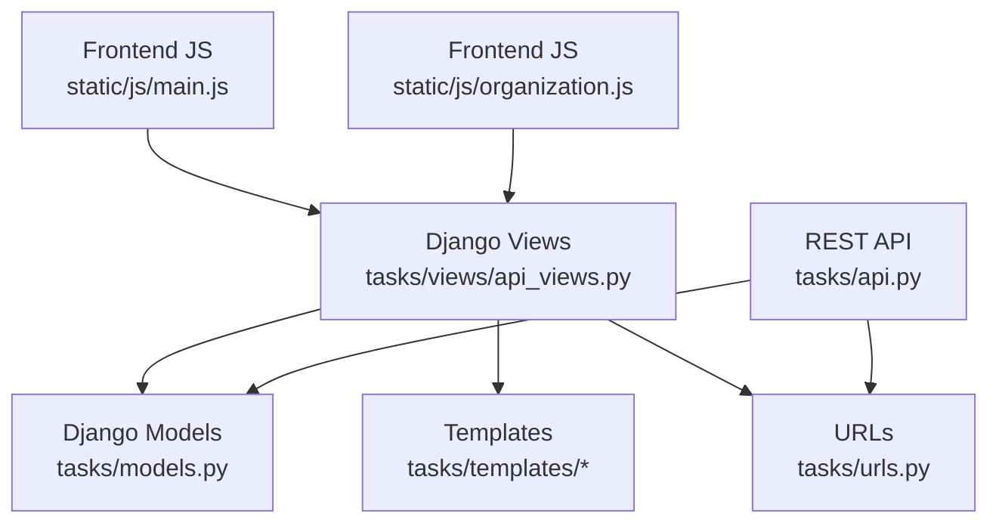
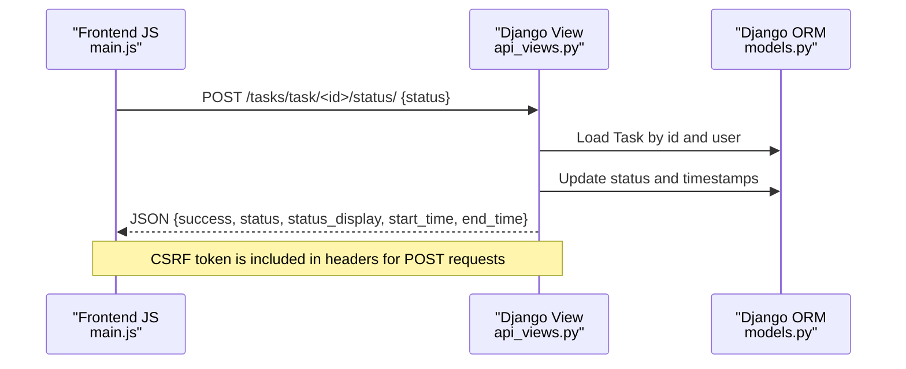
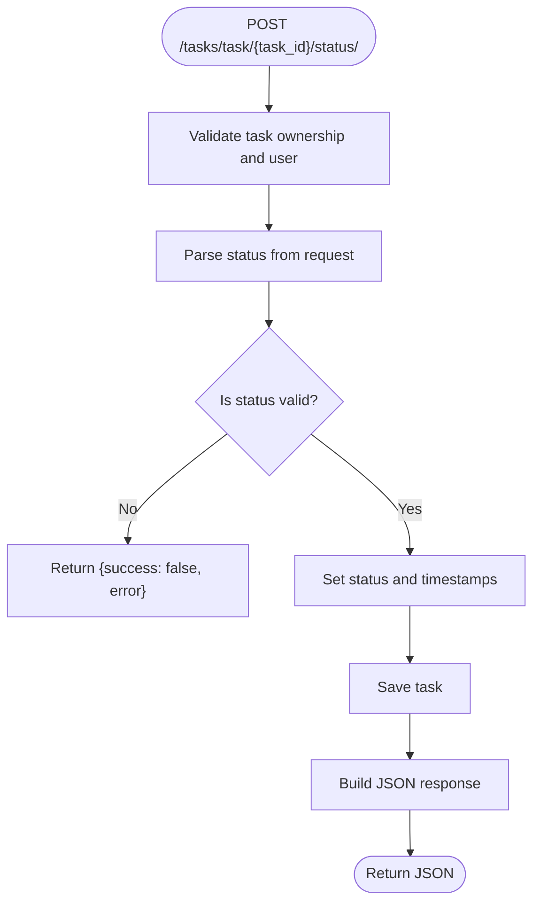
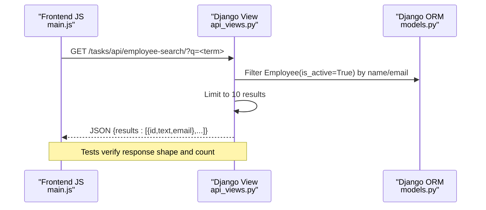
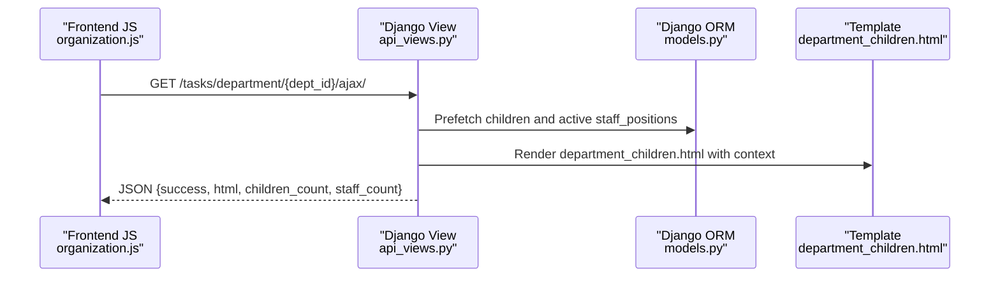
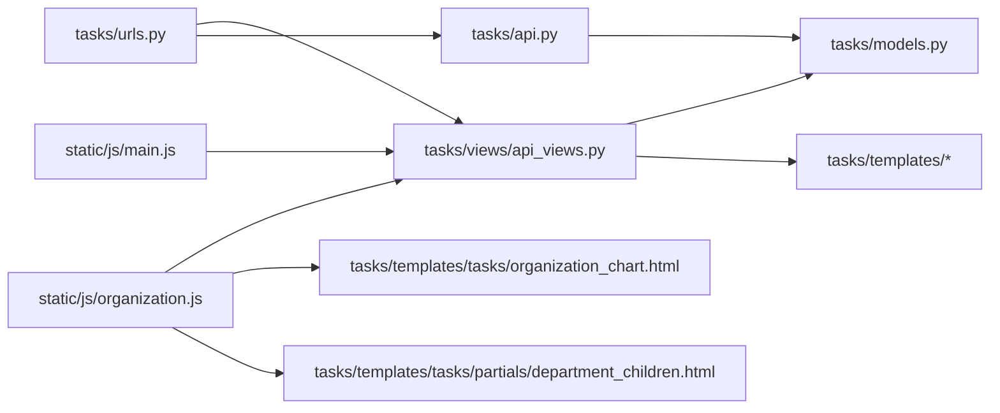

# API Endpoints

<cite>
**Referenced Files in This Document**
- [api_views.py](file://tasks/views/api_views.py)
- [api.py](file://tasks/api.py)
- [urls.py](file://tasks/urls.py)
- [main.js](file://static/js/main.js)
- [organization.js](file://static/js/organization.js)
- [organization_chart.html](file://tasks/templates/tasks/organization_chart.html)
- [department_children.html](file://tasks/templates/tasks/partials/department_children.html)
- [employee_list_ajax.htm](file://tasks/templates/tasks/partials/employee_list_ajax.htm)
- [models.py](file://tasks/models.py)
- [org_service.py](file://tasks/services/org_service.py)
- [test_api.py](file://tasks/tests/test_api.py)
</cite>

## Table of Contents
1. [Introduction](#introduction)
2. [Project Structure](#project-structure)
3. [Core Components](#core-components)
4. [Architecture Overview](#architecture-overview)
5. [Detailed Component Analysis](#detailed-component-analysis)
6. [Dependency Analysis](#dependency-analysis)
7. [Performance Considerations](#performance-considerations)
8. [Troubleshooting Guide](#troubleshooting-guide)
9. [Conclusion](#conclusion)

## Introduction
This document provides comprehensive documentation for API endpoints and AJAX functionality in the task manager application. It covers:
- Task status update endpoint (task_update_status_ajax)
- Employee search API (employee_search_api)
- Organization chart data endpoints (department_detail_ajax)
- JSON response formatting and request/response schemas
- Frontend JavaScript communication patterns, including parameter passing and data serialization
- Authentication requirements and security considerations
- Examples of API usage and integration patterns

## Project Structure
The API and AJAX functionality spans Django views, URL routing, templates, and frontend JavaScript:
- Backend endpoints are defined in tasks/views/api_views.py and tasks/api.py
- URLs are configured in tasks/urls.py
- Templates render dynamic HTML fragments for AJAX responses
- Frontend JavaScript utilities in static/js/main.js and static/js/organization.js handle requests and DOM updates

**Diagram sources**
- [api_views.py:1-130](file://tasks/views/api_views.py#L1-L130)
- [api.py:1-39](file://tasks/api.py#L1-L39)
- [urls.py:1-100](file://tasks/urls.py#L1-L100)
- [main.js:88-135](file://static/js/main.js#L88-L135)
- [organization.js:1-179](file://static/js/organization.js#L1-L179)
- [models.py:13-89](file://tasks/models.py#L13-L89)

**Section sources**
- [urls.py:1-100](file://tasks/urls.py#L1-L100)

## Core Components
- Task status update endpoint: Updates task status and timestamps via AJAX
- Employee search API: Returns paginated, filtered employee suggestions
- Organization chart data endpoint: Returns department subtree HTML and counts via AJAX
- Frontend Ajax utility: Handles CSRF-protected fetch requests and JSON parsing
- Organization page scripts: Manage tree expansion/collapse and search UI

**Section sources**
- [api_views.py:47-93](file://tasks/views/api_views.py#L47-L93)
- [api.py:10-39](file://tasks/api.py#L10-L39)
- [main.js:88-135](file://static/js/main.js#L88-L135)
- [organization.js:1-179](file://static/js/organization.js#L1-L179)

## Architecture Overview
The frontend JavaScript communicates with backend endpoints using fetch. For form submissions, it passes a CSRF token via headers. For JSON endpoints, it sends JSON payloads. Responses are returned as JSON objects with a consistent structure.

**Diagram sources**
- [api_views.py:47-70](file://tasks/views/api_views.py#L47-L70)
- [main.js:102-117](file://static/js/main.js#L102-L117)
- [models.py:165-238](file://tasks/models.py#L165-L238)

## Detailed Component Analysis

### Task Status Update Endpoint
- Endpoint: POST /tasks/task/{task_id}/status/
- Purpose: Update task status and set start/end timestamps when transitioning states
- Authentication: Requires login (login_required decorator)
- Request payload:
  - Form field: status (string)
- Response schema:
  - success: boolean
  - status: string (task status)
  - status_display: string (localized status label)
  - start_time: string | null (formatted time)
  - end_time: string | null (formatted time)
- Error handling:
  - Returns success: false with error message for invalid requests

**Diagram sources**
- [api_views.py:47-70](file://tasks/views/api_views.py#L47-L70)

**Section sources**
- [api_views.py:47-70](file://tasks/views/api_views.py#L47-L70)

### Employee Search API
- Endpoint: GET /tasks/api/employee-search/
- Purpose: Provide searchable employee suggestions for assignment/search
- Authentication: Requires login (login_required decorator)
- Query parameters:
  - q: search term (string)
- Response schema:
  - results: array of objects
    - id: integer
    - text: string (format: "{full_name} ({position})")
    - email: string
- Behavior:
  - Filters active employees by last_name, first_name, or email
  - Limits results to 10 items
  - Returns empty array if no query provided

**Diagram sources**
- [api_views.py:73-93](file://tasks/views/api_views.py#L73-L93)
- [test_api.py:25-38](file://tasks/tests/test_api.py#L25-L38)

**Section sources**
- [api_views.py:73-93](file://tasks/views/api_views.py#L73-L93)
- [test_api.py:25-38](file://tasks/tests/test_api.py#L25-L38)

### Organization Chart Data Endpoint
- Endpoint: GET /tasks/department/{dept_id}/ajax/
- Purpose: Return HTML fragment for department subtree and counts
- Authentication: Requires login (login_required decorator)
- Response schema:
  - success: boolean
  - html: string (rendered HTML fragment)
  - children_count: integer
  - staff_count: integer
- Template rendering:
  - Uses tasks/partials/department_children.html to render department nodes and staff lists
- Backend optimization:
  - Uses prefetch_related and select_related to minimize queries
  - Counts staff per child department efficiently

**Diagram sources**
- [api_views.py:95-129](file://tasks/views/api_views.py#L95-L129)
- [department_children.html:1-27](file://tasks/templates/tasks/partials/department_children.html#L1-L27)

**Section sources**
- [api_views.py:95-129](file://tasks/views/api_views.py#L95-L129)
- [department_children.html:1-27](file://tasks/templates/tasks/partials/department_children.html#L1-L27)

### Additional REST API Endpoint
- Endpoint: GET /tasks/api/tasks/
  - Returns list of tasks for the authenticated user
  - Response: array of task objects
- Endpoint: POST /tasks/api/quick-assign/
  - Assigns an employee to a task
  - Request: task_id, employee_id
  - Response: {success, task, employee}

**Section sources**
- [api.py:10-39](file://tasks/api.py#L10-L39)

## Dependency Analysis
- Frontend JavaScript depends on Django views for data and uses CSRF protection via cookies
- Views depend on models for data access and templates for HTML generation
- URL routing connects endpoints to views
- Organization service supports data retrieval patterns used by views

**Diagram sources**
- [urls.py:1-100](file://tasks/urls.py#L1-L100)
- [api_views.py:1-130](file://tasks/views/api_views.py#L1-L130)
- [api.py:1-39](file://tasks/api.py#L1-L39)
- [organization.js:1-179](file://static/js/organization.js#L1-L179)
- [main.js:88-135](file://static/js/main.js#L88-L135)
- [organization_chart.html:1-131](file://tasks/templates/tasks/organization_chart.html#L1-L131)
- [department_children.html:1-27](file://tasks/templates/tasks/partials/department_children.html#L1-L27)

**Section sources**
- [urls.py:1-100](file://tasks/urls.py#L1-L100)
- [organization.js:1-179](file://static/js/organization.js#L1-L179)
- [main.js:88-135](file://static/js/main.js#L88-L135)

## Performance Considerations
- Organization chart endpoint uses prefetch_related and select_related to reduce database queries and improve load times for nested structures
- Employee search limits results to 10 entries to keep responses small
- Frontend fetch calls avoid unnecessary re-renders by updating only the relevant DOM areas

[No sources needed since this section provides general guidance]

## Troubleshooting Guide
- Authentication failures:
  - Ensure the user is logged in; endpoints are protected with login_required
- CSRF errors on POST:
  - Verify X-CSRFToken header is present when sending JSON payloads
  - Confirm getCookie('csrftoken') retrieves a valid token
- Empty or unexpected search results:
  - For employee search, ensure query parameter q is provided
  - Confirm employees are marked as active
- Invalid status transitions:
  - Only statuses from Task.STATUS_CHOICES are accepted
  - Verify task ownership by the requesting user

**Section sources**
- [api_views.py:9-21](file://tasks/views/api_views.py#L9-L21)
- [main.js:137-151](file://static/js/main.js#L137-L151)
- [models.py:165-176](file://tasks/models.py#L165-L176)

## Conclusion
The API and AJAX endpoints provide efficient, secure interactions for task status updates, employee search, and organization chart navigation. They follow consistent JSON schemas, enforce authentication, and leverage Django’s ORM optimizations for performance. Frontend JavaScript utilities encapsulate request patterns and CSRF handling, enabling straightforward integration.