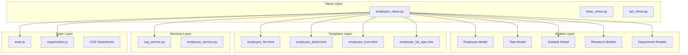
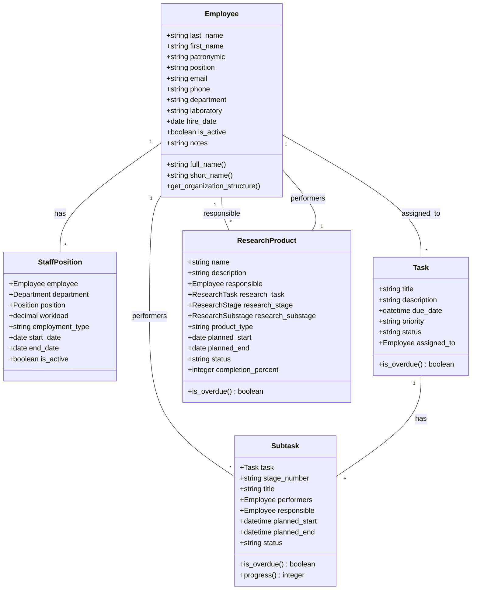
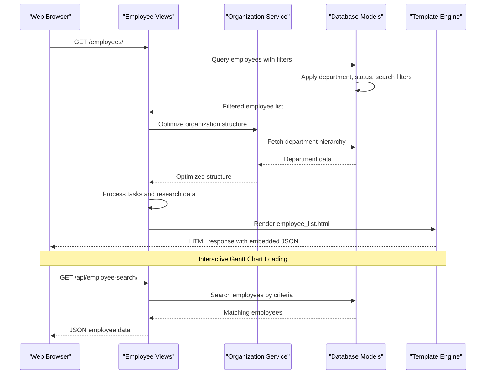
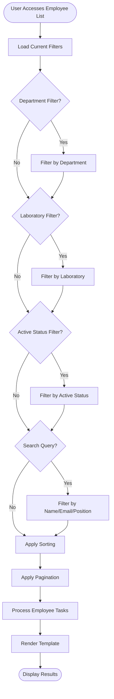
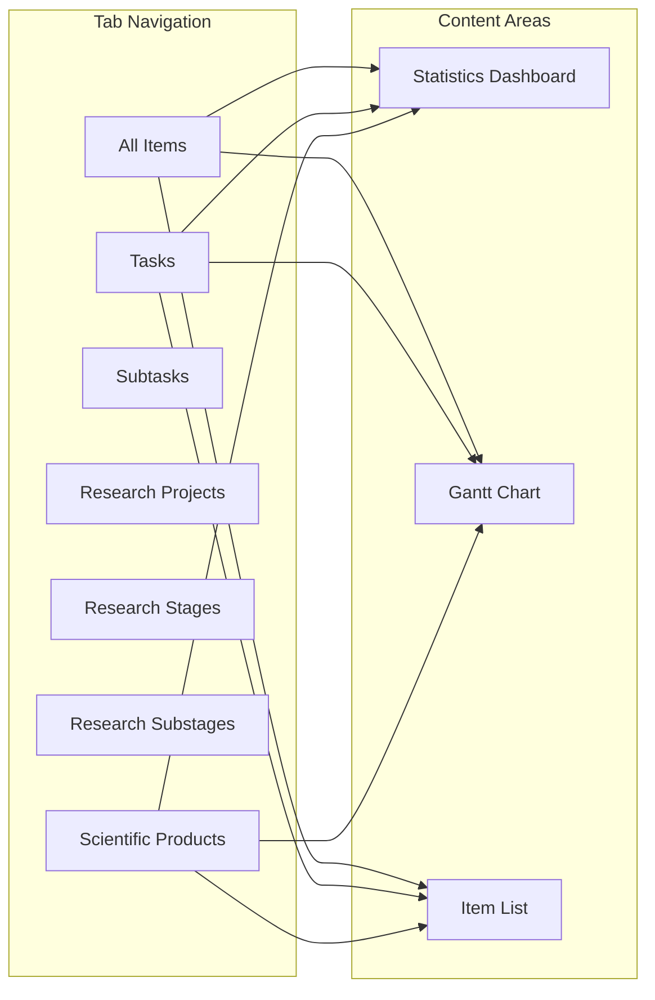
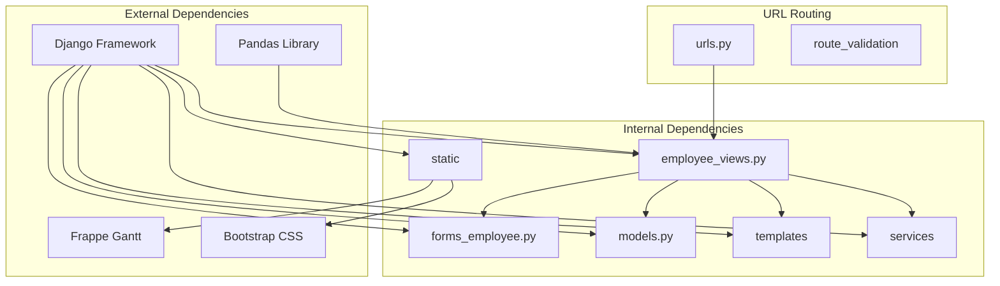

# Enhanced Employee Views Logic

<cite>
**Referenced Files in This Document**
- [employee_views.py](file://tasks/views/employee_views.py)
- [forms_employee.py](file://tasks/forms_employee.py)
- [models.py](file://tasks/models.py)
- [employee_list.html](file://tasks/templates/tasks/employee_list.html)
- [employee_detail.html](file://tasks/templates/tasks/employee_detail.html)
- [urls.py](file://tasks/urls.py)
- [org_service.py](file://tasks/services/org_service.py)
- [task_extras.py](file://tasks/templatetags/task_extras.py)
- [employee_list_ajax.htm](file://tasks/templates/tasks/partials/employee_list_ajax.htm)
- [employee_form.html](file://tasks/templates/tasks/employee_form.html)
- [employee_confirm_delete.html](file://tasks/templates/tasks/employee_confirm_delete.html)
- [main.js](file://static/js/main.js)
- [organization.js](file://static/js/organization.js)
</cite>

## Table of Contents
1. [Introduction](#introduction)
2. [Project Structure](#project-structure)
3. [Core Components](#core-components)
4. [Architecture Overview](#architecture-overview)
5. [Detailed Component Analysis](#detailed-component-analysis)
6. [Dependency Analysis](#dependency-analysis)
7. [Performance Considerations](#performance-considerations)
8. [Troubleshooting Guide](#troubleshooting-guide)
9. [Conclusion](#conclusion)

## Introduction

The Enhanced Employee Views Logic represents a sophisticated Django-based solution for managing and visualizing employee information within an organizational task management system. This system provides comprehensive employee management capabilities including detailed employee profiles, integrated task tracking, research project monitoring, and advanced visualization through interactive Gantt charts.

The system handles complex organizational structures with hierarchical departments, laboratories, and research projects, offering real-time visibility into employee workloads, deadlines, and project contributions. The enhanced views provide both administrative oversight and individual employee dashboards with personalized task management and timeline visualization.

## Project Structure

The employee views logic is organized within a modular Django architecture that separates concerns across multiple layers:

**Diagram sources**
- [employee_views.py:1-1073](file://tasks/views/employee_views.py#L1-L1073)
- [models.py:1-858](file://tasks/models.py#L1-L858)

**Section sources**
- [employee_views.py:1-1073](file://tasks/views/employee_views.py#L1-L1073)
- [urls.py:1-100](file://tasks/urls.py#L1-L100)

## Core Components

### Employee Management Views

The employee views system consists of several specialized view functions that handle different aspects of employee data management:

#### Main Employee List View
The primary employee listing functionality provides comprehensive filtering, sorting, and pagination capabilities with integrated task visualization:

- **Filtering**: Department, laboratory, active status, and search functionality
- **Sorting**: Multi-column sorting with customizable order
- **Pagination**: Efficient 20-employee per page pagination
- **Task Integration**: Real-time task assignment and deadline visualization
- **Research Tracking**: Integrated scientific product monitoring

#### Detailed Employee View
The detailed view presents comprehensive employee information with multiple visualization modes:

- **Tabbed Interface**: Separate sections for tasks, subtasks, research projects
- **Interactive Gantt Charts**: Timeline visualization with color-coded research projects
- **Statistics Dashboard**: Real-time metrics and progress indicators
- **Organizational Context**: Department hierarchy and staff position mapping

#### CRUD Operations
Complete employee lifecycle management through dedicated view functions:

- **Create**: New employee registration with validation
- **Update**: Comprehensive profile editing
- **Delete**: Safe deletion with dependency checking
- **Toggle Active**: Status management with audit trail

**Section sources**
- [employee_views.py:18-332](file://tasks/views/employee_views.py#L18-L332)
- [employee_views.py:334-760](file://tasks/views/employee_views.py#L334-L760)
- [employee_views.py:761-1073](file://tasks/views/employee_views.py#L761-L1073)

### Data Models and Relationships

The employee system is built on a robust model hierarchy that supports complex organizational structures:

**Diagram sources**
- [models.py:13-800](file://tasks/models.py#L13-L800)

**Section sources**
- [models.py:13-800](file://tasks/models.py#L13-L800)

## Architecture Overview

The enhanced employee views architecture follows Django's MVC pattern with additional service layers for complex operations:

**Diagram sources**
- [employee_views.py:18-332](file://tasks/views/employee_views.py#L18-L332)
- [org_service.py:4-32](file://tasks/services/org_service.py#L4-L32)

The architecture emphasizes separation of concerns with dedicated layers for data access, business logic, presentation, and client interaction. The system leverages Django's ORM for efficient database operations and implements caching strategies for frequently accessed data.

**Section sources**
- [employee_views.py:18-332](file://tasks/views/employee_views.py#L18-L332)
- [org_service.py:4-32](file://tasks/services/org_service.py#L4-L32)

## Detailed Component Analysis

### Employee List View Implementation

The employee list view serves as the central hub for employee management with sophisticated filtering and visualization capabilities:

#### Advanced Filtering System
The filtering mechanism supports multiple criteria with intelligent query construction:

**Diagram sources**
- [employee_views.py:18-56](file://tasks/views/employee_views.py#L18-L56)

#### Task Processing and Visualization
Each employee's tasks are processed with intelligent sorting and deadline calculation:

- **Deadline Calculation**: Tasks sorted by proximity to current date
- **Overdue Detection**: Automatic overdue status identification
- **Priority Handling**: Color-coded priority indicators
- **Type Differentiation**: Clear distinction between tasks and subtasks

#### Gantt Chart Integration
The system generates comprehensive Gantt chart data for timeline visualization:

- **Color Coding**: Unique colors for different research tasks
- **Duration Calculation**: Intelligent task duration estimation
- **Status Visualization**: Progress and completion indicators
- **Interactive Elements**: Clickable timeline entries

**Section sources**
- [employee_views.py:18-332](file://tasks/views/employee_views.py#L18-L332)

### Employee Detail View Implementation

The detailed employee view provides comprehensive individual employee information with multiple visualization modes:

#### Tabbed Interface Architecture
The interface uses a tabbed system for organizing different types of information:

**Diagram sources**
- [employee_detail.html:82-111](file://tasks/templates/tasks/employee_detail.html#L82-L111)

#### Gantt Chart Implementation
The Gantt chart provides interactive timeline visualization with advanced filtering:

- **Dynamic Period Selection**: Yearly, monthly, or custom date range filtering
- **Color Legend**: Research task color mapping for easy identification
- **Interactive Controls**: View mode switching and navigation tools
- **Warning Indicators**: Due date warnings and overdue alerts

#### Statistics and Metrics
The system calculates comprehensive statistics for each employee:

- **Task Counts**: By type and status
- **Progress Metrics**: Completion percentages and timelines
- **Overdue Tracking**: Late task identification
- **Research Contributions**: Scientific product involvement

**Section sources**
- [employee_views.py:334-760](file://tasks/views/employee_views.py#L334-L760)
- [employee_detail.html:229-267](file://tasks/templates/tasks/employee_detail.html#L229-L267)

### Data Import and Export System

The system provides comprehensive data management capabilities through Excel-based import/export functionality:

#### Import Processing
The import system handles complex Excel files with validation and error reporting:

- **File Validation**: Format and column verification
- **Data Transformation**: Excel-to-model conversion
- **Conflict Resolution**: Duplicate detection and handling
- **Error Reporting**: Detailed error messages with row information

#### Export Functionality
Export capabilities provide standardized data extraction:

- **Template Generation**: Pre-populated Excel templates
- **Data Formatting**: Proper field formatting and localization
- **Batch Processing**: Efficient bulk export operations

**Section sources**
- [employee_views.py:881-1011](file://tasks/views/employee_views.py#L881-L1011)

### Client-Side Interactions

The enhanced views incorporate sophisticated client-side functionality for improved user experience:

#### AJAX Integration
Dynamic content loading through AJAX requests:

- **Real-time Updates**: Live employee search and filtering
- **Partial Rendering**: Efficient template updates without full page reloads
- **Error Handling**: Graceful degradation and user feedback

#### Interactive Features
JavaScript-powered enhancements:

- **Gantt Chart Controls**: Zoom, pan, and view mode switching
- **Form Validation**: Client-side validation with server-side confirmation
- **Responsive Design**: Mobile-friendly interface adaptation

**Section sources**
- [main.js:88-135](file://static/js/main.js#L88-L135)
- [organization.js:107-154](file://static/js/organization.js#L107-L154)

## Dependency Analysis

The employee views system exhibits well-structured dependencies that support maintainability and scalability:

**Diagram sources**
- [employee_views.py:1-16](file://tasks/views/employee_views.py#L1-L16)
- [urls.py:1-35](file://tasks/urls.py#L1-L35)

### Coupling and Cohesion Analysis

The system demonstrates excellent modularity with low internal coupling and high cohesion:

- **View-Model Separation**: Clean separation between presentation and data logic
- **Service Layer**: Dedicated organization service for complex operations
- **Template Reusability**: Shared components across different views
- **Form Abstraction**: Consistent form handling across CRUD operations

### Performance Considerations

The system implements several optimization strategies:

- **Database Indexing**: Strategic indexing on frequently queried fields
- **Query Optimization**: Efficient query construction with select_related
- **Caching Strategies**: Intelligent caching for repeated operations
- **Pagination**: Efficient handling of large datasets

**Section sources**
- [models.py:62-67](file://tasks/models.py#L62-L67)
- [models.py:203-209](file://tasks/models.py#L203-L209)

## Performance Considerations

The enhanced employee views system incorporates multiple performance optimization strategies:

### Database Optimization
- **Select Related Queries**: Minimizes N+1 query problems through strategic joins
- **Index Utilization**: Strategic indexing on department, status, and active fields
- **Prefetch Related**: Efficient loading of related objects with prefetch_related
- **Query Limiting**: Appropriate query result limiting for large datasets

### Caching Strategies
- **Template Fragment Caching**: Reusable template components with caching
- **Session-Based Error Storage**: Efficient error message handling
- **AJAX Request Caching**: Client-side caching for frequently accessed data

### Frontend Performance
- **Lazy Loading**: Gantt charts and large lists loaded on demand
- **Virtual Scrolling**: Efficient rendering of long employee lists
- **Debounced Search**: Intelligent search input handling to reduce requests

## Troubleshooting Guide

### Common Issues and Solutions

#### Employee List Loading Problems
**Symptoms**: Slow page loads or incomplete employee data
**Causes**: 
- Missing database indexes
- Excessive JOIN operations
- Large dataset without pagination

**Solutions**:
- Verify database indexes on department and status fields
- Check query execution plans for optimization
- Implement proper pagination and filtering

#### Gantt Chart Display Issues
**Symptoms**: Timeline visualization problems or missing data
**Causes**:
- Incorrect date calculations
- Missing research task color mapping
- Client-side JavaScript errors

**Solutions**:
- Validate date field processing in view functions
- Check color palette assignment logic
- Review browser console for JavaScript errors

#### Import/Export Failures
**Symptoms**: Excel import errors or export failures
**Causes**:
- Invalid file formats
- Missing required columns
- Data validation errors

**Solutions**:
- Verify Excel file format (.xlsx/.xls)
- Check required column presence
- Review error messages for specific field issues

### Debugging Tools and Techniques

#### Server-Side Debugging
- Enable Django debug mode for development
- Use Django Debug Toolbar for query analysis
- Implement structured logging for error tracking

#### Client-Side Debugging
- Browser developer tools for JavaScript debugging
- Network tab for AJAX request analysis
- Console logging for component state tracking

**Section sources**
- [employee_views.py:754-759](file://tasks/views/employee_views.py#L754-L759)

## Conclusion

The Enhanced Employee Views Logic represents a comprehensive solution for modern employee management within organizational task systems. The implementation demonstrates excellent architectural principles with clear separation of concerns, robust data modeling, and sophisticated user interface design.

Key strengths of the system include:

- **Scalability**: Well-structured architecture supporting growth
- **Usability**: Intuitive interfaces with comprehensive functionality
- **Integration**: Seamless connection between different organizational components
- **Performance**: Optimized queries and efficient data handling
- **Maintainability**: Clean code structure and comprehensive documentation

The system successfully balances functionality with performance, providing administrators with powerful oversight tools while delivering personalized experiences for individual employees. The integration of Gantt charts, comprehensive filtering, and real-time updates creates a modern, responsive employee management platform suitable for complex organizational environments.

Future enhancements could focus on additional mobile optimization, advanced analytics capabilities, and expanded integration with external HR systems. The solid foundation established by the current implementation provides an excellent platform for continued evolution and feature expansion.