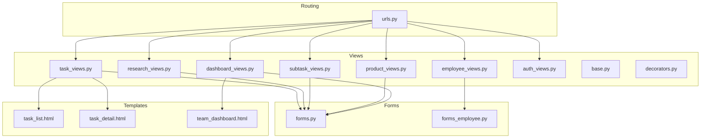
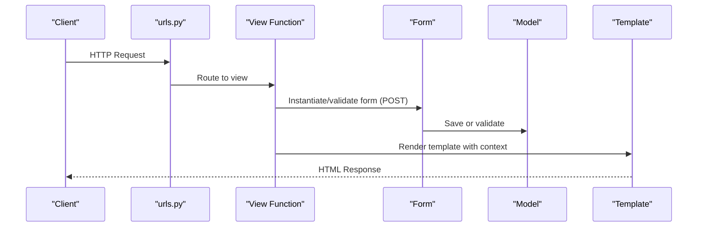
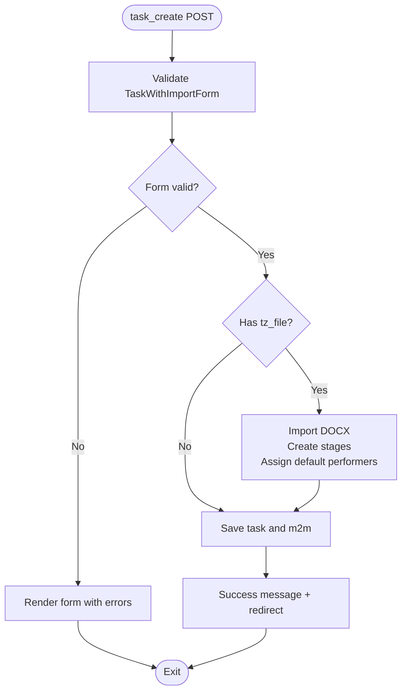
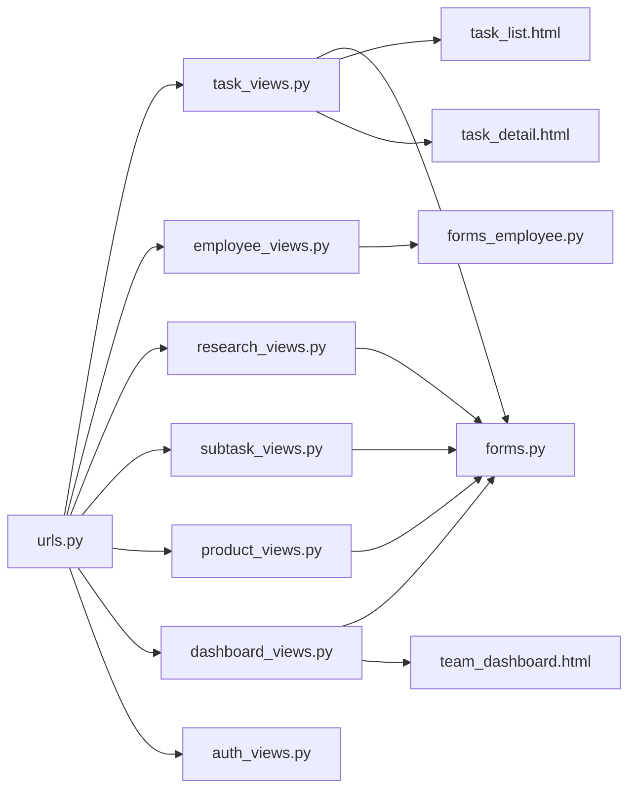

# HTTP View Functions

<cite>
**Referenced Files in This Document**
- [tasks/views/__init__.py](file://tasks/views/__init__.py)
- [tasks/views/base.py](file://tasks/views/base.py)
- [tasks/views/auth_views.py](file://tasks/views/auth_views.py)
- [tasks/views/task_views.py](file://tasks/views/task_views.py)
- [tasks/views/employee_views.py](file://tasks/views/employee_views.py)
- [tasks/views/dashboard_views.py](file://tasks/views/dashboard_views.py)
- [tasks/views/research_views.py](file://tasks/views/research_views.py)
- [tasks/views/subtask_views.py](file://tasks/views/subtask_views.py)
- [tasks/views/product_views.py](file://tasks/views/product_views.py)
- [tasks/decorators.py](file://tasks/decorators.py)
- [tasks/forms.py](file://tasks/forms.py)
- [tasks/forms_employee.py](file://tasks/forms_employee.py)
- [tasks/urls.py](file://tasks/urls.py)
- [tasks/templates/tasks/task_list.html](file://tasks/templates/tasks/task_list.html)
- [tasks/templates/tasks/task_detail.html](file://tasks/templates/tasks/task_detail.html)
- [tasks/templates/tasks/team_dashboard.html](file://tasks/templates/tasks/team_dashboard.html)
</cite>

## Table of Contents
1. [Introduction](#introduction)
2. [Project Structure](#project-structure)
3. [Core Components](#core-components)
4. [Architecture Overview](#architecture-overview)
5. [Detailed Component Analysis](#detailed-component-analysis)
6. [Dependency Analysis](#dependency-analysis)
7. [Performance Considerations](#performance-considerations)
8. [Troubleshooting Guide](#troubleshooting-guide)
9. [Conclusion](#conclusion)
10. [Appendices](#appendices)

## Introduction
This document provides comprehensive documentation for HTTP view functions in the task manager application. It covers task CRUD operations, employee management, research project views, and dashboard views. For each view, we explain request processing, context creation, template rendering, response generation, form handling, validation, and error management. We also document authentication decorators, permission checks, and access control mechanisms.

## Project Structure
The views are organized by domain areas:
- Task lifecycle and administration: task_views.py
- Employee management: employee_views.py
- Research projects: research_views.py
- Subtasks and stages: subtask_views.py
- Research products: product_views.py
- Dashboards: dashboard_views.py
- Authentication: auth_views.py
- Shared utilities: base.py
- Decorators: decorators.py
- Forms: forms.py, forms_employee.py
- URL routing: urls.py
- Templates: located under tasks/templates/tasks/

**Diagram sources**
- [tasks/urls.py:1-100](file://tasks/urls.py#L1-L100)
- [tasks/views/task_views.py:1-471](file://tasks/views/task_views.py#L1-L471)
- [tasks/views/employee_views.py:1-1013](file://tasks/views/employee_views.py#L1-L1013)
- [tasks/views/research_views.py:1-165](file://tasks/views/research_views.py#L1-L165)
- [tasks/views/subtask_views.py:1-218](file://tasks/views/subtask_views.py#L1-L218)
- [tasks/views/product_views.py:1-253](file://tasks/views/product_views.py#L1-L253)
- [tasks/views/dashboard_views.py:1-143](file://tasks/views/dashboard_views.py#L1-L143)
- [tasks/views/auth_views.py:1-21](file://tasks/views/auth_views.py#L1-L21)
- [tasks/views/base.py:1-20](file://tasks/views/base.py#L1-L20)
- [tasks/decorators.py:1-21](file://tasks/decorators.py#L1-L21)
- [tasks/forms.py:1-224](file://tasks/forms.py#L1-L224)
- [tasks/forms_employee.py:1-53](file://tasks/forms_employee.py#L1-L53)
- [tasks/templates/tasks/task_list.html:1-200](file://tasks/templates/tasks/task_list.html#L1-L200)
- [tasks/templates/tasks/task_detail.html:1-200](file://tasks/templates/tasks/task_detail.html#L1-L200)
- [tasks/templates/tasks/team_dashboard.html:1-78](file://tasks/templates/tasks/team_dashboard.html#L1-L78)

**Section sources**
- [tasks/urls.py:1-100](file://tasks/urls.py#L1-L100)
- [tasks/views/__init__.py:1-11](file://tasks/views/__init__.py#L1-L11)

## Core Components
- Authentication decorator: login_required is applied to most views to enforce user authentication.
- Permission enforcement: views commonly restrict access to objects owned by the current user (e.g., Task instances filtered by user).
- Request processing: GET for listing/filtering/sorting; POST for creation/update/delete and AJAX toggles.
- Context creation: views assemble filtered querysets, counts, statistics, and form instances.
- Template rendering: render(request, template, context) returns HttpResponse.
- Form handling: ModelForms and custom forms handle validation and saving.
- Error management: messages framework communicates success/error notifications; exceptions are logged via a decorator.

**Section sources**
- [tasks/views/task_views.py:19-69](file://tasks/views/task_views.py#L19-L69)
- [tasks/views/employee_views.py:17-332](file://tasks/views/employee_views.py#L17-L332)
- [tasks/views/research_views.py:8-86](file://tasks/views/research_views.py#L8-L86)
- [tasks/views/subtask_views.py:10-65](file://tasks/views/subtask_views.py#L10-L65)
- [tasks/views/product_views.py:9-26](file://tasks/views/product_views.py#L9-L26)
- [tasks/views/dashboard_views.py:13-143](file://tasks/views/dashboard_views.py#L13-L143)
- [tasks/decorators.py:8-21](file://tasks/decorators.py#L8-L21)

## Architecture Overview
The application follows Django’s MVC-like pattern:
- URLs route to view functions.
- Views fetch data, apply filters/sorts, and pass context to templates.
- Forms encapsulate validation and model updates.
- Templates render HTML with context data.

**Diagram sources**
- [tasks/urls.py:38-100](file://tasks/urls.py#L38-L100)
- [tasks/views/task_views.py:78-179](file://tasks/views/task_views.py#L78-L179)
- [tasks/forms.py:5-44](file://tasks/forms.py#L5-L44)

## Detailed Component Analysis

### Task CRUD and Workflow Views
- task_list
  - Filters: status, employee, search, sort.
  - Statistics: counts per status and overdue.
  - Context: tasks, filters, counts, employees.
  - Template: task_list.html.
  - Access control: user-bound filtering.
  - Return: render(request, task_list.html, context).
  - Section sources
    - [tasks/views/task_views.py:19-69](file://tasks/views/task_views.py#L19-L69)
    - [tasks/templates/tasks/task_list.html:1-200](file://tasks/templates/tasks/task_list.html#L1-L200)

- task_detail
  - Fetches task by id and user.
  - Context: task.
  - Template: task_detail.html.
  - Return: render(request, task_detail.html, context).
  - Section sources
    - [tasks/views/task_views.py:72-76](file://tasks/views/task_views.py#L72-L76)
    - [tasks/templates/tasks/task_detail.html:1-200](file://tasks/templates/tasks/task_detail.html#L1-L200)

- task_create
  - POST handles TaskWithImportForm with optional DOCX import.
  - Validation: form.is_valid().
  - Save: task.save(), form.save_m2m(); optional import pipeline.
  - Redirects to task_list on success.
  - Return: render or redirect.
  - Section sources
    - [tasks/views/task_views.py:78-179](file://tasks/views/task_views.py#L78-L179)
    - [tasks/forms.py:164-201](file://tasks/forms.py#L164-L201)

- task_update
  - GET: pre-populated TaskForm.
  - POST: form.is_valid(), save, redirect.
  - Return: render or redirect.
  - Section sources
    - [tasks/views/task_views.py:180-203](file://tasks/views/task_views.py#L180-L203)
    - [tasks/forms.py:5-44](file://tasks/forms.py#L5-L44)

- task_delete
  - Validates ownership and POST submission.
  - Clears related research products and performers, deletes subtasks, then task.
  - Messages and redirect.
  - Return: render or redirect.
  - Section sources
    - [tasks/views/task_views.py:205-236](file://tasks/views/task_views.py#L205-L236)

- task_start, task_finish, task_complete, task_reset_time
  - Status transitions with validation (can_start/can_complete).
  - Updates timestamps and status.
  - Messages and redirect.
  - Return: redirect.
  - Section sources
    - [tasks/views/task_views.py:238-298](file://tasks/views/task_views.py#L238-L298)

- task_assign_employees
  - GET: lists employees with filters and search.
  - POST: sets assigned_to for task.
  - Return: render or redirect.
  - Section sources
    - [tasks/views/task_views.py:300-340](file://tasks/views/task_views.py#L300-L340)

- task_statistics
  - Aggregates counts and durations for user tasks.
  - Context: stats dictionary.
  - Template: statistics.html.
  - Return: render(request, statistics.html, context).
  - Section sources
    - [tasks/views/task_views.py:365-406](file://tasks/views/task_views.py#L365-L406)

**Diagram sources**
- [tasks/views/task_views.py:78-179](file://tasks/views/task_views.py#L78-L179)
- [tasks/forms.py:164-201](file://tasks/forms.py#L164-L201)

**Section sources**
- [tasks/views/task_views.py:19-471](file://tasks/views/task_views.py#L19-L471)
- [tasks/forms.py:5-201](file://tasks/forms.py#L5-L201)

### Employee Management Views
- employee_list
  - Filters: department, laboratory, is_active, search, sort.
  - Pagination: Paginator(employees, 20).
  - Gantt data construction for tasks and research products.
  - Context: page_obj, filters, employee_tasks, employee_research_products, gantt_data_json.
  - Return: render(request, employee_list.html, context).
  - Section sources
    - [tasks/views/employee_views.py:17-332](file://tasks/views/employee_views.py#L17-L332)

- employee_detail
  - Builds unified timeline of tasks, subtasks, research tasks, stages, substages, and products.
  - Gantt data JSON with research task colors.
  - Context: items, staff_positions, org_structure, counts, gantt_data, filters.
  - Return: render(request, employee_detail.html, context).
  - Section sources
    - [tasks/views/employee_views.py:334-692](file://tasks/views/employee_views.py#L334-L692)

- employee_create, employee_update
  - Uses EmployeeForm.
  - POST: form.is_valid(), save, success message, redirect.
  - Return: render or redirect.
  - Section sources
    - [tasks/views/employee_views.py:701-751](file://tasks/views/employee_views.py#L701-L751)
    - [tasks/forms_employee.py:6-31](file://tasks/forms_employee.py#L6-L31)

- employee_toggle_active
  - Toggles is_active and redirects to detail.
  - Section sources
    - [tasks/views/employee_views.py:741-751](file://tasks/views/employee_views.py#L741-L751)

- employee_delete
  - Prevents deletion if active tasks/products exist; clears relations otherwise.
  - Messages and redirect.
  - Section sources
    - [tasks/views/employee_views.py:753-800](file://tasks/views/employee_views.py#L753-L800)

**Section sources**
- [tasks/views/employee_views.py:17-800](file://tasks/views/employee_views.py#L17-L800)
- [tasks/forms_employee.py:6-53](file://tasks/forms_employee.py#L6-L53)

### Research Project Views
- research_task_list
  - Context: research_tasks ordered by created_date.
  - Return: render(request, research_task_list.html, context).
  - Section sources
    - [tasks/views/research_views.py:8-16](file://tasks/views/research_views.py#L8-L16)

- research_task_detail
  - Context: research_task, stages with substages/products, totals, progress.
  - Return: render(request, research_task_detail.html, context).
  - Section sources
    - [tasks/views/research_views.py:53-86](file://tasks/views/research_views.py#L53-L86)

- research_stage_detail
  - Context: stage, substages with products.
  - Return: render(request, research_stage_detail.html, context).
  - Section sources
    - [tasks/views/research_views.py:88-99](file://tasks/views/research_views.py#L88-L99)

- research_substage_detail
  - Context: substage, products, employees.
  - Return: render(request, research_substage_detail.html, context).
  - Section sources
    - [tasks/views/research_views.py:101-116](file://tasks/views/research_views.py#L101-L116)

- assign_research_performers
  - Validates item_type against ResearchStage, ResearchSubstage, ResearchProduct.
  - POST: sets performers and responsible; redirects accordingly.
  - GET: renders assignment form with current performers/responsible.
  - Section sources
    - [tasks/views/research_views.py:117-165](file://tasks/views/research_views.py#L117-L165)

**Section sources**
- [tasks/views/research_views.py:8-165](file://tasks/views/research_views.py#L8-L165)

### Subtask Views
- subtask_list
  - Groups subtasks by stage number and sorts stages/substages.
  - Context: task, stages, substages_by_stage, employees, progress.
  - Return: render(request, subtask_list.html, context).
  - Section sources
    - [tasks/views/subtask_views.py:10-65](file://tasks/views/subtask_views.py#L10-L65)

- subtask_create
  - POST: SubtaskForm saves with task relation; auto-assigns responsible if single performer.
  - Return: render or redirect.
  - Section sources
    - [tasks/views/subtask_views.py:68-94](file://tasks/views/subtask_views.py#L68-L94)
    - [tasks/forms_subtask.py:1-200](file://tasks/forms_subtask.py#L1-L200)

- subtask_update
  - POST: SubtaskForm saves; redirect to subtask_list.
  - Return: render or redirect.
  - Section sources
    - [tasks/views/subtask_views.py:96-116](file://tasks/views/subtask_views.py#L96-L116)

- subtask_delete
  - POST: deletes subtask; redirect to subtask_list.
  - Return: render or redirect.
  - Section sources
    - [tasks/views/subtask_views.py:118-130](file://tasks/views/subtask_views.py#L118-L130)

- subtask_bulk_create
  - Parses stages_data, creates subtasks, assigns performers by name matching.
  - Messages for created and errors.
  - Return: render or redirect.
  - Section sources
    - [tasks/views/subtask_views.py:133-189](file://tasks/views/subtask_views.py#L133-L189)

- subtask_update_status
  - POST: updates status and timestamps; supports AJAX JsonResponse.
  - Return: redirect or JsonResponse.
  - Section sources
    - [tasks/views/subtask_views.py:191-217](file://tasks/views/subtask_views.py#L191-L217)

**Section sources**
- [tasks/views/subtask_views.py:10-217](file://tasks/views/subtask_views.py#L10-L217)

### Research Product Views
- research_product_detail
  - Context: product, performers with roles.
  - Return: render(request, research_product_detail.html, context).
  - Section sources
    - [tasks/views/product_views.py:9-26](file://tasks/views/product_views.py#L9-L26)

- update_product_status
  - POST: updates ResearchProduct.status; supports AJAX JsonResponse.
  - Return: redirect or JsonResponse.
  - Section sources
    - [tasks/views/product_views.py:28-48](file://tasks/views/product_views.py#L28-L48)

- product_assign_performers
  - GET: filters employees by department and search; builds department list with counts.
  - POST: clears existing ProductPerformer entries and reassigns; sets responsible.
  - Redirects to appropriate detail page.
  - Section sources
    - [tasks/views/product_views.py:50-170](file://tasks/views/product_views.py#L50-L170)

- research_product_list
  - Filters: type, status, research_task; search.
  - Stats: total, in_progress, completed, overdue.
  - Return: render(request, research_product_list.html, context).
  - Section sources
    - [tasks/views/product_views.py:206-252](file://tasks/views/product_views.py#L206-L252)

**Section sources**
- [tasks/views/product_views.py:9-252](file://tasks/views/product_views.py#L9-L252)

### Dashboard Views
- organization_chart
  - Caches data using Django cache backend.
  - Builds hierarchical departments with prefetch_related staff positions.
  - Context: root_departments, departments_by_type, statistics.
  - Return: render(request, organization_chart.html, context).
  - Section sources
    - [tasks/views/dashboard_views.py:13-109](file://tasks/views/dashboard_views.py#L13-L109)

- team_dashboard
  - Context: total_employees, active_tasks, top employees by task_count, recent assignments.
  - Return: render(request, team_dashboard.html, context).
  - Section sources
    - [tasks/views/dashboard_views.py:111-143](file://tasks/views/dashboard_views.py#L111-L143)
    - [tasks/templates/tasks/team_dashboard.html:1-78](file://tasks/templates/tasks/team_dashboard.html#L1-L78)

**Section sources**
- [tasks/views/dashboard_views.py:13-143](file://tasks/views/dashboard_views.py#L13-L143)
- [tasks/templates/tasks/team_dashboard.html:1-78](file://tasks/templates/tasks/team_dashboard.html#L1-L78)

### Authentication Views
- register
  - POST: UserCreationForm validation, save, login, redirect to task_list.
  - Return: render or redirect.
  - Section sources
    - [tasks/views/auth_views.py:9-21](file://tasks/views/auth_views.py#L9-L21)

**Section sources**
- [tasks/views/auth_views.py:9-21](file://tasks/views/auth_views.py#L9-L21)

### Base Utilities and Decorators
- update_substage_performers
  - Synchronizes substage performers from associated product performers.
  - Section sources
    - [tasks/views/base.py:1-20](file://tasks/views/base.py#L1-L20)

- log_view decorator
  - Logs view execution time and exceptions.
  - Section sources
    - [tasks/decorators.py:8-21](file://tasks/decorators.py#L8-L21)

**Section sources**
- [tasks/views/base.py:1-20](file://tasks/views/base.py#L1-L20)
- [tasks/decorators.py:8-21](file://tasks/decorators.py#L8-L21)

## Dependency Analysis
- URL routing maps endpoints to view functions.
- Views depend on forms for validation and model updates.
- Views depend on models for queries and relationships.
- Templates depend on context keys provided by views.
- Shared utilities (base.py) support cross-cutting concerns.

**Diagram sources**
- [tasks/urls.py:1-100](file://tasks/urls.py#L1-L100)
- [tasks/views/task_views.py:1-471](file://tasks/views/task_views.py#L1-L471)
- [tasks/views/employee_views.py:1-1013](file://tasks/views/employee_views.py#L1-L1013)
- [tasks/views/research_views.py:1-165](file://tasks/views/research_views.py#L1-L165)
- [tasks/views/subtask_views.py:1-218](file://tasks/views/subtask_views.py#L1-L218)
- [tasks/views/product_views.py:1-253](file://tasks/views/product_views.py#L1-L253)
- [tasks/views/dashboard_views.py:1-143](file://tasks/views/dashboard_views.py#L1-L143)
- [tasks/views/auth_views.py:1-21](file://tasks/views/auth_views.py#L1-L21)
- [tasks/forms.py:1-224](file://tasks/forms.py#L1-L224)
- [tasks/forms_employee.py:1-53](file://tasks/forms_employee.py#L1-L53)
- [tasks/templates/tasks/task_list.html:1-200](file://tasks/templates/tasks/task_list.html#L1-L200)
- [tasks/templates/tasks/task_detail.html:1-200](file://tasks/templates/tasks/task_detail.html#L1-L200)
- [tasks/templates/tasks/team_dashboard.html:1-78](file://tasks/templates/tasks/team_dashboard.html#L1-L78)

**Section sources**
- [tasks/urls.py:1-100](file://tasks/urls.py#L1-L100)

## Performance Considerations
- Use select_related and prefetch_related to reduce database queries in list/detail views.
- Apply pagination for large lists (e.g., employee_list).
- Cache heavy computations (e.g., organization_chart) to minimize repeated work.
- Minimize nested loops in templates; precompute aggregates in views.
- Use database indexes on frequently filtered/sorted fields.

## Troubleshooting Guide
- Authentication failures: Ensure login_required decorator is present and user is authenticated.
- Permission denied: Verify object-level filtering by request.user.
- Form validation errors: Inspect form.errors and cleaned_data; check custom clean_* methods.
- Import errors (task_create): Review DOCX import pipeline logs and messages.
- AJAX endpoints: Confirm X-Requested-With header for JsonResponse responses.
- Logging: Use log_view decorator to capture execution time and exceptions.

**Section sources**
- [tasks/decorators.py:8-21](file://tasks/decorators.py#L8-L21)
- [tasks/views/task_views.py:78-179](file://tasks/views/task_views.py#L78-L179)

## Conclusion
The HTTP view functions implement a robust, user-focused interface for managing tasks, employees, research projects, and dashboards. They consistently apply authentication, enforce access control, leverage forms for validation, and render templates with rich context. Performance and reliability are supported by caching, optimized queries, and structured error handling.

## Appendices

### View Function Signatures and Patterns
- task_list(request): GET; returns render with filtered/sorted tasks and statistics.
- task_detail(request, task_id): GET; returns render with task detail.
- task_create(request): GET/POST; returns render or redirect after form validation and optional import.
- task_update(request, task_id): GET/POST; returns render or redirect after form validation.
- task_delete(request, task_id): GET/POST; returns redirect after cleanup and deletion.
- task_start(request, task_id): POST; updates status and timestamps.
- task_finish(request, task_id): GET/POST; validates completion and updates status.
- task_complete(request, task_id): POST; marks task as done.
- task_reset_time(request, task_id): GET/POST; resets timestamps and status.
- task_assign_employees(request, task_id): GET/POST; manages assigned_to.
- task_statistics(request): GET; returns render with aggregated stats.
- employee_list(request): GET; returns render with paginated employees and Gantt data.
- employee_detail(request, employee_id): GET; returns render with unified timeline and Gantt.
- employee_create(request): GET/POST; returns render or redirect.
- employee_update(request, employee_id): GET/POST; returns render or redirect.
- employee_toggle_active(request, employee_id): POST; toggles is_active.
- employee_delete(request, employee_id): GET/POST; prevents deletion if active items exist.
- research_task_list(request): GET; returns render with research tasks.
- research_task_detail(request, task_id): GET; returns render with stages and progress.
- research_stage_detail(request, stage_id): GET; returns render with substages.
- research_substage_detail(request, substage_id): GET; returns render with products and employees.
- assign_research_performers(request, item_type, item_id): GET/POST; assigns performers and responsible.
- subtask_list(request, task_id): GET; returns render with grouped subtasks.
- subtask_create(request, task_id): GET/POST; returns render or redirect.
- subtask_update(request, subtask_id): GET/POST; returns render or redirect.
- subtask_delete(request, subtask_id): GET/POST; returns redirect.
- subtask_bulk_create(request, task_id): GET/POST; returns render or redirect.
- subtask_update_status(request, subtask_id): POST; updates status and timestamps; supports AJAX.
- research_product_detail(request, product_id): GET; returns render with performers.
- update_product_status(request, product_id): POST; updates status; supports AJAX.
- product_assign_performers(request, product_id): GET/POST; assigns performers and responsible.
- research_product_list(request): GET; returns render with filtered products and stats.
- organization_chart(request): GET; returns render with cached organizational data.
- team_dashboard(request): GET; returns render with team metrics.
- register(request): GET/POST; returns render or redirect after user registration.

**Section sources**
- [tasks/views/task_views.py:19-471](file://tasks/views/task_views.py#L19-L471)
- [tasks/views/employee_views.py:17-800](file://tasks/views/employee_views.py#L17-L800)
- [tasks/views/research_views.py:8-165](file://tasks/views/research_views.py#L8-L165)
- [tasks/views/subtask_views.py:10-217](file://tasks/views/subtask_views.py#L10-L217)
- [tasks/views/product_views.py:9-252](file://tasks/views/product_views.py#L9-L252)
- [tasks/views/dashboard_views.py:13-143](file://tasks/views/dashboard_views.py#L13-L143)
- [tasks/views/auth_views.py:9-21](file://tasks/views/auth_views.py#L9-L21)