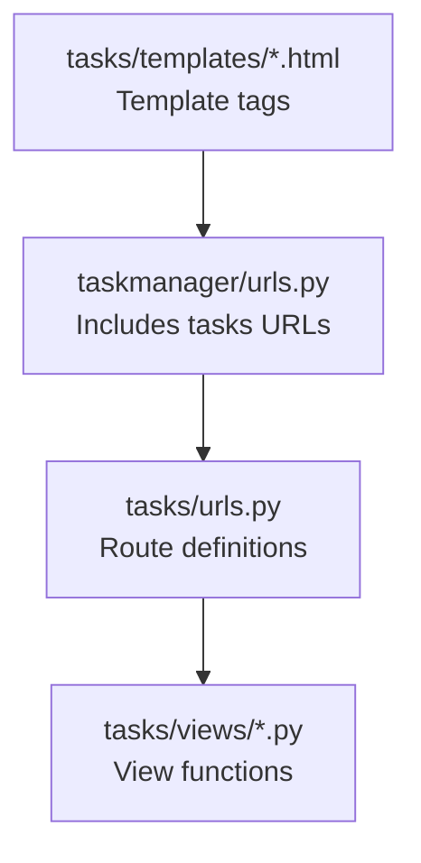
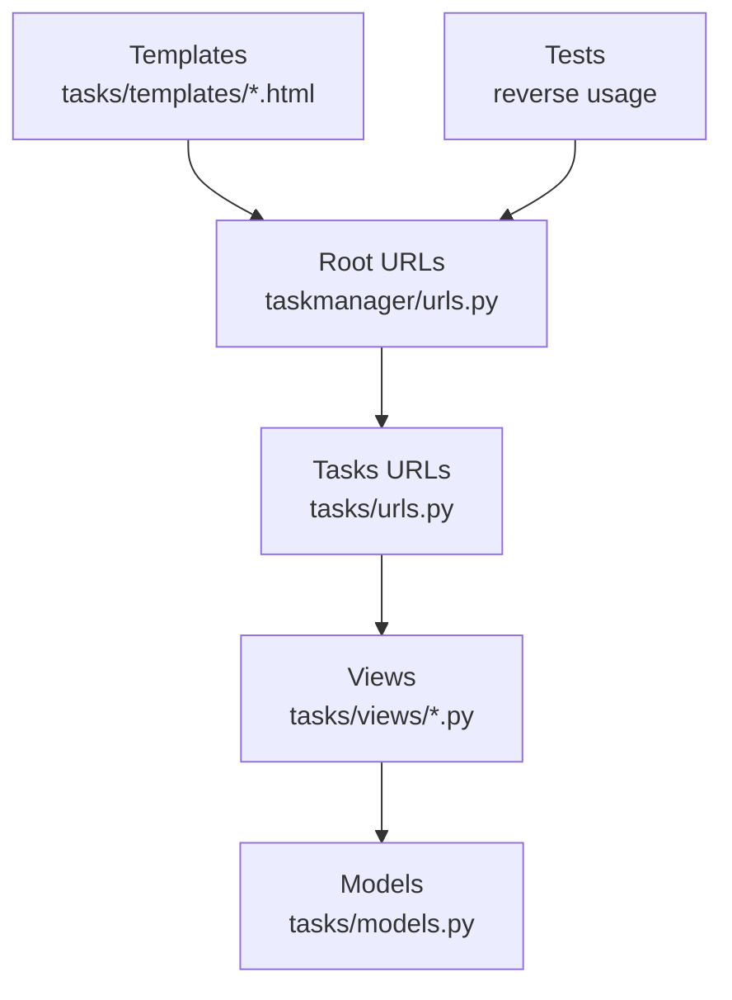
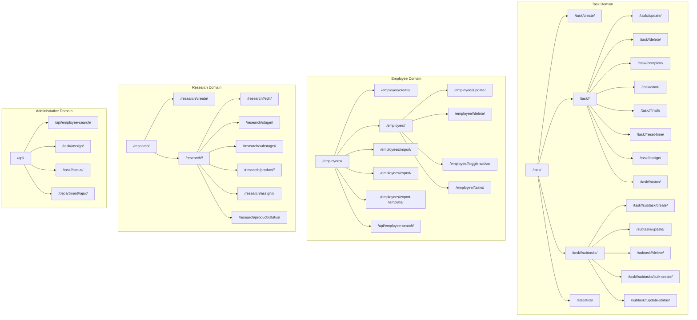

# URL Patterns and Routing

<cite>
**Referenced Files in This Document**
- [taskmanager/urls.py](file://taskmanager/urls.py)
- [tasks/urls.py](file://tasks/urls.py)
- [tasks/views/__init__.py](file://tasks/views/__init__.py)
- [tasks/views/task_views.py](file://tasks/views/task_views.py)
- [tasks/views/employee_views.py](file://tasks/views/employee_views.py)
- [tasks/views/research_views.py](file://tasks/views/research_views.py)
- [tasks/views/api_views.py](file://tasks/views/api_views.py)
- [tasks/models.py](file://tasks/models.py)
- [tasks/templates/base.html](file://tasks/templates/base.html)
- [taskmanager/settings.py](file://taskmanager/settings.py)
</cite>

## Table of Contents
1. [Introduction](#introduction)
2. [Project Structure](#project-structure)
3. [Core Components](#core-components)
4. [Architecture Overview](#architecture-overview)
5. [Detailed Component Analysis](#detailed-component-analysis)
6. [Dependency Analysis](#dependency-analysis)
7. [Performance Considerations](#performance-considerations)
8. [Troubleshooting Guide](#troubleshooting-guide)
9. [Conclusion](#conclusion)

## Introduction
This document explains the URL routing system used by the application. It catalogs all URL patterns for task management, employee management, research projects, and administrative endpoints, describes parameter types and namespaces, and details how URLs connect to view functions. It also covers reverse URL resolution via Django’s reverse and template tags, and demonstrates how parameters are extracted and passed to view handlers.

## Project Structure
The routing is configured at the project level and includes the tasks app’s URL patterns. The tasks app defines most routes under a flat namespace (no explicit namespace prefix), so URL names are unique within the tasks app.

**Diagram sources**
- [taskmanager/urls.py:1-11](file://taskmanager/urls.py#L1-L11)
- [tasks/urls.py:1-100](file://tasks/urls.py#L1-L100)

**Section sources**
- [taskmanager/urls.py:1-11](file://taskmanager/urls.py#L1-L11)
- [tasks/urls.py:1-100](file://tasks/urls.py#L1-L100)

## Core Components
- Root URL configuration includes the tasks app and Django admin and auth routes.
- The tasks app defines all functional routes for tasks, employees, research, imports, dashboards, and AJAX/API endpoints.
- View functions receive parameters either from path converters (int, str) or from query strings and request bodies.
- Reverse URL resolution is used in templates and tests.

Key routing highlights:
- Task routes: list, detail, create, update, delete, start/complete/finish/reset-time, statistics, assign employees, AJAX status updates.
- Employee routes: list, create, detail, update, delete, toggle active, import/export, AJAX search, per-employee task list.
- Research routes: lists, create, detail, edit, stage/substage/product detail, assign performers, update product status.
- Administrative/API routes: AJAX task status, AJAX assign employees, employee search API, department detail AJAX.

**Section sources**
- [taskmanager/urls.py:6-11](file://taskmanager/urls.py#L6-L11)
- [tasks/urls.py:38-100](file://tasks/urls.py#L38-L100)
- [tasks/views/__init__.py:1-11](file://tasks/views/__init__.py#L1-L11)

## Architecture Overview
The routing architecture is a single-namespace design under the tasks app. The root includes the tasks app’s URL patterns and Django’s built-in admin and auth URLs. Template tags and tests use reverse to build URLs.

**Diagram sources**
- [taskmanager/urls.py:1-11](file://taskmanager/urls.py#L1-L11)
- [tasks/urls.py:1-100](file://tasks/urls.py#L1-L100)
- [tasks/views/__init__.py:1-11](file://tasks/views/__init__.py#L1-L11)
- [tasks/models.py:1-200](file://tasks/models.py#L1-L200)

## Detailed Component Analysis

### Task Management Routes (/task/)
- Base list: matches empty path to the task list view.
- Detail: accepts an integer task identifier.
- CRUD and lifecycle: create, update, delete, start, complete, finish, reset-time.
- Statistics: dedicated endpoint for task metrics.
- Assign employees: AJAX endpoint to assign multiple employees to a task.
- AJAX status: endpoint to update task status via AJAX.

Parameter types:
- Integer identifiers for resources (task_id).

Reverse URL resolution examples:
- Named route: task_list
- Named route with argument: task_detail(task_id)
- Named route with argument: task_update(task_id)
- Named route with argument: task_delete(task_id)
- Named route with argument: task_assign_employees(task_id)
- Named route with argument: task_update_status_ajax(task_id)

How parameters are extracted and passed:
- Path converters extract integers from URLs and pass them as keyword arguments to view functions.
- Example view signatures demonstrate receiving task_id.

**Section sources**
- [tasks/urls.py:39-50](file://tasks/urls.py#L39-L50)
- [tasks/urls.py:40](file://tasks/urls.py#L40)
- [tasks/urls.py:42](file://tasks/urls.py#L42)
- [tasks/urls.py:43](file://tasks/urls.py#L43)
- [tasks/urls.py:44](file://tasks/urls.py#L44)
- [tasks/urls.py:45](file://tasks/urls.py#L45)
- [tasks/urls.py:46](file://tasks/urls.py#L46)
- [tasks/urls.py:47](file://tasks/urls.py#L47)
- [tasks/urls.py:48](file://tasks/urls.py#L48)
- [tasks/urls.py:49](file://tasks/urls.py#L49)
- [tasks/urls.py:50](file://tasks/urls.py#L50)
- [tasks/views/task_views.py:72-76](file://tasks/views/task_views.py#L72-L76)
- [tasks/views/task_views.py:181-190](file://tasks/views/task_views.py#L181-L190)
- [tasks/views/task_views.py:197-200](file://tasks/views/task_views.py#L197-L200)

### Employee Management Routes (/employee/)
- List, create, detail, update, delete, toggle active, per-employee task list.
- Import/export endpoints for staff data.
- AJAX employee search API.
- Parameter types:
  - Integer identifiers for employees (employee_id).

Reverse URL resolution examples:
- Named route: employee_list
- Named route: employee_create
- Named route with argument: employee_detail(employee_id)
- Named route with argument: employee_update(employee_id)
- Named route with argument: employee_delete(employee_id)
- Named route with argument: employee_toggle_active(employee_id)
- Named route with argument: employee_tasks(employee_id)
- Named route: employee_import
- Named route: employee_export
- Named route: employee_export_template
- Named route: employee_search_api

How parameters are extracted and passed:
- Path converters extract integers from URLs and pass them as keyword arguments to view functions.
- Example view signatures demonstrate receiving employee_id.

**Section sources**
- [tasks/urls.py:52-63](file://tasks/urls.py#L52-L63)
- [tasks/urls.py:55](file://tasks/urls.py#L55)
- [tasks/urls.py:56](file://tasks/urls.py#L56)
- [tasks/urls.py:57](file://tasks/urls.py#L57)
- [tasks/urls.py:58](file://tasks/urls.py#L58)
- [tasks/urls.py:59](file://tasks/urls.py#L59)
- [tasks/urls.py:63](file://tasks/urls.py#L63)
- [tasks/views/employee_views.py:18-20](file://tasks/views/employee_views.py#L18-L20)
- [tasks/views/employee_views.py:181-190](file://tasks/views/employee_views.py#L181-L190)

### Research Project Routes (/research/)
- Lists, create, detail, edit for research tasks.
- Detail for stages and sub-stages.
- Detail for research products.
- Assign performers to stage, sub-stage, or product using a string type for item_type.
- Update product status.

Parameter types:
- Integer identifiers for research items (task_id, stage_id, substage_id, product_id).
- String type for item_type in assign_research_performers.

Reverse URL resolution examples:
- Named route: research_task_list
- Named route: research_task_create
- Named route with argument: research_task_detail(task_id)
- Named route with argument: research_task_edit(task_id)
- Named route with argument: research_stage_detail(stage_id)
- Named route with argument: research_substage_detail(substage_id)
- Named route with argument: research_product_detail(product_id)
- Named route with arguments: assign_research_performers(item_type, item_id)
- Named route with argument: update_product_status(product_id)

How parameters are extracted and passed:
- Path converters extract integers and strings from URLs and pass them as keyword arguments to view functions.
- Example view signatures demonstrate receiving item_type and item_id.

**Section sources**
- [tasks/urls.py:73-82](file://tasks/urls.py#L73-L82)
- [tasks/urls.py:76](file://tasks/urls.py#L76)
- [tasks/urls.py:78](file://tasks/urls.py#L78)
- [tasks/urls.py:79](file://tasks/urls.py#L79)
- [tasks/urls.py:80](file://tasks/urls.py#L80)
- [tasks/urls.py:81](file://tasks/urls.py#L81)
- [tasks/views/research_views.py:54-56](file://tasks/views/research_views.py#L54-L56)
- [tasks/views/research_views.py:35-44](file://tasks/views/research_views.py#L35-L44)
- [tasks/views/research_views.py:90-93](file://tasks/views/research_views.py#L90-L93)
- [tasks/views/research_views.py:103-106](file://tasks/views/research_views.py#L103-L106)
- [tasks/views/research_views.py:118-124](file://tasks/views/research_views.py#L118-L124)

### Administrative Routes (/api/)
- AJAX endpoints for task assignment and status updates.
- Employee search API.
- Department detail AJAX.

Parameter types:
- Integer identifiers for resources (task_id, dept_id).
- String type for item_type in assign_research_performers.

Reverse URL resolution examples:
- Named route: employee_search_api
- Named route with argument: task_assign_employees_ajax(task_id)
- Named route with argument: task_update_status_ajax(task_id)
- Named route with argument: department_detail_ajax(dept_id)

How parameters are extracted and passed:
- Path converters extract integers and strings from URLs and pass them as keyword arguments to view functions.
- Example view signatures demonstrate receiving task_id and dept_id.

**Section sources**
- [tasks/urls.py:63](file://tasks/urls.py#L63)
- [tasks/urls.py:49](file://tasks/urls.py#L49)
- [tasks/urls.py:50](file://tasks/urls.py#L50)
- [tasks/urls.py:96](file://tasks/urls.py#L96)
- [tasks/views/api_views.py:9-130](file://tasks/views/api_views.py#L9-L130)

### URL Namespaces and Reverse Resolution
- The tasks app routes are included at the root level without a namespace prefix, so named routes are globally unique within the app.
- Reverse resolution is used in templates and tests:
  - Template tag usage resolves named routes to URLs.
  - Test usage of reverse constructs URLs for testing.

Examples of reverse usage:
- Named route: task_list
- Named route with argument: task_detail(task_id)
- Named route: employee_search_api

**Section sources**
- [tasks/templates/base.html:29-88](file://tasks/templates/base.html#L29-L88)
- [tasks/urls.py:38-100](file://tasks/urls.py#L38-L100)

### Hierarchical URL Structure and Resource Organization
The URL hierarchy organizes resources by domain:
- Task domain: /task/... with nested subtasks under a parent task.
- Employee domain: /employee/... with supporting endpoints for import/export/search.
- Research domain: /research/... with nested stages, sub-stages, and products.
- Administrative domain: /api/... for AJAX endpoints.

**Diagram sources**
- [tasks/urls.py:38-100](file://tasks/urls.py#L38-L100)

## Dependency Analysis
The routing depends on:
- Root URL configuration including the tasks app.
- View functions that accept path parameters and return HTTP responses.
- Models referenced by views (e.g., Task, Employee, ResearchTask).
- Templates that resolve named routes via template tags.

```mermaid
graph TB
Root["taskmanager/urls.py"] --> Tasks["tasks/urls.py"]
Tasks --> VTask["tasks/views/task_views.py"]
Tasks --> VEmp["tasks/views/employee_views.py"]
Tasks --> VRes["tasks/views/research_views.py"]
Tasks --> VApi["tasks/views/api_views.py"]
VTask --> M["tasks/models.py"]
VEmp --> M
VRes --> M
VApi --> M
Templates["tasks/templates/base.html"] --> Root
```

**Diagram sources**
- [taskmanager/urls.py:1-11](file://taskmanager/urls.py#L1-L11)
- [tasks/urls.py:1-100](file://tasks/urls.py#L1-L100)
- [tasks/views/task_views.py:1-200](file://tasks/views/task_views.py#L1-L200)
- [tasks/views/employee_views.py:1-200](file://tasks/views/employee_views.py#L1-L200)
- [tasks/views/research_views.py:1-165](file://tasks/views/research_views.py#L1-L165)
- [tasks/views/api_views.py:1-130](file://tasks/views/api_views.py#L1-L130)
- [tasks/models.py:1-200](file://tasks/models.py#L1-L200)
- [tasks/templates/base.html:1-118](file://tasks/templates/base.html#L1-L118)

**Section sources**
- [taskmanager/urls.py:1-11](file://taskmanager/urls.py#L1-L11)
- [tasks/urls.py:1-100](file://tasks/urls.py#L1-L100)
- [tasks/views/__init__.py:1-11](file://tasks/views/__init__.py#L1-L11)

## Performance Considerations
- Use efficient prefetching in views that render hierarchical data (e.g., research stages/sub-stages/products) to reduce database queries.
- AJAX endpoints return JSON responses to minimize HTML overhead.
- Consider caching for frequently accessed lists and dashboards.

## Troubleshooting Guide
Common issues and resolutions:
- 404 Not Found: Verify the named route exists and parameters match the expected converter types (int, str).
- Parameter extraction errors: Ensure path converters align with view function signatures.
- Reverse resolution failures: Confirm the named route is defined in tasks/urls.py and used consistently in templates/tests.

**Section sources**
- [tasks/urls.py:38-100](file://tasks/urls.py#L38-L100)
- [tasks/views/research_views.py:118-165](file://tasks/views/research_views.py#L118-L165)
- [tasks/views/api_views.py:9-130](file://tasks/views/api_views.py#L9-L130)

## Conclusion
The routing system uses a flat namespace under the tasks app, with clear URL patterns for tasks, employees, research, and administrative endpoints. Parameters are typed (int, str) and passed directly to view functions. Reverse URL resolution is supported via Django’s reverse and template tags, enabling maintainable links across templates and tests.