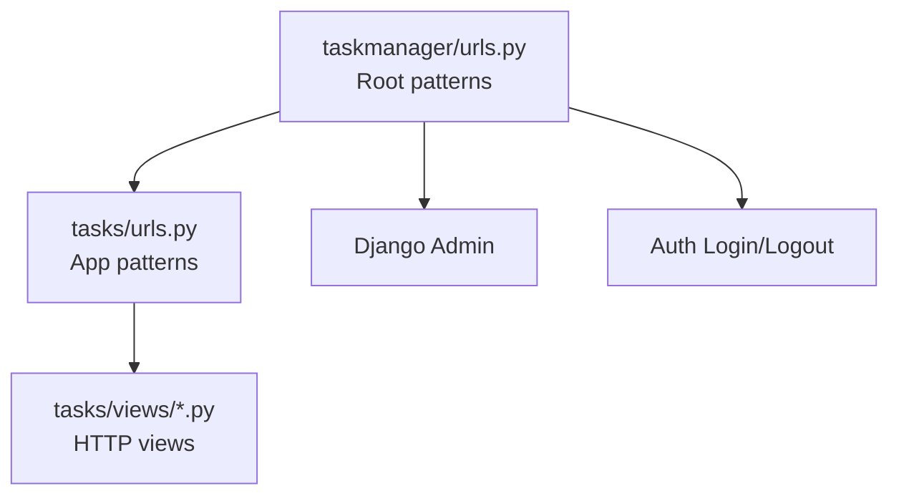
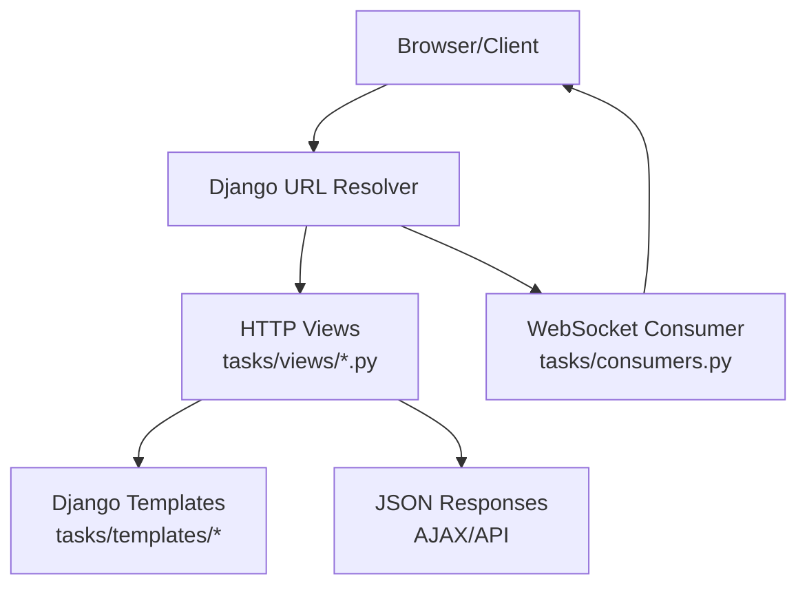
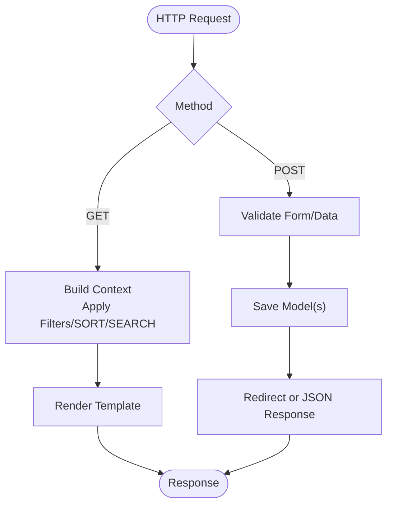
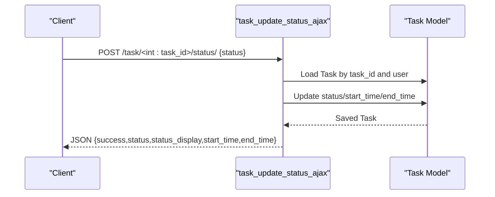
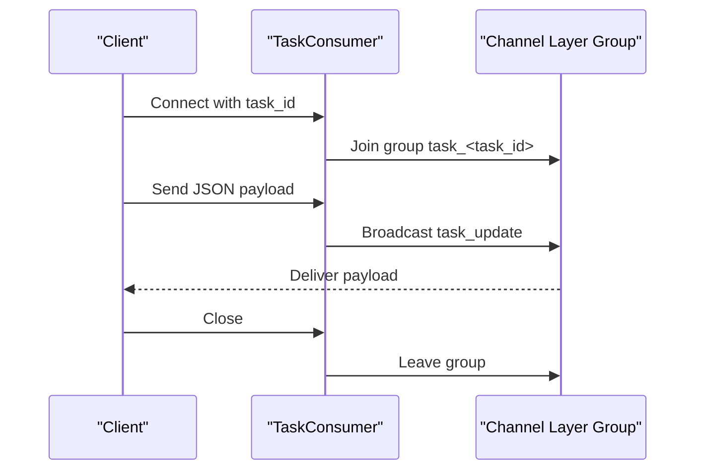
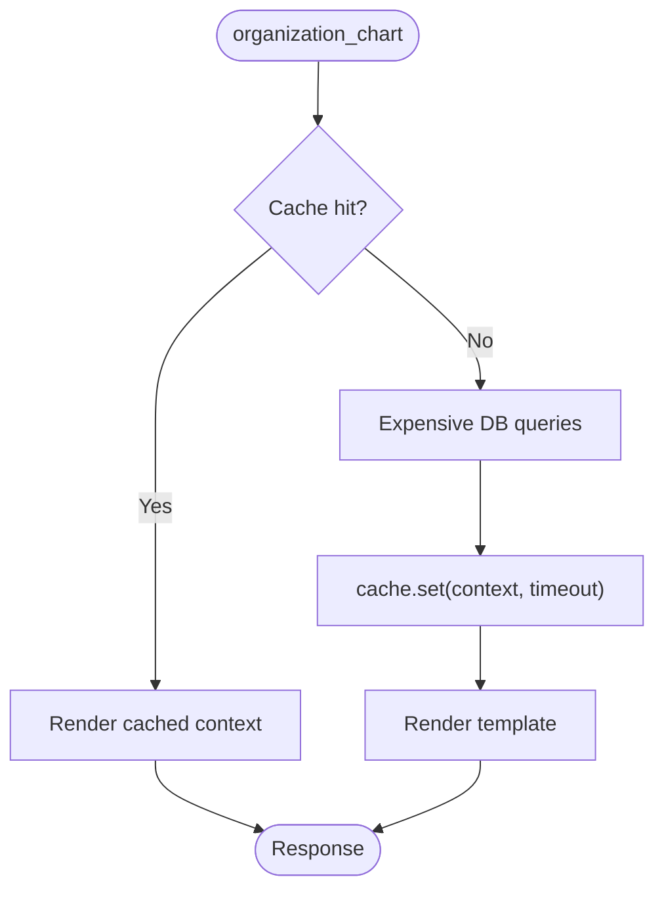
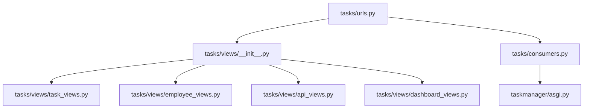

# Views and URL Routing

<cite>
**Referenced Files in This Document**
- [taskmanager/urls.py](file://taskmanager/urls.py)
- [tasks/urls.py](file://tasks/urls.py)
- [taskmanager/settings.py](file://taskmanager/settings.py)
- [tasks/views/__init__.py](file://tasks/views/__init__.py)
- [tasks/views/task_views.py](file://tasks/views/task_views.py)
- [tasks/views/employee_views.py](file://tasks/views/employee_views.py)
- [tasks/views/api_views.py](file://tasks/views/api_views.py)
- [tasks/views/dashboard_views.py](file://tasks/views/dashboard_views.py)
- [tasks/views/base.py](file://tasks/views/base.py)
- [tasks/consumers.py](file://tasks/consumers.py)
- [taskmanager/asgi.py](file://taskmanager/asgi.py)
- [tasks/decorators.py](file://tasks/decorators.py)
- [tasks/templates/tasks/task_list.html](file://tasks/templates/tasks/task_list.html)
</cite>

## Table of Contents
1. [Introduction](#introduction)
2. [Project Structure](#project-structure)
3. [Core Components](#core-components)
4. [Architecture Overview](#architecture-overview)
5. [Detailed Component Analysis](#detailed-component-analysis)
6. [Dependency Analysis](#dependency-analysis)
7. [Performance Considerations](#performance-considerations)
8. [Troubleshooting Guide](#troubleshooting-guide)
9. [Conclusion](#conclusion)

## Introduction
This document explains the Views and URL Routing system of the Task Manager application. It covers URL patterns, route parameters, and query string handling; view function architecture, request processing, and response generation; HTTP views and WebSocket consumers for real-time updates; URL namespaces and reverse URL resolution; template integration; authentication decorators and permissions; AJAX endpoint handling and JSON responses; API integration patterns; caching strategies and performance optimization; and error handling approaches.

## Project Structure
The routing is centralized in two files:
- Root URL configuration includes the admin, login/logout, and includes the tasks app URLs.
- Tasks app URL configuration defines all HTTP routes grouped by domain features (tasks, employees, subtasks, research, products, imports, dashboards).

Key characteristics:
- No explicit URL namespace prefixes are used in the included tasks URLs; names are defined per pattern and resolved via the app’s namespace.
- Reverse URL resolution uses the pattern names defined in tasks/urls.py.

**Diagram sources**
- [taskmanager/urls.py:6-11](file://taskmanager/urls.py#L6-L11)
- [tasks/urls.py:38-100](file://tasks/urls.py#L38-L100)

**Section sources**
- [taskmanager/urls.py:6-11](file://taskmanager/urls.py#L6-L11)
- [tasks/urls.py:38-100](file://tasks/urls.py#L38-L100)

## Core Components
- URL configuration
  - Root includes admin, login, logout, and the tasks app.
  - Tasks app defines all feature-specific routes with named patterns.
- View functions
  - HTTP views handle GET/POST requests, process forms, apply filters/sorting/search, and render templates.
  - API views return JSON responses for AJAX and client-side integrations.
  - Dashboard and organizational chart views integrate caching and optimized queries.
- WebSocket consumers
  - Real-time updates via Channels for task groups.
- Authentication and permissions
  - Views commonly require login; access checks filter by user ownership.
- Template integration
  - Templates use  to resolve named patterns and pass context for rendering.

**Section sources**
- [taskmanager/urls.py:6-11](file://taskmanager/urls.py#L6-L11)
- [tasks/urls.py:38-100](file://tasks/urls.py#L38-L100)
- [tasks/views/task_views.py:19-69](file://tasks/views/task_views.py#L19-L69)
- [tasks/views/api_views.py:9-129](file://tasks/views/api_views.py#L9-L129)
- [tasks/views/dashboard_views.py:13-143](file://tasks/views/dashboard_views.py#L13-L143)
- [tasks/consumers.py:4-36](file://tasks/consumers.py#L4-L36)
- [tasks/templates/tasks/task_list.html:1-200](file://tasks/templates/tasks/task_list.html#L1-L200)

## Architecture Overview
The system follows a layered architecture:
- URL dispatcher resolves incoming paths to view functions.
- Views process requests, query models, build context, and render templates or return JSON.
- Templates reference named URLs for navigation and AJAX endpoints.
- Optional WebSocket consumers enable real-time updates for specific task groups.

**Diagram sources**
- [tasks/urls.py:38-100](file://tasks/urls.py#L38-L100)
- [tasks/views/task_views.py:19-69](file://tasks/views/task_views.py#L19-L69)
- [tasks/views/api_views.py:9-129](file://tasks/views/api_views.py#L9-L129)
- [tasks/consumers.py:4-36](file://tasks/consumers.py#L4-L36)

## Detailed Component Analysis

### URL Patterns and Route Parameters
- Root patterns
  - Admin: path('admin/', ...), name='admin'
  - Login: path('login/', ...), name='login'
  - Logout: path('logout/', ...), name='logout'
  - Tasks app: path('', include('tasks.urls'))
- Tasks app patterns (selected)
  - Tasks
    - List: path('', task_list, name='task_list')
    - Detail: path('task/<int:task_id>/', task_detail, name='task_detail')
    - Create: path('task/create/', task_create, name='task_create')
    - Update: path('task/<int:task_id>/update/', task_update, name='task_update')
    - Delete: path('task/<int:task_id>/delete/', task_delete, name='task_delete')
    - Complete: path('task/<int:task_id>/complete/', task_complete, name='task_complete')
    - Start: path('task/<int:task_id>/start/', task_start, name='task_start')
    - Finish: path('task/<int:task_id>/finish/', task_finish, name='task_finish')
    - Reset time: path('task/<int:task_id>/reset-time/', task_reset_time, name='task_reset_time')
    - Statistics: path('statistics/', task_statistics, name='task_statistics')
    - Assign employees: path('task/<int:task_id>/assign/', task_assign_employees, name='task_assign_employees')
    - Update status (AJAX): path('task/<int:task_id>/status/', task_update_status_ajax, name='task_update_status_ajax')
  - Employees
    - List: path('employees/', employee_list, name='employee_list')
    - Create: path('employee/create/', employee_create, name='employee_create')
    - Detail: path('employee/<int:employee_id>/', employee_detail, name='employee_detail')
    - Update: path('employee/<int:employee_id>/update/', employee_update, name='employee_update')
    - Delete: path('employee/<int:employee_id>/delete/', employee_delete, name='employee_delete')
    - Toggle active: path('employee/<int:employee_id>/toggle-active/', employee_toggle_active, name='employee_toggle_active')
    - Tasks: path('employee/<int:employee_id>/tasks/', employee_tasks, name='employee_tasks')
    - Import/export/search: various patterns under employees/, api/, and import endpoints
  - Subtasks
    - List: path('task/<int:task_id>/subtasks/', subtask_list, name='subtask_list')
    - Create: path('task/<int:task_id>/subtask/create/', subtask_create, name='subtask_create')
    - Update: path('subtask/<int:subtask_id>/update/', subtask_update, name='subtask_update')
    - Delete: path('subtask/<int:subtask_id>/delete/', subtask_delete, name='subtask_delete')
    - Bulk create: path('task/<int:task_id>/subtasks/bulk-create/', subtask_bulk_create, name='subtask_bulk_create')
    - Update status: path('subtask/<int:subtask_id>/update-status/', subtask_update_status, name='subtask_update_status')
  - Research
    - List: path('research/', research_task_list, name='research_task_list')
    - Create: path('research/create/', research_task_create, name='research_task_create')
    - Detail: path('research/<int:task_id>/', research_task_detail, name='research_task_detail')
    - Edit: path('research/<int:task_id>/edit/', research_task_edit, name='research_task_edit')
    - Stage detail: path('research/stage/<int:stage_id>/', research_stage_detail, name='research_stage_detail')
    - Substage detail: path('research/substage/<int:substage_id>/', research_substage_detail, name='research_substage_detail')
    - Product detail: path('research/product/<int:product_id>/', research_product_detail, name='research_product_detail')
    - Assign performers: path('research/assign/<str:item_type>/<int:item_id>/', assign_research_performers, name='assign_research_performers')
    - Update product status: path('research/product/<int:product_id>/status/', update_product_status, name='update_product_status')
  - Products
    - List/detail/status: views_product.* endpoints under research/products/
    - Assign performers: path('product/<int:product_id>/assign-performers/', product_assign_performers, name='product_assign_performers')
    - Create external employee: path('create-external-employee/', create_external_employee, name='create_external_employee')
  - Imports
    - Research import: path('research/import/', import_research_from_docx, name='import_research')
    - Staff import: path('staff/import/', import_staff_from_excel, name='import_staff')
    - Preview import: path('task/preview-import/', preview_import, name='preview_import')
  - Dashboards and charts
    - Organization chart: path('org-chart/', organization_chart, name='organization_chart')
    - Department detail (AJAX): path('department/<int:dept_id>/ajax/', department_detail_ajax, name='department_detail_ajax')
    - Team dashboard: path('team/dashboard/', team_dashboard, name='team_dashboard')

Route parameters:
- Integer IDs: <int:task_id>, <int:employee_id>, <int:subtask_id>, <int:stage_id>, <int:substage_id>, <int:product_id>, <int:dept_id>
- String type identifiers: <str:item_type> used for dynamic assignment routes

Query string handling:
- Filters/sorting/search are read from request.GET keys such as status, employee, search, sort, department, laboratory, is_active, page, year, start_date, end_date, q, and others depending on the view.

Reverse URL resolution:
- Templates use , e.g., , .
- The tasks app patterns are referenced directly by name because the tasks app is included at the root level.

**Section sources**
- [taskmanager/urls.py:6-11](file://taskmanager/urls.py#L6-L11)
- [tasks/urls.py:38-100](file://tasks/urls.py#L38-L100)
- [tasks/templates/tasks/task_list.html:1-200](file://tasks/templates/tasks/task_list.html#L1-L200)

### View Function Architecture and Request Processing
- HTTP views
  - Authentication: Most views are decorated with @login_required, ensuring only authenticated users can access.
  - Request handling: Views check request.method, extract parameters from path and query string, and optionally process uploaded files or POST data.
  - Data retrieval: Views query models, apply filters/sorting/search, and prefetch related objects where appropriate.
  - Response generation: Views render templates with context or return JSON for AJAX endpoints.
- Example: task_list reads status, employee, search, and sort from request.GET, applies filters, counts statuses, and renders the task list template.
- Example: task_detail retrieves a single task filtered by user ownership and renders the detail template.
- Example: task_create handles both regular creation and import from a DOCX file, saving the task and associated subtasks, and redirects on success.
- Example: task_assign_employees processes POST to assign employees to a task and GET to render the assignment interface with filtering and search.
- Example: task_statistics computes aggregated metrics for the logged-in user.

**Diagram sources**
- [tasks/views/task_views.py:19-69](file://tasks/views/task_views.py#L19-L69)
- [tasks/views/task_views.py:78-179](file://tasks/views/task_views.py#L78-L179)
- [tasks/views/task_views.py:300-340](file://tasks/views/task_views.py#L300-L340)

**Section sources**
- [tasks/views/task_views.py:19-69](file://tasks/views/task_views.py#L19-L69)
- [tasks/views/task_views.py:78-179](file://tasks/views/task_views.py#L78-L179)
- [tasks/views/task_views.py:300-340](file://tasks/views/task_views.py#L300-L340)

### AJAX Endpoints and JSON Responses
- AJAX endpoints return JsonResponse for asynchronous interactions.
- Examples:
  - task_assign_employees_ajax: handles POST to assign employees and GET to render filtered employee lists via partial templates.
  - task_update_status_ajax: updates task status and timestamps, returning status display and formatted timestamps.
  - employee_search_api: returns a paginated list of employees matching a query string.
  - department_detail_ajax: returns HTML for department subtree and counts via a partial template.

**Diagram sources**
- [tasks/views/api_views.py:47-70](file://tasks/views/api_views.py#L47-L70)

**Section sources**
- [tasks/views/api_views.py:9-129](file://tasks/views/api_views.py#L9-L129)

### Template Integration and Reverse URL Resolution
- Templates use  to reference named patterns, enabling decoupled navigation and robust refactoring.
- Example usage appears in task_list.html for links to create, detail, and other views.
- The tasks app patterns are referenced directly by name because the tasks app is included at the root.

**Section sources**
- [tasks/templates/tasks/task_list.html:1-200](file://tasks/templates/tasks/task_list.html#L1-L200)
- [tasks/urls.py:38-100](file://tasks/urls.py#L38-L100)

### Authentication Decorators and Access Control
- Most views are protected by @login_required, ensuring only authenticated users can access.
- Access control is enforced by filtering models by the requesting user (e.g., Task.objects.filter(user=request.user)).
- Authentication settings define LOGIN_URL, LOGIN_REDIRECT_URL, and LOGOUT_REDIRECT_URL.

**Section sources**
- [tasks/views/task_views.py:19-69](file://tasks/views/task_views.py#L19-L69)
- [taskmanager/settings.py:163-167](file://taskmanager/settings.py#L163-L167)

### WebSocket Consumers for Real-Time Functionality
- TaskConsumer manages group-based real-time updates for a specific task room.
- On connect, the consumer joins a group named task_<task_id>.
- On receive, it broadcasts received data to all group members.
- Disconnect removes the channel from the group.

**Diagram sources**
- [tasks/consumers.py:4-36](file://tasks/consumers.py#L4-L36)

**Section sources**
- [tasks/consumers.py:4-36](file://tasks/consumers.py#L4-L36)
- [taskmanager/asgi.py:10-17](file://taskmanager/asgi.py#L10-L17)

### API Integration Patterns
- AJAX endpoints return structured JSON responses suitable for client-side consumption.
- Partial HTML rendering via render_to_string enables efficient DOM updates without full page reloads.
- Example: department_detail_ajax prefetches related objects and renders a partial template to return HTML plus counts.

**Section sources**
- [tasks/views/api_views.py:95-129](file://tasks/views/api_views.py#L95-L129)

### View Caching Strategies and Performance Optimization
- Organization chart view caches the rendered context for 10 minutes using Django’s cache framework.
- The view attempts to fetch data from cache; if missing, it performs expensive queries, then stores the result.
- Settings include a dummy cache backend by default and disabled cache middleware seconds.

**Diagram sources**
- [tasks/views/dashboard_views.py:14-109](file://tasks/views/dashboard_views.py#L14-L109)
- [taskmanager/settings.py:85-99](file://taskmanager/settings.py#L85-L99)

**Section sources**
- [tasks/views/dashboard_views.py:14-109](file://tasks/views/dashboard_views.py#L14-L109)
- [taskmanager/settings.py:85-99](file://taskmanager/settings.py#L85-L99)

### Error Handling Approaches
- Logging decorator: A reusable decorator logs view execution time and exceptions, aiding debugging and monitoring.
- Try/catch blocks in views capture exceptions during complex operations (e.g., employee_detail) and show user-friendly messages.
- CSRF protection and middleware ensure secure request handling.

**Section sources**
- [tasks/decorators.py:8-21](file://tasks/decorators.py#L8-L21)
- [tasks/views/employee_views.py:694-700](file://tasks/views/employee_views.py#L694-L700)
- [taskmanager/settings.py:49-61](file://taskmanager/settings.py#L49-L61)

## Dependency Analysis
- URL configuration
  - Root includes admin, auth, and tasks app.
  - Tasks app imports views from a central package initializer.
- View dependencies
  - HTTP views depend on models, forms, and utilities; they often prefetch related objects to reduce queries.
  - API views depend on JsonResponse and template rendering for partials.
  - Dashboard views depend on caching and complex ORM aggregations.
- WebSocket consumers depend on Channels and group messaging.

**Diagram sources**
- [tasks/urls.py:38-100](file://tasks/urls.py#L38-L100)
- [tasks/views/__init__.py:1-11](file://tasks/views/__init__.py#L1-L11)
- [tasks/consumers.py:4-36](file://tasks/consumers.py#L4-L36)
- [taskmanager/asgi.py:10-17](file://taskmanager/asgi.py#L10-L17)

**Section sources**
- [tasks/urls.py:38-100](file://tasks/urls.py#L38-L100)
- [tasks/views/__init__.py:1-11](file://tasks/views/__init__.py#L1-L11)

## Performance Considerations
- Use select_related and prefetch_related to minimize database queries in views that render lists or charts.
- Apply pagination for large lists (e.g., employee_list).
- Leverage caching for expensive computations and repeated data retrieval (e.g., organization_chart).
- Keep AJAX endpoints lightweight by returning only necessary data or partial HTML.
- Avoid unnecessary template rendering in hot paths; consider JSON APIs for client-driven UI updates.

## Troubleshooting Guide
- Authentication failures
  - Ensure @login_required is applied to protected views and that LOGIN_URL is configured correctly.
- Permission errors
  - Verify that views filter models by request.user to prevent unauthorized access.
- Slow pages
  - Check for N+1 queries; add select_related/prefetch_related where missing.
  - Enable caching for heavy views.
- AJAX issues
  - Confirm endpoint names match URL patterns and that JSON responses include success/error fields.
- WebSocket connectivity
  - Verify ASGI application is configured and Channels backend is available.

**Section sources**
- [taskmanager/settings.py:163-167](file://taskmanager/settings.py#L163-L167)
- [tasks/views/task_views.py:19-69](file://tasks/views/task_views.py#L19-L69)
- [tasks/views/dashboard_views.py:14-109](file://tasks/views/dashboard_views.py#L14-L109)
- [tasks/views/api_views.py:9-129](file://tasks/views/api_views.py#L9-L129)
- [taskmanager/asgi.py:10-17](file://taskmanager/asgi.py#L10-L17)

## Conclusion
The Task Manager employs a clear separation of concerns: URL routing defines patterns with named endpoints, views encapsulate request processing and response generation, templates integrate reverse URL resolution, and optional WebSocket consumers enable real-time updates. Authentication decorators and user-scoped queries enforce access control. AJAX endpoints and partial HTML rendering support modern client experiences. Caching and query optimization improve performance. The architecture is modular and maintainable, with explicit patterns for HTTP and WebSocket interactions.