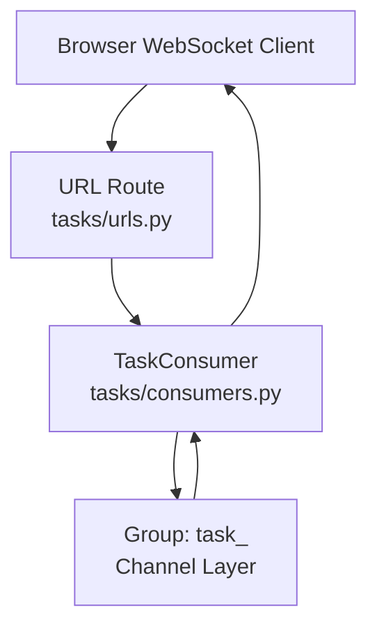
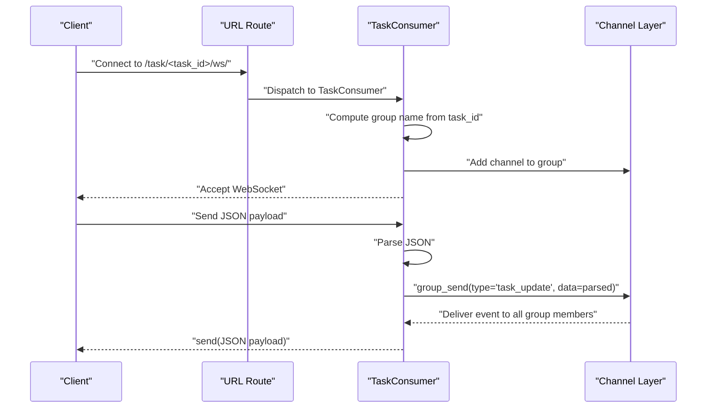
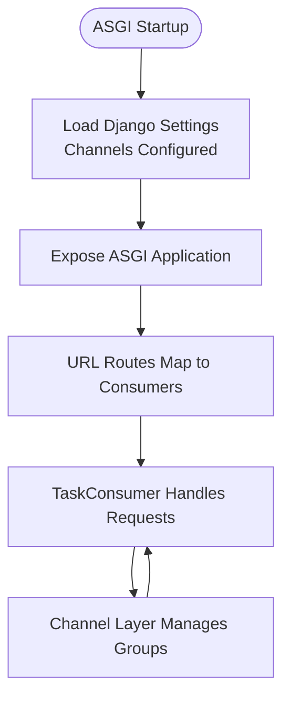
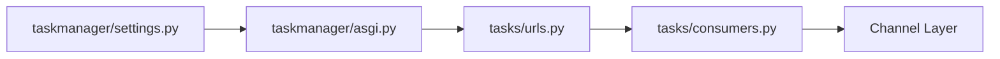

# WebSocket Consumers

<cite>
**Referenced Files in This Document**
- [consumers.py](file://tasks/consumers.py)
- [asgi.py](file://taskmanager/asgi.py)
- [settings.py](file://taskmanager/settings.py)
- [urls.py](file://tasks/urls.py)
- [task_views.py](file://tasks/views/task_views.py)
</cite>

## Table of Contents
1. [Introduction](#introduction)
2. [Project Structure](#project-structure)
3. [Core Components](#core-components)
4. [Architecture Overview](#architecture-overview)
5. [Detailed Component Analysis](#detailed-component-analysis)
6. [Dependency Analysis](#dependency-analysis)
7. [Performance Considerations](#performance-considerations)
8. [Troubleshooting Guide](#troubleshooting-guide)
9. [Conclusion](#conclusion)

## Introduction
This document explains the WebSocket consumer architecture and real-time functionality in the project. It focuses on how WebSocket consumers are structured, how connections are handled, and how messages are processed. It also documents how these consumers integrate with Django Channels to enable real-time updates such as live status updates and notifications. The document covers consumer lifecycle management, bidirectional communication patterns, message formats, and practical examples of implementation.

## Project Structure
The real-time feature is implemented using Django Channels with a single consumer that manages per-task chat rooms. The consumer is wired into the URL routing so clients can connect to a specific task’s room via a WebSocket endpoint.

```mermaid
graph TB
subgraph "Django App"
V["tasks/views/task_views.py"]
U["tasks/urls.py"]
C["tasks/consumers.py"]
end
subgraph "Django Channels Runtime"
ASGI["taskmanager/asgi.py"]
Settings["taskmanager/settings.py"]
end
Browser["Browser Client"] --> WS["WebSocket Endpoint"]
WS --> C
C --> CL["Channel Layer"]
CL --> C
V --> |"HTTP Views"| Browser
```

**Diagram sources**
- [consumers.py:1-36](file://tasks/consumers.py#L1-L36)
- [asgi.py:1-17](file://taskmanager/asgi.py#L1-L17)
- [settings.py:1-288](file://taskmanager/settings.py#L1-L288)
- [urls.py:1-100](file://tasks/urls.py#L1-L100)
- [task_views.py:1-471](file://tasks/views/task_views.py#L1-L471)

**Section sources**
- [consumers.py:1-36](file://tasks/consumers.py#L1-L36)
- [asgi.py:1-17](file://taskmanager/asgi.py#L1-L17)
- [settings.py:1-288](file://taskmanager/settings.py#L1-L288)
- [urls.py:1-100](file://tasks/urls.py#L1-L100)
- [task_views.py:1-471](file://tasks/views/task_views.py#L1-L471)

## Core Components
- TaskConsumer: An asynchronous WebSocket consumer that:
  - Accepts connections scoped to a specific task.
  - Joins the client to a group named after the task.
  - Broadcasts received messages to all clients in the group.
  - Sends incoming group events back to the client.

Key responsibilities:
- Connection handling: Extracts task_id from the URL route and creates a group name.
- Group management: Adds/removes the channel to/from the task-specific group.
- Message routing: Parses JSON payloads and forwards them to the group.
- Event delivery: Converts group events into outbound WebSocket messages.

**Section sources**
- [consumers.py:4-36](file://tasks/consumers.py#L4-L36)

## Architecture Overview
The WebSocket layer integrates with Django Channels and the Django application stack. The consumer participates in the Channels runtime and uses the configured channel layer for inter-process messaging.

**Diagram sources**
- [consumers.py:4-36](file://tasks/consumers.py#L4-L36)
- [urls.py:1-100](file://tasks/urls.py#L1-L100)

## Detailed Component Analysis

### Consumer Lifecycle and Room Management
- On connect:
  - Extracts task_id from the URL route.
  - Computes a group name derived from task_id.
  - Adds the current channel to the group.
  - Accepts the connection.
- On disconnect:
  - Removes the channel from the group.
- Receive:
  - Parses incoming text payload as JSON.
  - Broadcasts the parsed data to the group with a handler type.
- Handler:
  - Receives group events and sends them back to the client as JSON.

**Diagram sources**
- [consumers.py:4-36](file://tasks/consumers.py#L4-L36)
- [urls.py:1-100](file://tasks/urls.py#L1-L100)

**Section sources**
- [consumers.py:4-36](file://tasks/consumers.py#L4-L36)

### Message Formats and Event Types
- Incoming message format:
  - Text-based JSON payload.
  - The consumer parses the payload and forwards it unchanged to the group.
- Outgoing message format:
  - Text-based JSON payload identical to the received data.
- Event type:
  - Internal event dispatched to the consumer’s handler is named consistently with the consumer method invoked by the channel layer.

Practical implications:
- Clients should send structured JSON that reflects the intended real-time update (e.g., status change metadata).
- The consumer does not transform the payload; it broadcasts it as-is.

**Section sources**
- [consumers.py:22-36](file://tasks/consumers.py#L22-L36)

### Bidirectional Communication Patterns
- Push from server to clients:
  - Any part of the application can publish to the group using the channel layer.
  - The consumer receives the event and sends it to all connected clients.
- Push from clients to server and broadcast:
  - Clients can send JSON payloads; the consumer forwards them to the group.
- Pull from server to client:
  - Not implemented by this consumer; real-time updates are push-based.

Note: The current implementation is unidirectional from the consumer’s perspective for inbound messages but bidirectional in terms of broadcasting to all group members.

**Section sources**
- [consumers.py:22-36](file://tasks/consumers.py#L22-L36)

### Connection Lifecycle Management
- Joining a room:
  - On connect, the consumer adds the channel to a group named after the task.
- Leaving a room:
  - On disconnect, the consumer removes the channel from the group.
- Reconnection:
  - No explicit rejoin logic is present; clients should reconnect to rejoin the group.

Operational considerations:
- If a client disconnects unexpectedly, it will remain out of the group until reconnected.
- Group membership is tied to the channel lifetime.

**Section sources**
- [consumers.py:5-20](file://tasks/consumers.py#L5-L20)

### Integration with Django Channels and Django Settings
- ASGI application:
  - The project exposes a standard ASGI application for Channels to use.
- Channel layer:
  - The consumer uses the configured channel layer to manage groups and inter-process messaging.
- Routing:
  - The consumer is reachable via a URL pattern that captures the task_id and routes to the consumer.

**Diagram sources**
- [asgi.py:1-17](file://taskmanager/asgi.py#L1-L17)
- [settings.py:1-288](file://taskmanager/settings.py#L1-L288)
- [consumers.py:4-36](file://tasks/consumers.py#L4-L36)

**Section sources**
- [asgi.py:1-17](file://taskmanager/asgi.py#L1-L17)
- [settings.py:1-288](file://taskmanager/settings.py#L1-L288)
- [consumers.py:4-36](file://tasks/consumers.py#L4-L36)

### Real-Time Features: Live Status Updates and Notifications
- Live status updates:
  - To broadcast status changes, another part of the application (e.g., a view or signal handler) publishes to the group using the channel layer with the same event type used by the consumer.
  - The consumer receives the event and sends it to all clients in the group.
- Notifications:
  - Notifications can be modeled as JSON payloads sent to the group; the consumer forwards them unchanged to clients.

Implementation guidance:
- Use the channel layer to publish to the group named after the task.
- Keep notification payloads small and structured for efficient parsing on the client.

**Section sources**
- [consumers.py:26-32](file://tasks/consumers.py#L26-L32)
- [consumers.py:34-36](file://tasks/consumers.py#L34-L36)

## Dependency Analysis
- Consumer depends on:
  - Django Channels’ AsyncWebsocketConsumer base class.
  - The channel layer for group management and broadcasting.
- URL routing depends on:
  - A URL pattern that captures task_id and dispatches to the consumer.
- Application startup depends on:
  - ASGI application initialization and Django settings.

**Diagram sources**
- [urls.py:1-100](file://tasks/urls.py#L1-L100)
- [consumers.py:4-36](file://tasks/consumers.py#L4-L36)
- [asgi.py:1-17](file://taskmanager/asgi.py#L1-L17)
- [settings.py:1-288](file://taskmanager/settings.py#L1-L288)

**Section sources**
- [urls.py:1-100](file://tasks/urls.py#L1-L100)
- [consumers.py:4-36](file://tasks/consumers.py#L4-L36)
- [asgi.py:1-17](file://taskmanager/asgi.py#L1-L17)
- [settings.py:1-288](file://taskmanager/settings.py#L1-L288)

## Performance Considerations
- Broadcasting cost:
  - Each group_send dispatches to all channels in the group. For large groups, consider limiting group size or using targeted channels.
- Payload size:
  - Keep JSON payloads minimal to reduce bandwidth and parsing overhead.
- Group churn:
  - Frequent connect/disconnect cycles cause group membership churn; avoid unnecessary reconnections.
- Scalability:
  - The channel layer and worker scaling impact throughput. Ensure the deployment supports the expected concurrency.

[No sources needed since this section provides general guidance]

## Troubleshooting Guide
Common issues and resolutions:
- Client cannot connect:
  - Verify the URL pattern captures task_id correctly and routes to the consumer.
  - Confirm ASGI application is running and the consumer is imported.
- Messages not received:
  - Ensure the client sends JSON payloads and the consumer is in the correct group.
  - Confirm the channel layer is configured and accessible.
- Unexpected disconnects:
  - The consumer removes the channel from the group on disconnect; clients must reconnect to rejoin.

**Section sources**
- [consumers.py:5-20](file://tasks/consumers.py#L5-L20)
- [consumers.py:22-36](file://tasks/consumers.py#L22-L36)
- [urls.py:1-100](file://tasks/urls.py#L1-L100)
- [asgi.py:1-17](file://taskmanager/asgi.py#L1-L17)
- [settings.py:1-288](file://taskmanager/settings.py#L1-L288)

## Conclusion
The WebSocket consumer provides a straightforward, scalable mechanism for real-time updates per task. By leveraging Django Channels’ group model, it enables broadcast-style updates to all interested clients. The consumer’s simplicity—parsing JSON and forwarding it—allows flexible message formats suitable for live status updates and notifications. Proper routing, channel layer configuration, and mindful payload design are essential for reliable operation.